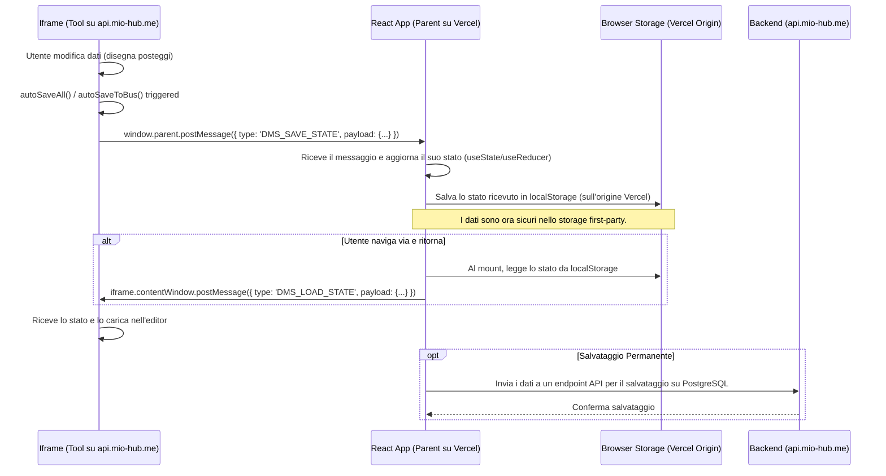

# 📝 Proposta di Soluzione Architetturale per la Persistenza dei Dati

**Data:** 07 Marzo 2026
**Autore:** Manus AI
**Stato:** In Approvazione

---

## 1. Analisi del Problema

L'attuale architettura dell'applicazione DMS si basa su un'applicazione React principale (Vercel) che carica strumenti di editing (Slot Editor, BUS HUB) da un dominio differente (`api.mio-hub.me`) all'interno di un `<iframe>`. Il meccanismo di salvataggio automatico e di passaggio dati tra i tool (`dms-bus.js`) fa affidamento su API di storage del browser come `IndexedDB` e `localStorage`.

Il problema critico di **perdita totale dei dati** si manifesta su browser basati su WebKit, in particolare **Safari (su iPad e macOS)**, a causa di una funzionalità di protezione della privacy chiamata **Intelligent Tracking Prevention (ITP)**.

> **Intelligent Tracking Prevention (ITP)** tratta lo storage (localStorage, IndexedDB, cookie) di domini di terze parti, caricati all'interno di iframe, come **effimero**. Questo significa che il browser elimina attivamente tutti i dati salvati da `api.mio-hub.me` nel momento in cui l'iframe viene rimosso dalla pagina, ad esempio quando l'utente naviga verso un'altra sezione dell'app React.

L'attuale flusso di lavoro è quindi intrinsecamente inaffidabile:

1.  L'utente modifica la mappa nello `slot_editor_v3_unified.html` (iframe).
2.  Le funzioni `autoSaveAll()` e `autoSaveToBus()` salvano i dati in `localStorage` e `IndexedDB` sotto l'origine `api.mio-hub.me`.
3.  L'utente naviga via, il componente React `BusHubEditor` viene smontato, distruggendo l'iframe.
4.  Safari/ITP rileva la distruzione dell'iframe di terze parti e **cancella tutti i dati associati**.
5.  Al ritorno, l'iframe viene ricreato vuoto, senza alcuna possibilità di recuperare il lavoro precedente.

## 2. Soluzione Proposta: `postMessage` Bridge e First-Party Storage

Per risolvere il problema in modo robusto e definitivo, si propone di modificare l'architettura di comunicazione per aggirare le restrizioni di ITP, centralizzando la gestione dello stato nell'applicazione React principale (first-party), che non è soggetta a queste limitazioni.

La soluzione si basa sulla creazione di un **"ponte" di comunicazione (`postMessage` bridge)** tra l'iframe (child) e la pagina React che lo ospita (parent).

### Diagramma Architetturale della Soluzione

### Fasi di Implementazione

1.  **Modifica di `dms-bus.js` e degli Editor (`slot_editor`, `bus_hub`):**
    *   Le funzioni di salvataggio (`put`, `putJSON`, `autoSaveAll`, `autoSaveToBus`) verranno modificate. Oltre a (o invece di) scrivere in `localStorage`/`IndexedDB`, invieranno i dati all'applicazione parent tramite `window.parent.postMessage()`.
    *   Verrà aggiunto un listener per il messaggio `DMS_LOAD_STATE` dal parent, che popolerà lo stato dell'editor al caricamento.

2.  **Modifica del Componente React `BusHubEditor.tsx`:**
    *   Il listener `handleMessage` esistente verrà potenziato per gestire il nuovo messaggio `DMS_SAVE_STATE`. Quando riceve i dati, li salverà nel `localStorage` del dominio Vercel (first-party).
    *   All'avvio (nel `useEffect`), il componente leggerà i dati salvati dal proprio `localStorage` e, una volta che l'iframe è caricato, invierà un messaggio `DMS_LOAD_STATE` all'iframe per ripristinare lo stato.

3.  **Creazione di un Endpoint di Fallback/Persistenza sul Server:**
    *   Per garantire la massima sicurezza dei dati, l'applicazione React invierà periodicamente i dati di stato a un nuovo endpoint sul backend (`/api/dms/autosave`).
    *   Questo endpoint salverà la configurazione JSON in una tabella temporanea o dedicata su PostgreSQL, associata all'utente e al mercato.
    *   Al caricamento, l'app React proverà prima a caricare dal `localStorage` locale e, in caso di fallimento, chiederà al server l'ultimo stato salvato.

## 3. Vantaggi di Questo Approccio

*   **Affidabilità Cross-Browser:** La soluzione è conforme agli standard web e funziona su tutti i browser moderni, inclusi quelli con politiche di privacy restrittive come Safari.
*   **Centralizzazione dello Stato:** La gestione dello stato viene spostata nell'applicazione React principale, rendendo l'architettura più pulita e prevedibile.
*   **Persistenza Robusta:** La combinazione di `localStorage` first-party e un fallback lato server garantisce che nessun dato venga perso, neanche in caso di pulizia della cache del browser da parte dell'utente.
*   **Minimamente Invasivo:** L'approccio non richiede di stravolgere l'architettura esistente (come servire i tool dallo stesso dominio), ma si limita a migliorare il canale di comunicazione tra i componenti.
