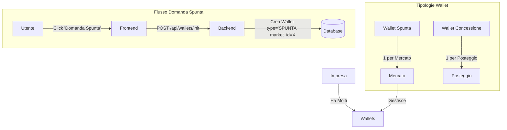

# 🔑 BLUEPRINT MIO HUB - AGGIORNATO 29 DICEMBRE 2025 (v3.1)

**DOCUMENTO DI CONTESTO PER NUOVE SESSIONI MANUS**

---

## 📋 INDICE

1. [Aggiornamento 29 Dicembre (Spunta & Storico)](#-aggiornamento-29-dicembre-2025-sessione-notturna---spunta--storico)
2. [Repository e Deploy](#-repository-e-deploy)
3. [Accesso Server Hetzner](#-accesso-server-hetzner)
4. [Database Neon PostgreSQL](#-database-neon-postgresql)
5. [Architettura Sistema Chat](#-architettura-sistema-chat)
6. [Schema Database agent_messages](#-schema-database-agent_messages)
7. [Flusso Messaggi e Mode](#-flusso-messaggi-e-mode)
8. [Logica di Rendering Frontend](#-logica-di-rendering-frontend)
9. [File Chiave da Conoscere](#-file-chiave-da-conoscere)
10. [Comandi Utili](#-comandi-utili)
11. [Agenti del Sistema](#-agenti-del-sistema)
12. [Wallet / PagoPA](#-wallet--pagopa)
13. [Imprese & Qualificazioni](#-imprese--qualificazioni)
14. [API Inventory (Integrazioni)](#-api-inventory-integrazioni)

---

## 💡 AGGIORNAMENTO 29 DICEMBRE 2025 (SESSIONE NOTTURNA - SPUNTA & STORICO)

### ✅ Nuove Funzionalità Implementate

1.  **UI Wallet & Spunta (Refactoring Completo)**
    -   **Wallet Chiusi di Default**: Le sezioni "Portafogli Spunta" e "Concessioni" nel pannello di dettaglio partono chiuse per pulizia.
    -   **Wallet Generico**: I wallet senza mercato associato sono etichettati come **"GENERICO"** (Badge Bianco), distinti da quelli di mercato (Badge Giallo).
    -   **Semafori Intelligenti**:
        -   **Verde**: Saldo > € 0.00
        -   **Rosso**: Saldo <= € 0.00 (Da Pagare/Ricaricare)
    -   **Header Riepilogativo**: Mostra il numero totale di wallet e la somma totale dei saldi in bianco.

2.  **Wallet Spunta Specifico per Mercato**
    -   **Architettura**: I wallet di tipo `SPUNTA` non sono più unici per azienda, ma specifici per ogni coppia `(Azienda, Mercato)`.
    -   **Motivazione**: I pagamenti della spunta devono confluire nelle casse specifiche del comune che gestisce quel mercato.
    -   **Visualizzazione**: Nella lista imprese, il badge "Spunta" mostra il saldo del wallet relativo al mercato che si sta visualizzando.

3.  **Domanda Spunta**
    -   **Nuovo Flusso**: Aggiunto pulsante "Domanda Spunta" nel tab Autorizzazioni.
    -   **Funzionamento**: Permette di creare un nuovo wallet spunta per un'impresa in uno specifico mercato.
    -   **UX**: La modale mostra esplicitamente il Mercato e il Comune di riferimento per evitare errori.
    -   **Nota**: Per le imprese con molti wallet spunta, la visualizzazione è filtrata per mostrare solo quello pertinente al mercato corrente.

4.  **Fix Storico PagoPA**
    -   **Problema**: Crash della pagina storico dovuto a conflitti di nomi (`History` vs `window.history`) e dati sporchi.
    -   **Soluzione**: Rinominato componente in `HistoryIcon`, blindato il rendering delle date e filtrati i dati non validi.

5.  **Indicatori Visivi (Semafori)**
    -   **Lista Imprese**: Aggiunti semafori (Verde/Rosso) e importi per:
        -   Concessioni (Posteggi)
        -   Wallet Spunta (Ricaricabile)
    -   **Logica**: € 0.00 è considerato "Da Pagare" (Rosso) per le concessioni, mentre per la spunta dipende dal saldo positivo/negativo.

6.  **Fix Backend Qualificazioni (v3.1)**
    -   **Problema**: Il badge delle qualificazioni nella lista imprese non si aggiornava automaticamente.
    -   **Soluzione**: Modificata la query principale `/api/imprese` per includere una subquery che recupera le qualificazioni 62	    -   **Stato**: Committato su `mihub-backend-rest` (master).
63	
64	7.  **Fix Dimensioni Posteggi & Popup (v3.1)**
65	    -   **Problema**: Dimensioni posteggi mancanti o stimate erroneamente, popup spunta incompleto.
66	    -   **Soluzione Dimensioni**: Implementata logica a cascata (Priority Fallback):
67	        1.  **DB**: Cerca dimensioni ufficiali nel database (`width` x `depth`).
68	        2.  **GeoJSON**: Se mancano, cerca nelle proprietà del file mappa.
69	        3.  **Stima**: Se mancano entrambe, calcola geometricamente dal poligono (Label "STIMATE").
70	    -   **Soluzione Popup Spunta**:
71	        -   Aggiunta visualizzazione **Impresa Intestataria**.
72	        -   Aggiunto pulsante **"Visita Vetrina"** (Link interno SPA).
73	        -   Allineata logica dimensioni a quella standard.
74	
75	### 📐 Architettura Wallet Spunta


---

## 🚀 REPOSITORY E DEPLOY

### Frontend (Vercel)
| Campo | Valore |
|-------|--------|
| **Repository** | `https://github.com/Chcndr/dms-hub-app-new` |
| **Branch** | `master` |
| **URL Produzione** | `https://dms-hub-app-new.vercel.app` |
| **Deploy** | Automatico su push a master |
| **Framework** | Vite + React + TypeScript + TailwindCSS |

### Backend (Hetzner)
| Campo | Valore |
|-------|--------|
| **Repository** | `https://github.com/Chcndr/mihub-backend-rest` |
| **Branch** | `master` |
| **URL Produzione** | `https://orchestratore.mio-hub.me` |
| **Deploy** | Manuale: `git pull` + `pm2 restart` |
| **Framework** | Node.js + Express |

### Flusso di Lavoro OBBLIGATORIO
```
1. Modifiche locali nel sandbox
2. git add -A && git commit -m "messaggio" && git push origin master
3. Per backend: SSH su Hetzner → git pull → pm2 restart mihub-backend
4. Per frontend: Vercel fa deploy automatico
```

**⚠️ MAI modificare direttamente sul server Hetzner!**

---

## 🖥️ ACCESSO SERVER HETZNER

| Campo | Valore |
|-------|--------|
| **IP** | `157.90.29.66` |
| **User** | `root` |
| **Chiave SSH** | `/home/ubuntu/.ssh/manus_hetzner_key` |
| **Percorso Backend** | `/root/mihub-backend-rest` |

### Comando SSH
```bash
ssh -i /home/ubuntu/.ssh/manus_hetzner_key root@157.90.29.66
```

### Deploy Backend (dopo push su GitHub)
```bash
ssh -i /home/ubuntu/.ssh/manus_hetzner_key root@157.90.29.66 'cd /root/mihub-backend-rest && git pull && pm2 restart mihub-backend'
```

---

## 💾 DATABASE NEON POSTGRESQL

| Campo | Valore |
|-------|--------|
| **Host** | `ep-bold-silence-adftsojg-pooler.c-2.us-east-1.aws.neon.tech` |
| **Database** | `neondb` |
| **User** | `neondb_owner` |
| **Password** | `npg_lYG6JQ5Krtsi` |
| **SSL** | `require` |

---

## 🏗️ ARCHITETTURA SISTEMA CHAT

### Viste Frontend
| Vista | Descrizione | Mode | Conversation ID |
|-------|-------------|------|-----------------|
| **Chat MIO** | Chat principale con orchestratore | `auto` | `mio-main` |
| **Vista 4 Agenti** | Mostra coordinamento MIO→Agenti | `auto` | `mio-{agent}-coordination` |
| **Chat Singola Manus** | Chat diretta con Manus | `direct` | `user-manus-direct` |
| **Chat Singola Abacus** | Chat diretta con Abacus | `direct` | `user-abacus-direct` |
| **Chat Singola GPT Dev** | Chat diretta con GPT Dev | `direct` | `user-gptdev-direct` |
| **Chat Singola Zapier** | Chat diretta con Zapier | `direct` | `user-zapier-direct` |

---

## 📊 SCHEMA DATABASE agent_messages

```sql
CREATE TABLE agent_messages (
  id                uuid PRIMARY KEY DEFAULT gen_random_uuid(),
  conversation_id   varchar NOT NULL,    -- ID conversazione
  sender            varchar NOT NULL,    -- Chi ha inviato: 'user', 'mio', 'manus', 'abacus', 'gptdev', 'zapier'
  recipient         varchar,             -- Destinatario (opzionale)
  role              varchar NOT NULL,    -- 'user' | 'assistant'
  message           text NOT NULL,       -- Contenuto del messaggio
  agent             varchar,             -- Agente che ha risposto
  mode              varchar DEFAULT 'auto',  -- 'auto' | 'direct'
  meta              jsonb,               -- Metadati aggiuntivi
  tool_call_id      varchar,             -- ID chiamata tool (se presente)
  tool_name         varchar,             -- Nome tool usato
  tool_args         jsonb,               -- Argomenti tool
  error             boolean,             -- Flag errore
  created_at        timestamptz DEFAULT NOW()
);
```

### Valori Campi Chiave

| Campo | Valori Possibili | Descrizione |
|-------|------------------|-------------|
| **sender** | `user`, `mio`, `manus`, `abacus`, `gptdev`, `zapier` | Chi ha inviato il messaggio |
| **role** | `user`, `assistant` | Ruolo nel contesto LLM |
| **mode** | `auto`, `direct` | Modalità di routing |
| **agent** | `null`, `mio`, `manus`, `abacus`, `gptdev`, `zapier` | Agente che ha processato |

---

## 🔄 FLUSSO MESSAGGI E MODE

### Flusso Mode AUTO (User → MIO → Agente)

```
1. User scrive a MIO
   └→ Salvato: mio-main, sender='user', role='user', mode='auto'

2. MIO analizza e delega a Manus
   └→ Salvato: mio-manus-coordination, sender='mio', role='user', mode='auto'

3. Manus risponde
   └→ Salvato: mio-manus-coordination, sender='manus', role='assistant', mode='auto'
   └→ Salvato: mio-main, sender='manus', role='assistant', mode='auto'

4. MIO elabora e risponde all'utente
   └→ Salvato: mio-main, sender='mio', role='assistant', mode='auto'
```

### Flusso Mode DIRECT (User → Agente)

```
1. User scrive direttamente a Manus
   └→ Salvato: user-manus-direct, sender='user', role='user', mode='direct'

2. Manus risponde
   └→ Salvato: user-manus-direct, sender='manus', role='assistant', mode='direct'
```

---

## 🎨 LOGICA DI RENDERING FRONTEND

### Chat Principale MIO

**File**: `DashboardPA.tsx` (riga 4102)

```tsx
<span>da {msg.role === 'user' ? 'Tu' : msg.agentName?.toUpperCase() || 'MIO'}</span>
```

- Se `role === 'user'`, mostra **"Tu"**
- Altrimenti, mostra il nome dell'agente (es. "MANUS") o "MIO" come fallback

### Vista Singola (GPT Dev, Manus, Abacus, Zapier)

**File**: `DashboardPA.tsx` (riga 4368)

```tsx
<span>da {msg.role === 'user' ? 'Tu' : (msg.agent || 'agente')}</span>
```

- Se `role === 'user'`, mostra **"Tu"**
- Altrimenti, mostra il nome dell'agente (es. "gptdev") o "agente" come fallback

---

## 📁 FILE CHIAVE DA CONOSCERE

### Backend (mihub-backend-rest)

| File | Descrizione |
|------|-------------|
| `routes/orchestrator.js` | Endpoint principale `/api/mihub/orchestrator`, routing messaggi |
| `utils/direct_saver.js` | Salvataggio diretto messaggi nel database |
| `src/modules/orchestrator/database.js` | Funzioni database: `addMessage`, `saveDirectMessage`, `createConversation` |
| `src/modules/orchestrator/llm.js` | Chiamate agli agenti LLM (MIO, Manus, Abacus, GPT Dev) |
| `config/database.js` | Configurazione connessione PostgreSQL |
| `routes/imprese.js` | API Imprese (Fix Qualificazioni v3.1) |

### Frontend (dms-hub-app-new)

| File | Descrizione |
|------|-------------|
| `src/components/DashboardPA.tsx` | Dashboard principale, logica chat e routing |
| `src/components/markets/WalletPanel.tsx` | Pannello Wallet (Spunta/Concessioni) |
| `src/components/markets/MarketCompaniesTab.tsx` | Lista Imprese con Badges |
| `src/components/markets/MarketAutorizzazioniTab.tsx` | Tab Autorizzazioni (Domanda Spunta) |

---

## 💻 COMANDI UTILI

### Avvio Server Backend (Locale)
```bash
cd mihub-backend-rest
npm install
npm start
```

### Avvio Frontend (Locale)
```bash
cd dms-hub-app-new
npm install
npm run dev
```

### Git Sync (Standard)
```bash
git add .
git commit -m "Update"
git push origin master
```

---

## 🤖 AGENTI DEL SISTEMA

| Agente | Ruolo | Capability |
|--------|-------|------------|
| **MIO** | Orchestratore | Routing, Sintesi, Gestione Contesto |
| **MANUS** | Esecutore Tecnico | Coding, Deploy, Debugging, Shell |
| **ABACUS** | Analista Dati | SQL, Analisi, Reportistica |
| **GPT DEV** | Sviluppatore | Code Generation, Refactoring |
| **ZAPIER** | Automazione | Integrazioni Esterne (Email, Calendar) |

---

## 💳 WALLET / PAGOPA

### Struttura Dati
- **Tabella**: `wallets`
- **Campi**: `id`, `company_id`, `market_id` (per Spunta), `concession_id` (per Concessioni), `balance`, `type` ('SPUNTA', 'CONCESSIONE').

### Logica Colori
- **Verde**: Saldo positivo (> 0)
- **Rosso**: Saldo negativo o zero (<= 0)
- **Giallo**: Badge identificativo "Spunta"
- **Blu**: Badge identificativo "Concessione"
- **Bianco**: Badge identificativo "Generico"

---

## 🏢 IMPRESE & QUALIFICAZIONI

### Badge Qualificazioni
- **Logica**: Il badge "Qualificato" appare se l'impresa ha almeno una qualificazione attiva.
- **Dati**: Recuperati via subquery in `GET /api/imprese` (v3.1).
- **Tabella**: `qualificazioni` (`company_id`, `type`, `status`, `start_date`, `end_date`).

---

## 🔌 API INVENTORY (INTEGRAZIONI)

### MIO Hub Core
- `POST /api/mihub/orchestrator`: Endpoint unico per messaggi chat.
- `GET /api/imprese`: Lista imprese con aggregati (wallet, concessioni, qualificazioni).
- `POST /api/wallets/init`: Creazione nuovi wallet (Spunta/Concessione).
- `POST /api/wallets/recharge`: Ricarica wallet (simulazione PagoPA).

---

## 📐 ARCHITETTURA FLUSSO DATI (DEFINITIVA v3.2)

Questa sezione definisce il "contratto" unico per il flusso dei dati tra Database, Backend e Frontend. Ogni modifica futura DEVE rispettare questo schema.

### 1. Dimensioni Posteggi (Stalls)

Il calcolo delle dimensioni NON deve mai essere stimato dal frontend se i dati esistono nel DB.

*   **Database (`stalls`)**:
    *   `width` (numeric): Larghezza in metri (es. 4.00).
    *   `depth` (numeric): Profondità in metri (es. 7.60).
    *   `area_mq` (numeric): Superficie in mq (es. 30.40).
*   **Backend (`GET /api/markets/:id/stalls`)**:
    *   Deve restituire un campo `dimensions` formattato come stringa `"WxD"` (es. `"4.00 x 7.60"`).
    *   Logica SQL: `CONCAT(ROUND(width, 2), ' x ', ROUND(depth, 2)) as dimensions`.
*   **Frontend (`MarketMapComponent`)**:
    *   **Priorità 1**: Usa `dbStall.dimensions` (dal backend).
    *   **Priorità 2**: Usa `props.dimensions` (dal GeoJSON, solo se il DB è vuoto).
    *   **Priorità 3 (Fallback)**: Calcolo geometrico (DA EVITARE, mostra etichetta "Stimate").

### 2. Link Vetrina (Showcase)

Il collegamento tra un posteggio e la vetrina dell'impresa deve essere deterministico.

*   **Database**:
    *   `vendors.impresa_id`: Chiave esterna che punta alla tabella `imprese`.
    *   `concessions.vendor_id`: Collega il posteggio al venditore.
*   **Backend**:
    *   La query `/api/markets/:id/stalls` esegue una JOIN tra `stalls` -> `concessions` -> `vendors`.
    *   Restituisce `impresa_id` per ogni posteggio occupato.
*   **Frontend**:
    *   Il link è: `/vetrine/{impresa_id}`.
    *   Se `impresa_id` è nullo ma c'è un nome impresa, fallback a `/vetrine?q={nome_impresa}`.

### 3. Wallet Spunta (Market-Specific)

I wallet di tipo "Spunta" sono strettamente legati al mercato di riferimento.

*   **Database (`wallets`)**:
    *   `type`: 'SPUNTA'
    *   `market_id`: ID del mercato (OBBLIGATORIO per tipo Spunta).
    *   `company_id`: ID dell'impresa.
*   **Logica di Visualizzazione**:
    *   Nella lista imprese di un mercato (es. Modena), si deve mostrare SOLO il saldo del wallet con `market_id` corrispondente a Modena.
    *   I wallet con `market_id` NULL sono considerati "GENERICI" e mostrati separatamente (badge bianco).

---

---

## 🚀 MODULO SSO SUAP (Ente Sussidiario Automatizzato)

### 1. Obiettivo
Automatizzare il ruolo di Ente Sussidiario nel processo SUAP, gestendo l'istruttoria delle pratiche (es. Subingressi, SCIA) attraverso l'integrazione con PDND e l'uso dei dati interni (DMS).

### 2. Architettura Dati (Schema Database)

#### Tabella `suap_pratiche`
| Colonna | Tipo | Descrizione |
| :--- | :--- | :--- |
| `id` | UUID | Identificativo interno univoco |
| `cui` | VARCHAR | Codice Univoco Istanza (da PDND) |
| `tipo_pratica` | VARCHAR | Es. "SCIA Subingresso", "Voltura", "Rinnovo" |
| `stato` | VARCHAR | Stati: `RECEIVED`, `PRECHECK`, `EVALUATED`, `APPROVED`, `REJECTED`, `INTEGRATION_REQ` |
| `richiedente_cf` | VARCHAR | Codice Fiscale del richiedente |
| `impresa_id` | UUID | FK verso tabella `imprese` (se mappabile) |
| `data_presentazione` | TIMESTAMP | Data di protocollo/presentazione |
| `esito_automatico` | VARCHAR | `AUTO_OK`, `AUTO_KO`, `REVIEW_NEEDED` |
| `score` | INT | Punteggio calcolato dal motore decisionale |

#### Tabella `suap_checks` (Checklist Automatica)
| Colonna | Tipo | Descrizione |
| :--- | :--- | :--- |
| `id` | UUID | PK |
| `pratica_id` | UUID | FK verso `suap_pratiche` |
| `check_code` | VARCHAR | Es. `CHECK_DURC`, `CHECK_CANONE`, `CHECK_PRESENZE` |
| `esito` | BOOLEAN | `true` (passato), `false` (fallito) |
| `dettaglio` | JSONB | Dati grezzi del controllo (es. "Scadenza DURC: 2024-12-31") |
| `fonte` | VARCHAR | Es. "PDND", "DMS_PRESENZE", "DMS_PAGAMENTI" |

#### Tabella `suap_eventi` (Timeline)
| Colonna | Tipo | Descrizione |
| :--- | :--- | :--- |
| `id` | UUID | PK |
| `pratica_id` | UUID | FK verso `suap_pratiche` |
| `tipo_evento` | VARCHAR | Es. `INGESTION`, `STATUS_CHANGE`, `INTEGRATION_SENT` |
| `descrizione` | TEXT | Descrizione leggibile dell'evento |
| `timestamp` | TIMESTAMP | Data e ora evento |
| `operatore` | VARCHAR | Utente o "SYSTEM" |

### 3. API Backend (Nuovi Endpoint)

*   `GET /api/suap/pratiche`: Lista paginata con filtri (stato, tipo, data).
*   `GET /api/suap/pratiche/:id`: Dettaglio completo (include checks ed eventi).
*   `POST /api/suap/pratiche/:id/valuta`: Esegue il motore decisionale (ricalcola score e checks).
*   `POST /api/suap/pratiche/:id/azione`: Esegue azioni di workflow (es. Approva, Richiedi Integrazione).
*   `GET /api/suap/stats`: Restituisce i contatori per la dashboard (Totali, Lavorazione, Approvate, Rigettate).

### 4. Interfaccia Utente (Frontend)

#### Dashboard (`SuapDashboard.tsx`)
*   **KPI Cards:** 4 card in alto (Totali, In Lavorazione, Approvate, Rigettate) con colori distintivi.
*   **Lista Recenti:** Tabella semplificata delle ultime pratiche arrivate.

#### Lista Pratiche (`SuapListPage.tsx`)
*   Tabella completa con filtri avanzati.
*   Badge di stato colorati (es. Verde per APPROVATA, Giallo per IN LAVORAZIONE).

#### Dettaglio Pratica (`SuapDetailPage.tsx`)
*   **Header:** Dati principali (CUI, Richiedente, Tipo).
*   **Checklist:** Lista dei controlli automatici con icone (✅/❌) e dettagli espandibili.
*   **Timeline:** Cronologia degli eventi.
*   **Azioni:** Pulsanti per l'operatore (basati sullo stato attuale).

### 5. Integrazioni Esterne
*   **PDND (Catalogo SSU):** Polling o Webhook per ricevere nuove pratiche.
*   **SSO:** Autenticazione operatori (già presente, da estendere se serve SPID per cittadini).

---

## 💎 AGGIORNAMENTI ARCHITETTURALI "FUTURE-PROOF" (SSO SUAP)

### 1. Supporto Multi-Ente (Tenant Isolation)
Tutte le tabelle del modulo SUAP includeranno la colonna `ente_id` (UUID) per supportare nativamente la gestione di più comuni/enti nello stesso database.
*   `suap_pratiche` -> `ente_id`
*   `suap_config` -> `ente_id` (configurazione regole specifiche per ente)

### 2. Event Sourcing "Leggero"
Nella tabella `suap_eventi`, oltre ai metadati, verrà salvato il **payload raw** (JSON) delle comunicazioni con PDND/DMS.
*   Colonna `payload_raw` (JSONB): Per audit, debug e riproducibilità degli errori.
*   Colonna `correlation_id`: Per tracciare una transazione attraverso più sistemi.

### 3. UX Upgrade: SLA & Evidenze
*   **SLA Clock:** Nella dashboard e nel dettaglio pratica, un indicatore visivo (countdown) mostrerà i giorni rimanenti alla scadenza normativa (30/60 gg), colorandosi progressivamente (Verde -> Giallo -> Rosso).
*   **Drawer Evidenze:** Cliccando su un esito della checklist (es. "DURC Irregolare"), si aprirà un pannello laterale ("Drawer") che mostra:
    *   Fonte del dato (es. INPS/PDND).
    *   Timestamp esatto della verifica.
    *   JSON di risposta originale (l'evidenza tecnica).
    *   Motivazione leggibile generata dal sistema.

### 4. Operational Runbook (Bozza)
*   **Log Strutturati:** Ogni log deve includere `[CUI: ...] [Ente: ...]` per facilitare la ricerca.
*   **Gestione Segreti:** Token PDND e certificati gestiti via variabili d'ambiente (Vault), mai nel codice o nel DB in chiaro.
*   **Idempotenza:** Le API di scrittura (es. `/valuta`, `/azione`) devono essere idempotenti (gestione `Idempotency-Key` nell'header o check su stato pratica).

---

## 🛡️ ENTERPRISE UPGRADE (Sicurezza, Dati e Affidabilità)

### 1. Data Retention & Privacy
*   **Payload Raw:** I dati JSON grezzi in `suap_eventi` verranno conservati per **180 giorni** (configurabile), poi archiviati o eliminati.
*   **Access Control:** L'accesso alla colonna `payload_raw` sarà limitato al ruolo `AUDITOR` o `ADMIN`.
*   **Masking:** I campi sensibili (es. PII non necessari) verranno mascherati prima del salvataggio se non essenziali per l'audit.

### 2. Strategia Migrazioni DB
*   **Tool:** Utilizzeremo script SQL versionati (es. `V1__init_suap.sql`) eseguiti all'avvio o via pipeline CI/CD.
*   **Naming:** `V{version}__{description}.sql`.
*   **Vincoli:** Ogni migrazione deve essere reversibile (o avere uno script di rollback).

### 3. Idempotenza "Hard"
*   **Vincoli DB:** Unique constraint su `(ente_id, cui)` nella tabella `suap_pratiche` per evitare duplicati.
*   **API:** Le chiamate critiche (es. invio esito) richiederanno un header `Idempotency-Key`. Il backend verificherà se quella chiave è già stata processata.

### 4. Performance & Explainability
*   **Materialized View:** La UI leggerà da una vista ottimizzata (`suap_pratiche_view`) che aggrega stato, score e ultimo evento, aggiornata in near-real-time, lasciando la tabella eventi per l'audit.
*   **Explainability Standard:** Ogni esito (OK/KO) salverà un oggetto strutturato:
    ```json
    {
      "outcome_code": "KO_DURC",
      "reasons": ["DURC_EXPIRED", "PAYMENTS_MISSING"],
      "human_summary": "Il DURC risulta scaduto e mancano pagamenti del canone.",
      "evidence_refs": ["evt_123", "chk_456"]
    }
    ```

---

## 🧩 COMPLETAMENTO DATA MODEL & OPERATIVITÀ (v3.2)

### 1. Nuove Tabelle Core (Mancanti in v3.1)

#### Tabella `suap_decisioni` (Audit Decisionale)
| Colonna | Tipo | Descrizione |
| :--- | :--- | :--- |
| `id` | UUID | PK |
| `pratica_id` | UUID | FK |
| `outcome_code` | VARCHAR | `AUTO_OK`, `AUTO_KO`, `MANUAL_OK`, `INTEGRATION_REQ` |
| `score` | INT | Punteggio calcolato al momento della decisione |
| `reasons` | JSONB | Array di codici errore/warning (es. `["DURC_KO", "FEE_MISSING"]`) |
| `human_summary` | TEXT | Spiegazione generata per l'operatore |
| `approved_by` | VARCHAR | Utente o "SYSTEM" |
| `created_at` | TIMESTAMP | Data decisione |

#### Tabella `suap_azioni` (Workflow Operativo)
| Colonna | Tipo | Descrizione |
| :--- | :--- | :--- |
| `id` | UUID | PK |
| `pratica_id` | UUID | FK |
| `tipo_azione` | VARCHAR | `SEND_OUTCOME`, `REQUEST_INTEGRATION`, `ADD_NOTE`, `ASSIGN` |
| `payload` | JSONB | Dati dell'azione (es. testo nota, destinatario assegnazione) |
| `status` | VARCHAR | `PENDING`, `COMPLETED`, `FAILED` (per gestione asincrona) |
| `idempotency_key` | VARCHAR | Chiave univoca per evitare doppi invii |

#### Tabella `suap_documenti` (Gestione Allegati)
| Colonna | Tipo | Descrizione |
| :--- | :--- | :--- |
| `id` | UUID | PK |
| `pratica_id` | UUID | FK |
| `file_name` | VARCHAR | Nome originale file |
| `file_hash` | VARCHAR | Hash SHA-256 per integrità |
| `storage_path` | VARCHAR | Percorso su S3/MinIO o URL PDND |
| `metadata` | JSONB | Metadati extra (MIME type, size, autore) |

#### Tabella `suap_regole` (Rules Engine Configurabile)
| Colonna | Tipo | Descrizione |
| :--- | :--- | :--- |
| `id` | UUID | PK |
| `ente_id` | UUID | FK (Regole specifiche per ente) |
| `check_code` | VARCHAR | Es. `CHECK_DURC` |
| `tipo` | VARCHAR | `HARD` (bloccante), `SOFT` (punteggio) |
| `peso` | INT | Punteggio sottratto se fallisce (per SOFT) |
| `enabled` | BOOLEAN | Attiva/Disattiva regola |

### 2. Endpoint Operativi Aggiuntivi
*   `POST /api/suap/pratiche/:id/refresh`: Forza il ricalcolo dei check (es. dopo aver pagato).
*   `POST /api/suap/pratiche/:id/invia-esito`: Invia l'esito finale al SUAP (asincrono via `suap_azioni`).
*   `POST /api/suap/pratiche/:id/richiesta-integrazione`: Invia richiesta documenti mancanti.

### 3. Job Queue (Concettuale)
Le azioni verso l'esterno (PDND, Mail) non avvengono nel thread della richiesta HTTP, ma vengono salvate in `suap_azioni` con stato `PENDING`. Un worker (cron o processo separato) le preleva ed esegue con logica di retry esponenziale.

---

## 🔌 API INVENTORY (INTEGRAZIONI)

### Regola di Visibilità (Visibility First)
**Tutti i nuovi endpoint creati nel backend DEVONO essere esposti e testabili nella sezione 'Integrazioni' del frontend (`Integrazioni.tsx`).**

Se gli endpoint non sono ancora presenti nel file `api/index.json` ufficiale (gestito centralmente), **DEVONO essere aggiunti manualmente** nel componente React `Integrazioni.tsx` all'interno del `useEffect` che carica la lista, e gestiti nello `switch` case di `handleTestEndpoint`.

### Inventario Endpoint Attivi (Aggiornato 29 Dicembre)

#### 1. SUAP & PDND (Nuovo Modulo)
| Endpoint | Metodo | Descrizione | Stato |
|----------|--------|-------------|-------|
| `/api/suap/stats` | GET | Statistiche generali pratiche | ✅ Integrato |
| `/api/suap/pratiche` | GET | Lista pratiche con filtri | ✅ Integrato |
| `/api/suap/pratiche/:id` | GET | Dettaglio pratica con timeline | ✅ Integrato |
| `/api/suap/pratiche` | POST | Ingestione nuova pratica | ✅ Integrato |
| `/api/suap/pratiche/:id/valuta` | POST | Esecuzione motore regole | ✅ Integrato |
| `/api/imprese` | GET | Lista Imprese PDND | ✅ Integrato |
| `/api/qualificazioni` | GET | Lista Qualificazioni | ✅ Integrato |

#### 2. System & Workspace
| Endpoint | Metodo | Descrizione | Stato |
|----------|--------|-------------|-------|
| `/api/system/status` | GET | Health check servizi | ✅ Integrato |
| `/api/workspace/files` | GET | File condivisi | ✅ Integrato |
| `/api/mihub/chats` | GET | Storico chat agenti | ✅ Integrato |

#### 3. GIS & Abacus
| Endpoint | Metodo | Descrizione | Stato |
|----------|--------|-------------|-------|
| `/api/gis/markets` | GET | GeoJSON Mercati | ✅ Integrato |
| `/api/abacus/sql/query` | POST | Query SQL Admin | ✅ Integrato |

#### 4. DMS Hub Core
| Modulo | Endpoint Principali | Stato |
|--------|---------------------|-------|
| **Markets** | `/api/dmsHub/markets/*` | ✅ Integrato |
| **Stalls** | `/api/dmsHub/stalls/*` | ✅ Integrato |
| **Vendors** | `/api/dmsHub/vendors/*` | ✅ Integrato |
| **Bookings** | `/api/dmsHub/bookings/*` | ✅ Integrato |
| **Wallet** | `/api/trpc/wallet.*` | ✅ Integrato |

---
