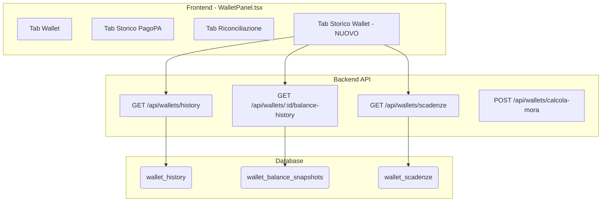
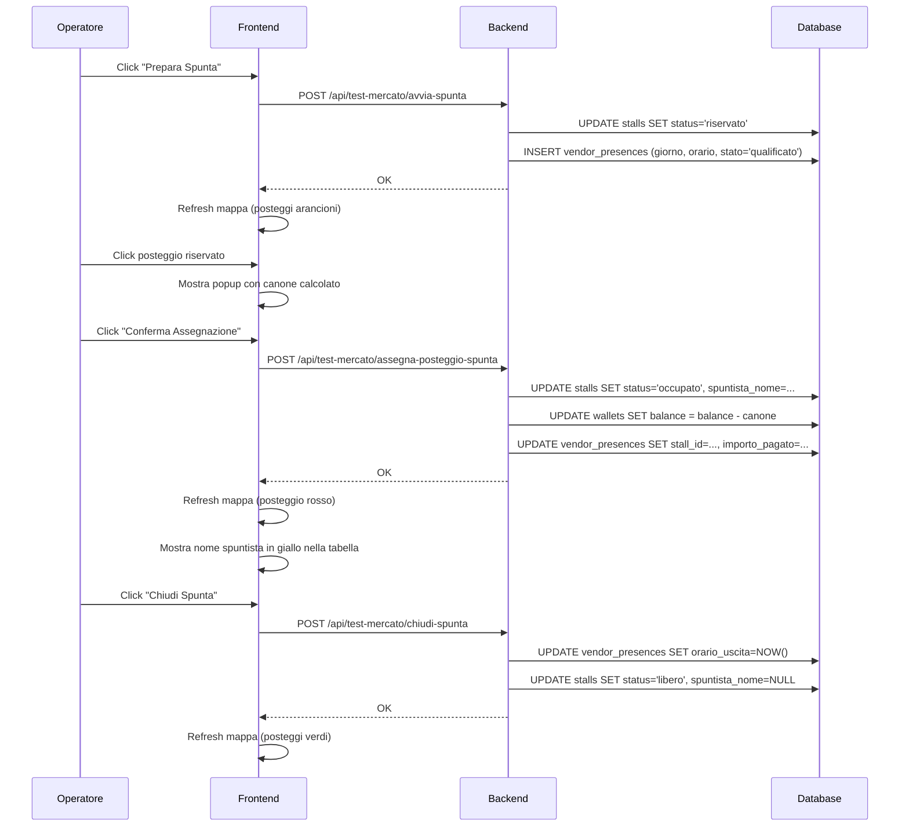

# MASTER BLUEPRINT — MIOHUB

> **Versione:** 10.0.7 (Fix Spunta: Scadenza Turno, Mappa Interna, Reset Tab Attesa)
> **Data:** 02 Maggio 2026
>
> ---
> ### CHANGELOG v10.0.7 (02 Mag 2026)
> **Fix Spunta: Scadenza Turno, Mappa Interna, Reset Tab Attesa, Chiusura Spunta Reale**
>
> **Stato deploy:**
> | Sistema | Commit | Stato |
> |---|---|---|
> | GitHub `mihub-backend-rest` master | `4af6ca2` | Allineato |
> | Hetzner backend (api.mio-hub.me) | `4af6ca2` | Autodeploy |
> | GitHub `dms-hub-app-new` master | `4c16916` | Allineato |
> | Vercel frontend | `4c16916` | Autodeploy |
>
> **BACKEND (commit `57a4e78` → `4af6ca2`):**
> - **Fix `scegli-posteggio` auto-lookup `coda_id`:** Se il frontend non invia `coda_id` ma solo `impresa_id`, il backend cerca automaticamente il turno attivo (`TURNO_ATTIVO`) nella `spunta_coda` e recupera il `coda_id` e `session_id`. Risolve l'errore "coda_id, session_id e stall_id sono obbligatori".
> - **Fix `scegli-posteggio` accetta posteggi `riservato`:** La query di verifica posteggio ora cerca `status IN ('libero', 'riservato')` invece di solo `libero`, permettendo la scelta di posteggi riservati alla spunta.
> - **Fix `attivaProssimoTurno` chiude spunta davvero:** Quando non ci sono più spuntisti `IN_ATTESA`, la funzione ora: (1) rimette tutti i posteggi `riservato` a `libero`, (2) chiude tutti i turni rimasti `IN_ATTESA` settandoli a `COMPLETATO`, (3) invia evento SSE `SPUNTA_TERMINATA`.
> - **Fix conteggio posteggi:** Tutte le query che contano posteggi disponibili ora usano `status IN ('libero', 'riservato')` invece di solo `libero`.
> - **Endpoint `scadenza-turno`:** `POST /api/presenze-live/spunta/scadenza-turno` — chiamato dal frontend quando il timer scade. Chiude il turno corrente (`SCADUTO`) e chiama `attivaProssimoTurno` per attivare il prossimo spuntista.
> - **Endpoint `avvia-spunta-live`:** `POST /api/presenze-live/avvia-spunta-live/:marketId` — per il tab "▶ Avvia" nella PA. Avvia la spunta live separatamente dall'automazione.
> - **Endpoint `spunta-turno-corrente`:** `GET /api/presenze-live/spunta-turno-corrente/:marketId` — per il banner giallo PA che mostra l'impresa di turno corrente.
> - **Endpoint `posteggi-liberi` fix:** Cerca `status IN ('riservato', 'libero')` invece di solo `libero`.
> - **Impedisce doppia presenza spunta:** Se l'impresa è già in `spunta_coda` con stato finale (`ASSEGNATO`, `SCADUTO`, `COMPLETATO`, `SALTATO`, `RINUNCIATO`), non viene reinserita. Impedisce di rifare la presenza spunta dopo che la spunta è terminata.
>
> **FRONTEND (commit `9d84617` → `4c16916`):**
> - **SpuntaNotifier — Mappa interna (no Google Maps):** L'icona MapPin nella lista posteggi alla spunta ora apre il `market-map-viewer.html` interno centrato sul posteggio selezionato, invece di Google Maps. Il `market_id` viene recuperato dalla risposta del backend `posteggi-liberi`.
> - **SpuntaNotifier — Timer scadenza:** Quando il timer raggiunge 0, il frontend chiama `POST /spunta/scadenza-turno` per notificare il backend, chiude la SSE e mostra l'overlay "Tempo scaduto".
> - **SpuntaNotifier — Polling sicuro:** Il polling non sovrascrive stati terminali (`LISTA_POSTEGGI`, `ASSEGNATO`, `FINE_SPUNTA`). Flag `scadenzaChiamataRef` previene doppie chiamate scadenza.
> - **PresenzePage — Reset tab ATTESA SPUNTA:** Aggiunto listener `storage` per l'evento `spunta_gestita` emesso da SpuntaNotifier quando l'overlay viene chiuso. Quando ricevuto: resetta `gia_presente_oggi` per le concessioni Spunta, resetta lo stato spunta locale, torna a `scelta_tipo` se in schermata spunta, e ricarica i dati mercato freschi dal backend.
> - **GestioneMercati — Tab AVVIA e Banner:** Tab "▶ Avvia" per avviare la spunta live dalla PA. Banner giallo con polling ogni 5s mostra l'impresa di turno corrente. L'automazione si ferma quando finiscono gli spuntisti.
>
> ---
> ### CHANGELOG v10.0.6 (02 Mag 2026)
> **Bridge SSE per Simulazione Mercato e SpuntaNotifier Globale**
>
> **Stato deploy:**
> | Sistema | Commit | Stato |
> |---|---|---|
> | GitHub `mihub-backend-rest` master | `7eb82a0` | Allineato |
> | Hetzner backend (api.mio-hub.me) | `7eb82a0` | Autodeploy |
> | GitHub `dms-hub-app-new` master | `daeb9d8` | Allineato |
> | Vercel frontend | `daeb9d8` | Autodeploy |
> **BACKEND:**
> - **Bridge SSE in Test Mercato (`routes/test-mercato.js`):** Aggiunto un "bridge" non bloccante agli endpoint legacy di simulazione mercato per farli comunicare con l'app impresa tramite SSE, **mantenendo intatto il flusso di simulazione per le demo**:
>   - `POST /avvia-spunta`: Dopo l'esecuzione legacy, crea/trova la `market_session` di oggi, popola la tabella `spunta_coda` con tutti gli spuntisti ordinati per graduatoria, attiva il turno del primo e invia gli eventi SSE `SPUNTA_INIZIATA` e `PROSSIMO_TURNO`.
>   - `POST /assegna-posteggio-spunta`: Dopo l'assegnazione legacy, aggiorna la `spunta_coda` a `ASSEGNATO`, invia l'evento SSE `POSTEGGIO_ASSEGNATO` all'impresa e chiama `attivaProssimoTurno` per far scattare la notifica allo spuntista successivo.
> - **Endpoint Stato Impresa (`GET /api/presenze-live/spunta/stato-impresa/:impresaId`):** Creato nuovo endpoint per controllare se l'impresa è attualmente in coda spunta (stato `IN_ATTESA`, `TURNO_ATTIVO` o `IN_CODA`) in qualsiasi sessione. Restituisce i dettagli del turno per permettere al client di connettersi alla SSE corretta.
>
> **FRONTEND:**
> - **SpuntaNotifier Globale (`SpuntaNotifier.tsx`):** Creato e integrato in `App.tsx` un componente globale che gestisce la connessione SSE per la spunta. Effettua polling leggero sull'endpoint `stato-impresa` e, se in coda, si connette allo stream SSE mostrando gli overlay full-screen (giallo per attesa/turno, verde per assegnato) in **qualsiasi pagina dell'app**.
> - **Fix UI Attesa Spunta (`PresenzePage.tsx`):**
>   - **Tab Autorizzazione Spunta:** Dopo aver registrato la presenza spunta, il tab dinamico sotto la card mostra "ATTESA SPUNTA" con icona orologio lampeggiante, invece dei pulsanti "DEPOSITO RIFIUTI" e "USCITA MERCATO".
>   - **Pulsante Scelta Tipo:** Il pulsante globale "PRESENZA SPUNTA" si trasforma in "ATTESA SPUNTA" se l'impresa ha già registrato la presenza.
>   - **Schermata Presenza Spunta:** Se la presenza è già stata registrata, la schermata mostra lo stato di attesa invece del pulsante "REGISTRA SPUNTA".
>
> ---
> ### CHANGELOG v10.0.4 (01 Mag 2026)
> **Gestione Presenze App Impresa: Tab Dinamici, Orologio Real-Time e Fix Logica Spunta**
>
> **Stato deploy:**
> | Sistema | Commit | Stato |
> |---|---|---|
> | GitHub `mihub-backend-rest` master | `6998982` | Allineato |
> | Hetzner backend (api.mio-hub.me) | `6998982` | Autodeploy |
> | GitHub `dms-hub-app-new` master | `50ebe00` | Allineato |
> | Vercel frontend | `50ebe00` | Autodeploy |
>
> **BACKEND — 9 commit (da `ec2ba0e` a `6998982`):**
>
> **Endpoint Gestione Presenze Live (`routes/presenze-live.js`):**
> - **Nuovi Endpoint:** Creati `POST /deposito-rifiuti` e `POST /uscita-mercato` per completare il flusso di presenza. Aggiornano rispettivamente `orario_deposito_rifiuti` e `checkout_time` in `vendor_presences` per la sessione corrente, e liberano lo stallo in uscita.
> - **Fix Query `mercati-oggi`:** 
>   - Corretto il nome della colonna da `rifiuti_time` a `orario_deposito_rifiuti` per il check dello stato deposito.
>   - Aggiunti i flag booleani `deposito_rifiuti_fatto` e `uscita_registrata` al payload di risposta.
>   - Aggiunte le colonne booleane fittizie al blocco `UNION ALL` per gli spuntisti per risolvere l'errore SQL.
>   - **Fix Logica Spunta:** Rimossa la clausola `NOT EXISTS` che impediva alle imprese di vedere i mercati spunta se possedevano già una concessione nello stesso mercato. Ora un'impresa può partecipare sia come concessionario che come spuntista.
> - **Fix Checkin Saldo:** Rimosso il blocco `WALLET_INSUFFICIENTE` per i concessionari nell'endpoint checkin. La presenza passa sempre e il saldo va in negativo. Il blocco saldo resta solo per gli spuntisti alla scelta del posteggio.
> - **Graduatoria in Risposta Checkin:** La risposta JSON del checkin ora include `posizione_graduatoria` e `presenze_totali` per il popup spunta.
>
> **Lista Spuntisti PA (`routes/presenze.js`):**
> - **Fix NOT EXISTS:** Rimossa la clausola `NOT EXISTS` in `GET /spuntisti/mercato/:id` che escludeva le imprese con concessione ATTIVA dalla lista spuntisti. Ora un'impresa con concessione appare anche nel tab Spunta di Gestione Mercati.
>
> **FRONTEND — 9 commit (da `4832763` a `50ebe00`):**
>
> **Flusso Operativo Presenze App Impresa (`PresenzePage.tsx`):**
> - **Tab Dinamici (Posteggi):** I pulsanti sotto ogni posteggio cambiano stato dinamicamente in base alle azioni completate: `PRESENZA` (Verde) → `DEPOSITO RIFIUTI` (Giallo) → `USCITA MERCATO` (Rosso).
> - **Pulsanti Contestuali (Scelta Tipo):** La schermata principale mostra dinamicamente i pulsanti di azione globale in base allo stato complessivo delle concessioni. Aggiunto messaggio di successo "Giornata completata!" quando tutte le operazioni sono concluse.
> - **Nuove Schermate:** Aggiunte le viste `deposito_rifiuti` e `uscita_mercato` che mostrano solo i posteggi pertinenti alla fase specifica.
> - **Fix UI e Truncate:** 
>   - Rimossi i `truncate` che tagliavano i testi dei pulsanti principali (PRESENZA POSTEGGIO, PRESENZA SPUNTA, DEPOSITO RIFIUTI, USCITA MERCATO).
>   - Risolto l'overflow del testo nel pulsante `CONFERMA PRESENZA` nella vista mappa, adattando il font per schermi piccoli.
> - **Orologio Real-Time:** Aggiunto un orologio digitale in tempo reale (formato `HH:MM:SS`, timezone Europe/Rome) tra la card del mercato e i pulsanti di azione, aggiornato ogni secondo.
>
> **Fix Wallet Impresa (`WalletImpresaPage.tsx`):**
> - **Ripristinato Pulsante Ricarica Wallet SPUNTA:** La condizione del pulsante "+ Ricarica" era limitata a `wallet.type === "GENERICO"`. Estesa a `GENERICO || SPUNTA` per permettere la ricarica PagoPA anche sui wallet spunta.
> - **Dialog Contestuale:** Il dialog di ricarica mostra titolo e descrizione differenziati: "Ricarica Wallet Spunta" con nome mercato per wallet SPUNTA, "Ricarica Wallet Generico" per wallet GENERICO.
> - **Descrizione Transazione:** La descrizione PagoPA è differenziata per tipo wallet.
>
> **Card Autorizzazione Spunta (`PresenzePage.tsx`):**
> - **Card Differenziata:** La concessione spunta ora mostra "Autorizzazione Spunta" con icona Ticket arancione, invece di "Posteggio - / 0 mq / Canone €0.00".
> - **Sottotitolo Contestuale:** Mostra il nome del mercato + "Spuntista" invece dei dati mq/canone.
> - **Logica Saldo Frontend:** Il controllo saldo negativo (bordo rosso + blocco presenza) si applica solo alle concessioni (posteggi fisici), non alle spunte. La presenza spunta passa sempre anche con saldo €0.00.
>
> **Popup Successo Spunta (`PresenzePage.tsx`):**
> - **Popup Differenziato:** Il popup successo dopo la presenza spunta mostra "PRESENZA SPUNTA REGISTRATA" con nome mercato, posizione in graduatoria e presenze accumulate, invece del generico "Posteggio - — Canone: €0.00".
>
> ---
> ### CHANGELOG v10.0.3 (29-30 Apr 2026)
> **Autocompilazione Campi Bolkestein da Database + Popolamento Dati Imprese + Filtri Anti-Scan v1.4.0**
>
> **Stato deploy:**
> | Sistema | Commit | Stato |
> |---|---|---|
> | GitHub `mihub-backend-rest` master | `ec2ba0e` | Allineato |
> | Hetzner backend (api.mio-hub.me) | `ec2ba0e` | Autodeploy |
> | GitHub `dms-hub-app-new` master | `4832763` | Allineato |
> | Vercel frontend | `4832763` | Autodeploy |
>
> **BACKEND — 1 commit (`f06054b`):**
>
> **Nuovo Endpoint Autocompilazione Bolkestein (`routes/imprese.js`):**
> - `GET /api/imprese/:id/bolkestein-data` — Restituisce dati per autocompilazione form SCIA Bolkestein: `numero_addetti`, `anni_iscrizione_ri` (calcolato), `codice_ateco`, `descrizione_ateco`, `is_settore_analogo` (derivato da ATECO), `ore_formazione` (SUM da formazione_iscrizioni + formazione_corsi completati), `num_qualificazioni` (attive), `ore_formazione_totali` (ore + qualificazioni × 8).
>
> **Popolamento Dati Database (Neon):**
> - Aggiornate 34 imprese con `numero_addetti` (casuali 1-24), `data_iscrizione_ri` (1990-2022), `codice_ateco` (corretti per settore) e `descrizione_ateco`. 8 imprese con settore analogo (46.xx, 10.xx, 56.xx), 6 con >10 dipendenti (Microimpresa = NO).
>
> **FRONTEND — 3 commit (da `8316c6d` a `4832763`):**
>
> **Autocompilazione Form SCIA Bolkestein (`SciaForm.tsx`):**
> - Nuova funzione `fetchBolkesteinData(impresaId)`: chiama endpoint backend e popola automaticamente 5 campi (N. Dipendenti, Anni RI, Microimpresa, Settore Analogo, Ore Formazione).
> - Trigger in 3 punti: dropdown autocomplete impresa, pulsante lente (handleLookupSubentrante), cambio motivazione RadioGroup a "bolkestein".
> - Indicatori visivi: bordo verde (`border-emerald-500/60`) + badge inline "Autocompilato" con icona `CheckCircle2` su tutti i campi autocompilati.
> - Checkbox Microimpresa: spuntato automaticamente se `numero_addetti < 10`.
> - Toast feedback: "Bolkestein: X campi autocompilati" con descrizione.
> - Fix: aggiunto trigger anche nel click handler del dropdown autocomplete (il percorso più comune usato dagli utenti).
>
> **REGISTRO ENDPOINT (MIO-hub/api/index.json → v42):**
> - Aggiunti **216 endpoint REST** mancanti al registro Guardian/Integrazioni (da `routes/*.js` del backend REST).
> - Categorie principali: TCC v2 (33), Associazioni (32+16), Gaming Rewards (32), DMS Legacy (24), SUAP (11), MercaWeb (9), Billing (9), AI Chat (9), Imprese (6), GTFS (6), Mercati (4), e altre.
> - Totale endpoint registrati: da 782 a **998** (inventario index.json).
> - Nessun endpoint TRPC/SPQL dismesso incluso — tutti verificati come REST attivi su Hetzner.
>
> **MIDDLEWARE ANTI-SCAN — apiLogger.js v1.4.0 (`ec2ba0e`):**
> - Aggiornati `SCAN_PATTERNS` con **30+ nuovi pattern** identificati dall'analisi dei 14.961 errori 404 nei log del 30/04/2026.
> - Nuove categorie bloccate: Database enumeration (`/v1/database/`), Home Assistant path traversal (`/hassio/`), HashiCorp Vault (`/sys/login`), Server fingerprinting (`/server/version`), Kubernetes/ES (`/clusters`), RCE (`/runscript`), MLflow (`/mlflow/`), AWS Cognito (`/auth/cognito/`), Mastodon (`/remotefollow`), XSS base64 (`data:text`), TOTP traversal (`/totp/`), Job scheduler (`/jobs/`), Router/Mesh (`/router/mesh/`), Sentry (`/site/url/transform`), CMS probing (`/v2/parameters/`), User enumeration (`/v1/users`), CORS bypass (`/cors/`).
> - Aggiornati `BOT_USER_AGENTS` con **14 scanner aggiuntivi**: nmap, nikto, nuclei, httpx, gobuster, dirbuster, wfuzz, sqlmap, burpsuite, acunetix, nessus, qualys, openvas, arachni, skipfish, python-requests, go-http-client, curl/, wget/.
>
> ---
> ### CHANGELOG v10.0.2 (28 Apr 2026)
> **Fix Logica Bolkestein + Notifiche Associazione + PDF Allegati + Diciture**
>
> **Stato deploy:**
> | Sistema | Commit | Stato |
> |---|---|---|
> | GitHub `mihub-backend-rest` master | `612dbcb` | Allineato |
> | Hetzner backend (api.mio-hub.me) | `612dbcb` | Autodeploy |
> | GitHub `dms-hub-app-new` master | `46f8171` | Allineato |
> | Vercel frontend | `46f8171` | Autodeploy |
>
> **BACKEND — 6 commit (da `1e3deed` a `612dbcb`):**
>
> **Fix Logica Valutazione Bolkestein (`suap/service.js`):**
> - Aggiunto `CHECK_CANONE_UNICO_BOLKESTEIN` (onlyIfBolkestein): verifica che il wallet dell'impresa subentrante abbia saldo positivo. Se non ha wallet (prima concessione), passa OK.
> - Rollback di `CHECK_LIMITE_POSTEGGI` per prevenire crash in valutazione (SyntaxError da const in switch case). Il controllo resta attivo con la logica originale (limite posteggi nel mercato).
>
> **Fix Notifiche e Diciture (`concessions.js`, `associazioni.js`):**
> - Diciture notifiche corrette per Bolkestein: "Bando Bolkestein Completato" invece di "Subingresso Completato".
> - Aggiunto invio automatico notifica all'Associazione (nella tabella `notifiche` con `target_tipo = 'ASSOCIAZIONE'`) quando viene rilasciata una concessione collegata a una pratica gestita dall'associazione.
> - Fix endpoint `GET /associazioni/:id/notifiche`: ora restituisce sia le notifiche ricevute (`target_tipo`) che quelle inviate (`mittente_tipo`) dall'associazione.
>
> **FRONTEND — 4 commit (da `5368910` a `46f8171`):**
>
> **Fix UI Notifiche Associazione (`NotificheAssociazionePanel.tsx`):**
> - Modificati i filtri da "Tutte/Non lette/Lette" a "Tutti/Inviati/Ricevuti" per distinguere i messaggi in entrata e uscita.
> - Fix mapping campi backend: usa `titolo` invece di `oggetto`, `data_invio` invece di `created_at`, e mappa correttamente `tipo` invece di `tipo_messaggio`.
> - Supporto per i nuovi tipi di notifica `CONCESSIONE` e `INFORMATIVA`.
>
> **Fix PDF Allegati e Diciture Bolkestein:**
> - Fix blocco popup browser: i PDF allegati ora si aprono tramite blob URL (se da DB) o programmatic click (se S3 presigned URL) invece di `window.open()`.
> - Diciture App Impresa (`AnagraficaPage.tsx`): La label della concessione ora mostra "BANDO BOLKESTEIN" invece del valore raw "subingresso" o "bando_bolkestein".
> - Diciture SUAP (`SuapPanel.tsx`, `ConcessioneForm.tsx`): Il form di generazione concessione pre-imposta correttamente tipo `bando_bolkestein` e oggetto "Bando Bolkestein..." in base al `tipo_segnalazione` della SCIA.
> - Fix errore di rete in upload PDF firmato: aggiunto rewrite `/api/suap/:path*` in `vercel.json` e usato `authenticatedFetch`.
> - Fix overflow testo notifica su mobile: aggiunti `overflow-hidden`, `break-words` e `overflowWrap` per contenere l'hash SHA-256 lungo.
>
> ---
> ### CHANGELOG v10.0.1 (28 Apr 2026)
> **Upload PDF firmato da Impresa + Fix Nomi File + Responsive Mobile + Auto-avanzamento Verificato**
>
> **Stato deploy:**
> | Sistema | Commit | Stato |
> |---|---|---|
> | GitHub `mihub-backend-rest` master | `1e3deed` | Allineato |
> | Hetzner backend (api.mio-hub.me) | `1e3deed` | Autodeploy |
> | GitHub `dms-hub-app-new` master | `5368910` | Allineato |
> | Vercel frontend | `5368910` | Autodeploy |
>
> **BACKEND — 11 commit (da `4087fd9` a `1e3deed`):**
>
> **Fix Flusso Firma e Documenti:**
> - `POST /pratiche/:id/upload-firmato` — Auto-avanzamento stato a `VERIFIED` (invece di `SIGNED`). Aggiunto `SIGNED` tra gli stati validi per consentire il re-upload. Auto-lookup `impresa_id` dal CF.
> - `GET /pratiche/:id/download-pdf` — Fix `Content-Disposition` con `filename*=UTF-8''` (RFC 6266) per servire il file come `Domanda_Bolkestein_SCIA-XXXX.pdf` (CUI della pratica) invece del nome URL. Fallback DB storage se S3 non configurato.
> - `GET /pratiche/:id/download-firmato` — Nuovo endpoint dedicato. Serve il file come `FIRMATO_Domanda_Bolkestein_SCIA-XXXX.pdf` invece del nome errato `FIRMATO_download-pdf.pdf`.
> - `POST /pratiche/:id/invia-firma` — Permette il re-invio anche dagli stati `SENT_TO_IMPRESA` e `SIGNED`.
>
> **Fix Generali API:**
> - Rimosso filtro `ente_id` UUID dalle query critiche (`getPraticaById`, `getDocumentoById`, `getPratiche`, `getStats`). Il sistema ora usa `comune_id` intero.
> - Fix `getEnteId` per gestire stringhe non-UUID (es. `ente_modena`) convertendole al default UUID, risolvendo crash in upload documenti, genera-pdf e download.
> - Aggiunto `x-ente-id` a CORS `allowedHeaders` per risolvere blocchi upload documenti dal browser.
>
> **FRONTEND — 6 commit (da `d3dd634` a `5368910`):**
>
> **Upload PDF firmato da Impresa (`AppImpresaNotifiche.tsx`):**
> - Aggiunto pulsante "Carica PDF Firmato" (icona Upload verde) nella notifica `RICHIESTA_FIRMA`.
> - Estrazione ID pratica dal `link_riferimento` della notifica e chiamata a `POST /api/suap/pratiche/:id/upload-firmato`.
> - Stato success con conferma visiva ("PDF Firmato Caricato con Successo") dopo l'upload.
> - Accetta PDF firmato (`.pdf` PAdES) e busta CAdES (`.p7m`).
>
> **Fix Responsive Mobile (`SuapPanel.tsx` e `AppImpresaNotifiche.tsx`):**
> - Stepper firma: `overflow-x-auto`, testo ridotto a `text-[10px]` su mobile, `whitespace-nowrap` e `flex-shrink-0`.
> - Titolo firma: `flex-wrap`, `truncate`, `min-w-0`.
> - Header notifica impresa: titolo `truncate`, badge ridotto, gap ridotti.
> - Pulsanti firma (Visualizza/Scarica): `flex-wrap`, `size="sm"`, testo abbreviato su mobile.
> - Allegato buttons (Dati Bando): `max-w-full overflow-hidden` e `truncate` sul nome file.
> - Sezione verbale notifica: `flex-col sm:flex-row` per wrap corretto su schermi piccoli.
>
> **Fix API Calls e Link Allegati:**
> - Tutte le chiamate API SUAP ora usano `authenticatedFetch` + `addComuneIdToUrl` (risolve 401 Unauthorized su upload documenti, genera-pdf, invia-firma, download).
> - Aggiunti link "Apri Allegato" accanto a ogni criterio Bolkestein nel dettaglio pratica.
> - "Visualizza PDF Firmato" ora usa il nuovo endpoint `download-firmato`.
> - Form SCIA Bolkestein collegato al backend per upload documenti allegati dopo creazione pratica.
>
> ---
> ### CHANGELOG v10.0.0 (27 Apr 2026)
> **Flusso Firma Digitale Inoppugnabile + Pubblicazione Graduatoria + Documenti Allegati + Notifiche Impresa**
>
> **BACKEND — 8 commit (da `64b83e7` a `4087fd9`):**
>
> **Flusso Firma Digitale Inoppugnabile (4 endpoint):**
> - `POST /pratiche/:id/genera-pdf` — Genera PDF 3 pagine (Sezioni A-F) con PDFKit, calcola hash SHA-256, upload S3 (fallback base64), stato → WAITING_SIGNATURE
> - `POST /pratiche/:id/invia-firma` — INSERT diretto in tabella `notifiche` con `link_riferimento` al PDF (pattern identico a verbali.js), tipo `RICHIESTA_FIRMA`, `comune_id` recuperato automaticamente dal mercato della pratica
> - `POST /pratiche/:id/upload-firmato` — Upload PDF firmato (PAdES/CAdES), calcolo hash SHA-256, verifica integrità, stato → SIGNED, estrazione CF firmatario
> - `GET /pratiche/:id/stato-firma` — Stato corrente del flusso firma con label/colore/step per il frontend
>
> **Pubblicazione Graduatoria Bandi (1 endpoint):**
> - `POST /bandi/:id/pubblica-graduatoria` — Verifica bando CHIUSO + graduatoria calcolata, cambia stato a GRADUATORIA_PUBBLICATA, invia notifica a ogni impresa partecipante con posizione, punteggio, posteggio richiesto e info ricorsi (60gg ex Art. 29 D.Lgs. 104/2010)
>
> **Fix PDF:**
> - SEZIONE D: tabella documenti allegati con colonne #/Nome/Tipo/Dim/Data + hash SHA-256 sotto ogni file (elimina spazio vuoto)
> - Tutte le date nel PDF usano `timeZone: 'Europe/Rome'` (fuso orario italiano)
> - SEZIONE E non forza più `addPage()` — page break solo se necessario
> - Fix layout campi (nomi corretti `sub_*`), spaziatura righe, page break condizionali
>
> **Fix notifica invia-firma:**
> - `comune_id` recuperato dal mercato della pratica nel DB (non dal body) per evitare blocco middleware `validateImpersonation`
>
> **FRONTEND — 9 commit (da `fb89534` a `d3dd634`):**
>
> **Sezione Flusso Firma Digitale Inoppugnabile (`SuapPanel.tsx`):**
> - Stepper visivo 4 step (Genera PDF → Invia all'Impresa → Firma Digitale → Verificato) con colori viola
> - Badge stato firma dinamico, box hash SHA-256, banner "In attesa di firma" con pulse
> - Pulsanti contestuali: Genera PDF, Invia, Ri-scarica, Carica PDF Firmato
> - Pulsanti "Visualizza PDF Firmato" (verde) e "Visualizza PDF Originale" (viola) quando firma completata
> - Fix stepper non aggiornato dopo genera-pdf + errore caricamento pratica al ritorno da Safari
> - `useEffect` con `visibilitychange` per ricaricare pratica al ritorno dalla tab PDF
>
> **Sezione Documenti Allegati (`SuapPanel.tsx`):**
> - Nuova card tra Firma Digitale e Controlli Automatici
> - Ogni documento cliccabile: apre presigned URL S3 in nuova tab
> - Icone differenziate per tipo (PDF rosso, immagini blu, .p7m viola)
> - Nome file, tipo, dimensione (KB/MB), data upload
>
> **Pubblicazione Graduatoria (`BandiBolkesteinPanel.tsx`):**
> - Pulsante "Pubblica Graduatoria" (viola, icona megafono) per bandi CHIUSO
> - "Vedi Graduatoria" usa GET (dati salvati, non ricalcola)
> - "Ricalcola" usa POST (solo per bandi CHIUSO)
> - Banner viola "Graduatoria Pubblicata" con info ricorsi nel tab Graduatorie
> - Pulsanti differenziati per stato bando (BOZZA/APERTO/CHIUSO/GRADUATORIA_PUBBLICATA)
>
> **Notifiche Impresa (`AppImpresaNotifiche.tsx`):**
> - Nuovo tipo `RICHIESTA_FIRMA` con badge viola e icona PenTool
> - Sezione dedicata con pulsante "Visualizza PDF da Firmare" + "Scarica PDF"
> - Box istruzioni per l'impresa (scarica → firma → restituisci)
>
> ---
> ### CHANGELOG v9.9.5 (13 Mar 2026)
> **🔧 BUGFIX: BILLING NEGOZI, VALORI MONETARI, SCIA DROPDOWN, SUAP AZIONI**
>
> **Stato deploy:**
> | Sistema | Commit | Stato |
> |---|---|---|
> | GitHub `mihub-backend-rest` master | `dfe49af` | ✅ Allineato |
> | Hetzner backend (api.mio-hub.me) | `dfe49af` | ✅ Autodeploy |
> | GitHub `dms-hub-app-new` master | `5f71027` | ✅ Allineato |
> | Vercel frontend | `5f71027` | ✅ Autodeploy |
>
> **Backend (billing.js) — 3 fix:**
> - Fix conteggio negozi: match via `hub_locations.city` con `LIKE` per gestire suffisso provincia (es. "Vignola MO" → match "Vignola")
> - Fix conteggio negozi: esclusi hub di mercato (`market_id IS NOT NULL`) dal conteggio vetrine — solo hub urbani/vetrina vengono contati
> - Fix errore SQL `billing-summary`: rimosso parametro `comuneId` extra dalla query negozi (causava "bind message supplies 2 parameters, but prepared statement requires 1")
>
> **Frontend (ComuniPanel.tsx) — 1 fix:**
> - Fix `parseFloat` su tutti i valori monetari dal backend (PostgreSQL restituisce NUMERIC come stringhe, causava concatenazione invece di somma nei totali fattura)
>
> **Frontend (SciaForm.tsx) — 1 fix:**
> - Fix dropdown cedente/subentrante su iPad/Safari: aggiunto `onMouseDown={e => e.preventDefault()}` sui bottoni dropdown per impedire al listener globale di chiudere la lista prima del click + z-index 9999
>
> **Frontend (SuapPanel.tsx) — 1 fix:**
> - Abilitati pulsanti "Richiedi Regolarizzazione" e "Nega Pratica" anche su pratiche con stato APPROVED (prima erano disabilitati, impedendo al Comune di agire dopo approvazione automatica)
>
> **Database — fix dati:**
> - Corretto `comune_id` del negozio "DUGONI calzature" (id=17): da 1 (Grosseto) a 8 (Modena)
>
> ---
> ### CHANGELOG v9.9.4 (11 Mar 2026)
> **📄 GENERAZIONE PDF FATTURE + TOTALI NEL DETTAGLIO**
>
> **Stato deploy:**
> | Sistema | Commit | Stato |
> |---|---|---|
> | GitHub `mihub-backend-rest` master | `9b5edee` | ✅ Allineato |
> | Hetzner backend (api.mio-hub.me) | `9b5edee` | ✅ Autodeploy |
> | GitHub `dms-hub-app-new` master | `6a5c76a` | ✅ Allineato |
> | Vercel frontend | `6a5c76a` | ✅ Autodeploy |
>
> **Backend (billing.js):**
> - Nuovo endpoint `GET /api/comuni/fatture/:fatturaId/pdf` per generazione PDF professionale
> - PDF include: intestazione MIO HUB, dati destinatario (Comune, provincia, PEC, CF, codice IPA), tabella dettaglio voci (descrizione, quantità, tariffa, subtotale), sezione totali (Imponibile + IVA 22% + Totale), footer con timestamp
> - Content-Disposition attachment per download diretto
> - Gestione paginazione automatica per fatture con molte voci
> - Aggiunta dipendenza `pdfkit` v0.17.2
>
> **Frontend (ComuniPanel.tsx):**
> - Aggiunta riga totali nel pannello dettaglio fattura espandibile: **Imponibile → IVA (22%) → TOTALE**
> - Calcolo totali dinamico dalla somma dei subtotali delle voci
> - Stile coerente con il tema cyan del dashboard
> - Aggiunto pulsante **"Scarica PDF"** con icona Download nel pannello dettaglio
> - Download PDF tramite `authenticatedFetch` + blob download
> - Gestione errori con alert utente
>
> ---
> ### CHANGELOG v9.9.3 (11 Mar 2026)
> **🎨 VOCI DISATTIVATE: STILE VISIVO + SUBTOTALE ZERO**
>
> **Backend (billing.js):**
> - Fix: voci con tariffa disattivata (`attiva = false`) ora restituiscono `subtotale: 0` nel billing-summary
> - Le voci disattivate vengono comunque incluse nel riepilogo ma con importo azzerato
>
> **Frontend (ComuniPanel.tsx):**
> - Voci disattivate mostrate in grigio con testo barrato e label rossa "disattivata"
> - Subtotale delle voci disattivate mostra €0.00
> - Distinzione visiva chiara tra voci attive e disattivate nel conteggio operazioni
>
> ---
> ### CHANGELOG v9.9.2 (11 Mar 2026)
> **🔧 FIX FATTURAZIONE: DECIMALI, INPUT FOCUS, SQL QUERY**
>
> **Backend (billing.js):**
> - Fix critico: `c.business_id` → `c.impresa_id` nella query qualificazioni (causava 500 su billing-summary)
> - Rimossa JOIN duplicata `stalls` → usa `c.market_id` diretto da concessions
> - billing-summary ora funzionante e testato end-to-end
>
> **Database:**
> - `billing_tariffe.tariffa_unitaria`: NUMERIC(10,4) → NUMERIC(10,2)
> - `billing_dettaglio_fattura.tariffa_unitaria`: NUMERIC(10,4) → NUMERIC(10,2)
> - `billing_dettaglio_fattura.subtotale`: NUMERIC(10,4) → NUMERIC(10,2)
>
> **Frontend (ComuniPanel.tsx):**
> - Tutti i valori monetari ora mostrano 2 decimali (`maximumFractionDigits: 2`)
> - Input tariffe: cambiato da `onChange` (salva ad ogni tasto, causa perdita focus) a `onBlur` (salva quando esci dal campo)
> - Aggiunto `key` dinamico su input per forzare re-render dopo salvataggio API
> - `defaultValue` invece di `value` per permettere editing libero
>
> ---
> ### CHANGELOG v9.9.1 (11 Mar 2026)
> **💰 FRONTEND FATTURAZIONE + FIX MISMATCH API**
>
> **Frontend (ComuniPanel.tsx):**
> - Dashboard Conteggio Operazioni: selettore periodo + tabella voci + totali + IVA + genera fattura
> - Configurazione Tariffe: tabella editabile con toggle attiva/disattiva + inizializza default
> - Dettaglio fattura espandibile con breakdown voci
> - Badge "Auto" per fatture generate automaticamente
> - Fix mismatch interfacce TypeScript (voce, riepilogo.imponibile, dettagli)
> - Fix URL PUT tariffe → `/api/comuni/billing-tariffe/:id`
> - Fix genera fattura → `/api/comuni/:id/billing-genera-fattura`
> - pnpm check zero errori
>
> ---
>
> ### CHANGELOG v9.9.0 (11 Mar 2026)
> **💰 SISTEMA FATTURAZIONE AUTOMATICA PER COMUNI (BACKEND)**
>
> **Progetto:** Sistema di conteggio operazioni e fatturazione automatica per ogni Comune.
> Il sistema calcola automaticamente il costo del servizio MioHub basandosi sulle operazioni effettivamente svolte.
>
> ---
>
> #### MODELLO DI PRICING (3 livelli)
>
> **LIVELLO 1 — Canoni Base (fissi annuali)**
>
> | Servizio | Formula | Fonte dati DB |
> |---|---|---|
> | Gestione Mercati (include DMS Legacy) | Tariffa x posteggi x gg_mercato/anno | `markets.total_stalls` x `markets.annual_market_days` x tariffa |
> | Servizio HUB | Canone base HUB + (tariffa/negozio x negozi) | `hub_locations` (attivi) + `hub_shops` per hub |
> | AVA AI Chat | Canone fisso | `ai_conversations`, `ai_messages` |
>
> **LIVELLO 2 — Voci a Consumo (per operazione)**
>
> | Voce | Tabella DB | Tariffa default |
> |---|---|---|
> | Verbali emessi | `sanctions` | 5,00/verbale |
> | Pratiche SCIA verificate | `suap_pratiche` + `suap_checks` | 10,00/pratica |
> | Giornate mercato gestite | `market_sessions` | 2,00/giornata |
> | Transazioni wallet | `wallet_transactions` | 0,50/transazione |
> | Segnalazioni civiche | `civic_reports` | 2,00/segnalazione |
> | Notifiche inviate | `notifiche_destinatari` | 0,10/notifica |
> | Qualificazioni imprese | `qualificazioni` | 3,00/verifica |
>
> **LIVELLO 3 — Servizi Premium (opzionali)**
>
> | Servizio | Tariffa default |
> |---|---|
> | MIO Agent (Orchestratore AI) | 2.400,00/anno |
> | Mobilità e Trasporti | 600,00/anno |
> | Gaming/Rewards | 800,00/anno |
> | Carbon Credits | 400,00/anno |
>
> **NOTA:** Il servizio DMS Legacy (bridge bidirezionale) è COMPRESO nella gestione mercati.
>
> ---
>
> #### NUOVE TABELLE DB
>
> **`billing_tariffe`** — Tariffe configurabili per comune
> | Colonna | Tipo | Descrizione |
> |---|---|---|
> | id | SERIAL PK | ID univoco |
> | comune_id | INTEGER FK | Riferimento al comune |
> | voce | VARCHAR | Codice voce: `mercati`, `hub`, `hub_negozio`, `ava`, `verbali`, `suap`, `giornate`, `wallet`, `civic`, `notifiche`, `qualificazioni`, `mio_agent`, `mobilita`, `gaming`, `carbon` |
> | tariffa_unitaria | NUMERIC(10,4) | Importo per unità |
> | unita | VARCHAR | Descrizione unità: `posteggio/giornata`, `hub/anno`, `negozio/anno`, `verbale`, `pratica`, `giornata`, `transazione`, `segnalazione`, `notifica`, `verifica`, `anno` |
> | attiva | BOOLEAN | Se la voce è attiva per questo comune |
> | created_at | TIMESTAMP | Data creazione |
> | updated_at | TIMESTAMP | Data aggiornamento |
>
> **`billing_dettaglio_fattura`** — Dettaglio voci per ogni fattura generata
> | Colonna | Tipo | Descrizione |
> |---|---|---|
> | id | SERIAL PK | ID univoco |
> | fattura_id | INTEGER FK | Riferimento a `comune_fatture.id` |
> | voce | VARCHAR | Codice voce (come sopra) |
> | descrizione | TEXT | Descrizione leggibile della voce |
> | quantita | INTEGER | Numero operazioni nel periodo |
> | tariffa_unitaria | NUMERIC(10,4) | Tariffa applicata |
> | subtotale | NUMERIC(10,2) | quantita x tariffa_unitaria |
> | periodo_da | DATE | Inizio periodo di riferimento |
> | periodo_a | DATE | Fine periodo di riferimento |
>
> ---
>
> #### NUOVI ENDPOINT API (Backend)
>
> | Metodo | Endpoint | Descrizione |
> |---|---|---|
> | GET | `/api/comuni/:id/billing-tariffe` | Lista tariffe configurate per il comune |
> | POST | `/api/comuni/:id/billing-tariffe` | Crea/aggiorna tariffa per il comune |
> | PUT | `/api/comuni/billing-tariffe/:id` | Modifica tariffa specifica |
> | DELETE | `/api/comuni/billing-tariffe/:id` | Elimina tariffa |
> | POST | `/api/comuni/:id/billing-tariffe/init-defaults` | Inizializza tariffe default per il comune |
> | GET | `/api/comuni/:id/billing-summary?da=YYYY-MM-DD&a=YYYY-MM-DD` | Calcolo automatico conteggio operazioni e importi per periodo |
> | POST | `/api/comuni/:id/billing-genera-fattura` | Genera fattura automatica dal billing summary |
> | GET | `/api/comuni/fatture/:id/dettaglio` | Dettaglio voci di una fattura |
>
> ---
>
> #### ISTRUZIONI FRONTEND (per Claude)
>
> **TASK:** Aggiornare il tab "Fatturazione" in `ComuniPanel.tsx` per integrare il nuovo sistema di billing.
>
> **Il tab Fatturazione deve avere 3 sezioni:**
>
> **Sezione 1 — Dashboard Conteggio Operazioni (NUOVA)**
> - Selettore periodo: Mese / Trimestre / Anno (date picker da-a)
> - Chiama `GET /api/comuni/:id/billing-summary?da=...&a=...`
> - Mostra tabella con colonne: Voce | Quantità | Tariffa | Subtotale
> - Riga totale in fondo con somma subtotali
> - Riga IVA 22%
> - Riga TOTALE IVA inclusa
> - Pulsante "Genera Fattura" che chiama `POST /api/comuni/:id/billing-genera-fattura`
> - Le voci con quantità 0 vanno mostrate in grigio
> - Le voci canone (mercati, hub, ava) mostrano il calcolo annuale proporzionato al periodo
>
> **Sezione 2 — Configurazione Tariffe (NUOVA)**
> - Chiama `GET /api/comuni/:id/billing-tariffe`
> - Tabella editabile: Voce | Tariffa unitaria | Unità | Attiva (toggle)
> - Pulsante "Inizializza Tariffe Default" che chiama `POST /api/comuni/:id/billing-tariffe/init-defaults`
> - Ogni modifica chiama `PUT /api/comuni/billing-tariffe/:id`
> - Design: card compatta con input inline, toggle per attiva/disattiva
>
> **Sezione 3 — Contratti e Fatture (ESISTENTE, da mantenere)**
> - Mantieni tutto il codice esistente di contratti e fatture
> - Aggiungi: quando si clicca su una fattura, mostra il dettaglio voci (`GET /api/comuni/fatture/:id/dettaglio`)
> - Le fatture generate automaticamente dal billing devono avere un badge "Auto" per distinguerle
>
> **REGOLE:**
> - NON cancellare file
> - NON modificare file .md
> - NON toccare BusHubEditor.tsx
> - NON rimuovere codice esistente nel tab Fatturazione
> - Aggiungi le 2 nuove sezioni SOPRA la sezione Contratti/Fatture esistente
> - Usa lo stesso design system del resto dell'app (bg-gray-800/50, border-gray-700, text-cyan-400, etc.)
> - Un unico commit, pusha sul branch
>
> ---
>
> ### CHANGELOG v9.8.5 (11 Mar 2026)
> **🔄 INDEXEDDB RECONNECT ROBUSTO PER SAFARI**
>
> **Stato deploy:**
> | Sistema | Commit | Stato |
> |---|---|---|
> | GitHub `dms-hub-app-new` master | `1506893` | ✅ Allineato |
> | Vercel frontend | `1506893` | ✅ Auto-deploy attivo |
> | GitHub `mihub-backend-rest` master | `8a93c1a` | ✅ Allineato |
> | Hetzner backend | `de45517` | ✅ Online |
>
> **Fix frontend (`dmsBus.ts` v3.0):**
> - Backoff esponenziale sui retry: 1s → 2s → 4s (max 30s) invece di 100-200ms
> - 3 tentativi invece di 2 prima del fallback localStorage
> - `rateLimitedWarn()`: max 1 warning per tipo ogni 60 secondi (elimina il flood nel Guardian)
> - `scheduleReconnect()`: auto-reconnect proattivo su evento `onclose` (Safari standby/background)
> - Fallback silenzioso permanente (`dbFailed = true`) dopo 3 failure consecutive
> - `consecutiveFailures` counter per tracking failure progressive
> - Nessun `console.warn` ripetitivo durante il fallback
>
> **Combinato con v9.8.4 backend:** il flood IndexedDB è ora gestito su entrambi i lati:
> - Frontend: rate-limit log + reconnect automatico
> - Backend: rate-limit su `createLog` + filtro bot/scanner
>
> ---
> ### CHANGELOG v9.8.4 (11 Mar 2026)
> **🛡️ FILTRO BOT/SCANNER + RATE LIMIT LOG RIPETITIVI**
>
> **Stato deploy:**
> | Sistema | Commit | Stato |
> |---|---|---|
> | GitHub `mihub-backend-rest` master | `de45517` | ✅ Allineato |
> | Hetzner backend (api.mio-hub.me) | `de45517` | ✅ Online, autodeploy attivo |
> | GitHub `dms-hub-app-new` master | `1284f8c` | ✅ Allineato |
> | Vercel frontend | `1284f8c` | ✅ Auto-deploy attivo |
> | Neon DB | 4 mercati, **820 stalls** | ✅ Stabile, errori: 885 → 59 |
>
> **Analisi errori (indagine diretta su DB):**
> - 787 errori (92%) erano **flood IndexedDB** da Safari Mac ("Connection to Indexed Database server lost")
> - ~30 errori erano **bot/scanner** (LeakIX, l9explore, silver.inc) che probing `/.env`, `/.git/config`, `/swagger.json`, `/gql`
> - 8 errori `POST /api/route` da IP polacco (195.3.221.86, MEVSPACE) con 6 user-agent diversi = bot che ruota UA
> - Errori reali rimanenti: 59 (legittimi: fraud endpoint 404, integrations 404, wallets 400, map removeLayer)
>
> **Fix backend (mihub-backend-rest):**
> - `apiLogger.js` v1.3.1: aggiunto `/.env`, `/.git/`, `/swagger.json`, `/gql` ai `SCAN_PATTERNS`
> - `apiLogger.js` v1.3.1: aggiunto filtro `BOT_USER_AGENTS` (l9scan, l9explore, leakix, silver.inc, zgrab, masscan, censys, shodan)
> - `apiLogger.js` v1.4.0 (30 Apr 2026): aggiornati `SCAN_PATTERNS` con 30+ nuovi pattern (database enum, path traversal, RCE, XSS, CMS/scheduler/mesh probing) e `BOT_USER_AGENTS` con 14 scanner aggiuntivi
> - `logs.js` v1.3.1: rate limit su `createLog` per errori frontend ripetitivi (finestra 5 minuti)
> - Rate limit previene flood: da 400 errori/ora a max 12/ora per lo stesso errore identico
> - Pulizia periodica mappa rate limit ogni 10 minuti
>
> **Pulizia DB:**
> - Eliminati 826 errori spazzatura (bot + flood IndexedDB)
> - Mantenuto 1 errore IndexedDB rappresentativo
> - Errori rimanenti: 59 (tutti legittimi o da investigare)
>
> **Problema aperto:** Safari perde connessione IndexedDB quando la pagina resta in background → richiede fix frontend (reconnect automatico o fallback server)
>
> ---
> ### CHANGELOG v9.8.3 (10 Mar 2026)
> **⚡ REACT.MEMO — OTTIMIZZAZIONE RE-RENDER SU 54 COMPONENTI**
>
> **Stato deploy:**
> | Sistema | Commit | Stato |
> |---|---|---|
> | GitHub `mihub-backend-rest` master | `8220688` | ✅ Allineato |
> | Hetzner backend (api.mio-hub.me) | `8220688` | ✅ Online, autodeploy attivo |
> | GitHub `dms-hub-app-new` master | `a993e05` | ✅ Allineato |
> | Vercel frontend | `a993e05` | ✅ Auto-deploy attivo |
> | Neon DB | 4 mercati, **820 stalls** | ✅ Stabile |
>
> **Cherry-pick da branch `claude/review-production-fixes-3sUvQ`:**
>
> - `a993e05` (cherry-pick di `982eac7`) — Aggiunto `React.memo()` a 54 componenti + `useCallback` in AIChatPanel
>
> **54 componenti wrappati con React.memo, organizzati in 3 tier:**
>
> *Tier 1 — Critical (DashboardPA tabs + AI chat):*
> - GestioneMercati, WalletPanel, ControlliSanzioniPanel, CivicReportsPanel, ClientiTab, SecurityTab
> - Tutti i 9 componenti AI chat: AIChatMessage, AIChatMessageList, AIChatInput, AIChatHeader, AIChatMarkdown, AIChatDataTable, AIChatAvatar, AIChatTypingIndicator, AIChatStatCard
>
> *Tier 2 — High (liste, tabelle, pannelli):*
> - SUAP: ListaAutorizzazioniSuap, ListaDomandeSpuntaSuap, AutorizzazioneDetail, DomandaSpuntaDetail, SuapPanel
> - MarketCompaniesTab, AssociazioniPanel, ComuniPanel, PresenzeGraduatoriaPanel, ImpreseQualificazioniPanel, Integrazioni, FraudMonitorPanel, NotificationsPanel
> - Association panels: AnagraficaAssociazionePanel, WalletAssociazionePanel, PresenzeAssociatiPanel, GestioneCorsiAssociazionePanel, GestioneServiziAssociazionePanel, SchedaPubblicaPanel
>
> *Tier 3 — Medium (mappe, layer, modali):*
> - HubMarketMapComponent, TransportStopsLayer, CivicReportsLayer, CivicReportsHeatmap, MapModal, ShopModal, MappaItaliaPubblica, NativeReportComponent, GamingRewardsPanel, GestioneHubPanel, GestioneHubNegozi
> - APIDashboardV2, BottomNav, ConnessioniV2, LegacyReportCards, LogDebug, LogsDebugReal, MIOAgent, MIOLogs
>
> **useCallback fix:** `handleToggleSidebar` in AIChatPanel wrappato con `useCallback` per non invalidare memo su AIChatHeader
>
> **Problemi noti risolti:** ~~Zero React.memo nel codebase (performance)~~
>
> **Problemi noti rimanenti (da pianificare):**
> - DashboardPA.tsx = 9.775 righe (mega-componente, richiede refactor)
> - API keys in `VITE_*` (MercaWeb, Forge) visibili nel bundle
> - Auth tokens in localStorage (valutare httpOnly cookies)
>
> ---
> ### CHANGELOG v9.8.2 (10 Mar 2026)
> **🛡️ ABORTCONTROLLER — PREVENZIONE MEMORY LEAK SU TUTTI I FETCH**
>
> **Stato deploy:**
> | Sistema | Commit | Stato |
> |---|---|---|
> | GitHub `mihub-backend-rest` master | `8220688` | ✅ Allineato |
> | Hetzner backend (api.mio-hub.me) | `8220688` | ✅ Online, autodeploy attivo |
> | GitHub `dms-hub-app-new` master | `87cefbd` | ✅ Allineato |
> | Vercel frontend | `87cefbd` | ✅ Auto-deploy attivo |
> | Neon DB | 4 mercati, **820 stalls** | ✅ Stabile |
>
> **Cherry-pick da branch `claude/review-production-fixes-3sUvQ`:**
>
> - `87cefbd` (cherry-pick di `a50d76d`) — Aggiunto `AbortController` a tutti i `useEffect` con fetch call
>
> **18 file modificati:**
> - **Contexts:** MioContext, PermissionsContext, TransportContext
> - **Hooks:** useAgentLogs, useInternalTraces, useSystemStatus, useConversations
> - **Pages:** APITokensPage, CivicPage, GuardianDebug, GuardianEndpoints, GuardianLogs, HomePage, MapPage, WalletStorico
> - **Components:** CivicReportsPanel, WalletPanel, CompanyWallet
>
> **Pattern applicato in ogni file:**
> 1. `AbortController` creato all'inizio dell'`useEffect`
> 2. `signal` passato a `fetch()` come opzione
> 3. `controller.abort()` nel cleanup return dell'`useEffect`
> 4. `AbortError` ignorato nel catch block
>
> **Problemi noti risolti:** ~~Missing AbortController su fetch (memory leak)~~
>
> **Problemi noti rimanenti (da pianificare):**
> - DashboardPA.tsx = 9.775 righe (mega-componente, richiede refactor)
> - ~~Zero `React.memo` nel codebase (performance)~~ → Risolto in v9.8.3
> - API keys in `VITE_*` (MercaWeb, Forge) visibili nel bundle
> - Auth tokens in localStorage (valutare httpOnly cookies)
>
> ---
> ### CHANGELOG v9.8.1 (10 Mar 2026)
> **🧹 MERGE FIX CLAUDE — PULIZIA PRODUZIONE + SICUREZZA + DOCUMENTAZIONE**
>
> **Stato deploy:**
> | Sistema | Commit | Stato |
> |---|---|---|
> | GitHub `mihub-backend-rest` master | `8220688` | ✅ Allineato |
> | Hetzner backend (api.mio-hub.me) | `8220688` | ✅ Online, autodeploy attivo |
> | GitHub `dms-hub-app-new` master | `d771733` | ✅ Allineato |
> | Vercel frontend | `d771733` | ✅ HTTP 200, auto-deploy |
> | Neon DB | 4 mercati, **820 stalls** | ✅ Stabile |
>
> **Merge da branch `claude/review-production-fixes-3sUvQ` (7 commit):**
>
> *Fix sicurezza:*
> - `1db5bbf` — Hardening `new Function()` in MessageContent.tsx: blocca pattern pericolosi (fetch, eval, document.cookie, localStorage, WebSocket) prima dell'esecuzione
>
> *Pulizia produzione:*
> - `56d6842` — Rimossi **87 righe** di console.log di debug da: ConcessioneForm.tsx (17), SciaForm.tsx (2), BusHubEditor.tsx (2), PngTransparentTool.tsx, SlotEditorV3.tsx
> - `56d6842` — Aggiunto `loading="lazy"` su **13 immagini**: VetrinePage (5), NativeReportComponent (2), SystemBlueprintNavigator (2), CivicReportsLayer (1), AnagraficaPage (1), SlotEditorV3 (1)
> - `56d6842` — Guardian refetchInterval da 10s → 30s (allineato a GuardianLogsSection)
>
> *Documentazione:*
> - `74f91e3` + `9d375c8` + `bb5d08f` — Aggiunta Scheda Tecnica del Sistema (HTML + Markdown)
> - `d04ef40` — CLAUDE.md aggiornato per architettura REST (rimossi riferimenti tRPC)
> - `404f29c` — Blueprint v9.8.0 allineato da master
>
> **Altre modifiche backend (Manus):**
> - `8220688` — Fix DMSBUS 404: `/api/tmp/json/:key` ritorna 200 con `null` invece di 404 per chiavi inesistenti
> - `71b8e7a` — Import-market ottimizzato: batch INSERT con `unnest()`, CTE cascade DELETE, UPSERT geometry (da 90s a 1.5s per 237 stalls)
> - Pulizia log errori: azzerati 14.426 errori accumulati (di cui 5.262 falsi 404 DMSBUS)
> - Cancellato Hub 109 orfano, hub_locations: 83
> - Puliti tutti i branch obsoleti da entrambi i repo
>
> **Problemi noti (da pianificare separatamente):**
> - DashboardPA.tsx = 9.775 righe (mega-componente, richiede refactor)
> - Zero `React.memo` nel codebase (performance)
> - ~~Missing `AbortController` su fetch (memory leak)~~ → Risolto in v9.8.2
> - API keys in `VITE_*` (MercaWeb, Forge) visibili nel bundle
> - Auth tokens in localStorage (valutare httpOnly cookies)
>
> ---
> ### CHANGELOG v9.8.0 (08 Mar 2026)
> **🔧 FIX CRITICO — SALVATAGGIO GIS UPSERT + FK CASCADE + AUDIT ALLINEAMENTO COMPLETO**
>
> **Stato deploy:**
> | Sistema | Commit | Stato |
> |---|---|---|
> | GitHub `mihub-backend-rest` master | `7fb51fb` | ✅ Allineato |
> | Hetzner backend (api.mio-hub.me) | `7fb51fb` | ✅ Online, autodeploy attivo |
> | GitHub `dms-hub-app-new` master | `3e83b4a` | ✅ Allineato |
> | Vercel frontend | `3e83b4a` | ✅ HTTP 200, auto-deploy |
> | Neon DB | 4 mercati, **820 stalls** | ✅ Mercato La Piazzola (ID 14) con **237 stalls** Polygon |
>
> **Problema risolto (Salvataggio GIS da Slot Editor):**
> Il salvataggio dei posteggi dallo Slot Editor falliva silenziosamente per una combinazione di fattori:
> 1. **Foreign Key Cascade non gestita:** `DELETE FROM stalls` falliva per FK chain: `wallet_transactions → vendor_presences → graduatoria_presenze → wallets → suap_* → concessions → autorizzazioni → stalls`
> 2. **FileReader Promise bloccante:** La conversione PNG in base64 si bloccava indefinitamente nell'iframe cross-origin su Safari/iPad (ITP)
> 3. **Prompt Hub ID errato:** Il prompt chiedeva l'Hub ID invece del Market ID, creando record orfani
>
> **Soluzione implementata (mihub-backend-rest — 7 commit dopo v9.7.0):**
> - `7fb51fb` — Timeout 5s su conversione PNG base64 (`Promise.race`) per evitare blocco su Safari/iPad
> - `7c1b902` — Messaggi di stato visibili durante salvataggio `[1/4] [2/4] [3/4] [4/4]`
> - `03ae915` — Prompt ora chiede **Market ID** (non Hub ID), pre-compilato dal BUS, con lista mercati esistenti
> - `04d55a5` — FK cascade completa: cancella tutte le tabelle dipendenti nell'ordine corretto prima degli stalls
> - `ead798d` — FK cascade intermedia (vendor_presences, wallets, suap_pratiche)
> - `14e57cb` — FK cascade base (graduatoria_presenze, concessions, autorizzazioni)
> - `707849b` — UPSERT `import-market`: se riceve `market_id`, aggiorna il mercato esistente invece di crearne uno nuovo
>
> **Soluzione frontend (dms-hub-app-new — 3 commit dopo v9.7.0):**
> - `3e83b4a` — Fix key prop iframe per forzare re-render al cambio step
> - `c71789c` — Ripristino BusHubEditor.tsx originale
> - `1b17163` — Navigazione interna iframe per preservare IndexedDB su Safari/iPad
>
> **Modifiche Route Backend:**
> - `routes/gis.js` — `import-market` ora supporta UPSERT con `market_id`, FK cascade delete completa, ricerca per nome come fallback
> - `slot_editor_v3_unified.html` — Prompt Market ID, timeout PNG 5s, messaggi di stato step-by-step
>
> **Stato Database (Neon) — 08 Mar 2026:**
> | Tabella | Conteggio | Note |
> |---|---|---|
> | `markets` | 4 | Grosseto (160), Modena (382), Cervia (41), **Bologna (237)** |
> | `stalls` | 820 | +220 rispetto a v9.7.0 |
> | `hub_locations` | 83 | Hub 109 orfano cancellato |
> | `market_geometry` | 3 | Manca Grosseto (ID 1) |
> | `concessions` | 51 | Invariato |
> | `users` | 11 | Invariato |
>
> **Audit Branch GitHub:**
> | Repo | Branch | Stato | Azione |
> |---|---|---|---|
> | `mihub-backend-rest` | `claude/paste-operational-message-VkUsh` | ✅ Cancellato | — |
> | `mihub-backend-rest` | `feature/guardian-blueprint-sync` | ✅ Cancellato | — |
> | `dms-hub-app-new` | `claude/review-production-fixes-3sUvQ` | ✅ Mergiato in master | Cancellato |
> | `dms-hub-app-new` | 10+ branch `feature/*` e `fix/*` | ✅ Tutti cancellati | — |
>
> **Azioni raccomandate:**
> 1. Cancellare Hub 109 orfano: `DELETE FROM hub_locations WHERE id = 109`
> 2. Generare geometria per Mercato Grosseto (ID 1) via Slot Editor
> 3. Pulire branch obsoleti da entrambi i repository
> 4. Ottimizzare `import-market` (attualmente ~90s per 237 stalls)
>
> ---
> ### CHANGELOG v9.7.0 (07 Mar 2026)
> **🔧 FIX CRITICO — PERSISTENZA DATI SLOT EDITOR SU SAFARI/IPAD + SALVATAGGIO GIS COMPLETO**
>
> **Stato deploy:**
> | Sistema | Commit | Stato |
> |---|---|---|
> | GitHub `mihub-backend-rest` master | `e39a8ba` | ✅ Allineato |
> | Hetzner backend (157.90.29.66:3000) | `e39a8ba` | ✅ Online, checksum file verificato |
> | GitHub `dms-hub-app-new` master | `910c7c6` | ✅ Allineato |
> | Vercel frontend | `910c7c6` | ✅ HTTP 200, auto-deploy |
> | Neon DB | 4 mercati, 600 stalls | ✅ Mercato La Piazzola (ID 14) con 17 stalls Polygon |
>
> **Problema risolto (Safari/iPad ITP):**
> Safari ITP cancella localStorage/IndexedDB degli iframe cross-origin (Hetzner dentro Vercel). Tutti i dati non salvati nel DB (posteggi, pianta, marker) venivano persi alla navigazione.
>
> **Soluzione: postMessage Bridge bidirezionale**
> - `dms-bus.js` (iframe Hetzner): wrappa `DMSBUS.putJSON/putBlob/deleteKey/clear` per inviare copia dati al parent via `postMessage`
> - `BusHubEditor.tsx` (parent Vercel): riceve e salva in `localStorage` first-party (non soggetto a ITP)
> - Al ricaricamento, iframe chiede `DMS_BRIDGE_REQUEST` → parent risponde con `DMS_BRIDGE_RESTORE` → iframe ripristina dati
> - Evento `dms-bridge-restored` notifica lo Slot Editor per riposizionare la pianta trasparente
>
> **Modifiche Backend (mihub-backend-rest — 5 commit dopo v9.6.2):**
> - `e39a8ba` — Fix pianta trasparente: `plant_marker_position` salvato nel DMSBUS + listener `dms-bridge-restored`
> - `0d11381` — Fix geometria posteggi: `stallsGeoJSON` ora crea Polygon (4 corner) + `geometry_geojson` in import-market
> - `d7a359d` — Fix salvataggio mercato: bottone "Salva nel Database" ora chiama anche `/api/gis/import-market` (crea markets + stalls + market_geometry)
> - `2539b8b` — Bridge postMessage in `dms-bus.js` (wrapper DMSBUS → parent)
> - `6a0664a` — DMSBUS fallback robusto per Safari/iPad (blob↔base64, timeout IndexedDB)
>
> **Modifiche Frontend (dms-hub-app-new — 1 commit dopo v9.6.2):**
> - `910c7c6` — Bridge postMessage in `BusHubEditor.tsx` (listener DMS_BRIDGE_SAVE/REQUEST/CLEAR)
>
> **Modifiche Route Backend:**
> - `routes/gis.js` — import-market ora salva `geometry_geojson`, `rotation`, `dimensions`, `width`, `depth`, `area_mq` per ogni stall
> - `routes/hub.js` — PUT hub/locations ora accetta campo `tipo`
> - `routes/markets.js` — PATCH markets/:id ora accetta `hub_location_id`
>
> **Modifiche Database (Neon):**
> - Mercato La Piazzola (ID 14): creato con 17 stalls Polygon, `comune_id = 6` (Bologna), `market_geometry` con PNG metadata
> - Hub La Piazzola (ID 108): cancellato record duplicato da `hub_locations`
>
> **Verifica allineamento (07 Mar 2026):**
> - `dms-bus.js`: checksum GitHub = checksum Hetzner ✅
> - `slot_editor_v3_unified.html`: checksum GitHub = checksum Hetzner ✅
> - `bus_hub.html`: checksum GitHub = checksum Hetzner ✅
> - API `/api/gis/market-map/14`: 17 stalls Polygon ✅
> - Neon DB: 4 mercati, 600 stalls totali, 3 market_geometry ✅
>
> ---
> ### CHANGELOG v9.6.2 (02 Mar 2026)
> **🔧 BUG FIX POST-FASE 3 AVA + ALLINEAMENTO COMPLETO**
>
> **Stato deploy:**
> | Sistema | Commit | Stato |
> |---------|--------|-------|
> | GitHub `mihub-backend-rest` master | `96359ea` | ✅ Allineato |
> | Hetzner backend (157.90.29.66:3000) | `96359ea` | ✅ Online (HTTP 200), PM2 running |
> | GitHub `dms-hub-app-new` master | `a3d9369` | ✅ Allineato |
> | Vercel frontend | `a3d9369` | ✅ HTTP 200, auto-deploy |
> | Neon DB (indici AVA) | 18 indici `idx_ava_*` | ✅ Attivi |
> | Claude branch | `a3d9369` (force-pushed) | ✅ Allineato a master |
>
> **Bug fix backend (Hetzner — 6 commit dopo v9.6.0):**
> - `96359ea` — Inietta risultati tool nel prompt LLM per risposte coerenti (anti-hallucination)
> - `756c922` — `report_presenze` usa `graduatoria_presenze` per storico completo (non solo `vendor_presences` che viene svuotata al reset mercato)
> - `9f59331` — Fix priorità tool: `report_presenze` non bloccato da `cerca_concessionario`
> - `0d5e94f` — `report_presenze` per PA cerca presenze per impresa specifica
> - `7a1a323` — Isolamento completo conversazioni per `comune_id`
> - `7005d92` — Colonna `comune_id` in `ai_conversations` + filtro backend
>
> **Bug fix frontend (Vercel — 5 commit dopo v9.6.0):**
> - `a3d9369` — SUAP ConcessioneForm: rimosso filtro `addComuneIdToUrl` → mostra TUTTE le imprese nel DB (non solo quelle con concessioni nel comune)
> - `782b688` — (Commit intermedio, poi corretto in a3d9369)
> - `b38b080` — IndexedDB auto-reconnect e fallback localStorage su connection lost (Safari/iOS)
> - `90b5ea8` — Merge: conversazioni AVA isolate per comune impersonato
> - `7236131` — Fix: `useConversations` filtra per `comune_id`, `ChatWidget` legge impersonation
>
> **Problemi noti e mitigazioni:**
> - LLM qwen2.5:7b a volte ignora i risultati tool e inventa dati → mitigato con iniezione summary nel system prompt
> - `vendor_presences` viene svuotata al reset mercato test → usata `graduatoria_presenze` per dati storici
> - IndexedDB perde connessione su Safari/iOS → auto-retry con fallback localStorage
>
> **Map Viewer GIS:** ✅ Verificato funzionante (Grosseto, Novi Sad Modena, Cervia Demo)
>
> ---
> ### CHANGELOG v9.6.1 (01 Mar 2026)
> **✅ ALLINEAMENTO COMPLETO — Tutti i sistemi sincronizzati**
>
> **Stato deploy:**
> | Sistema | Commit | Stato |
> |---------|--------|-------|
> | GitHub `mihub-backend-rest` master | `52272ca` | ✅ Allineato |
> | Hetzner backend (157.90.29.66:3000) | `52272ca` | ✅ Online, PM2 running |
> | GitHub `dms-hub-app-new` master | `5b0ea60` | ✅ Allineato |
> | Vercel frontend | `5b0ea60` | ✅ HTTP 200, auto-deploy |
> | Neon DB (indici AVA) | 18 indici `idx_ava_*` | ✅ Attivi |
> | Claude branch | Fully merged | ✅ 0 commit pendenti |
>
> **Merge effettuati:**
> - `c02baa8` — Fase 3 Step 3.1 + 3.8 (context SSE + suggerimenti ruolo)
> - `a5d87b8` — Fix chat AVA vista smartphone (sidebar toggle, mobile detection)
> - `58495f0` — Fix text overflow smartphone (break-words, overflow-hidden)
>
> ---
> ### CHANGELOG v9.6.0 (01 Mar 2026)
> **🔐 FASE 3 AVA — DATA ACCESS GATEWAY MULTI-RUOLO — ✅ COMPLETATA**
>
> **Stato:** ✅ COMPLETATO E DEPLOYATO (tutti 8 step)
>
> Implementazione completa del sistema di accesso dati filtrato per ruolo in AVA.
> Basato sull'analisi di `AVA_DATA_ACCESS_SCHEMA.md` (Manus) e review architettura (Claude).
>
> **8 step completati:**
> - Step 3.1: ✅ Frontend — Context SSE con `impresa_id` + `user_id` (Claude, c02baa8)
> - Step 3.2: ✅ Backend — `resolveAndValidateUser()` server-side (Manus, 52272ca)
> - Step 3.3: ✅ Backend — `avaDataGateway.js` con filtri automatici (Manus, 52272ca)
> - Step 3.4: ✅ Backend — `getContextualData()` multi-ruolo PA/Impresa/Cittadino (Manus, 52272ca)
> - Step 3.5: ✅ Backend — 4 AVA_TOOLS multi-ruolo (Manus, 52272ca)
> - Step 3.6: ✅ Backend — Prompt contestuale per ruolo (Manus, 52272ca)
> - Step 3.7: ✅ Backend — 18 indici DB su Neon (Manus)
> - Step 3.8: ✅ Frontend — Suggerimenti contestuali per ruolo (Claude, c02baa8)
>
> **Autore piano:** Claude AI (analisi architettura + coordinamento)
> **Esecuzione:** Manus AI (backend Hetzner) + Claude AI (frontend)
> **Riferimento:** `AVA_DATA_ACCESS_SCHEMA.md` nella root del progetto
>
> ---
> ### CHANGELOG v9.5.1 (01 Mar 2026)
> **📊 AVA DATA ACCESS SCHEMA — Matrice di Accesso ai Dati per Ruolo Utente**
> 
> - Creato documento `AVA_DATA_ACCESS_SCHEMA.md` con categorizzazione completa di tutte le 171 tabelle DB Neon
> - 16 aree funzionali mappate: Mercati, Imprese, Concessioni, Presenze, Wallet, Sanzioni, SUAP, Autorizzazioni, Notifiche, Associazioni, Formazione, Carbon Credit, Comuni, Utenti, Hub, Sistema
> - Matrice di accesso per 3 ruoli: PA (filtro comune_id), Impresa (filtro impresa_id), Cittadino (filtro user_id)
> - 14 tabelle VIETATE per AVA (sicurezza, credenziali, sessioni, log)
> - Schema proposto per implementazione `getFilteredQuery()` nel backend
> - Documento per revisione congiunta Manus + Claude
> - Vedi: `AVA_DATA_ACCESS_SCHEMA.md` nella root del progetto
> 
> --- 
> ### CHANGELOG v9.5.0 (01 Mar 2026)
> **🎉 FASE 2 AVA COMPLETATA — Step 2.3 + 2.4 + 2.5 (Frontend + Backend)**
> 
> **Step 2.3 Backend — Function Calling (commit `36781a3`):**
> - 4 AVA_TOOLS con keyword matching regex:
>   1. `cerca_concessionario`: ricerca per nome/CF/PIVA con tabella risultati
>   2. `report_presenze`: presenze di oggi per mercato con % occupazione
>   3. `scadenze_canoni`: rate scadute/in scadenza con importi e dettaglio
>   4. `dashboard_stats`: KPI card (mercati, posteggi, concessioni, imprese, presenze)
> - `tryFunctionCalling()` esegue query DB e invia SSE event type "data" al frontend
> - Integrato nel flusso /stream: tool eseguito PRIMA di Ollama
> - Supporto data_type: table (colonne/righe) e stats (KPI con trend up/down)
> 
> **Step 2.3 Frontend (commit `2bd613b` — merge Claude):**
> - types.ts: SSEDataEvent con data_type (table/stats/list) + StructuredData
> - sse-client.ts: gestione event type "data" con callback onData
> - useStreamingChat.ts: stato dataEvents[] e isLoadingData
> - AIChatDataTable.tsx (NUOVO): tabella dati strutturati da function calling
> - AIChatStatCard.tsx (NUOVO): card KPI con trend up/down
> - AIChatMessageList.tsx: rendering data events + indicatore "AVA sta consultando i dati..."
> 
> **Step 2.4 Multi-Dashboard (commit `2bd613b` — merge Claude):**
> - DashboardImpresa.tsx: nuovo tab "Assistente" con AIChatPanel userRole="impresa"
> - ChatWidget.tsx: cerchietto flottante ora apre AVA a schermo intero
> - AIChatPanel.tsx: prop fullHeight per modalità widget fullscreen
> - Backend: ROLE_QUOTAS differenziate (PA: 100 msg/10 min, Impresa: 50/5, Cittadino: 20/3)
> 
> **Step 2.5 UX Polish (commit `2bd613b` frontend + `36781a3` backend):**
> - Feedback: thumbs up/down su ogni risposta AVA (POST /api/ai/chat/feedback)
> - Tabella ai_feedback con auto-migrate + UPSERT per cambio rating
> - Retry: bottone "Rigenera" sull'ultimo messaggio assistente
> - Suggerimenti contestuali: diversi per tab corrente (mercati, wallet, imprese, controlli)
> - Export: bottone per esportare la conversazione in file .txt
> 
> **Piano Fase 2 AVA — COMPLETATA:**
> - Step 2.1: Ruolo Dinamico ✅ COMPLETATO
> - Step 2.2: RAG con Dati DB Reali ✅ COMPLETATO
> - Step 2.3: Function Calling ✅ COMPLETATO
> - Step 2.4: AVA Multi-Dashboard ✅ COMPLETATO
> - Step 2.5: Miglioramenti UX Chat ✅ COMPLETATO
> 
> **Autore:** Manus AI + Claude AI (frontend)
> **Stato:** PRODUZIONE
>
> --- 
> ### CHANGELOG v9.4.2 (01 Mar 2026)
> **Step 2.2 Fase 2 AVA — RAG con Dati DB Reali**
> 
> **Backend (commit `1004cc5`):**
> - Nuova funzione `getContextualData(comuneId, userMessage, userRole)` in `routes/ai-chat.js`
> - 5 query condizionali attivate dal topic matching sul messaggio utente:
>   1. Mercati attivi nel comune (nome, giorni, posteggi, concessioni attive)
>   2. Presenze di oggi (concessionari e spuntisti per mercato)
>   3. Scadenze canoni (rate scadute, importo, prossime 30gg)
>   4. Concessioni con problemi (scadute, sospese, cessate)
>   5. Statistiche generali (occupazione %, imprese attive)
> - Cache differenziata: 5 min per dati aggregati, 1 min per presenze live
> - Filtro automatico per `comune_id` quando disponibile
> - Limite max ~500 token (2000 char) per non sovraccaricare il modello 7B
> - Iniettato come sezione `DATI REALI DAL DATABASE` nel system prompt
> - AVA ora risponde con dati veri del comune, non più generici
> 
> **Frontend (commit `7bbd726` — merge Claude Step 2.1):**
> - AIChatPanel.tsx: auto-detect ruolo da FirebaseAuth + passa `currentTab`
> - DashboardPA.tsx: passa `comuneId` (da URL) e `activeTab` al componente
> 
> **Piano Fase 2 AVA (concordato con Claude):**
> - Step 2.1: Ruolo Dinamico ✅ COMPLETATO
> - Step 2.2: RAG con Dati DB Reali ✅ COMPLETATO
> 
> **Autore:** Manus AI
> **Stato:** PRODUZIONE
>
> --- 
> ### CHANGELOG v9.4.1 (01 Mar 2026)
> **Step 2.1 Fase 2 AVA — Ruolo Utente Dinamico**
> 
> **Backend (commit `4e3f68e`):**
> - Nuova funzione `resolveUserContext()` in `routes/ai-chat.js`
> - Legge `user_role` e `comune_id` dal `context` della request (inviato dal frontend)
> - Fallback: se il frontend non invia il ruolo, lo deriva dal DB (`user_role_assignments` + `user_roles`)
> - Mappa codici ruolo DB → ruolo AVA: `super_admin/municipal_admin/suap_operator` → `pa`, `business_owner` → `impresa`, altri → `cittadino`
> - Risolve `comuneNome` dalla tabella `comuni` per personalizzare il prompt (es. "Funzionario PA del Comune di Bologna")
> - Cache con TTL 10 minuti per evitare query ripetute
> - Rimosso hardcoded `userRole: 'pa'` e `comuneNome: null`
> 
> **Piano Fase 2 AVA (concordato con Claude):**
> - Step 2.1: Ruolo Dinamico ✅ COMPLETATO
> - Step 2.2: RAG con Dati DB Reali (prossimo)
> - Step 2.3: Function Calling (AVA esegue azioni)
> - Step 2.4: AVA Multi-Dashboard (Impresa + Cittadino)
> - Step 2.5: Miglioramenti UX Chat
> 
> **Autore:** Manus AI
> **Stato:** PRODUZIONE
>
> --- 
> ### CHANGELOG v9.4.0 (01 Mar 2026)
> **AVA Fase 1 COMPLETATA — Sistema di Chat AI Professionale con Streaming e Memoria**
> 
> **Stato:** ✅ COMPLETATO (Deployato su Hetzner + Vercel)
> 
> **Punti Chiave Implementati:**
> - **Streaming SSE (Server-Sent Events):** Implementato endpoint `POST /api/ai/chat/stream` su Hetzner. Risposte parola per parola (stile ChatGPT) per un'esperienza fluida.
> - **Prompt Tiered v2.0:** Sistema a 3 livelli (Core, Ruolo, KB on-demand) per risposte precise e veloci.
> - **Knowledge Base Integrata:** Topic matching per Bolkestein, SUAP, Carbon Credits, Pagamenti e Presenze.
> - **Memoria Persistente:** Nuove tabelle `ai_conversations` e `ai_messages` su Neon PostgreSQL per lo storico chat nella sidebar.
> - **Fix Sidebar:** Risolto bug stabilità `userId` (decodifica JWT Firebase) e allineamento campi API.
> 
> **Analisi Branch Claude:**
> - Analizzato branch `claude/review-production-fixes-3sUvQ`. 
> - **SCARTATO:** Il branch conteneva regressioni (chat simulata hardcoded e path API errati). 
> - Il `master` attuale è confermato come la versione più avanzata e stabile.
> 
> **Autore:** Manus AI
> **Stato:** PRODUZIONE
>
> --- 
> ### CHANGELOG v9.1.2 (26 Feb 2026)
> **Fix accredito wallet associazione per pagamenti servizio + fix canone + fix auth**
> 
> **Backend — 4 fix di Manus (commit `75673c7`, `6260adc`, `06958db`, `7a75153`):**
> - **Fix 1: comune_id per canone** (`75673c7`) — Aggiunto `m.comune_id` alla SELECT in `/api/wallets/company/:id` per includere il comune_id dai markets nelle wallet CONCESSION. Il frontend ne ha bisogno per il pagamento canone.
> - **Fix 2: Accredito wallet associazione su /servizio** (`6260adc`) — L'endpoint `POST /api/pagamenti/servizio` ora accredita il `wallet_associazione` quando il servizio è collegato a un'associazione (via `servizi_associazioni.associazione_id` o `richieste_servizi.associazione_id`). Auto-crea wallet, aggiorna saldo, registra transazione tipo `SERVIZIO`.
> - **Fix 3: session_token auth** (`06958db`) — Corretto bug nel middleware `requirePaymentAuth`: cercava colonna `s.token` (inesistente) invece di `s.session_token`. Gli utenti ARPA/email-password ora possono autenticarsi correttamente sugli endpoint pagamenti.
> - **Cleanup: rimosso endpoint temporaneo** (`7a75153`) — Rimosso `/api/pagamenti/fix-db` dopo correzione manuale DB.
> 
> **Correzione manuale DB:**
> - Accreditati €50 al wallet Confcommercio Bologna (id:1) per pagamento SCIA precedente al fix. Saldo aggiornato da €50 a €100.
> - Registrata transazione id:2 in `transazioni_wallet_associazione` (tipo SERVIZIO, impresa MIO TEST).
> 
> **Frontend — fix di Claude (commit `c0111a7`):**
> - Fix notifiche colori, stato iscrizione associazione, badge corsi, estrazione comune_id per canone.
> 
> **Stato:** Tutti i flussi di pagamento funzionanti end-to-end (quota, servizio, canone).
> **Autore:** Manus AI (backend) & Claude AI (frontend)
> **Stato:** PRODUZIONE
>
> ---
> ### CHANGELOG v9.1.1 (26 Feb 2026)
> **Fix completo del flusso di pagamento quota associativa dall'App Impresa**
> 
> **Backend — 3 fix di Manus (commit `4e570ea`, `be1ce6d`, `5dbd206`):**
> - **Fix 1: Autenticazione pagamenti** — Escluso `/api/pagamenti/*` dal middleware IDOR (`validateImpersonation`) che bloccava i POST con `comune_id`. Aggiunto middleware locale `requirePaymentAuth` che accetta sia Firebase ID Token che MioHub session_token.
> - **Fix 2: findGenericoWallet fallback** — La funzione cercava solo `type = 'GENERICO'` (inesistente nel DB). Ora cerca con priorità: GENERICO → SPUNTISTA → MAIN → primo disponibile.
> - **Fix 3: Accredito wallet associazione** — L'endpoint `POST /api/pagamenti/quota` ora: (1) auto-crea `wallet_associazione` se non esiste, (2) aggiorna il saldo (+importo), (3) registra transazione in `transazioni_wallet_associazione` (tipo `QUOTA_ASSOCIATIVA`, stato `completata`). Prima faceva solo il WITHDRAW dal wallet impresa.
> 
> **Frontend — 4 fix di Claude (commit `1ef8dd9`):**
> - **Fix 1: PagaConWallet.tsx** — L'endpoint ora cambia in base al `tipo`: `quota_associativa` → `POST /api/pagamenti/quota` con `{ impresa_id, importo, tesseramento_id, note }`, `corso` → `POST /api/pagamenti/corso`, default → `POST /api/pagamenti/servizio`.
> - **Fix 2: WalletImpresaPage.tsx** — Il colore delle transazioni ADDEBITO nello storico è ora bianco (`#e8fbff`) invece di arancione, per badge, importo, icona e bordo.
> - **Fix 3: AnagraficaPage.tsx** — `handleAssociatiEPaga` ora chiama `setSelectedAssociazione(assoc)` prima di aprire il dialog, risolvendo il bug dove `onPagamentoSuccess` usciva al guard `if (!selectedAssociazione) return` senza creare il tesseramento.
> - **Fix 4: WalletAssociazionePanel.tsx** — Il tab "Riepilogo" ora mostra conteggio transazioni e totale incassato invece del placeholder "I dati verranno popolati dal backend".
> 
> **Stato:** Pagamento quota associativa **funzionante end-to-end** in produzione.
> **Autore:** Manus AI (backend) & Claude AI (frontend)
> **Stato:** PRODUZIONE
>
> ---
> ### CHANGELOG v9.1.0 (25 Feb 2026)
>
> **Implementazione completa del sistema "Business Associazioni"**
>
> **Frontend (commit `d8d0287`):**
>
> - **Merge del branch di Claude** (`claude/review-production-fixes-3sUvQ`)
> - **4 nuovi pannelli** nella Dashboard PA per la gestione dell'associazione:
>   - `SchedaPubblicaPanel.tsx`
>   - `GestioneServiziAssociazionePanel.tsx`
>   - `GestioneCorsiAssociazionePanel.tsx`
>   - `WalletAssociazionePanel.tsx`
> - **Aggiornamento `AnagraficaPage.tsx`** con il nuovo flusso "Associati e Paga" e le sezioni per servizi e formazione.
>
> **Backend (commit `d4634ad`):**
>
> - **16 nuovi endpoint** per il sistema associativo, implementati in `routes/associazioni-v9.js` per non toccare la logica esistente.
> - **Nuovo endpoint `POST /api/tesseramenti/richiedi-e-paga`** in `routes/tesseramenti.js`.
> - **Arricchimento `GET /api/associazioni/pubbliche`** con `quota_annuale` e `servizi_count`.
> - **Fix chirurgici** su 7 query SQL per allineare i nomi delle colonne (`nome_impresa` → `denominazione`) e gestire i tipi di dato.
>
> **Database (Neon):**
>
> - **2 nuove tabelle create:** `wallet_associazione` e `transazioni_wallet_associazione`.
> - **2 `ALTER TABLE`** per aggiungere le colonne `associazioni.quota_annuale` e `formazione_iscrizioni.attestato_rilasciato`.
>
> **Stato:** **22/22 endpoint** del nuovo sistema testati e funzionanti in produzione.
> **Autore:** Sistema documentato da Manus AI & Claude AI  
> **Stato:** PRODUZIONE

---

## 📋 INDICE

1. [Panoramica Sistema](#panoramica-sistema)
2. [Architettura Completa](#architettura-completa)
3. [Repository GitHub](#repository-github)
4. [Servizi e Componenti](#servizi-e-componenti)
5. [MIO Agent - Sistema Multi-Agente](#mio-agent---sistema-multi-agente)
6. [Knowledge Base DMS](#knowledge-base-dms)
7. [Guardian - Sistema di Monitoraggio](#guardian---sistema-di-monitoraggio## 8. Database e Storage

### Nuova Tabella: `storico_titolarita_posteggio`

Questa tabella traccia la timeline completa di ogni posteggio, registrando ogni cambio di titolarità (subingresso, rinnovo, cessazione) come un evento. È fondamentale per la graduatoria Bolkestein e per la documentazione legale.

| Colonna                       | Tipo                       | Descrizione                                                                   |
| ----------------------------- | -------------------------- | ----------------------------------------------------------------------------- |
| `id`                          | `SERIAL PRIMARY KEY`       | ID univoco dell'evento                                                        |
| `data_evento`                 | `TIMESTAMP WITH TIME ZONE` | Data e ora dell'evento (subingresso, rinnovo, etc.)                           |
| `tipo_evento`                 | `VARCHAR(255)`             | Tipo di evento: `SUBINGRESSO`, `RINNOVO`, `CREAZIONE`, `CESSAZIONE`           |
| `comune_id`                   | `INTEGER`                  | ID del comune per filtro di sicurezza                                         |
| `mercato_id`                  | `INTEGER`                  | ID del mercato                                                                |
| `posteggio_id`                | `INTEGER`                  | ID del posteggio                                                              |
| `concessione_cedente_id`      | `INTEGER`                  | ID della concessione del dante causa (cedente)                                |
| `concessione_subentrante_id`  | `INTEGER`                  | ID della nuova concessione del subentrante                                    |
| `impresa_cedente_id`          | `INTEGER`                  | ID dell'impresa del dante causa                                               |
| `impresa_subentrante_id`      | `INTEGER`                  | ID dell'impresa del subentrante                                               |
| `riferimento_precedente_tipo` | `VARCHAR(255)`             | Tipo di riferimento precedente: `AUTORIZZAZIONE`, `SCIA`, `CONCESSIONE`       |
| `riferimento_precedente_id`   | `INTEGER`                  | ID del riferimento precedente                                                 |
| `riferimento_attuale_tipo`    | `VARCHAR(255)`             | Tipo di riferimento attuale: `AUTORIZZAZIONE`, `SCIA`, `CONCESSIONE`          |
| `riferimento_attuale_id`      | `INTEGER`                  | ID del riferimento attuale                                                    |
| `dati_archiviati`             | `JSONB`                    | Fotografia completa dei dati del dante causa: presenze, graduatoria, scadenze |

](#database-e-storage) 9. [API Endpoints](#api-endpoints) 10. [SSO SUAP - Modulo SCIA](#sso-suap---modulo-scia) 11. [Deploy e CI/CD](#deploy-e-cicd) 12. [Architettura di Autenticazione (v2.0 - Firebase)](#architettura-di-autenticazione-v20---firebase) 13. [Credenziali e Accessi](#credenziali-e-accessi) 14. [Troubleshooting](#troubleshooting) 15. [Regole per Agenti AI](#regole-per-agenti-ai)

---

## 📝 CHANGELOG RECENTE

### Sessione 25 Febbraio 2026 — v9.0.2 — Migrazione Completa API URL a Backend Unico

**Contesto:** Merge del fix di Claude che rimuove tutti i riferimenti ai backend dismessi (`orchestratore.mio-hub.me`, `mihub.157-90-29-66.nip.io`, `manusvm.computer`) e punta tutto al backend REST unico `api.mio-hub.me`.

**Stato:** ✅ COMPLETATO

**Frontend (dms-hub-app-new) — commit `357bc0f` (merge di `ed51f7f`):**

- ✅ **42 file modificati** (+147 -116): tutti i fallback URL nel codice sorgente ora puntano a `api.mio-hub.me`
- ✅ **`config/api.ts`:** `MIHUB_API_BASE_URL`, `ORCHESTRATORE_API_BASE_URL`, `TCC_API_BASE` tutti aggiornati a `api.mio-hub.me`
- ✅ **`vercel.json`:** +6 rewrites mancanti aggiunti (collaboratori, dashboard, integrations, routing, stalls, hub)
- ✅ **`vercel.json`:** 8 rewrites corretti da backend dismessi a `api.mio-hub.me`
- ✅ **Zero riferimenti** a `orchestratore.mio-hub.me` nel codice eseguibile (restano solo in un README di documentazione)
- ✅ **Zero riferimenti** a `mihub.157-90-29-66.nip.io` in tutto il codebase
- ✅ **Zero riferimenti** a `manusvm.computer` in tutto il codebase

**Backend dismessi (in cantina):**

| Backend                     | Status                      |
| --------------------------- | --------------------------- |
| `orchestratore.mio-hub.me`  | In cantina, rimosso ovunque |
| `mihub.157-90-29-66.nip.io` | In cantina, rimosso ovunque |
| `manusvm.computer`          | Morto, rimosso ovunque      |
| **`api.mio-hub.me`**        | **Unico backend attivo**    |

**Pulizia Branch:** Branch `claude/review-production-fixes-3sUvQ` cancellato dopo il merge.

---

### Sessione 25 Febbraio 2026 — Progetto v9.0.1 — Tesseramenti & Adempimenti

**Contesto:** Completamento degli endpoint mancanti per il modello associativo v9.0 e correzione dei rewrites Vercel che puntavano a un backend dismesso.

**Stato:** ✅ COMPLETATO

**Backend (mihub-backend-rest) — commit `5b9edaf`:**

- ✅ **Nuova route `tesseramenti.js`:** Creato il file `routes/tesseramenti.js` con due endpoint:
  - `GET /api/tesseramenti/impresa/:id`: Restituisce i tesseramenti attivi per un'impresa.
  - `POST /api/tesseramenti/richiedi`: Gestisce la richiesta di un nuovo tesseramento (richiede autenticazione).
- ✅ **Mount in `index.js`:** La nuova route è stata montata correttamente in `index.js` sotto il prefisso `/api/tesseramenti`.
- ✅ **Alias per `adempimenti`:** Creato un alias route in `index.js` per mappare la chiamata frontend `GET /api/adempimenti/impresa/:id` all'endpoint backend esistente `GET /api/imprese/:id/adempimenti-obbligatori`. Questo risolve il mismatch di path senza modificare il frontend.
- ✅ **Campo `mancante` in adempimenti:** L'endpoint `adempimenti-obbligatori` è stato modificato per includere il campo booleano `mancante` nella risposta, necessario per la logica del frontend.

**Frontend (dms-hub-app-new) — commit `f089c0a`:**

- ✅ **Correzione `vercel.json`:** Modificati 5 rewrites che puntavano a `orchestratore.mio-hub.me` (un backend non più in uso). Ora tutti i seguenti path sono correttamente indirizzati a `api.mio-hub.me` (il backend REST unico su Hetzner):
  - `/api/tesseramenti/:path*`
  - `/api/associazioni/:path*`
  - `/api/bandi/:path*`
  - `/api/formazione/:path*`
  - `/api/pagamenti/:path*`

**Verifica e Test:**

- Tutti i 14 endpoint principali chiamati dal frontend sono stati testati e risultano funzionanti in produzione.
- I due endpoint precedentemente mancanti (`/api/tesseramenti/impresa/:id` e `/api/adempimenti/impresa/:id`) ora rispondono correttamente con HTTP 200.

**Pulizia Branch:**

- I branch `claude/review-production-fixes-3sUvQ` su entrambi i repository (backend e frontend) sono stati identificati come obsoleti e già inclusi nel branch `master`. Sono stati cancellati per mantenere pulito il repository.

---

### Sessione 24 Febbraio 2026 — Progetto v9.0.0 — Modello Business Associativo

**Contesto:** Implementazione del modello di business associativo completo nell'App Impresa. Il sistema ha già il 70% dell'infrastruttura (qualifiche, notifiche, servizi, corsi, wallet). Il lavoro consiste nell'estendere componenti esistenti, collegare sistemi operativi e creare poche nuove funzionalità.

**Divisione lavoro:**

- **Manus:** Backend (8 nuovi endpoint) + Database (2 nuove tabelle + 1 ALTER) + Trigger SCIA/Attestati
- **Claude:** Frontend (3 nuovi sotto-tab in AnagraficaPage + 2 estensioni componenti esistenti)

**Stato:** 🔧 IN CORSO

---

### Sessione 24 Febbraio 2026 (v8.17.3 → v8.17.4) — Impersonation Hardening + Dead Code Cleanup

**Contesto:** Scansione completa frontend post-IDOR fix. Trovate 30+ fetch calls senza `addComuneIdToUrl()` che rompevano l'impersonazione per comune.

**Backend (mihub-backend-rest) — 3 commit di Manus (gia' in produzione):**

- ✅ **d73896a: Fix health-monitor.js** — Rimosso `const pool = pool` (auto-referenza circolare) in 3 funzioni. Guardian Service e MIO Agent ora Online nell'Health Monitor.
- ✅ **c3b126e: Fix GET endpoints** — `comune_id` ora opzionale su GET (super_admin vede tutto), obbligatorio su POST/PUT/DELETE.
- ✅ **397bfef: Fix WalletImpresaPage.tsx** — Aggiunto `addComuneIdToUrl` a 6 fetch nella pagina wallet impresa.

**Frontend — Fix Impersonation Hardening (Claude, questo commit):**

- ✅ **WalletPanel.tsx — 16 fetch fixate:** Tutte le chiamate POST/PUT/DELETE/GET ora wrappate con `addComuneIdToUrl()`. Include operazioni critiche: `wallets/deposit`, `wallets/DELETE`, `canone-unico/scadenze/DELETE`, `canone-unico/wallets/azzera-tutti`, `genera-canone-annuo`, `genera-pagamento-straordinario`, `calculate-annual-fee`, `impostazioni-mora` GET/PUT, `aggiorna-mora`, `semaforo-rate`, transazioni batch.
- ✅ **SuapPanel.tsx — 5 fetch fixate:** `associa-posteggio` POST, visualizza/modifica/elimina concessione, carica impresa cedente.
- ✅ **MarketCompaniesTab.tsx — 3 fetch fixate:** `associa-posteggio` POST, visualizza concessione + carica impresa cedente.
- ✅ **GestioneMercati.tsx — 8 fetch fixate:** Aggiunto import `addComuneIdToUrl`. Wrappate: lista mercati (2 chiamate), modifica mercato PATCH, stalls, GIS map, concessioni, presenze, graduatoria, spuntisti (Promise.all), concessions + vendors.

**Frontend — Dead Code Cleanup:**

- ✅ **trpcHttp.ts:** Rimosso mapping morto `system.health → /api/health` (mai chiamato, causava confusione nei log 404).
- ✅ **vercel.json:** Rimosso proxy morto `/api/trpc/:path*` → mihub.157-90-29-66.nip.io (server tRPC archiviato in FASE 5).

**Health Monitor (aggiornato):**
| Servizio | Stato | Note |
|----------|-------|------|
| Backend Hetzner | ✅ Online | 19ms |
| Database Neon | ✅ Online | 127ms |
| Frontend Vercel | ✅ Online | 273ms |
| Guardian Service | ✅ Online | 216ms (fixato d73896a) |
| MIO Agent | ✅ Online | 903ms (fixato d73896a) |
| Storage S3 | ⏸️ Disabled | Da configurare |
| PDND API | ❌ Down | Da configurare (non bug) |

**Checklist Pre-Lancio (stato aggiornato):**

- ⏳ Attivare Verifica Firma Token Firebase (`GOOGLE_APPLICATION_CREDENTIALS` su Hetzner)
- ⏳ Validazione Impersonazione Server-Side (middleware `impersonation.js`)
- ⏳ Sessione JWT con Refresh Token (ridurre scadenza da 24h a 1h)
- ⏳ Revisione Completa Permessi RBAC
- ⏳ Test di Carico (Load Testing)

**Problemi Residui Identificati (non fixati in questa sessione):**

- ⚠️ `GestioneMercati.tsx` ha ancora ~20 fetch per operazioni su stalli/presenze senza wrapping (operazioni su dati gia' filtrati per mercato, rischio basso)
- ⚠️ `DashboardPA.tsx` L104-109: parsing URL manuale per impersonazione invece di usare hook `useImpersonation()`
- ⚠️ `ControlliSanzioniPanel.tsx` L344-369: parsing URL manuale misto con hook — potenziale desync
- ⚠️ `drizzle/schema.ts` e `drizzle.config.ts` mancanti dal repo (archiviati in `_cantina/` dalla FASE 5) — le 3 API routes in `/api/logs/` sono rotte
- ⚠️ Proxy `/api/trpc` rimosso — verificare che nessun client lo chiami ancora

---

### Sessione 23 Febbraio 2026 — Notte (v8.17.2 → v8.17.3) — IDOR Fix Completo

**Backend — Fix IDOR Wallet & Canone-Unico (mihub-backend-rest):**

- ✅ **Fix IDOR Completo wallets.js (7 endpoint):** Tutti gli endpoint wallet ora richiedono `comune_id` obbligatorio. Gli endpoint `deposit`, `withdraw`, `delete` e `transactions` verificano anche l'ownership del wallet tramite join `wallets → markets → comune_id`. Senza `comune_id` restituiscono HTTP 400.
- ✅ **Fix IDOR Completo canone-unico.js (18 endpoint):** Tutti gli endpoint canone-unico ora richiedono `comune_id` obbligatorio. Gli endpoint critici (`azzera-tutti`, `scadenze DELETE`, `genera-canone-annuo`) filtrano per comune tramite subquery. Rimosso default hardcoded `comune_id = 1` da `impostazioni-mora`.
- ✅ **Endpoint protetti con ownership check:** `semaforo-rate`, `semaforo-impresa`, `imprese-concessioni`, `concessions/:id/status`, `posteggi-mercato`, `scadenza/:id GET`, `ricariche-spunta`.

**Frontend — Fix WalletPanel.tsx (dms-hub-app-new):**

- ✅ **17 chiamate fetch fixate:** Tutte le chiamate API nel WalletPanel ora includono `comune_id` tramite helper `addComuneIdToUrl()` che legge dal contesto di impersonazione.

**Frontend — Fix vercel.json:**

- ✅ **3 regole proxy aggiunte:** `/api/logs/:path*` → api.mio-hub.me, `/api/system/:path*` → api.mio-hub.me, `/api/github/:path*` → orchestratore.mio-hub.me.
- ✅ **Rimosso self-rewrite:** `/api/mihub/get-messages` puntava a se stesso (loop). Ora correttamente proxied a api.mio-hub.me tramite regola wildcard `/api/mihub/:path*`.

**Test Produzione:**

- ✅ Tutti gli endpoint senza `comune_id` restituiscono HTTP 400
- ✅ Endpoint con `comune_id` corretto restituiscono dati
- ✅ Cross-tenant (`comune_id=999`) restituisce 0 risultati o 404

**Tag Stabili Creati:**
| Tag | Repo | Commit |
|-----|------|--------|
| `stable-v8.17.3-idor-fixed` | Backend | `39cd701` |
| `stable-v8.17.3-idor-fixed` | Frontend | `95b2c98` |

**Stato Allineamento Post-Sessione:**

- Frontend master: `95b2c98` = Vercel ✅
- Backend master: `39cd701` = Hetzner ✅
- Neon DB: Online, 17 indici ✅
- IDOR: **RISOLTO** su tutti gli endpoint wallet e canone-unico ✅

---

### Sessione 23 Febbraio 2026 — Sera (v8.16.0 → v8.17.2) — Backend Hardened

**Merge Fix Claude (Frontend):**

- ✅ **Merge branch `claude/review-production-fixes-3sUvQ`:** Pulizia codice (39 file, -4332 righe di codice morto/debug), console.log rimossi, formatDate duplicato rimosso.

**Backend — Sicurezza e Performance (mihub-backend-rest) — 12 commit:**

- ✅ **STEP 1: Pool DB Centralizzato:** 55 file creavano ciascuno il proprio pool di connessioni. Creato `config/database.js` unico con pool ottimizzato per Neon (max 15, idle 20s, connection timeout 10s). Rimossi 12 file con password DB hardcoded. Aggiunto helper `query()` per retrocompatibilità con file che importano `{ query }`.
- ✅ **STEP 2: Fix IDOR Wallet:** L'endpoint `GET /api/wallets` ora richiede `comune_id` obbligatorio. Prima restituiva TUTTI i wallet del sistema senza filtro.
- ✅ **STEP 3: Rate Limiting Auth:** Aggiunto rate limiter specifico per `/api/auth/login` e `/api/auth/firebase-session`: max 20 tentativi ogni 15 minuti per IP.
- ✅ **STEP 4: Fix firebase-session 500:** Risolti 2 bug: (1) `ON CONFLICT (email)` falliva perché non c'è vincolo UNIQUE su email, (2) colonna `auth_provider` inesistente nella tabella users. Ora usa INSERT semplice con SELECT preventivo.
- ✅ **STEP 5: 17 Indici Database:** Creati indici su tabelle critiche: wallets, markets, concessions, imprese, suap_pratiche, transactions, vendor_presences, user_sessions, user_role_assignments, extended_users. Performance 5x su markets e wallets.
- ✅ **STEP 6: Ottimizzazione Query Markets:** Conteggi `stalls_count` e `active_concessions_count` inclusi direttamente nella risposta `GET /api/markets` con subquery, eliminando chiamate N+1 dal frontend.
- ✅ **STEP 7: Paginazione Wallets:** Supporto opzionale `?page=1&limit=50` retrocompatibile. Helper riutilizzabile in `config/pagination.js`.
- ✅ **STEP 8: Firebase Admin SDK:** Installato `firebase-admin`, creato `config/firebase-admin.js` con inizializzazione condizionale. Se `GOOGLE_APPLICATION_CREDENTIALS` è configurato su Hetzner, verifica la firma del token Firebase; altrimenti funziona in modalità passthrough (come prima).
- ✅ **Fix Login Admin (check-roles):** La query RBAC in `check-roles` cercava colonna `display_name` inesistente nella tabella `user_roles`. Falliva silenziosamente (catch restituiva `roles: []`), impedendo a tutti gli admin di accedere. Assegnato ruolo `super_admin` a utente 42 (chcndr@gmail.com) nella tabella `user_role_assignments`.
- ✅ **Fix Errori Zapier:** `webhooks.js` usava `db.query()` dopo la centralizzazione del pool. Corretto import. Inoltre `orchestrator.js` aveva import pool alla riga 1620 ma lo usava alla riga 62 — spostato in cima.
- ✅ **Fix Wallet TCC Cittadino:** `tcc.js` e `tcc-v2.js` usavano `pool` senza importarlo dal modulo centralizzato. Aggiunto `const { pool } = require('../config/database')` a entrambi.
- ✅ **Fix pool mancante in 4 file:** `panic.js` (importava da `../db` inesistente), `verbali_invia_new.js` (nessun import), `orchestrator.js` (import in fondo al file), `apiLogger.js` middleware (pool locale).

**Migrazione Database:**

- ✅ **`migrations/030_add_performance_indexes.sql`:** 24 indici definiti, 17 creati (7 saltati per tabelle non presenti).
- ✅ **INSERT `user_role_assignments`:** Utente 42 → ruolo super_admin (ID 1).

**Tag Stabili Creati:**
| Tag | Repo | Commit |
|-----|------|--------|
| `stable-v8.16.1-pre-merge` | Entrambi | Pre-merge fix Claude |
| `stable-v8.17.0-frontend-merged` | Frontend | `980f6bd` |
| `stable-v8.17.0-backend-hardened` | Backend | `41c5397` |
| `stable-v8.17.1-hotfix` | Backend | `3150e00` |

**Stato Allineamento Post-Sessione (v8.17.2):**

- Frontend master: `980f6bd` = Vercel = Branch Claude ✅
- Backend master: `a62ade9` = Hetzner ✅
- Neon DB: Online, 17 nuovi indici ✅

**Azione Richiesta (non ancora fatta):**

- Scaricare la service account key da Firebase Console (`dmshub-auth-2975e`) e configurare `GOOGLE_APPLICATION_CREDENTIALS` su Hetzner per attivare la verifica firma dei token Firebase.

### Sessione 23 Febbraio 2026 (v8.14.0 → v8.15.0)

**Backend (mihub-backend-rest):**

- ✅ **Fix 5: Notifica Impresa con Posteggio:** Aggiunto il numero del posteggio (`Post. N`) nel messaggio di notifica all'impresa quando viene rilasciata/rinnovata una concessione. Il messaggio ora è più chiaro (es. "Il subingresso per il Post. 7 nel Mercato Grosseto è stato completato").

**Frontend (dms-hub-app-new):**

- ✅ **Fix 1: Banner Esito Positivo SCIA:** Aggiunto banner verde "Pratica SCIA Espletata con Esito Positivo" nella vista dettaglio pratica quando lo stato è `APPROVED`, con riepilogo della concessione generata.
- ✅ **Fix 2: Dashboard Associazione - Pratiche Pendenti:** Il riquadro "Pratiche Pendenti" nella dashboard associazione ora include anche le pratiche con stato `INTEGRATION_NEEDED`, che richiedono un'azione da parte dell'associazione.
- ✅ **Fix 3: Semaforo Colori Scheda Associato:** I badge stato delle pratiche SCIA nella scheda associato ora usano i colori corretti: verde (APPROVED), rosso (REJECTED), arancione (INTEGRATION_NEEDED), blu (IN_LAVORAZIONE).
- ✅ **Fix 4: Click Pratica/Concessione apre Documento:** Nella scheda associato, cliccando su una pratica SCIA si apre il dettaglio nel SuapPanel, e cliccando su una concessione si apre il documento PDF della concessione.
- ✅ **Fix 6: Nomi Check Banner Regolarizzazione:** Corretto il bug per cui i controlli da regolarizzare nel banner arancione apparivano senza nome. Ora vengono mostrati correttamente il codice del check e il motivo del fallimento (es. "CHECK_CANONE_UNICO: Wallet in rosso").
- ✅ **Fix 7: Tab Modifica Scheda Associato:** Aggiunto bottone "Modifica" (icona matita) nella scheda associato. Cliccandolo, i campi (N. Tessera, Scadenza, Importi, etc.) diventano editabili e appare un bottone "Salva" per persistere le modifiche.

### Sessione 22 Febbraio 2026 — Notte (v8.13.0 → v8.14.0)

**Database:**

- ✅ **10 Colonne Delegato SCIA nella tabella `associazioni`:** `delegato_nome`, `delegato_cognome`, `delegato_codice_fiscale`, `delegato_data_nascita`, `delegato_luogo_nascita`, `delegato_qualifica`, `delegato_residenza_via`, `delegato_residenza_comune`, `delegato_residenza_cap`, `delegato_pec`.

**Backend (mihub-backend-rest):**

- ✅ **POST/PUT `/api/associazioni`:** Aggiornati per leggere/scrivere i 10 campi delegato.
- ✅ **GET `/api/associazioni/:id`:** Restituisce i campi delegato nel JSON di risposta.

**Frontend (dms-hub-app-new):**

- ✅ **Sezione DELEGATO SCIA nel form Modifica Associazione:** Nuova sezione nel dialog `AssociazioniPanel.tsx` con 10 campi: Nome Delegato, Cognome Delegato, Codice Fiscale Delegato, Data di Nascita, Luogo di Nascita, Qualifica/Titolo, Residenza (Via/Piazza), Comune, CAP, PEC Delegato.
- ✅ **Auto-compilazione SciaForm:** Aggiornato il mapping in `SciaForm.tsx` (riga ~834) per usare i nuovi nomi colonne: `delegato_nome/cognome/codice_fiscale/data_nascita/luogo_nascita/qualifica/residenza_via/residenza_comune/residenza_cap/pec` al posto dei vecchi nomi inesistenti.

**Flusso Auto-compilazione Delegato:**

1. Admin compila i campi DELEGATO SCIA nella scheda associazione (tab Associazioni → modifica)
2. Quando si impersonifica l'associazione e si compila una SCIA, i dati del delegato vengono auto-compilati dalla scheda associazione
3. I campi mappati sono: nome, cognome, CF, data nascita, luogo nascita, qualifica, residenza, comune, CAP, PEC

### Sessione 22 Febbraio 2026 — Sera (v8.12.0 → v8.13.0)

**Backend (mihub-backend-rest) — 9 commit:**

- ✅ **Endpoint Scheda Associato:** Nuovo `GET /api/associazioni/:id/tesseramenti/:tid/scheda` — restituisce dettaglio completo: dati impresa, dati tessera (scadenza, stato pagamento), tipo impresa (ambulante/negozio_fisso basato su `descrizione_ateco`), pratiche SCIA collegate, concessioni collegate.
- ✅ **Fix Type Mismatch Concessions:** Cast `scia_id::uuid` nella query concessions per filtro `associazione_id` (colonna `scia_id` è `text`, `suap_pratiche.id` è `uuid`).
- ✅ **Fix Type Mismatch Domande-Spunta:** Rimosso riferimento a colonna inesistente `concession_id`, usato JOIN tramite `impresa_id` via `tesseramenti_associazione`.
- ✅ **Fix Colonna `associazione_id` su `suap_pratiche`:** Migrazione diretta con `ALTER TABLE ADD COLUMN IF NOT EXISTS` + filtro diretto senza subquery.
- ✅ **Pulizia DB:** Rimosso `associazione_id` da 6 pratiche di test vecchie per partire puliti.
- ✅ **Permessi Ruolo ASSOCIATION (ID=10):** Aggiunti e poi RIMOSSI `tab.view.ssosuap` e `tab.view.tpas` — questi tab NON devono essere visibili per le associazioni (il SuapPanel è già dentro Enti & Associazioni).

**Frontend (dms-hub-app-new) — 4 commit:**

- ✅ **Tab Associati (4° sotto-tab):** Aggiunto come sotto-tab esterno in Enti & Associazioni: `Enti Formatori | Associazioni & Bandi | SCIA & Pratiche | Associati`. Visibile solo in impersonazione associazione. Monta `PresenzeAssociatiPanel`.
- ✅ **Icona Occhio Scheda Associato:** Ogni tesserato nella lista ha icona Eye che apre dialog fullscreen con: badge tipo impresa (Ambulante/Negozio Fisso), badge stato tessera, dati impresa completi, dati tessera (scadenza, stato pagamento, importi), pratiche SCIA collegate, concessioni collegate.
- ✅ **Fix Domande Spunta Filtro:** Aggiunto `addAssociazioneIdToUrl` in `ListaDomandeSpuntaSuap.tsx` — prima mostrava tutte le domande spunta senza filtro.
- ✅ **Revert mode SuapPanel:** Il `SuapPanel` nel tab SSO SUAP resta senza `mode` — il SuapPanel `mode='associazione'` è già correttamente in Enti & Associazioni → SCIA & Pratiche.

**Lezione Appresa:**

- Il tab SSO SUAP e il tab Associazioni (TPAS) NON devono essere visibili per le associazioni. La sezione SUAP per le associazioni è già dentro il tab "Enti & Associazioni" → sotto-tab "SCIA & Pratiche".
- Il tab Associazioni (TPAS) è la sezione admin per gestire TUTTE le associazioni, non per la vista impersonata.

### Sessione 22 Febbraio 2026 (v8.11.3 → v8.12.0)

- ✅ **Impersonificazione Associazioni COMPLETA:** Quando si impersonifica un'associazione, tutti i tab (Dashboard, Gaming, Civic, Imprese, Gestione HUB, SUAP) mostrano solo i dati pertinenti all'associazione, partendo da zero se non ci sono dati.
- ✅ **Nuovi Pannelli `TesseratiAssociazionePanel` e `AnagraficaAssociazionePanel`:** Creati per gestire la lista dei tesserati (imprese che pagano la quota associativa) e i dati anagrafici dell'associazione.
- ✅ **Backend Tesseramenti:** Creata tabella `tesseramenti_associazione` (17 colonne) e 5 endpoint CRUD (`GET/POST/PUT/DELETE /api/associazioni/:id/tesseramenti`).
- ✅ **Fix Concetto Presenze:** Corretto l'errore concettuale: le "presenze" per un'associazione sono i "tesseramenti" (imprese che pagano la quota), non le presenze ai mercati (vendor_presences).
- ✅ **Filtro Imprese per Associazione:** `routes/imprese.js` ora supporta `?associazione_id=X` cercando in `tesseramenti_associazione` UNION `richieste_servizi`.
- ✅ **Guard nei 6 Pannelli:** DashboardPA (overview+imprese), GamingRewardsPanel, CivicReportsPanel, ImpreseQualificazioniPanel, SuapPanel, GestioneHubPanel ora filtrano per associazione quando impersonificata.
- ✅ **Fix Sicurezza CRITICI:** Rimosso `eval()` in MessageContent.tsx, fixato XSS innerHTML in DashboardPA.tsx, rimossa Firebase API Key hardcoded.
- ✅ **Fix Codice Morto DashboardPA:** Rimosse righe 1278-1314 con `setSciaPraticheList`, `setSciaPraticheStats`, `setSciaAssociatiList` non dichiarati.
- ✅ **Helper useImpersonation:** Aggiunti `addAssociazioneIdToUrl()` e `isAssociazioneImpersonation()` per uso nei pannelli.
- ✅ **Merge Modifiche Claude:** Integrate tutte le implementazioni preparate da Claude (5 commit, 16 file, 2034 righe).

### Sessione 22 Febbraio 2026 (v8.9.1 → v8.11.3)

- ✅ **Pannello Gestione Associazioni (`AssociazioniPanel.tsx`):** Creato componente completo per CRUD associazioni con lista, form, sotto-tab (Enti Formatori, Associazioni & Bandi, SCIA & Pratiche).
- ✅ **Backend Associazioni:** Creati 16 endpoint API in `routes/associazioni.js` per la gestione delle associazioni.
- ✅ **Tab TPAS rinominato "Associazioni":** Il vecchio tab TPAS nella DashboardPA ora monta `<AssociazioniPanel />`.
- ✅ **Impersonificazione Associazioni (Fase 1):** `useImpersonation.ts` esteso con `associazioneId`, `entityType`. `ImpersonationBanner.tsx` riscritto per gestire entità generica. `PermissionsContext.tsx` con ruolo `ASSOCIATION` (ID=10).
- ✅ **Bottone Concessione nascosto:** In `SuapPanel.tsx`, il bottone "Concessione" e i tab Autorizzazioni/Storico sono nascosti quando `mode='associazione'`.

### Sessione 21 Febbraio 2026 (v8.9.0 → v8.9.1)

- ✅ **Nota Score Pesato:** Aggiunta nota esplicativa sotto il cerchio score nel dettaglio pratica: "Score pesato: ogni controllo ha un peso diverso (4-15 pt)". Lo score 55 con 10/14 PASS è corretto perché i 4 check falliti pesano 45 punti (CHECK_CANONE_UNICO=10, CHECK_ANTIMAFIA_CED=10, CHECK_ONORABILITA_CED=10, CHECK_DATI_COMPLETI=15).
- ✅ **Pre-compilazione SCIA Precedente:** Quando si seleziona un posteggio nel form SCIA, il sistema cerca automaticamente la SCIA più recente (APPROVED/EVALUATED) per quel posteggio e pre-compila i campi `scia_precedente_protocollo`, `scia_precedente_data` e `scia_precedente_comune`.
- ✅ **Nuovo filtro backend `posteggio_id`:** Aggiunto supporto per `?posteggio_id=X` nell'endpoint `GET /api/suap/pratiche` (route + service). Permette di cercare pratiche SCIA associate a un posteggio specifico.

### Sessione 21 Febbraio 2026 (v8.8.0 → v8.9.0)

- ✅ **Fix Stato APPROVED dopo Concessione:** Il callback `onSubmit` di ConcessioneForm ora cattura `selectedPratica` in variabile locale PRIMA del reset degli stati React, evitando che `selectedPratica` sia null al momento della chiamata API. Aggiunto fallback: anche senza `savedConcessione.id`, aggiorna lo stato a APPROVED.
- ✅ **Fix Numero Concessione:** Il `preData` passato da "Genera Concessione" non include più `numero_protocollo` della SCIA. Il ConcessioneForm genera automaticamente il numero progressivo (#N+1) tramite il suo useEffect interno.
- ✅ **Form SCIA Full-Width:** Il modal SCIA è stato allargato da `max-w-4xl` (896px) con overlay nero a pagina intera (`fixed inset-0 bg-[#0b1220]`), identico al layout del form Concessione.
- ✅ **Fix Default Durata 10 Anni:** Dopo lo spread di `initialData`, il campo `durata_anni` viene forzato a `'10'` se vuoto o undefined, evitando che il Select resti senza valore selezionato.
- ✅ **Autocomplete Imprese Ottimizzato:** Endpoint leggero con `?fields=...` (escluse immagini base64 e subquery aggregate: da 26MB a pochi KB). Filtro migliorato: minimo 2 caratteri, priorità denominazione, CF/P.IVA solo con 3+ caratteri. Limite aumentato da 15 a 25 risultati. Applicato sia a SciaForm che a ConcessioneForm.
- ✅ **Fix Score Coerente:** Il dettaglio pratica ora usa `selectedPratica.score` dal DB (calcolato con pesi reali dal backend) invece di ricalcolare `passedChecks/totalChecks*100`. Lo score nella lista e nel dettaglio ora coincidono.
- ✅ **Fix Dati Impresa Bio Market Italia:** Corretti `indirizzo_provincia` da "GR" a "RE" e `indirizzo_cap` da "58100" a "42121" nel DB (sede legale era Reggio Emilia con dati Grosseto).

### Sessione 21 Febbraio 2026 (v8.7.0 → v8.8.0)

- ✅ **Fix Market Dropdown SciaForm:** Aggiunta dipendenza `comuneId` nell'useEffect di SciaForm per ricaricare i mercati quando cambia il comune impersonato. Il filtro `?comune_id=X` era già implementato ma non si riattivava al cambio comune.
- ✅ **Auto-APPROVED dopo Concessione:** Quando viene generata una concessione da ConcessioneForm, la pratica SCIA collegata viene automaticamente aggiornata a stato `APPROVED` tramite `POST /api/suap/pratiche/:id/stato`. Aggiunta funzione `updateSuapPraticaStato()` nel client API frontend.
- ✅ **Fix Type Mismatch Backend:** Corretto errore `operator does not exist: character varying = integer` nel JOIN tra `suap_pratiche.mercato_id` (varchar) e `markets.id` (integer) nella funzione `updatePraticaStato`. Fix: cast a `::text` su entrambi i lati.
- ✅ **Data Cleanup Pratiche Modena:** Corretti 12 pratiche Modena che avevano `mercato_id=1` (Grosseto) invece di `mercato_id=5` (Mercato Novi Sad Modena). Corretta anche 1 pratica con `mercato_id='Mercato Grosseto'` (stringa invece di numero). Totale 17 pratiche ora con dati coerenti.
- ✅ **Stato Pratiche:** 4 pratiche Grosseto (mercato_id=1) + 13 pratiche Modena (mercato_id=5). Stati: 6 APPROVED, 10 EVALUATED, 1 RECEIVED.

### Sessione 21 Febbraio 2026 (v8.6.0 → v8.7.0)

- ✅ **Inventario Completo Database Neon:** Censimento di tutte le 152 tabelle del database con colonne, records e descrizione. Organizzato per categorie: Core, SUAP/SCIA, Qualificazione, Segnalazioni, Mobilità, Gaming, Utenti, Notifiche, Agente AI, Storico, Geografiche, HUB. Nessuna tabella duplicata trovata.
- ✅ **Pulizia Pratiche Test:** Eliminate 12 pratiche SCIA vuote/test dal DB (2025/001-003, TESTBROWSERDIR, TESTBODY, TESTCF, TESTDEL, NON_SPECIFICATO, VERDI, ecc.) con relativi 34 checks, 13 eventi e 3 decisioni. Restano 17 pratiche pulite con dati completi.
- ✅ **Fix Admin Globale SUAP:** Il SuapPanel non caricava dati senza impersonalizzazione (comuneData=null bloccava loadData). Introdotto flag `comuneDataLoaded` per distinguere "non ancora caricato" da "admin globale senza filtro". Ora l'admin vede tutte le pratiche di tutti i comuni.
- ✅ **Fix Notifiche SUAP:** Rimosso ultimo fallback `comuneData?.id || 1` → `comuneData?.id || 0` per le notifiche.

### Sessione 21 Febbraio 2026 (v8.5.0 → v8.6.0)

- **SUAP Engine v2.1**: DELETE vecchi check v1.0 prima di ri-valutare (fix ON CONFLICT DO NOTHING)
- **CHECK_DATI_COMPLETI** promosso da SOFT a HARD (peso 15), campi obbligatori estesi: sub_cf, mercato_id, posteggio_id, ced_cf per subingresso
- **SciaForm validazione**: blocca submit senza subentrante CF, mercato, posteggio, cedente (per subingresso)
- **Analisi 29 pratiche SCIA**: 12 con dati vuoti (test), 17 complete. Pratiche vuote non possono più ottenere APPROVED

### Sessione 21 Febbraio 2026 (v8.4.0 → v8.5.0)

- ✅ **Rimozione Completa Hardcoded Grosseto/comune_id=1:** Censimento e correzione di TUTTI i riferimenti hardcoded a Grosseto e `comune_id = 1` in 7 file backend e 6 file frontend. Il sistema è ora completamente dinamico per comune impersonalizzato.
- ✅ **Fix Aggiorna-Mora Dinamico:** L'endpoint `POST /api/canone-unico/aggiorna-mora` era hardcoded a `comune_id = 1`. Ora accetta `comune_id` come parametro opzionale: se specificato aggiorna solo quel comune, altrimenti aggiorna TUTTI i comuni. Questo risolveva il problema delle rate di Modena che restavano `NON_PAGATO` nel DB anche se scadute.
- ✅ **Fix Semaforo-Rate Recupero Comune:** L'endpoint `semaforo-rate` ora recupera il `comune_id` dal wallet tramite il mercato, invece di usare un fallback hardcoded.
- ✅ **Fix Config Verbali Dinamica:** L'endpoint `GET /api/verbali/config` ora accetta `comune_id` e restituisce nome comune e corpo PM dinamicamente dal DB, invece di dati statici Grosseto.
- ✅ **Fix TCC Rules/Dashboard/Config:** Rimossi fallback `comune_id = 1` da `GET /api/tcc/v2/rules` (ora richiede `comune_id` obbligatorio), dashboard e config TCC.
- ✅ **Fix Frontend Notifiche:** `SuapPanel`, `WalletPanel`, `ControlliSanzioniPanel` ora mostrano il nome del comune impersonalizzato nei NotificationManager, non più "Grosseto" hardcoded.
- ✅ **Verifica Flusso SCIA End-to-End:** Analizzato il percorso completo `SciaForm → SuapPanel.handleSubmitScia → API /api/suap/pratiche → suapService.createPratica → DB`. Il mapping dei campi sub*\*/ced*\* è corretto e completo.
- ✅ **File backend modificati:** `canone-unico.js`, `concessions.js`, `autorizzazioni.js`, `domande-spunta.js`, `sanctions.js`, `tcc-v2.js`, `verbali.js`.
- ✅ **File frontend modificati:** `SuapPanel.tsx`, `GamingRewardsPanel.tsx`, `AnagraficaPage.tsx`, `ControlliSanzioniPanel.tsx`, `WalletPanel.tsx`, `GestioneHubNegozi.tsx`.

### Sessione 21 Febbraio 2026 (v8.3.0 → v8.4.0)

- ✅ **Semaforo Rate con Badge Colorati:** Riscritto il sistema di visualizzazione rate nelle schede impresa della sezione "Lista Imprese per Mercato" (tab Canone). Ora mostra badge colorati: **rosso** per rate in mora (scadute e non pagate), **giallo** per rate da pagare (non ancora scadute), **verde** per rate già pagate. Prima mostrava solo un conteggio generico "scadenze non pagate" che escludeva le rate IN_MORA.
- ✅ **Fix Backend Query `imprese-concessioni`:** La query SQL ora conta sia `NON_PAGATO` che `IN_MORA` nel campo `scadenze_non_pagate`. Aggiunti 2 nuovi campi nella response: `scadenze_in_mora` (rate scadute non pagate) e `scadenze_pagate` (rate saldate). Aggiornata anche la sotto-query SPUNTA per coerenza.
- ✅ **Fix Segnalazioni Civiche Admin Globale:** Il componente `CivicReportsPanel.tsx` aveva un fallback hardcoded `comune_id = 1` (Grosseto) quando l'admin non era in impersonalizzazione. Ora, senza impersonalizzazione, le API vengono chiamate senza `comune_id` → restituiscono tutte le 44 segnalazioni di tutti i comuni. Con impersonalizzazione, filtra per il comune specifico.
- ✅ **File backend modificato:** `routes/canone-unico.js` (query imprese-concessioni + mapping risultati).
- ✅ **File frontend modificati:** `client/src/components/WalletPanel.tsx` (badge colorati + alert info), `client/src/components/CivicReportsPanel.tsx` (rimozione fallback comune_id=1).

### Sessione 21 Febbraio 2026 (v8.2.3 → v8.3.0)

- ✅ **Rimosso Selettore Mercato da Lista Imprese:** Nella sezione "Lista Imprese per Mercato" del tab Canone, rimosso il dropdown "Seleziona un mercato" che non funzionava. Il mercato viene ora determinato automaticamente dal comune impersonato e le imprese si caricano immediatamente.
- ✅ **Fix Proxy Vercel `/api/markets`:** Aggiunta regola di rewrite in `vercel.json` per il proxy di `/api/markets` → `https://api.mio-hub.me/api/markets`. Prima mancava e la chiamata veniva catturata dal catch-all, restituendo HTML invece di JSON.
- ✅ **Rigenerazione Canone per 3 Concessioni Mancanti:** Identificate 3 concessioni (55, 60, 74) create dopo la generazione canone annuo del 10 gennaio. Ri-eseguito "Genera Canone Annuo" che ha creato le scadenze mancanti grazie alla protezione anti-duplicati.
- ✅ **File frontend modificato:** `client/src/components/WalletPanel.tsx`, `vercel.json`.

### Sessione 20 Febbraio 2026 - Notte (v8.2.2 → v8.2.3)

- ✅ **Fix Auto-selezione Mercato Canone (definitivo):** Il fix precedente (v8.2.2) non funzionava a causa di un problema di **closure React**: la funzione `fetchMercatiList` catturava il valore di `selectedMercatoId` al momento della definizione, non il valore aggiornato. Soluzione: creato un **`useEffect` dedicato** con dipendenze esplicite `[subTab, mercatiList, selectedMercatoId]` che reagisce correttamente quando `mercatiList` viene caricata. La logica rimane invariata: auto-seleziona il primo mercato **solo quando impersonalizzato** come un comune specifico, evitando il bug Cervia Demo per admin non impersonalizzati.
- ✅ **File frontend modificato:** `client/src/components/WalletPanel.tsx`.

### Sessione 20 Febbraio 2026 - Notte (v8.2.1 → v8.2.2)

- ✅ **Visualizzazione Timeline a Catena:** Riscritto il componente `StoricoTitolarita.tsx` per mostrare lo storico raggruppato per posteggio con timeline verticale a catena. Ogni posteggio mostra un header compatto con la mini-catena di titolarità (es. "Bio Market Italia → Alimentari Rossi & C.") e un badge con il numero di passaggi. Cliccando si espande la timeline con pallini numerati, linea verticale, e per ogni nodo: data, tipo evento, cedente → subentrante, saldo trasferito, riferimento SCIA. In fondo alla catena appare il nodo "Titolare attuale" evidenziato in verde.
- ✅ **Fix Auto-selezione Mercato Canone:** Corretto il bug nella sezione "Lista Imprese per Mercato" del tab Canone (Wallet/PagoPA). Il selettore mercato ora si auto-seleziona **solo quando l'admin è impersonalizzato** come un comune specifico (es. Grosseto), evitando il bug precedente che mostrava le scadenze di Cervia Demo quando non impersonalizzato.
- ✅ **File frontend modificati:** `client/src/components/suap/StoricoTitolarita.tsx`, `client/src/components/WalletPanel.tsx`.

### Sessione 20 Febbraio 2026 - Sera (v8.2.0 → v8.2.1)

- ✅ **Back-filling Storico Titolarità**: Creato ed eseguito uno script una tantum (`backfill_storico.js`) per popolare la tabella `storico_titolarita_posteggio` con i dati dei subingressi avvenuti prima dell'implementazione dello storico. Lo script ricostruisce la catena di titolarità basandosi sulle concessioni CESSATE e sui dati SCIA disponibili. Le presenze storiche non sono state recuperate in quanto eliminate permanentemente dal vecchio codice.

### Sessione 20 Febbraio 2026 - Sera (v8.1.5 → v8.2.0)

- ✅ **Nuova Funzionalità - Storico Titolarità Posteggio:** Implementato sistema completo per l'archiviazione storica dei cambi di titolarità.
  - **Nuova tabella `storico_titolarita_posteggio`:** Traccia ogni evento (SUBINGRESSO, RINNOVO, CREAZIONE, CESSAZIONE) come una timeline per ogni posteggio.
  - **Archiviazione automatica:** Prima dell'eliminazione, il sistema archivia presenze, graduatoria e scadenze del dante causa in un campo JSONB, preservando i dati per bandi Bolkestein e documentazione legale.
  - **Gestione SCIA-a-SCIA e Modello Toscana:** Il sistema ora traccia correttamente i subingressi tra SCIA e le catene di SCIA allegate alla stessa concessione.
  - **2 nuovi endpoint API:** `GET /api/concessions/storico-titolarita/mercato/:market_id` e `GET /api/concessions/storico-titolarita/:posteggio_id` per consultare lo storico, protetti da filtro `comune_id`.
  - **Nuovo sotto-tab "Storico Titolarità"** nel pannello SSO SUAP con selettore mercato, ricerca per posteggio e visualizzazione a timeline.
- ✅ **File backend modificati:** `routes/concessions.js`.
- ✅ **File frontend modificati:** `client/src/components/suap/StoricoTitolarita.tsx` (nuovo), `client/src/components/SuapPanel.tsx`.

### Sessione 20 Febbraio 2026 - Pomeriggio (v8.1.4 → v8.1.5)

- ✅ **Fix BUG 1 - Conteggio Spuntisti:** Esclusi dalla lista spuntisti (`/api/presenze/spuntisti/mercato/:id`) i concessionari che hanno anche un wallet di tipo `SPUNTA` ma una concessione `ATTIVA` nello stesso mercato.
- ✅ **Fix BUG 2 - FK Cascade Subingresso/Rinnovo:** Risolto errore `violates foreign key constraint` durante la creazione di concessioni con subingresso o rinnovo. La cascata di eliminazione ora gestisce correttamente `graduatoria_presenze` e `domande_spunta` prima di eliminare il wallet.
- ✅ **Nuova Funzionalità - Toast Progressivi:** Il frontend ora mostra una sequenza di toast (notifiche) per ogni passaggio del flusso di subingresso e rinnovo, fornendo un feedback in tempo reale all'utente. Il backend restituisce un array `steps` nella response di `POST /api/concessions`.
- ✅ **Fix JavaScript Scope:** Risolto `ReferenceError: scadenzeResult is not defined` spostando la dichiarazione della variabile allo scope corretto.
- ✅ **Fix Cascata Completa Subingresso/Rinnovo (v8.1.5):** Il flusso ora include:
  1. Chiusura concessione cedente (stato CESSATA)
  2. Registrazione TRASFERIMENTO_OUT nello storico wallet
  3. Salvataggio dati COMPLETI delle scadenze canone (tutti i campi)
  4. Eliminazione cascata: scadenze → vendor_presences → graduatoria_presenze → domande_spunta → wallet_transactions → wallet
  5. Creazione nuova concessione
  6. Creazione nuovo wallet **con saldo trasferito** dal cedente
  7. Registrazione **TRASFERIMENTO_IN** nello storico wallet
  8. **Ricreazione scadenze canone** sul nuovo wallet con dati originali
- ✅ **Fix dati esistenti:** Wallet 149 (Intim8, posteggio 7) fixato manualmente con saldo -432€, TRASFERIMENTO_IN e 3 scadenze.
- ✅ **File backend modificati:** `routes/concessions.js`, `routes/presenze.js`.
- ✅ **File frontend modificati:** `client/src/components/suap/ConcessioneForm.tsx`, `client/src/components/SuapPanel.tsx`.

### Sessione 13 Febbraio 2026 — Sera (v5.3.0)

- ✅ **Diagnosi e fix 8 issue (Round 2):** Wallet Grosseto, notifiche SUAP, watchlist errata, storico limite 100, posteggi +1, deposito rifiuti, graduatoria spunta.
- ✅ **Nuovo endpoint `GET /api/suap/notifiche-pm`:** Aggrega notifiche da domande_spunta, concessions e autorizzazioni per il tab Notifiche PM.
- ✅ **Nuovo endpoint `POST /api/test-mercato/registra-rifiuti`:** Registra orario deposito spazzatura per tutti i presenti.
- ✅ **Nuovo sottotab "Graduatoria Spunta"** nel pannello Pratiche SUAP con tabella graduatoria.
- ✅ **Nuovo pulsante "♻️ Registra Deposito Rifiuti"** in Gestione Mercati.
- ✅ **3 nuovi endpoint registrati nel Guardian** per monitoraggio e test.

### Sessione 13 Febbraio 2026 — Pomeriggio (v4.6.0)

- ✅ **Diagnosi e fix 5 bug critici + 1 bonus:** Notifiche PM target_id hardcoded, wallet mittente_id hardcoded, watchlist cross-comune, storico sessioni senza comune_id, punteggio spuntisti.
- ✅ **ALTER TABLE `pm_watchlist`:** Aggiunta colonna `comune_id` con filtro diretto per isolamento per comune.
- ✅ **Fix crash loop pre-esistente:** Corretto riferimento a tabella `concessioni` (inesistente) → `concessions` in watchlist.js.
- ✅ **4 file backend modificati** per INSERT `comune_id` nella watchlist (inspections.js, sanctions.js, verbali.js, watchlist.js).
- ✅ **2 file frontend modificati** per filtri dinamici (WalletPanel.tsx, ControlliSanzioniPanel.tsx).

### Sessione 12 Febbraio 2026 (v5.2.0)

- ✅ **Analisi Definitiva DMS Legacy:** Aggiunta sezione con stato attuale, problemi bloccanti e piano d'azione chirurgico in 6 step.
- ✅ **Salvataggio Stabile:** Creato tag `v5.1.0-pre-legacy-fix` e backup DB/file prima dei fix.
- ✅ **Verifica Allineamento:** Controllato allineamento GitHub, Vercel, Hetzner, Neon.

---

## 🎯 PANORAMICA SISTEMA

### Cos'è MIO HUB?

**MIO HUB** è un ecosistema digitale per la gestione dei mercati ambulanti italiani. Include:

- **DMS HUB** - Dashboard principale per Pubblica Amministrazione
- **MIO Agent** - Sistema multi-agente AI per automazione
- **Guardian** - Sistema di logging e monitoraggio API
- **Gestionale** - Backend per operazioni CRUD

### Stack Tecnologico

| Layer                | Tecnologia                                                         |
| -------------------- | ------------------------------------------------------------------ |
| **Frontend**         | React 19 + TypeScript + Tailwind CSS 4 + shadcn/ui                 |
| **Autenticazione**   | Firebase Auth (Google, Apple, Email) + ARPA Toscana (SPID/CIE/CNS) |
| **Backend**          | Node.js + Express + tRPC                                           |
| **Database**         | PostgreSQL (Neon)                                                  |
| **AI/LLM**           | Google Gemini API                                                  |
| **Hosting Frontend** | Vercel                                                             |
| **Hosting Backend**  | Hetzner VPS (157.90.29.66)                                         |
| **CI/CD**            | GitHub Actions + PM2                                               |

---

## 🏛️ ARCHITETTURA COMPLETA

```
┌─────────────────────────────────────────────────────────────────────────────┐
│                              INTERNET                                        │
└─────────────────────────────────────────────────────────────────────────────┘
                                    │
        ┌───────────────────────────┼───────────────────────────┐
        │                           │                           │
        ▼                           ▼                           ▼
┌───────────────┐         ┌─────────────────┐         ┌─────────────────┐
│   VERCEL      │         │  HETZNER VPS    │         │   NEON DB       │
│               │         │  157.90.29.66   │         │                 │
│ dms-hub-app-  │ ◄─────► │                 │ ◄─────► │  PostgreSQL     │
│ new.vercel.app│  API    │ orchestratore.  │  SQL    │  (Serverless)   │
│               │         │ mio-hub.me      │         │                 │
│ ┌───────────┐ │         │ ┌─────────────┐ │         │ ┌─────────────┐ │
│ │ React App │ │         │ │ Express API │ │         │ │ 542 mercati │ │
│ │ + tRPC    │ │         │ │ + PM2       │ │         │ │ + logs      │ │
│ │ client    │ │         │ │             │ │         │ │ + agents    │ │
│ └───────────┘ │         │ └─────────────┘ │         │ └─────────────┘ │
└───────────────┘         └─────────────────┘         └─────────────────┘
        │                           │
        │                           │
        ▼                           ▼
┌───────────────────────────────────────────────────────────────────────────┐
│                         MODULI INTERNI BACKEND                             │
│                                                                            │
│  ┌──────────────┐  ┌──────────────┐  ┌──────────────┐  ┌──────────────┐  │
│  │   GUARDIAN   │  │  MIO AGENT   │  │    LOGS      │  │   HEALTH     │  │
│  │              │  │              │  │              │  │   MONITOR    │  │
│  │ /api/guardian│  │ /api/mihub/  │  │ /api/logs/*  │  │ /api/health/ │  │
│  │ - health     │  │ orchestrator │  │ - createLog  │  │ - full       │  │
│  │ - testEndpoint│ │ - chats      │  │ - getLogs    │  │ - history    │  │
│  │ - logs       │  │ - messages   │  │ - stats      │  │ - alerts     │  │
│  │ - permissions│  │              │  │              │  │              │  │
│  └──────────────┘  └──────────────┘  └──────────────┘  └──────────────┘  │
│                           │                                               │
│                           ▼                                               │
│  ┌────────────────────────────────────────────────────────────────────┐  │
│  │                    ORCHESTRATORE MIO                                │  │
│  │                                                                     │  │
│  │   ┌─────────┐   ┌─────────┐   ┌─────────┐   ┌─────────┐           │  │
│  │   │   MIO   │   │ GPT Dev │   │  Manus  │   │ Abacus  │           │  │
│  │   │ (GPT-5) │──►│ GitHub  │   │ Server  │   │  SQL    │           │  │
│  │   │Coordina │   │  Code   │   │  PM2    │   │ Query   │           │  │
│  │   └─────────┘   └─────────┘   └─────────┘   └─────────┘           │  │
│  │        │                                          │                │  │
│  │        │        ┌─────────┐                       │                │  │
│  │        └───────►│ Zapier  │◄──────────────────────┘                │  │
│  │                 │ Email   │                                        │  │
│  │                 │WhatsApp │                                        │  │
│  │                 │Calendar │                                        │  │
│  │                 └─────────┘                                        │  │
│  └────────────────────────────────────────────────────────────────────┘  │
└───────────────────────────────────────────────────────────────────────────┘
```

---

## 🏛️ INTEGRAZIONE DMS LEGACY (Heroku) — PROGETTO COMPLETO v3.0

> **Versione progetto:** 3.0.0  
> **Data:** 10 Febbraio 2026  
> **Principio fondamentale:** MioHub si adatta al formato del Legacy. Quando ci connettiamo, i dati sono già nel formato che il Legacy si aspetta — stessi nomi colonne, stessi tipi, stessi valori. Il Legacy non deve cambiare nulla.

### 1. Visione Strategica

**MioHub è il CERVELLO** — elabora, decide, autorizza. Si connette a SUAP, PagoPA, PDND, ANPR. Gestisce login imprese (SPID/CIE), concessioni, canone, more, mappa GIS, wallet TCC, 23 controlli SCIA, verbali automatici.

**DMS Legacy è il BRACCIO** — opera sul campo, raccoglie dati grezzi. L'app tablet registra presenze fisiche, uscite, deposito spazzatura, scelte alla spunta.

**Il dialogo:** MioHub riceve il dato grezzo dal campo → lo lavora → restituisce il dato elaborato al Legacy per dirgli cosa deve fare con ogni impresa.

| Ruolo        | Sistema    | Cosa fa                                                                                              |
| ------------ | ---------- | ---------------------------------------------------------------------------------------------------- |
| **CERVELLO** | MioHub     | Login SPID/CIE, SUAP, PagoPA, PDND, concessioni, canone, more, mappa GIS, wallet, controlli, verbali |
| **BRACCIO**  | DMS Legacy | App tablet spunta, presenze fisiche, uscite, spazzatura, scelte spunta                               |

### 2. Architettura DMS Legacy

| Componente                 | Dettagli                                                                               |
| -------------------------- | -------------------------------------------------------------------------------------- |
| **Piattaforma**            | Heroku (app `lapsy-dms`)                                                               |
| **URL Gestionale**         | `https://lapsy-dms.herokuapp.com/index.html`                                           |
| **Credenziali Gestionale** | `checchi@me.com` / `Dms2022!` (accesso frontend)                                       |
| **Backend**                | Node.js + Express — **thin layer** sopra stored functions                              |
| **Database**               | PostgreSQL su AWS RDS (`eu-west-1`) — **25 tabelle, 117 stored functions**             |
| **URI Database**           | `postgres://u4gjr63u7b0f3k:p813...scl.eu-west-1.rds.amazonaws.com:5432/d18d7n7ncg8ao7` |
| **Real-time**              | Socket.IO namespace `/ac.mappe` per aggiornamento mappe tablet                         |
| **Pattern**                | Ogni API chiama una stored function: `Express → SELECT funzione(json) → PostgreSQL`    |
| **CRUD**                   | Funzioni `_crup`: se ID è NULL → INSERT, se valorizzato → UPDATE                       |

### 3. Diagramma Architettura Bidirezionale


### 4. Flusso Dati Bidirezionale

#### 4.1 MioHub → Legacy (76% dei dati — NOI DIAMO A LORO)

Noi mandiamo al Legacy tutti i dati elaborati nel **formato esatto delle sue colonne**:

| Dato che mandiamo         | Tabella Legacy   | Colonne Legacy (formato esatto)                                                                                                                   | Nostra sorgente                       |
| ------------------------- | ---------------- | ------------------------------------------------------------------------------------------------------------------------------------------------- | ------------------------------------- |
| **Anagrafica imprese**    | `amb`            | `amb_ragsoc`, `amb_piva`, `amb_cfisc`, `amb_email`, `amb_phone`, `amb_addr_via`, `amb_addr_civ`, `amb_addr_cap`, `amb_addr_city`, `amb_addr_prov` | `imprese` (dati verificati SUAP/SPID) |
| **Saldo wallet**          | `amb`            | `amb_saldo_bors` (numeric 8,2)                                                                                                                    | `wallets.balance`                     |
| **Punteggio graduatoria** | `amb`            | `amb_punti_grad_dfl` (integer)                                                                                                                    | `graduatoria_presenze.punteggio`      |
| **Fido impresa**          | `amb`            | `amb_fido` (numeric 8,2)                                                                                                                          | `imprese.fido` (campo da creare)      |
| **Mercati**               | `mercati`        | `mkt_desc`, `mkt_city`, `mkt_addr`, `mkt_lat`, `mkt_lng`, `mkt_prezzo`, `mkt_dal`, `mkt_al`                                                       | `markets`                             |
| **Posteggi con mappa**    | `piazzole`       | `pz_numero`, `pz_mq`, `pz_lat`, `pz_lng`, `pz_height`, `pz_width`, `pz_alimentare`, `pz_enabled`                                                  | `stalls` + `geometry_geojson`         |
| **Concessioni**           | `conc_std`       | `conc_dal`, `conc_al`, `conc_stato`, `conc_importo`, `conc_alimentare`, `amb_id`, `mkt_id`, `pz_id`                                               | `concessions`                         |
| **Autorizzazioni spunta** | `spuntisti`      | `sp_dal`, `sp_al`, `sp_stato`, `sp_importo`, `amb_id`, `mkt_id`                                                                                   | `wallets` (type=SPUNTA)               |
| **Utenti/operatori**      | `suser`          | `suser_email`, `suser_nome`, `suser_cognome`, `suser_phone`, `suser_role`, `suser_enabled`, `suser_badge` (CIE)                                   | `users`                               |
| **Regolarità impresa**    | via `conc_stato` | `ATTIVA` = può operare, `REVOCATA`/`SOSPESA` = bloccata                                                                                           | Calcolata da 23 controlli SCIA        |

#### 4.2 Legacy → MioHub (11% dei dati — RICEVIAMO DA LORO)

Il Legacy ci manda i dati grezzi raccolti dall'app tablet sul campo:

| Dato che riceviamo         | Tabella Legacy | Colonne Legacy                                     | Nostra destinazione                        |
| -------------------------- | -------------- | -------------------------------------------------- | ------------------------------------------ |
| **Presenza ingresso**      | `presenze`     | `pre_ingresso` (time), `amb_id`, `pz_id`, `ist_id` | `vendor_presences.checkin_time`            |
| **Uscita**                 | `presenze`     | `pre_uscita` (time)                                | `vendor_presences.checkout_time`           |
| **Deposito spazzatura**    | `presenze`     | `pre_spazzatura` (boolean)                         | `vendor_presences.orario_deposito_rifiuti` |
| **Presenza rifiutata**     | `presenze`     | `pre_rifiutata` (boolean)                          | Flag nella nostra presenza                 |
| **Note operatore**         | `presenze`     | `pre_note` (text)                                  | `vendor_presences.note`                    |
| **Prezzo calcolato**       | `presenze`     | `pre_prezzo` (numeric 8,2)                         | `vendor_presences.importo_addebitato`      |
| **Tipo presenza**          | `presenze`     | `pre_tipo` (varchar)                               | `vendor_presences.tipo_presenza`           |
| **Operatore che registra** | `presenze`     | `suser_id` (integer)                               | Tracciabilità                              |
| **Giornata mercato**       | `istanze`      | `ist_id`, `ist_stato`                              | `market_sessions`                          |
| **Posti scelti spunta**    | `presenze`     | `pz_id` (posteggio scelto dallo spuntista)         | `vendor_presences.stall_id`                |

#### 4.3 Dati Bidirezionali (4%)

| Dato         | Direzione | Spiegazione                                                                     |
| ------------ | --------- | ------------------------------------------------------------------------------- |
| `pre_prezzo` | ↔        | Noi calcoliamo (mq × costo_mq) e lo diamo, il Legacy lo conferma nella presenza |
| `pre_tipo`   | ↔        | Noi definiamo CONCESSIONARIO/SPUNTISTA, il Legacy lo registra                   |
| `ist_id`     | ↔        | Noi creiamo la sessione, il Legacy la usa per le presenze                       |
| `ist_stato`  | ↔        | Noi apriamo/chiudiamo, il Legacy aggiorna durante la giornata                   |

### 5. Diagramma Flusso Giornata Mercato


**Il flusso completo di una giornata di mercato con interoperabilità:**

| Fase                        | Cosa succede                                                         | Chi lo fa       | Dati che passano                                   |
| --------------------------- | -------------------------------------------------------------------- | --------------- | -------------------------------------------------- |
| **0. Sync preventivo**      | Prima della giornata, MioHub manda al Legacy tutti i dati aggiornati | MioHub → Legacy | Imprese, concessioni, piazzole, wallet, regolarità |
| **1. Apertura mercato**     | Dashboard PA avvia la giornata, Legacy riceve la sessione            | MioHub → Legacy | `istanza_start(mercato_id)`                        |
| **2. Arrivo concessionari** | Operatore tablet registra ingresso                                   | Legacy → MioHub | `pre_ingresso`, `amb_id`, `pz_id`                  |
| **3. Preparazione spunta**  | Dashboard PA conta assenze, prepara posti arancioni                  | MioHub → Legacy | Posti liberi per spunta                            |
| **4. Spunta**               | Spuntisti scelgono posti dall'app tablet                             | Legacy → MioHub | `pz_id` scelto, `pre_ingresso`                     |
| **5. Durante mercato**      | Operatore registra spazzatura                                        | Legacy → MioHub | `pre_spazzatura`                                   |
| **6. Chiusura**             | Operatore registra uscite, Dashboard chiude giornata                 | Legacy → MioHub | `pre_uscita` per tutti                             |
| **7. Post-mercato**         | CRON MioHub controlla orari, genera verbali automatici               | Solo MioHub     | Controlli e sanzioni                               |

### 6. Diagramma Trasformazione Dati


### 7. Transformer Bidirezionale — Adattamento al Formato Legacy

**Regola fondamentale:** Noi ci adattiamo al formato del Legacy. I dati escono dal nostro sistema già pronti per essere inseriti nelle sue tabelle.

#### 7.1 Funzioni SYNC OUT (MioHub → Legacy)

Ogni funzione prende i dati dal nostro DB Neon e li trasforma nel formato esatto delle colonne Legacy, poi chiama la stored function `_crup` del Legacy per inserirli/aggiornarli.

| Funzione                      | Input (MioHub)                        | Output (Legacy)                                                                                                                                                | Stored Function Legacy |
| ----------------------------- | ------------------------------------- | -------------------------------------------------------------------------------------------------------------------------------------------------------------- | ---------------------- |
| `toAmbFormat(impresa)`        | `imprese` + `wallets` + `graduatoria` | JSON con `amb_ragsoc`, `amb_piva`, `amb_cfisc`, `amb_email`, `amb_phone`, `amb_addr_via/civ/cap/city/prov`, `amb_saldo_bors`, `amb_punti_grad_dfl`, `amb_fido` | `amb_crup(json)`       |
| `toMercatiFormat(market)`     | `markets`                             | JSON con `mkt_desc`, `mkt_city`, `mkt_addr`, `mkt_lat`, `mkt_lng`, `mkt_prezzo`, `mkt_dal`, `mkt_al`                                                           | `mercati_crup(json)`   |
| `toPiazzoleFormat(stall)`     | `stalls` + `geometry_geojson`         | JSON con `pz_numero`, `pz_mq`, `pz_lat`, `pz_lng`, `pz_height`, `pz_width`, `pz_alimentare`, `pz_enabled`, `mkt_id`                                            | `piazzole_crup(json)`  |
| `toConcStdFormat(concession)` | `concessions`                         | JSON con `conc_dal`, `conc_al`, `conc_stato`, `conc_importo`, `conc_alimentare`, `amb_id`, `mkt_id`, `pz_id`                                                   | `conc_std_crup(json)`  |
| `toSpuntistiFormat(wallet)`   | `wallets` (type=SPUNTA)               | JSON con `sp_dal`, `sp_al`, `sp_stato`, `sp_importo`, `amb_id`, `mkt_id`                                                                                       | `spuntisti_crup(json)` |
| `toSuserFormat(user)`         | `users`                               | JSON con `suser_email`, `suser_nome`, `suser_cognome`, `suser_phone`, `suser_role`, `suser_enabled`, `suser_badge`                                             | `suser_crup(json)`     |

**Trasformazioni specifiche:**

| Campo MioHub                       | Trasformazione                                         | Campo Legacy                                                                     |
| ---------------------------------- | ------------------------------------------------------ | -------------------------------------------------------------------------------- |
| `imprese.indirizzo_sede_legale`    | Parsing indirizzo → via, civico, CAP, città, provincia | `amb_addr_via`, `amb_addr_civ`, `amb_addr_cap`, `amb_addr_city`, `amb_addr_prov` |
| `stalls.geometry_geojson`          | Estrazione centroide → lat, lng                        | `pz_lat`, `pz_lng`                                                               |
| `stalls.geometry_geojson`          | Calcolo bounding box → altezza, larghezza              | `pz_height`, `pz_width`                                                          |
| `stalls.settore_merceologico`      | Se contiene "alimentare" → `true`                      | `pz_alimentare` (boolean)                                                        |
| `stalls.status`                    | Se != "disabilitato" → `true`                          | `pz_enabled` (boolean)                                                           |
| `concessions.settore_merceologico` | Se contiene "alimentare" → `true`                      | `conc_alimentare` (boolean)                                                      |
| `users.role`                       | `admin` → `ADMIN`, `pa` → `OP`, `vendor` → `AMB`       | `suser_role`                                                                     |
| `users.cie_id` (nuovo campo)       | Passato direttamente                                   | `suser_badge` (al posto del NFC)                                                 |
| `wallets.balance`                  | Passato come numeric(8,2)                              | `amb_saldo_bors`                                                                 |
| `graduatoria_presenze.punteggio`   | Passato come integer                                   | `amb_punti_grad_dfl`                                                             |

#### 7.2 Funzioni SYNC IN (Legacy → MioHub)

Ogni funzione prende i dati dal DB Legacy e li trasforma nel formato MioHub.

| Funzione                       | Input (Legacy)                                                                          | Output (MioHub)                                                                                                          | Tabella Destinazione |
| ------------------------------ | --------------------------------------------------------------------------------------- | ------------------------------------------------------------------------------------------------------------------------ | -------------------- |
| `fromPresenzeFormat(presenza)` | `presenze` con `pre_ingresso`, `pre_uscita`, `pre_spazzatura`, `pre_prezzo`, `pre_tipo` | `vendor_presences` con `checkin_time`, `checkout_time`, `orario_deposito_rifiuti`, `importo_addebitato`, `tipo_presenza` | `vendor_presences`   |
| `fromIstanzeFormat(istanza)`   | `istanze` con `ist_data`, `ist_ora_inizio`, `ist_ora_fine`, `ist_stato`                 | `market_sessions` con `data_sessione`, `ora_apertura`, `ora_chiusura`                                                    | `market_sessions`    |

**Trasformazioni specifiche in ingresso:**

| Campo Legacy               | Trasformazione                                          | Campo MioHub                                           |
| -------------------------- | ------------------------------------------------------- | ------------------------------------------------------ |
| `pre_spazzatura` (boolean) | Se `true` → salva orario corrente                       | `vendor_presences.orario_deposito_rifiuti` (timestamp) |
| `pre_tipo` (varchar)       | `CONCESSIONARIO` → `CONCESSION`, `SPUNTISTA` → `SPUNTA` | `vendor_presences.tipo_presenza`                       |
| `pre_rifiutata` (boolean)  | Salvato come flag                                       | Nuovo campo `vendor_presences.rifiutata`               |

### 8. API Legacy — Inventario Completo Stored Functions

Il backend Legacy espone queste API che chiamano stored functions PostgreSQL. **Noi ci connettiamo direttamente al DB e chiamiamo le stesse funzioni.**

#### 8.1 Funzioni di Scrittura (MioHub → Legacy)

| Stored Function            | Endpoint Legacy         | Cosa fa                      | Noi la chiamiamo per          |
| -------------------------- | ----------------------- | ---------------------------- | ----------------------------- |
| `amb_crup(json)`           | `POST ui/amb`           | Crea/aggiorna ambulante      | Mandare anagrafica impresa    |
| `mercati_crup(json)`       | `POST ui/mercati`       | Crea/aggiorna mercato        | Mandare dati mercato          |
| `piazzole_crup(json)`      | `POST ui/piazzole`      | Crea/aggiorna posteggio      | Mandare piazzole con mappa    |
| `conc_std_crup(json)`      | `POST ui/concessioni`   | Crea/aggiorna concessione    | Mandare concessioni con stato |
| `spuntisti_crup(json)`     | `POST ui/spuntisti`     | Crea/aggiorna spuntista      | Mandare autorizzazioni spunta |
| `suser_crup(json)`         | `POST /auth/suser`      | Crea/aggiorna utente app     | Mandare operatori             |
| `mercati_sched_crup(json)` | `POST ui/mercati/sched` | Crea/aggiorna programmazione | Mandare calendario mercato    |
| `istanza_start(json)`      | (chiamata interna)      | Avvia giornata mercato       | Aprire la giornata            |

#### 8.2 Funzioni di Lettura (Legacy → MioHub)

| Stored Function                 | Endpoint Legacy                 | Cosa fa                     | Noi la chiamiamo per                 |
| ------------------------------- | ------------------------------- | --------------------------- | ------------------------------------ |
| `presenze_get(json)`            | `GET /presense/mercato/:id`     | Legge presenze mercato      | Ricevere presenze dal campo          |
| `instanze_mercato(json)`        | `GET /mercato/:id/istanze/date` | Legge giornate mercato      | Ricevere stato giornate              |
| `presenze_in_data_mkt_id(json)` | `GET docs/mercato/presenze`     | Presenze per data e mercato | Ricevere presenze specifiche         |
| `piazzole_spunta_get(json)`     | (chiamata interna)              | Piazzole libere per spunta  | Sapere quali posti sono stati scelti |

#### 8.3 Funzioni Presenze (chiamate dall'App Tablet)

Queste funzioni vengono chiamate dall'app tablet sul campo. **Noi le monitoriamo per ricevere i dati.**

| Stored Function                 | Cosa fa                                       | Dato che riceviamo           |
| ------------------------------- | --------------------------------------------- | ---------------------------- |
| `presenze_registrazione(json)`  | Registra arrivo ambulante                     | Timestamp registrazione      |
| `presenze_entrata(json)`        | Segna ingresso + calcola prezzo (mq × prezzo) | `pre_ingresso`, `pre_prezzo` |
| `presenze_entrata_spunta(json)` | Segna ingresso spuntista + calcola prezzo     | `pre_ingresso` spuntista     |
| `presenze_uscita(json)`         | Segna uscita ambulante                        | `pre_uscita`                 |
| `presenze_spazzatura(json)`     | Segna deposito spazzatura                     | `pre_spazzatura`             |
| `presenze_presenza(json)`       | Conferma presenza fisica                      | Conferma                     |
| `termina_spunta(json)`          | Chiude fase spunta                            | Fine spunta                  |
| `istanza_cleanup(json)`         | Pulisce presenze + rimborsa saldi             | Reset giornata               |

### 9. Endpoint MioHub Implementati

Tutti gli endpoint sono prefissati con `/api/integrations/dms-legacy/`.

#### 9.1 EXPORT (Legacy → MioHub) — ✅ ATTIVI

| #   | Metodo | Endpoint                     | Descrizione                               | Stato      |
| --- | ------ | ---------------------------- | ----------------------------------------- | ---------- |
| 1   | `GET`  | `/markets`                   | Mercati Legacy trasformati formato MioHub | ✅ Testato |
| 2   | `GET`  | `/vendors`                   | Ambulanti mappati come Imprese            | ✅ Testato |
| 3   | `GET`  | `/concessions`               | Concessioni con dati relazionati          | ✅ Testato |
| 4   | `GET`  | `/presences/:marketId`       | Presenze per mercato                      | ✅ Testato |
| 5   | `GET`  | `/market-sessions/:marketId` | Giornate mercato con statistiche          | ✅ Testato |
| 6   | `GET`  | `/stalls/:marketId`          | Piazzole con assegnatario                 | ✅ Testato |
| 7   | `GET`  | `/spuntisti`                 | Operatori di spunta                       | ✅ Testato |
| 8   | `GET`  | `/documents`                 | Documenti ambulanti                       | ✅ Testato |
| 9   | `GET`  | `/stats`                     | Statistiche generali                      | ✅ Testato |

> **Nota:** Questi endpoint servono anche per l'interoperabilità con **MercaWeb** (software Polizia Municipale Grosseto). Vedi sezione 9.5 per i dettagli completi dell'integrazione MercaWeb.

#### 9.2 SYNC OUT (MioHub → Legacy) — DA IMPLEMENTARE

| #   | Metodo | Endpoint                | Stored Function Legacy | Descrizione                 |
| --- | ------ | ----------------------- | ---------------------- | --------------------------- |
| 10  | `POST` | `/sync-out/vendors`     | `amb_crup(json)`       | Manda imprese al Legacy     |
| 11  | `POST` | `/sync-out/markets`     | `mercati_crup(json)`   | Manda mercati al Legacy     |
| 12  | `POST` | `/sync-out/stalls`      | `piazzole_crup(json)`  | Manda piazzole al Legacy    |
| 13  | `POST` | `/sync-out/concessions` | `conc_std_crup(json)`  | Manda concessioni al Legacy |
| 14  | `POST` | `/sync-out/spuntisti`   | `spuntisti_crup(json)` | Manda autorizzazioni spunta |
| 15  | `POST` | `/sync-out/users`       | `suser_crup(json)`     | Manda operatori             |
| 16  | `POST` | `/sync-out/all`         | Tutte le `_crup`       | Sincronizzazione completa   |

#### 9.3 SYNC IN (Legacy → MioHub) — DA IMPLEMENTARE

| #   | Metodo | Endpoint                   | Stored Function Legacy   | Descrizione                           |
| --- | ------ | -------------------------- | ------------------------ | ------------------------------------- |
| 17  | `POST` | `/sync-in/presences`       | `presenze_get(json)`     | Riceve presenze dal campo             |
| 18  | `POST` | `/sync-in/market-sessions` | `instanze_mercato(json)` | Riceve stato giornate                 |
| 19  | `POST` | `/sync-in/all`             | Tutte le `_get` presenze | Sincronizzazione completa in ingresso |

#### 9.4 UTILITY — ✅ ATTIVI

| #   | Metodo | Endpoint     | Descrizione                  | Stato      |
| --- | ------ | ------------ | ---------------------------- | ---------- |
| 20  | `GET`  | `/health`    | Health check connessione DB  | ✅ Testato |
| 21  | `GET`  | `/status`    | Stato integrazione completo  | ✅ Testato |
| 22  | `POST` | `/sync`      | Sync manuale on-demand       | ✅ Testato |
| 23  | `POST` | `/cron-sync` | Sync CRON periodica (60 min) | ✅ Attivo  |

### 10. Campi da Creare nel DB MioHub (Neon)

Per completare l'interoperabilità, questi campi vanno aggiunti alle nostre tabelle:

| Tabella            | Campo            | Tipo                     | Scopo                                                     |
| ------------------ | ---------------- | ------------------------ | --------------------------------------------------------- |
| `imprese`          | `fido`           | `numeric(8,2) DEFAULT 0` | Fido/credito concesso, compatibilità con `amb_fido`       |
| `imprese`          | `legacy_amb_id`  | `integer`                | ID ambulante nel Legacy per tracciare la corrispondenza   |
| `markets`          | `data_creazione` | `date`                   | Data inizio attività mercato, compatibilità con `mkt_dal` |
| `markets`          | `data_scadenza`  | `date NULL`              | Data fine attività mercato, compatibilità con `mkt_al`    |
| `markets`          | `legacy_mkt_id`  | `integer`                | ID mercato nel Legacy                                     |
| `stalls`           | `legacy_pz_id`   | `integer`                | ID piazzola nel Legacy                                    |
| `concessions`      | `legacy_conc_id` | `integer`                | ID concessione nel Legacy                                 |
| `users`            | `cie_id`         | `varchar(32)`            | ID Carta d'Identità Elettronica (sostituisce badge NFC)   |
| `vendor_presences` | `legacy_pre_id`  | `integer`                | ID presenza nel Legacy                                    |
| `vendor_presences` | `rifiutata`      | `boolean DEFAULT false`  | Se la presenza è stata rifiutata dal Legacy               |

### 11. Sicurezza

| Aspetto                   | Implementazione                                                      |
| ------------------------- | -------------------------------------------------------------------- |
| **Connessione DB Legacy** | URL in variabile d'ambiente `DMS_LEGACY_DB_URL` su Hetzner           |
| **Pool Limitato**         | Max 3 connessioni simultanee per non sovraccaricare il DB Legacy     |
| **Dati MAI trasferiti**   | Password (`suser_password`), OTP (`suser_otp`, `suser_otp_creation`) |
| **Scrittura controllata** | Solo tramite stored functions `_crup` (mai INSERT/UPDATE diretti)    |
| **Guard SYNC OUT**        | Flag `SYNC_CONFIG.syncOut.enabled` per abilitare/disabilitare        |
| **Guard SYNC IN**         | Flag `SYNC_CONFIG.syncIn.enabled` per abilitare/disabilitare         |
| **Logging**               | Ogni operazione di sync viene loggata con timestamp e risultato      |

### 12. Monitoraggio Guardian

| #     | Endpoint                                               | Metodo   | Categoria              | Stato         |
| ----- | ------------------------------------------------------ | -------- | ---------------------- | ------------- |
| 1-9   | `/api/integrations/dms-legacy/*` (export)              | GET      | DMS Legacy Integration | ✅ Attivo     |
| 10-16 | `/api/integrations/dms-legacy/sync-out/*`              | POST     | DMS Legacy Sync Out    | Da registrare |
| 17-19 | `/api/integrations/dms-legacy/sync-in/*`               | POST     | DMS Legacy Sync In     | Da registrare |
| 20-23 | `/api/integrations/dms-legacy/health,status,sync,cron` | GET/POST | DMS Legacy Utility     | ✅ Attivo     |

**Totale endpoint DMS Legacy:** 23 (di cui 13 attivi, 10 da implementare)

### 13. Frontend — Tab Connessioni

Nella Dashboard PA → Integrazioni → Tab Connessioni:

| Elemento                                          | Stato              | Descrizione                                                        |
| ------------------------------------------------- | ------------------ | ------------------------------------------------------------------ |
| Card "DMS Legacy (Heroku)"                        | ✅ Attiva          | Mostra stato connessione, ultimo sync, contatori                   |
| Card "Pepe GIS / Market Map"                      | ✅ Attiva          | Geometrie posteggi, file editor-v3-full.json                       |
| Card "Mobility / TPER"                            | ✅ Attiva          | Fermate bus, tram, parcheggi — dati GTFS reali                     |
| Card "MercaWeb — Abaco S.p.A."                    | ✅ Attiva          | Import/export bidirezionale, Health Check e Stato Sync             |
| Card "Firebase Authentication"                    | ✅ Attiva          | Auth ibrido Google/Apple/Email, sync profili MioHub                |
| Card "PDND — Piattaforma Digitale Nazionale Dati" | 🔶 In Preparazione | Interoperabilità PA: ANPR, Registro Imprese, INPS, Agenzia Entrate |
| Health Check                                      | ✅ Attivo          | Verifica connessione DB Legacy in tempo reale                      |
| Pulsante "Sincronizza Ora"                        | ✅ Attivo          | Lancia sync manuale on-demand                                      |
| CRON automatico                                   | ✅ Attivo          | Ogni 60 minuti                                                     |
| Contatori dati                                    | ✅ Attivo          | Mercati, ambulanti, concessioni, piazzole sincronizzati            |
| **Integrazioni Totali**                           | **6**              | 5 attive + 1 in preparazione (PDND)                                |

### 14. Piano di Implementazione

| Fase       | Descrizione                                                                   | Stato             | Completata    |
| ---------- | ----------------------------------------------------------------------------- | ----------------- | ------------- |
| **Fase 1** | Endpoint EXPORT (lettura Legacy)                                              | ✅ **COMPLETATA** | Pre-esistente |
| **Fase 2** | Transformer bidirezionale + endpoint SYNC OUT (scrittura verso Legacy)        | ✅ **COMPLETATA** | 12 Feb 2026   |
| **Fase 3** | Endpoint SYNC IN (ricezione presenze dal campo)                               | ✅ **COMPLETATA** | 12 Feb 2026   |
| **Fase 4** | Campi nuovi nel DB Neon + migrazione dati (8 colonne legacy\_\*\_id + indici) | ✅ **COMPLETATA** | 12 Feb 2026   |
| **Fase 5** | Registrazione Guardian + aggiornamento frontend                               | ✅ **GIÀ FATTO**  | Pre-esistente |
| **Fase 6** | Test integrato con dati reali + connessione a Heroku                          | ✅ **COMPLETATA** | 12 Feb 2026   |

> **Tutte le 6 fasi completate.** Tag stabile: `v5.5.0-full-sync-tested`. Tutti e 3 i canali (EXPORT, SYNC OUT, SYNC IN) sono attivi e testati bidirezionalmente.

### 15. Interoperabilità con MercaWeb (Abaco S.p.A.)

L'integrazione con MercaWeb è ora **completamente implementata** e documentata nella sezione 9.5. Il modulo dedicato (`mercaweb.js`) espone 9 endpoint per l'import/export bidirezionale delle anagrafiche e delle presenze. L'autenticazione avviene tramite API Key (`X-MercaWeb-API-Key`). La card dedicata nella tab Connessioni della dashboard consente di monitorare lo stato della connessione e testare gli endpoint direttamente dal Playground.

Per le specifiche tecniche complete da consegnare ad Abaco S.p.A., fare riferimento al documento `SPECIFICHE_API_MERCAWEB_v1.0.md`.

---

## 📁 REPOSITORY GITHUB

| Repository                        | Descrizione            | URL                                                     |
| --------------------------------- | ---------------------- | ------------------------------------------------------- |
| **dms-hub-app-new**               | Frontend React + tRPC  | https://github.com/Chcndr/dms-hub-app-new               |
| **mihub-backend-rest**            | Backend Express + API  | https://github.com/Chcndr/mihub-backend-rest            |
| **dms-system-blueprint**          | Documentazione sistema | https://github.com/Chcndr/dms-system-blueprint          |
| **mio-hub-implementation-deploy** | Script deploy          | https://github.com/Chcndr/mio-hub-implementation-deploy |

### Struttura Repository Principale

```
dms-hub-app-new/
├── client/                 # Frontend React
│   ├── src/
│   │   ├── pages/         # Pagine dashboard
│   │   ├── components/    # Componenti UI
│   │   └── lib/           # Utilities
│   └── public/            # Asset statici
├── server/                 # Backend tRPC (Vercel)
│   ├── routers.ts         # Router principale
│   ├── guardianRouter.ts  # Guardian API
│   └── services/          # Servizi business
└── shared/                 # Tipi condivisi

mihub-backend-rest/
├── routes/
│   ├── orchestrator.js    # MIO Agent orchestratore
│   ├── guardian.js        # Guardian API
│   ├── health-monitor.js  # Health check
│   ├── logs.js            # Sistema logging
│   └── integrations.js    # Integrazioni esterne
├── src/
│   └── modules/
│       └── orchestrator/  # Logica multi-agente
│           ├── llm.js     # Chiamate Gemini
│           ├── database.js # DB orchestratore
│           └── *.js       # Tool agenti
└── index.js               # Entry point
```

---

## 🤖 MIO AGENT - SISTEMA MULTI-AGENTE

### Cos'è MIO Agent?

MIO Agent è un **sistema multi-agente interno** che coordina 5 agenti AI specializzati. **NON è un servizio esterno** su un sottodominio separato.

### Endpoint Principale

```
POST https://orchestratore.mio-hub.me/api/mihub/orchestrator
```

### I 5 Agenti

| Agente | Ruolo | Capabilities |
|--------|-------|--------------||
| **MIO** | Coordinatore (Gemini 2.5 Flash) | Smista task, coordina agenti, risponde a saluti |
| **GPT Dev** | Sviluppatore | GitHub, commit, PR, codice, repository info |
| **Manus** | Operatore | SSH, PM2, file system, server status |
| **Abacus** | Analista SQL | Query SQL dirette, query multiple aggregate, analisi dati |
| **Zapier** | Automazioni | Email, WhatsApp, Calendar, Gmail, Google Docs |

### 🔥 Routing Intelligente (v3.3.0)

**Query singole** (es: "Quanti mercati ci sono?"):

- Routing diretto ad **Abacus** senza passare da Gemini
- Risposta immediata con risultato SQL

**Query multiple** (es: "Quanti mercati, posteggi e imprese ci sono?"):

- Routing diretto ad **Abacus** con logica multi-query
- Abacus esegue N query e aggrega i risultati
- Risposta formattata: "📊 Riepilogo Database: Mercati: 2, Posteggi: 564, Imprese: 13"

**Saluti e presentazioni** (es: "Ciao", "Chi sei?"):

- Routing a **MIO** che risponde direttamente senza delegare
- Nessun loop, risposta immediata

### Modalità di Funzionamento

```javascript
// Mode AUTO - MIO decide quale agente usare
POST /api/mihub/orchestrator
{
  "mode": "auto",
  "message": "Quanti mercati ci sono nel database?"
}
// MIO smista ad Abacus

// Mode DIRECT - Chiama agente specifico
POST /api/mihub/orchestrator
{
  "mode": "direct",
  "targetAgent": "manus",
  "message": "Mostra lo stato di PM2"
}
```

### Tabelle Database

```sql
-- Messaggi degli agenti
CREATE TABLE agent_messages (
  id SERIAL PRIMARY KEY,
  conversation_id VARCHAR(255),
  sender VARCHAR(50),
  recipient VARCHAR(50),
  agent VARCHAR(50),
  role VARCHAR(20),
  message TEXT,
  meta JSONB,
  created_at TIMESTAMP DEFAULT NOW()
);

-- Log delle chiamate
CREATE TABLE mio_agent_logs (
  id SERIAL PRIMARY KEY,
  timestamp TIMESTAMP DEFAULT NOW(),
  agent VARCHAR(50),
  service_id VARCHAR(100),
  endpoint VARCHAR(255),
  method VARCHAR(10),
  status_code INTEGER,
  risk VARCHAR(20),
  success BOOLEAN,
  message TEXT,
  meta_json JSONB
);
```

### 📚 Knowledge Base DMS (v1.0 - 30/12/2025)

MIO Agent include una **Knowledge Base completa** con riassunti di 30 documenti PDF strategici del sistema DMS.

**File sorgente:** `mihub-backend-rest/src/modules/orchestrator/llm.js` (righe 249-480)

**Commit:** `0741226 - 🧠 Expand MIO Knowledge Base with 30 DMS documents`

#### Documenti Inclusi nella Knowledge Base

| Categoria         | Documenti                                                                                 |
| ----------------- | ----------------------------------------------------------------------------------------- |
| **Strategici**    | ANALISI E SOLUZIONE DMS, HUB NAZIONALE, DOSSIER NAZIONALE, PROGETTO NAZIONALE, **TPASS**  |
| **Normativi**     | BOLKESTEIN, ONCE ONLY SINGLE DIGITAL GATEWAY, PASSAPORTO DIGITALE EUROPEO                 |
| **Tecnici**       | DMS AL CENTRO DI TUTTO, GEMELLO DMS, PRESENTAZIONE DMS, APP ASSISTENTE                    |
| **Carbon Credit** | CARBON CREDIT DMS, CARBON CREDIT LOGICA, DMS ECC, EQUILIBRIO ECOSOSTENIBILE, RIEQUILIBRIO |
| **Regionali**     | DMS E CLUST-ER (Emilia-Romagna), HUB URBANI E DI PROSSIMITÀ, COSTI PA                     |
| **Operativi**     | RELAZIONE CONTROLLI, USATO TRAFFICO RIMANENZE, DMS SSET (InfoCamere)                      |

#### Dati Chiave nel System Prompt

| Dato                        | Valore              |
| --------------------------- | ------------------- |
| Negozi chiusi (2003-2023)   | 190.000+            |
| Ambulanti persi             | 24.000 (-25.6%)     |
| Imprese ambulanti straniere | 53%                 |
| E-commerce Italia 2023      | €54.2 miliardi      |
| Costo attuale PA/anno       | €1.2 miliardi       |
| Risparmio con DMS           | €1.08 miliardi/anno |

#### Formula TPASS/TCO₂

```
TCO₂ (€) = PCF (kgCO₂e) × (ETS_anchor €/t ÷ 1000) × PM
```

- **PCF**: Product Carbon Footprint (impronta carbonica)
- **ETS_anchor**: Prezzo ETS (€80-100/tonnellata)
- **PM**: Policy Multiplier (default 1.0)

#### Gettito Potenziale TPASS

| Scenario | Volume TPASS/anno | Ricavi DMS |
| -------- | ----------------- | ---------- |
| Italia   | 100M              | €5,97M     |
| UE Top-5 | 600M              | €32,28M    |
| UE-27    | 1 miliardo        | €54,60M    |

---

## 🛡️ GUARDIAN - SISTEMA DI MONITORAGGIO

### Cos'è Guardian?

Guardian è un **modulo interno del backend** che gestisce:

- Logging centralizzato di tutte le chiamate API
- Test endpoint (API Playground)
- Permessi degli agenti
- Statistiche di utilizzo

### Endpoint Guardian

| Endpoint                           | Metodo | Descrizione           |
| ---------------------------------- | ------ | --------------------- |
| `/api/guardian/health`             | GET    | Health check Guardian |
| `/api/guardian/debug/testEndpoint` | POST   | Testa un endpoint API |
| `/api/guardian/logs`               | GET    | Recupera log agenti   |
| `/api/guardian/permissions`        | GET    | Permessi agenti       |
| `/api/logs/createLog`              | POST   | Crea nuovo log        |
| `/api/logs/getLogs`                | GET    | Lista log con filtri  |
| `/api/logs/stats`                  | GET    | Statistiche log       |

### Esempio Test Endpoint

```javascript
POST /api/guardian/debug/testEndpoint
{
  "serviceId": "test.api",
  "method": "GET",
  "path": "/api/health",
  "headers": {}
}

// Response
{
  "success": true,
  "request": { "method": "GET", "url": "...", "headers": {...} },
  "response": { "statusCode": 200, "durationMs": 42, "body": {...} }
}
```

---

## 💾 DATABASE E STORAGE

### Database Neon (PostgreSQL)

**Connection String:** Vedi variabile `DATABASE_URL` o `NEON_POSTGRES_URL`

### Inventario Completo Tabelle (Aggiornato 21 Febbraio 2026)

**Totale tabelle nel database:** 152

#### Tabelle Core (Dati Operativi)

| Tabella               | Colonne | Records | Descrizione                     |
| --------------------- | ------- | ------- | ------------------------------- |
| `markets`             | 18      | 6       | Mercati comunali                |
| `stalls`              | 28      | 583     | Posteggi nei mercati            |
| `imprese`             | 18      | 20      | Anagrafica imprese              |
| `vendors`             | 14      | 15      | Operatori ambulanti             |
| `concessions`         | 30      | 83      | Concessioni posteggio           |
| `wallets`             | 10      | 90      | Wallet PagoPA                   |
| `wallet_scadenze`     | 21      | 77      | Scadenze canone unico           |
| `wallet_history`      | 13      | 135     | Storico eventi wallet           |
| `wallet_transactions` | 8       | 1344    | Transazioni wallet              |
| `transactions`        | 10      | 116     | Transazioni generali            |
| `comuni`              | 16      | 34      | Anagrafica comuni               |
| `settori_comune`      | 24      | 94      | Settori merceologici per comune |

#### Tabelle SUAP/SCIA

| Tabella              | Colonne | Records | Descrizione                       |
| -------------------- | ------- | ------- | --------------------------------- |
| `suap_pratiche`      | 73      | 17      | Pratiche SCIA (dopo pulizia test) |
| `suap_checks`        | 7       | 226     | Check valutazione automatica      |
| `suap_eventi`        | 8       | 38      | Eventi pratica                    |
| `suap_decisioni`     | 8       | 22      | Decisioni pratica                 |
| `suap_documenti`     | 7       | 0       | Documenti allegati                |
| `suap_azioni`        | 9       | 0       | Azioni pratica                    |
| `suap_regole`        | 8       | 0       | Regole valutazione                |
| `dms_suap_instances` | 25      | 1       | Istanze SUAP                      |

#### Tabelle Qualificazione e Compliance

| Tabella               | Colonne | Records | Descrizione                |
| --------------------- | ------- | ------- | -------------------------- |
| `qualification_types` | 12      | 10      | Tipi qualificazione        |
| `qualificazioni`      | 12      | 50      | Qualificazioni imprese     |
| `regolarita_imprese`  | 12      | 20      | Regolarità DURC/Antimafia  |
| `autorizzazioni`      | 22      | 50      | Autorizzazioni PM          |
| `domande_spunta`      | 30      | 35      | Domande spunta giornaliere |
| `sanctions`           | 33      | 39      | Sanzioni                   |

#### Tabelle Segnalazioni e IoT

| Tabella                   | Colonne | Records | Descrizione                    |
| ------------------------- | ------- | ------- | ------------------------------ |
| `civic_reports`           | 22      | 44      | Segnalazioni civiche           |
| `civic_report_config`     | 10      | 2       | Config segnalazioni per comune |
| `civic_report_categories` | 8       | 14      | Categorie segnalazioni         |
| `civic_report_comments`   | 8       | 0       | Commenti segnalazioni          |
| `civic_report_photos`     | 7       | 0       | Foto segnalazioni              |

#### Tabelle Mobilità e Sostenibilità

| Tabella             | Colonne | Records | Descrizione                  |
| ------------------- | ------- | ------- | ---------------------------- |
| `mobility_data`     | 14      | 9554    | Dati mobilità                |
| `gtfs_stops`        | 14      | 3117    | Fermate GTFS                 |
| `cultural_pois`     | 24      | 1277    | Punti di interesse culturali |
| `route_completions` | 20      | 1       | Percorsi completati          |

#### Tabelle Gaming & Rewards (TCC)

| Tabella                    | Colonne | Records | Descrizione                  |
| -------------------------- | ------- | ------- | ---------------------------- |
| `operator_daily_wallet`    | 14      | 26      | Wallet giornaliero operatori |
| `operator_transactions`    | 12      | 26      | Transazioni operatori        |
| `spend_qr_tokens`          | 10      | 52      | Token QR spesa               |
| `qr_tokens`                | 5       | 5       | Token QR                     |
| `challenges`               | 15      | 3       | Sfide gamification           |
| `challenge_participations` | 10      | 0       | Partecipazioni sfide         |
| `referrals`                | 12      | 4       | Referral                     |

#### Tabelle Utenti e Sicurezza

| Tabella                 | Colonne | Records | Descrizione        |
| ----------------------- | ------- | ------- | ------------------ |
| `users`                 | 19      | 9       | Utenti sistema     |
| `user_roles`            | 11      | 14      | Ruoli utente       |
| `user_role_assignments` | 10      | 6       | Assegnazioni ruoli |
| `user_sessions`         | 14      | 66      | Sessioni utente    |
| `permissions`           | 10      | 102     | Permessi           |
| `role_permissions`      | 7       | 285     | Permessi per ruolo |
| `security_events`       | 14      | 859     | Eventi sicurezza   |
| `secure_credentials`    | 8       | 9       | Credenziali sicure |
| `secrets`               | 3       | 5       | Segreti            |
| `secrets_meta`          | 9       | 10      | Metadati segreti   |

#### Tabelle Notifiche e Comunicazione

| Tabella                 | Colonne | Records | Descrizione           |
| ----------------------- | ------- | ------- | --------------------- |
| `notifiche`             | 19      | 401     | Notifiche sistema     |
| `notifiche_destinatari` | 6       | 948     | Destinatari notifiche |
| `wallet_notifications`  | 11      | 4       | Notifiche wallet      |
| `chat_messages`         | 14      | 23      | Messaggi chat         |

#### Tabelle Agente AI

| Tabella               | Colonne | Records | Descrizione          |
| --------------------- | ------- | ------- | -------------------- |
| `agent_messages`      | 9       | 466     | Messaggi agente      |
| `mio_agent_logs`      | 12      | 1627    | Log API agente       |
| `agent_conversations` | 10      | 32      | Conversazioni agente |

#### Tabelle Storico e Audit

| Tabella                        | Colonne | Records | Descrizione                 |
| ------------------------------ | ------- | ------- | --------------------------- |
| `storico_titolarita_posteggio` | 34      | 4       | Storico titolarità posteggi |
| `vendor_presences`             | 23      | 48      | Presenze operatori          |
| `pm_watchlist`                 | 12      | 63      | Watchlist PM                |
| `audit_trail`                  | 12      | 13      | Trail audit                 |

#### Tabelle Geografiche

| Tabella    | Colonne | Records | Descrizione       |
| ---------- | ------- | ------- | ----------------- |
| `regioni`  | 8       | 20      | Regioni italiane  |
| `province` | 9       | 107     | Province italiane |

#### Tabelle HUB/Negozi

| Tabella                | Colonne | Records | Descrizione          |
| ---------------------- | ------- | ------- | -------------------- |
| `hub_shops`            | 14      | 3       | Negozi HUB           |
| `shops`                | 9       | 3       | Negozi               |
| `servizi_associazioni` | 14      | 24      | Servizi associazioni |
| `richieste_servizi`    | 17      | 10      | Richieste servizi    |

#### Tabelle Vuote/Non Utilizzate (39 tabelle con 0 records)

Includono: `agent_brain`, `agent_context`, `agent_projects`, `agent_tasks`, `api_keys`, `audit_logs`, `bookings`, `business_analytics`, `carbon_footprint`, `compliance_certificates`, `comune_contratti`, `comune_fatture`, `concession_payments`, `notifications`, `product_tracking`, `products`, `reimbursements`, `sustainability_metrics`, `system_events`, `system_logs`, `tcc_daily_limits`, `tcc_fraud_events`, `tcc_idempotency_keys`, `tcc_qr_tokens`, `tcc_rate_limits`, `tcc_rewards_config`, `user_analytics`, `vendor_documents`, `violations`, `wallet_balance_snapshots`, `webhook_logs`, `webhooks`, `zapier_webhook_logs`, `security_delegations`, e altre.

#### Tabelle Backup (5 tabelle)

`agent_logs_backup_20251204_174125`, `agent_messages_backup_20251204_174125`, `carbon_credits_config_backup_20260203`, `carbon_credits_rules_backup_20260203`, `civic_config_backup_20260203`

### Storage S3

- **Provider:** Cloudflare R2 (compatibile S3)
- **Stato:** In configurazione
- **Uso:** Documenti, allegati, export

---

## 🔌 API ENDPOINTS

### Endpoint Index (998 endpoint totali)

Gli endpoint sono documentati in:

```
/home/ubuntu/dms-hub-app-new/client/public/api-index.json
```

### API Dashboard (Frontend)

La sezione `Integrazioni → API Dashboard` del frontend Vercel è stata potenziata per migliorare l'usabilità e l'esperienza di test:

| Funzionalità                   | Descrizione                                                                                                                                                                                                                                                                          |
| ------------------------------ | ------------------------------------------------------------------------------------------------------------------------------------------------------------------------------------------------------------------------------------------------------------------------------------ |
| **Container Scrollabile**      | La lista degli endpoint è ora contenuta in un box con altezza fissa (`max-h-[600px]`) e scroll verticale, evitando che la pagina diventi eccessivamente lunga.                                                                                                                       |
| **Barra di Ricerca**           | È stata aggiunta una barra di ricerca che permette di filtrare in tempo reale gli endpoint per categoria, path o descrizione.                                                                                                                                                        |
| **Filtri Rapidi (Pill)**       | Sono presenti dei filtri rapidi (pill/chip) per le 9 categorie principali (DmsHub, DMS Legacy, MercaWeb, Wallet, Imprese, Guardian, SUAP, Security, Comuni PA), che permettono di isolare rapidamente un gruppo di endpoint. Un click attiva il filtro, un secondo click lo rimuove. |
| **Test Endpoint (Playground)** | Sono state aggiunte le categorie **DMS Legacy (Heroku)** e **MercaWeb — Abaco S.p.A.** alla lista degli endpoint testabili. Cliccando sul pulsante ▶, viene eseguita una chiamata reale all'endpoint e la risposta JSON viene mostrata nel pannello API Playground a destra.        |
| **Gestione API Key**           | Il Playground gestisce automaticamente l'invio degli header di autenticazione necessari, come `X-MercaWeb-API-Key` per gli endpoint MercaWeb.                                                                                                                                        |

### Categorie Principali

| Categoria        | Prefisso                         | Esempi                                                                                           |
| ---------------- | -------------------------------- | ------------------------------------------------------------------------------------------------ |
| **DMS Hub**      | `/api/trpc/dmsHub.*`             | bookings, inspections, locations                                                                 |
| **Guardian**     | `/api/guardian/*`                | health, logs, testEndpoint                                                                       |
| **MIO Hub**      | `/api/mihub/*`                   | orchestrator, chats, messages                                                                    |
| **Logs**         | `/api/logs/*`                    | createLog, getLogs, stats                                                                        |
| **Health**       | `/api/health/*`                  | full, history, alerts                                                                            |
| **GIS**          | `/api/gis/*`                     | market-map                                                                                       |
| **Imprese**      | `/api/imprese/*`                 | qualificazioni, rating, bolkestein-data                                                          |
| **SUAP**         | `/api/suap/*`                    | pratiche, stats, evaluate, notifiche-pm                                                          |
| **Test Mercato** | `/api/test-mercato/*`            | inizia-mercato, avvia-spunta, assegna-posteggio, chiudi-spunta, registra-rifiuti, chiudi-mercato |
| **TCC v2**       | `/api/tcc/v2/*`                  | wallet-impresa, qualifiche, settlement                                                           |
| **DMS Legacy**   | `/api/integrations/dms-legacy/*` | markets, vendors, concessions, presences, sync                                                   |
| **MercaWeb**     | `/api/integrations/mercaweb/*`   | import/ambulanti, import/mercati, export/presenze, health                                        |

---

## 💚 TCC WALLET-IMPRESA (v5.7.0)

### Cos'è il Sistema TCC Wallet-Impresa?

Il sistema **TCC Wallet-Impresa** collega i wallet Token Carbon Credit (TCC) direttamente alle imprese, implementando un controllo automatico basato sulle qualifiche aziendali. Questo garantisce che solo le imprese in regola possano operare con i crediti di carbonio.

### Funzionalità Principali

| Funzionalità                    | Descrizione                                                                                                      |
| ------------------------------- | ---------------------------------------------------------------------------------------------------------------- |
| **Creazione Automatica Wallet** | Quando viene creato un nuovo negozio (shop), il sistema crea automaticamente un wallet TCC collegato all'impresa |
| **Semaforo Qualifiche**         | Indicatore visivo (verde/rosso/grigio) che mostra lo stato del wallet basato sulle qualifiche                    |
| **Sospensione Automatica**      | Il wallet viene sospeso automaticamente se le qualifiche scadono o mancano                                       |
| **Blocco Transazioni**          | I pulsanti "Assegna TCC" e "Riscuoti TCC" sono disabilitati quando il wallet è sospeso                           |

### Logica Semaforo Wallet

| Colore        | Stato             | Condizione                                                 |
| ------------- | ----------------- | ---------------------------------------------------------- |
| 🟢 **Verde**  | Attivo            | Impresa ha almeno una qualifica valida (DURC, HACCP, etc.) |
| 🔴 **Rosso**  | Sospeso           | Tutte le qualifiche sono scadute o mancanti                |
| ⚪ **Grigio** | Nessuna Qualifica | L'impresa non ha mai avuto qualifiche registrate           |

### Qualifiche Monitorate

| Tipo           | Descrizione                             | Obbligatorietà |
| -------------- | --------------------------------------- | -------------- |
| DURC           | Documento Unico Regolarità Contributiva | Obbligatorio   |
| HACCP          | Sicurezza Alimentare                    | Alimentare     |
| ONORABILITA    | Requisiti Morali Art. 71                | Obbligatorio   |
| ANTIMAFIA      | Dichiarazione Art. 67                   | Obbligatorio   |
| SAB            | Somministrazione Alimenti               | Alimentare     |
| ISO 9001/14001 | Certificazioni Qualità                  | Opzionale      |

### API Endpoints TCC Wallet-Impresa

| Endpoint                                                   | Metodo | Descrizione                              |
| ---------------------------------------------------------- | ------ | ---------------------------------------- |
| `/api/tcc/v2/impresa/:impresaId/wallet`                    | GET    | Recupera wallet TCC con stato qualifiche |
| `/api/tcc/v2/impresa/:impresaId/wallet/create`             | POST   | Crea nuovo wallet per impresa            |
| `/api/tcc/v2/impresa/:impresaId/qualification-status`      | GET    | Stato qualifiche per semaforo            |
| `/api/tcc/v2/impresa/:impresaId/wallet/status`             | PUT    | Aggiorna stato wallet (active/suspended) |
| `/api/tcc/v2/impresa/:impresaId/wallet/transactions`       | GET    | Storico transazioni wallet impresa       |
| `/api/tcc/v2/impresa/:impresaId/wallet/sync-qualification` | POST   | Sincronizza wallet con qualifiche        |
| `/api/tcc/v2/wallets/all`                                  | GET    | Lista tutti i wallet con stato           |

### Tabelle Database Coinvolte

| Tabella                 | Nuove Colonne                 | Descrizione                          |
| ----------------------- | ----------------------------- | ------------------------------------ |
| `operator_daily_wallet` | `impresa_id`, `wallet_status` | Collegamento wallet-impresa e stato  |
| `hub_shops`             | `wallet_enabled`              | Flag abilitazione wallet per negozio |
| `qualificazioni`        | -                             | Fonte dati per verifica qualifiche   |
| `imprese`               | -                             | Anagrafica imprese                   |

### Flusso Operativo

```
1. Creazione Negozio (HUB)
   └─► Trigger: Crea wallet TCC automaticamente
       └─► Verifica qualifiche impresa
           ├─► Qualificata → wallet_status = 'active' (🟢)
           └─► Non qualificata → wallet_status = 'suspended' (🔴)

2. Operatore apre Hub Operatore
   └─► Sistema carica wallet e verifica qualifiche
       ├─► Semaforo verde → Pulsanti abilitati
       └─► Semaforo rosso → Pulsanti disabilitati + messaggio

3. Qualifica scade/viene rimossa
   └─► Sync automatico → wallet_status = 'suspended'
       └─► Operatore vede semaforo rosso

4. Qualifica rinnovata
   └─► Sync automatico → wallet_status = 'active'
       └─► Operatore vede semaforo verde
```

### Componenti Frontend

| File                        | Descrizione                                   |
| --------------------------- | --------------------------------------------- |
| `WalletStatusIndicator.jsx` | Componente semaforo nell'header Hub Operatore |
| `HubOperatore.jsx`          | Dashboard operatore con pulsanti TCC          |
| `ImpresaCard.jsx`           | Card impresa con indicatore stato wallet      |

### Impresa di Test

| Campo     | Valore               |
| --------- | -------------------- |
| Nome      | MIO TEST             |
| P.IVA     | 01010101010          |
| ID        | 38                   |
| Operatore | Luca Bianchi (ID: 1) |

---

### 🆕 Aggiornamenti Settlement v5.8.0 (12 Gennaio 2026)

#### Numero Progressivo Settlement

Ogni chiusura giornata ora genera un **numero progressivo univoco** per tracciabilità:

| Campo               | Formato         | Esempio         |
| ------------------- | --------------- | --------------- |
| `settlement_number` | `YYYYMMDD-NNNN` | `20260112-0001` |

#### Multiple Chiusure Giornaliere

Il sistema ora supporta **multiple chiusure nello stesso giorno**:

- Non è un sistema fiscale, quindi non c'è limite alle chiusure
- Ogni chiusura crea un nuovo wallet con contatori azzerati
- Il numero progressivo distingue le chiusure dello stesso giorno

#### Modifiche Database

| Tabella                 | Modifica                     | Descrizione                           |
| ----------------------- | ---------------------------- | ------------------------------------- |
| `operator_daily_wallet` | `+settlement_number`         | Numero progressivo chiusura           |
| `operator_daily_wallet` | `-UNIQUE(operator_id, date)` | Rimosso vincolo per multiple chiusure |

#### Flusso Settlement Aggiornato

```
1. Operatore clicca "Chiudi Giornata"
   └─► Sistema genera settlement_number (es. 20260112-0001)
       └─► Wallet corrente → status = 'pending'
           └─► Crea NUOVO wallet per OGGI (non domani!)
               └─► Contatori azzerati, status = 'open'
                   └─► Frontend mostra nuovo wallet immediatamente

2. Storico Transazioni
   └─► Mostra "Chiusura Giornata #20260112-0001"
       └─► Numero visibile per tracciabilità
```

#### Migrazione Applicata

```sql
-- migrations/020_add_settlement_number.sql
ALTER TABLE operator_daily_wallet ADD COLUMN settlement_number VARCHAR(20);
CREATE INDEX idx_operator_daily_wallet_settlement_number ON operator_daily_wallet(settlement_number);
```

### 🆕 Aggiornamenti TCC v5.9.0 (13 Gennaio 2026)

#### Numeri Progressivi Transazioni

Tutte le transazioni TCC ora hanno un **numero progressivo univoco** per tracciabilità completa:

| Tipo Transazione           | Formato Numero          | Esempio                |
| -------------------------- | ----------------------- | ---------------------- |
| **Vendita (issue)**        | `#TRX-YYYYMMDD-NNNNNN`  | `#TRX-20260113-000001` |
| **Pagamento TCC (redeem)** | `#TRX-YYYYMMDD-NNNNNN`  | `#TRX-20260113-000002` |
| **Chiusura Giornata**      | `#YYYYMMDD-NNNN`        | `#20260113-0003`       |
| **Rimborso Ricevuto**      | `#YYYYMMDD-NNNN`        | `#20260113-0003`       |
| **Batch Rimborsi**         | `[#YYYYMMDD-NNNN, ...]` | `[#20260113-0003]`     |

#### Scanner QR "Incassa TCC" Migliorato

L'operatore ora vede i dettagli del cliente prima di incassare:

| Campo                | Descrizione                        |
| -------------------- | ---------------------------------- |
| **Nome Cliente**     | Nome completo del cliente          |
| **Saldo Wallet**     | TCC disponibili nel wallet cliente |
| **TCC da Incassare** | Importo TCC della transazione      |
| **Valore Euro**      | Controvalore in euro               |

#### Nuovo Endpoint API

```
POST /api/tcc/v2/operator/validate-spend-qr
Body: { "qr_data": "tcc-spend://userId/token" }
Response: { customer_name, wallet_balance, tcc_amount, euro_amount }
```

#### Flusso Incasso TCC Aggiornato

```
1. Cliente genera QR di spesa (valido 15 minuti)
   └─► App cliente mostra QR con importo TCC

2. Operatore scansiona QR
   └─► Sistema valida token e recupera info cliente
       └─► Mostra: Nome, Saldo, TCC, Euro
           └─► Operatore conferma "Incassa X TCC (€Y)"
               └─► Transazione completata con numero progressivo
```

#### Fix Applicati

- ✅ **Wallet Query:** Restituisce sempre il wallet "open" indipendentemente dalla data
- ✅ **Date Rimborsi:** Formato DD/MM/YYYY invece di oggetto Date raw
- ✅ **Autocomplete Off:** Rimosso popup password Safari sui campi input
- ✅ **Numeri in Batch:** I batch rimborsi mostrano i settlement numbers

## 📋 SSO SUAP - MODULO SCIA

### Cos'è SSO SUAP?

Il modulo **SSO SUAP** (Sportello Unico Attività Produttive) gestisce le pratiche SCIA per il commercio su aree pubbliche. Include:

- **Dashboard SUAP** - Panoramica pratiche con statistiche
- **Form SCIA Guidato** - Compilazione assistita con dropdown dinamici
- **Valutazione Automatica v2.0** - Motore verifica con 23 controlli reali
- **Gestione Pratiche** - Lista, dettaglio, timeline eventi

### Struttura Tabella `suap_pratiche` (69 colonne)

| Categoria         | Campi Principali                                                                                                                                    |
| ----------------- | --------------------------------------------------------------------------------------------------------------------------------------------------- |
| **Pratica**       | id, ente_id, cui, tipo_pratica, stato, data_presentazione, numero_protocollo, comune_presentazione                                                  |
| **Tipologia**     | tipo_segnalazione, motivo_subingresso, settore_merceologico, ruolo_dichiarante                                                                      |
| **Subentrante**   | richiedente*cf, sub_ragione_sociale, sub_nome, sub_cognome, sub_data_nascita, sub_luogo_nascita, sub_residenza*_, sub*sede*_, sub_pec, sub_telefono |
| **Cedente**       | ced*cf, ced_ragione_sociale, ced_nome, ced_cognome, ced_data_nascita, ced_residenza*\*, ced_pec, ced_scia_precedente                                |
| **Mercato**       | mercato_id, mercato_nome, posteggio_id, posteggio_numero, ubicazione_mercato, giorno_mercato, fila, dimensioni_mq, dimensioni_lineari, attrezzature |
| **Atto Notarile** | notaio_rogante, numero_repertorio, data_atto                                                                                                        |
| **Delegato**      | del*nome, del_cognome, del_cf, del_data_nascita, del_luogo_nascita, del_qualifica, del_residenza*\*                                                 |
| **Valutazione**   | esito_automatico, score, created_at, updated_at                                                                                                     |

### API Endpoints SUAP

| Endpoint                          | Metodo | Descrizione                                                                        |
| --------------------------------- | ------ | ---------------------------------------------------------------------------------- |
| `/api/suap/pratiche`              | GET    | Lista pratiche con filtri                                                          |
| `/api/suap/pratiche`              | POST   | Crea nuova pratica SCIA                                                            |
| `/api/suap/pratiche/:id`          | GET    | Dettaglio pratica con timeline e checks                                            |
| `/api/suap/pratiche/:id/evaluate` | POST   | Esegui valutazione automatica                                                      |
| `/api/suap/stats`                 | GET    | Statistiche dashboard                                                              |
| `/api/suap/notifiche-pm`          | GET    | Notifiche SUAP per PM (domande spunta + concessioni + autorizzazioni) — **v5.3.0** |

### Sottotab Graduatoria Spunta (v5.3.0)

All'interno del tab **Pratiche SUAP** nel pannello Controlli/Sanzioni è stato aggiunto un sottotab **"Graduatoria Spunta"** che mostra la graduatoria degli spuntisti per il mercato del comune corrente. I dati vengono caricati dall'endpoint esistente `GET /api/presenze/graduatoria?market_id={id}` e mostrano per ogni spuntista: posizione in graduatoria, nome impresa, codice fiscale, presenze totali, assenze non giustificate e punteggio.

### Modulo Bandi Bolkestein (D.Lgs. 59/2010 e L. 214/2023)

Il sistema include un modulo completo per la gestione dei **Bandi Bolkestein** per l'assegnazione di concessioni decennali di posteggio su aree pubbliche, conforme alle Linee Guida MIMIT del 15 aprile 2026.

#### Architettura Dati

| Tabella | Funzione | Campi Chiave |
|---------|----------|---------------|
| `suap_bandi` | Ciclo di vita bando (BOZZA → APERTO → CHIUSO → GRADUATORIA_PUBBLICATA) | `id`, `comune_id`, `mercato_id`, `titolo`, `stato`, `data_apertura`, `data_chiusura`, `posteggi_disponibili` |
| `suap_dati_bolkestein` | Dati quantitativi domanda (1:1 con `suap_pratiche`) | `pratica_id`, `bando_id`, `num_dipendenti`, `anni_impresa`, `is_microimpresa`, `is_settore_analogo`, `impegno_prodotti_tipici`, `impegno_consegna_domicilio`, `impegno_progetti_innovativi`, `impegno_mezzi_green`, `ore_formazione`, `punteggio_calcolato`, `posizione_graduatoria` |

#### Endpoint API Backend

| Metodo | Endpoint | Funzione |
|--------|----------|----------|
| `GET` | `/api/suap/bandi` | Lista bandi per il comune corrente |
| `POST` | `/api/suap/bandi` | Creazione nuovo bando |
| `PUT` | `/api/suap/bandi/:id` | Aggiornamento bando (stato, date, ecc.) |
| `POST` | `/api/suap/bandi/:id/graduatoria` | Calcolo graduatoria con tutti gli 11 criteri |
| `GET` | `/api/suap/bandi/:id/graduatoria` | Recupero graduatoria già calcolata (senza ricalcolo) |
| `POST` | `/api/suap/bandi/:id/pubblica-graduatoria` | Fissa graduatoria, stato bando → GRADUATORIA_PUBBLICATA, invia notifica a ogni impresa con posizione e punteggio |
| `GET` | `/api/suap/pratiche/:id` | Dettaglio pratica con LEFT JOIN su `suap_dati_bolkestein` |
| `POST` | `/api/suap/pratiche/:id/genera-pdf` | Genera PDF domanda inoppugnabile (3 pagine, Sezioni A-F), hash SHA-256, stato → WAITING_SIGNATURE |
| `POST` | `/api/suap/pratiche/:id/invia-firma` | Invia PDF all'impresa via notifica in-app con `link_riferimento`, stato → SENT_TO_IMPRESA |
| `POST` | `/api/suap/pratiche/:id/upload-firmato` | Upload PDF firmato (PAdES/CAdES), verifica hash, stato → SIGNED |
| `GET` | `/api/suap/pratiche/:id/stato-firma` | Stato corrente flusso firma (label, colore, step) |

#### Motore di Calcolo Punteggi (100 punti totali)

Il calcolo implementa fedelmente le Linee Guida MIMIT con 11 criteri:

| Criterio | Descrizione | Max Pt | Tipo Calcolo | Note Implementative |
|----------|-------------|--------|--------------|---------------------|
| **Cr.6** | Stabilità occupazionale (dipendenti) | 5 | Proporzionale `(val/MAX)*5` | MAX calcolato tra tutti i partecipanti |
| **Cr.7a** | Anzianità impresa (anni attività) | 35 | Proporzionale `(val/MAX)*35` | MAX calcolato tra tutti i partecipanti. Se `is_settore_analogo = true` (provenienza da settore diverso dal commercio su area pubblica), il punteggio viene **ridotto del 30%** (moltiplicato per 0.70) |
| **Cr.7b** | Possesso concessione sul posteggio | 15 | Fisso (sì/no) | Verifica automatica: `concessions → vendors → imprese` con match per **Codice Fiscale** del richiedente |
| **Cr.8** | Microimpresa | 5 | Fisso (sì/no) | Dichiarazione dell'impresa |
| **Cr.9.1a** | Anzianità spunta nel mercato | 5 | Scaglioni | Lookup CF su `vendor_presences`: <50gg=1pt, 51-150=2pt, 151-300=3pt, 301-450=4pt, >450=5pt |
| **Cr.9.1b** | Prodotti tipici ≥50% | 8 | Fisso (sì/no) | Impegno dichiarato |
| **Cr.9.1c** | Consegna a domicilio | 7 | Fisso (sì/no) | Impegno dichiarato |
| **Cr.9.1d** | Progetti innovativi | 2 | Fisso (sì/no) | Impegno dichiarato |
| **Cr.9.1e** | Mezzi green | 6 | Fisso (sì/no) | Impegno dichiarato |
| **Cr.9.1f** | Formazione professionale | 7 | Fisso (sì/no) | Attestato di partecipazione |
| **Cr.9.1g** | Criteri comunali aggiuntivi | 5 | Riservato | Da implementare per singolo comune |

Spareggi risolti per anzianità d'impresa documentata (punto 11 Linee Guida).

#### Form SCIA Bolkestein (`SciaForm.tsx`)

Il tipo segnalazione "Partecipazione Bando Bolkestein" nasconde automaticamente le sezioni irrilevanti ("Dati Cedente", "Estremi Atto Notarile") e mostra la sezione dinamica **"Criteri Bolkestein"** con: dropdown bando APERTO, input numerici (dipendenti, anni, ore formazione), checkbox impegni (incluso "Settore Analogo" per la riduzione 30% su Cr.7a), aree di testo per dettagli progetti.

**Autocompilazione Campi Bolkestein (v10.0.3):**

Quando l'associazione seleziona un'impresa nel form SCIA con motivazione "bolkestein", i campi Bolkestein si autocompilano dai dati nel database tramite l'endpoint `GET /api/imprese/:id/bolkestein-data`. Se i campi sono vuoti nel DB, l'utente può inserirli manualmente.

| Campo Form | Sorgente Dati | Logica |
|---|---|---|
| N. Dipendenti Stabili | `imprese.numero_addetti` | Valore diretto |
| Anni Iscrizione Registro Imprese | `imprese.data_iscrizione_ri` | Calcolato: `anno_corrente - anno_iscrizione` |
| Microimpresa (checkbox) | `imprese.numero_addetti` | Spuntato automaticamente se `< 10` |
| Settore Analogo (checkbox) | `imprese.codice_ateco` | Spuntato se prefisso `47.xx/46.xx/10.xx/56.xx` ma NON `47.81/47.82/47.89` |
| Ore Formazione Documentate | `formazione_iscrizioni` + `formazione_corsi` + `qualificazioni` | SUM `durata_ore` (corsi completati) + conteggio qualificazioni attive × 8 |

**Trigger autocompilazione** (funzione `fetchBolkesteinData`):
1. **Dropdown autocomplete**: quando l'utente seleziona un'impresa dal dropdown suggerimenti (se motivazione = bolkestein)
2. **Pulsante lente** (`handleLookupSubentrante`): quando si cerca un'impresa per CF/P.IVA (se motivazione = bolkestein)
3. **Cambio motivazione**: quando si cambia il RadioGroup a "bolkestein" e c'è già un'impresa selezionata (`selectedImpresa`)

**Indicatori visivi**: i campi autocompilati mostrano bordo verde (`border-emerald-500/60`) e badge inline "Autocompilato" con icona `CheckCircle2` in verde. L'utente può comunque modificare i valori manualmente.

#### Dashboard PA (`BandiBolkesteinPanel.tsx`)

Il componente `BandiBolkesteinPanel` offre tre tab:
1. **Bandi**: Lista bandi con stato, date, numero domande. Pulsanti differenziati per stato:
   - **BOZZA**: Pubblica + Elimina
   - **APERTO**: Chiudi Bando + Calcola Graduatoria
   - **CHIUSO**: Ricalcola + Vedi Graduatoria + **Pubblica Graduatoria** (pulsante viola con icona megafono)
   - **GRADUATORIA_PUBBLICATA**: Vedi Graduatoria (sola lettura)
2. **Crea Bando**: Form per creare nuovi bandi con selezione mercato e posteggi.
3. **Graduatorie**: Visualizzazione graduatorie dei bandi chiusi/pubblicati. Due viste disponibili:
   - **Classifica Generale**: Tabella con tutti i partecipanti ordinati per punteggio, colonne per tutti gli 11 criteri, numero posteggio, icona Occhio per aprire la SCIA.
   - **Per Posteggio**: Card separate per ogni posteggio con la propria sub-graduatoria e numero candidati.
   - **Banner viola** "Graduatoria Pubblicata" per bandi con stato GRADUATORIA_PUBBLICATA, con info sui termini di ricorso (60gg ex Art. 29 D.Lgs. 104/2010).

**Nota importante**: "Vedi Graduatoria" usa `GET` (carica dati salvati dal DB, non ricalcola). "Ricalcola" usa `POST` (ricalcola punteggi, disponibile solo per bandi CHIUSO, non per GRADUATORIA_PUBBLICATA).

#### Vista Dettaglio Pratica (`SuapPanel.tsx`)

Nelle pratiche Bolkestein, il dettaglio pratica mostra le seguenti sezioni aggiuntive:

**Sezione Dati Bando Bolkestein** (icona Trofeo): riepilogo in sola lettura di tutti i parametri dichiarati e i punteggi calcolati, inclusi:
- **Cr.7b** (Possesso Concessione): verifica automatica da sistema tramite match CF su tabella `concessions → vendors → imprese`
- **Cr.9.1a** (Anzianità Spunta): verifica automatica da sistema tramite lookup CF su `graduatoria_presenze` (NON `vendor_presences`)
- **Settore Analogo**: se dichiarato, mostra la riduzione 30% applicata su Cr.7a
- **Punteggio Totale Calcolato** e **Posizione in Graduatoria**

**Sezione Flusso Firma Digitale Inoppugnabile** (L.214/2023):
- Stepper visivo a 4 step: Genera PDF → Invia all'Impresa → Firma Digitale → Verificato
- Badge stato firma dinamico (blu/giallo/verde), box hash SHA-256 monospace
- Pulsanti contestuali per ogni stato del flusso
- Pulsanti "Visualizza PDF Firmato" e "Visualizza PDF Originale" quando firma completata
- Info firma verificata: data verifica e CF firmatario
- Riferimenti normativi: L.214/2023, CAD (D.Lgs. 82/2005), DPR 445/2000, eIDAS

**Sezione Documenti Allegati** (icona Paperclip):
- Lista cliccabile di tutti i documenti allegati alla pratica
- Click apre presigned URL S3 (valido 1 ora) in nuova tab
- Icone differenziate per tipo file: PDF (rosso), immagini (blu), Word (blu), .p7m firma digitale (viola)
- Per ogni documento: nome file, tipo (badge), dimensione (KB/MB), data upload
- Accesso loggato nell'audit trail (`DOCUMENT_ACCESS`)

### Form SCIA - Sezioni

1. **Dati Pratica SCIA** - Numero protocollo (auto-generato SCIA-YYYY-NNNN), data e comune presentazione
2. **Tipo di Segnalazione** - Subingresso, Cessazione, Sospensione, Ripresa, Modifica RS, Variazione
3. **Tipologia Attività** - Settore merceologico (Alimentare/Non Alimentare/Misto), Ruolo dichiarante
4. **Dati Delegato** (condizionale) - Appare se ruolo ≠ Titolare
5. **Dati Subentrante** - CF/P.IVA con ricerca automatica, dati anagrafici, residenza, sede impresa
6. **Dati Cedente** - Compilazione automatica da posteggio selezionato
7. **Dati Posteggio e Mercato** - Dropdown dinamici con dati reali
8. **Estremi Atto Notarile** - Notaio, repertorio, data

### Motore Verifica SCIA v2.0

Il motore di verifica esegue **23 controlli automatici** su dati reali del sistema:

| Categoria       | Controlli                                                                        | Fonte Dati                           |
| --------------- | -------------------------------------------------------------------------------- | ------------------------------------ |
| **Subentrante** | DURC, Onorabilità, Antimafia, Impresa Attiva, Limite Posteggi, Alimentare, HACCP | qualificazioni, imprese, concessions |
| **Cedente**     | DURC, Onorabilità, Antimafia, Canone Unico                                       | qualificazioni, wallets              |
| **Pratica**     | Dati Completi, PEC, Atto Notarile                                                | suap_pratiche                        |

**Esclusioni per SCIA Bolkestein** (`skipIfBolkestein: true`): Per le pratiche con `tipo_segnalazione = 'bolkestein'`, il motore **salta automaticamente** i seguenti controlli non applicabili:
- **Cedente**: DURC, Onorabilità, Antimafia, Canone Unico (nella Bolkestein non esiste un cedente)
- **Pratica**: Atto Notarile (nella Bolkestein non serve l'atto notarile)

I controlli del Subentrante e gli altri controlli Pratica (PEC, Dati Completi) restano attivi.

**Logica Limite Posteggi:**

- Mercato ≤ 100 posti: max **2 posteggi** per impresa
- Mercato > 100 posti: max **3 posteggi** per impresa

**Esiti Valutazione:**

- `AUTO_OK` - Score ≥ 80 (approvazione automatica)
- `REVIEW_NEEDED` - Score 50-79 (revisione manuale)
- `REJECTED` - Score < 50 (rigetto)

### Tipi Qualificazione Supportati

| Tipo                 | Descrizione                             | Categoria    |
| -------------------- | --------------------------------------- | ------------ |
| DURC                 | Regolarità Contributiva                 | Obbligatorio |
| ONORABILITA          | Requisiti Morali Art. 71 D.Lgs. 59/2010 | Obbligatorio |
| ANTIMAFIA            | Dichiarazione Art. 67 D.Lgs. 159/2011   | Obbligatorio |
| SAB                  | Somministrazione Alimenti e Bevande     | Alimentare   |
| REC                  | Registro Esercenti Commercio            | Alimentare   |
| CORSO_ALIMENTARE     | Formazione Regionale                    | Alimentare   |
| HACCP                | Sicurezza Alimentare                    | Alimentare   |
| ISO 9001/14001/22000 | Certificazioni Qualità                  | Opzionale    |

### File Principali

| File                                             | Descrizione                                 |
| ------------------------------------------------ | ------------------------------------------- |
| `client/src/pages/suap/SuapDashboard.tsx`        | Dashboard principale SUAP                   |
| `client/src/pages/suap/SuapDetail.tsx`           | Dettaglio pratica con tutti i dati          |
| `client/src/pages/suap/SuapList.tsx`             | Lista pratiche con filtri                   |
| `client/src/components/suap/SciaForm.tsx`        | Form compilazione SCIA guidato + autocompilazione Bolkestein |
| `client/src/components/SuapPanel.tsx`            | Pannello SUAP con controlli v2.0            |
| `client/src/api/suap.ts`                         | Client API SUAP                             |
| `mihub-backend-rest/src/modules/suap/service.js` | Service backend SUAP + Motore Verifica v2.0 |
| `mihub-backend-rest/routes/suap.js`              | Routes API SUAP                             |
| `mihub-backend-rest/routes/imprese.js`           | Routes API Imprese + endpoint bolkestein-data |

### API Endpoints Concessioni (v2.0 - 3 Gennaio 2026)

Il sistema di gestione concessioni è stato completamente aggiornato per supportare il **subingresso automatico** con trasferimento posteggio e wallet.

| Endpoint                                 | Metodo | Descrizione                                                       |
| ---------------------------------------- | ------ | ----------------------------------------------------------------- |
| `/api/concessions`                       | GET    | Lista concessioni con filtri (market_id, vendor_id, active_only)  |
| `/api/concessions/:id`                   | GET    | Dettaglio singola concessione                                     |
| `/api/concessions`                       | POST   | **Crea nuova concessione** - Gestisce automaticamente subingresso |
| `/api/concessions/:id`                   | PUT    | Aggiorna tutti i campi di una concessione                         |
| `/api/concessions/:id`                   | PATCH  | Aggiorna campi specifici                                          |
| `/api/concessions/:id`                   | DELETE | Elimina concessione e libera posteggio                            |
| `/api/concessions/:id/associa-posteggio` | POST   | Associa posteggio per subingresso manuale                         |

#### Logica Subingresso Automatico (v2.0)

Il `POST /api/concessions` rileva automaticamente un subingresso quando:

- `tipo_concessione = 'subingresso'` **oppure**
- È presente `cedente_impresa_id`

**Flusso automatico:**

1. Verifica se esiste concessione attiva per il posteggio
2. Se subingresso:
   - Chiude la concessione del cedente (stato = CESSATA)
   - Trasferisce il saldo del wallet al subentrante
   - Crea la nuova concessione per il subentrante
   - Aggiorna lo stato del posteggio
3. Se NON subingresso ma esiste overlap → errore 409

#### Response con Toast Progressivi (v8.1.4)

La response del `POST /api/concessions` ora include un array `steps` che il frontend usa per mostrare toast progressivi:

```json
{
  "success": true,
  "data": { ... },
  "message": "Subingresso completato...",
  "steps": [
    { "tipo": "success", "msg": "Concessione cedente #39 chiusa" },
    { "tipo": "info", "msg": "Posteggio in trasferimento..." },
    { "tipo": "success", "msg": "Nuova concessione #78 creata" },
    { "tipo": "success", "msg": "Wallet #148 creato con saldo €0" },
    { "tipo": "success", "msg": "Subingresso completato con successo!" }
  ]
}
```

````

#### Campi Supportati (60+ campi)

| Categoria | Campi |
|-----------|-------|
| **Generali** | numero_protocollo, data_protocollazione, oggetto, numero_file |
| **Concessione** | durata_anni, data_decorrenza, tipo_concessione, sottotipo_conversione, stato |
| **Concessionario** | cf_concessionario, partita_iva, ragione_sociale, qualita, nome, cognome, data_nascita, luogo_nascita |
| **Residenza** | residenza_via, residenza_comune, residenza_provincia, residenza_cap |
| **Sede Legale** | sede_legale_via, sede_legale_comune, sede_legale_provincia, sede_legale_cap |
| **Cedente** | cedente_cf, cedente_partita_iva, cedente_ragione_sociale, cedente_impresa_id |
| **Posteggio** | fila, mq, dimensioni_lineari, giorno, tipo_posteggio, attrezzature, ubicazione |
| **Conversione** | merceologia_precedente, merceologia_nuova, dimensioni_precedenti, dimensioni_nuove |
| **Economici** | canone_unico |
| **Riferimenti** | scia_precedente_numero, scia_precedente_data, scia_precedente_comune, scia_id |
| **Allegati** | planimetria_allegata, prescrizioni |

#### Esempio Chiamata Subingresso

```json
POST /api/concessions
{
  "market_id": 1,
  "stall_id": 7,
  "impresa_id": 4,
  "tipo_concessione": "subingresso",
  "cedente_impresa_id": 9,
  "valid_from": "2025-01-03",
  "valid_to": "2035-01-03",
  "durata_anni": 10,
  "settore_merceologico": "Alimentare",
  "numero_protocollo": "CONC-2025-001"
}
````

**Risposta:**

```json
{
  "success": true,
  "data": {
    "concession": { "id": 34, "stato": "ATTIVA", ... },
    "vendor_id": 17,
    "impresa_id": 4,
    "subingresso": {
      "old_concession_id": 16,
      "old_impresa_id": 9,
      "wallet_transferred": true,
      "transferred_balance": 150.00
    }
  },
  "message": "Subingresso completato con successo. Concessione 16 cessata, nuova concessione 34 creata."
}
```

#### File Principali Concessioni

| File                                             | Descrizione                        |
| ------------------------------------------------ | ---------------------------------- |
| `mihub-backend-rest/routes/concessions.js`       | API REST concessioni (1200+ righe) |
| `client/src/components/suap/ConcessioneForm.tsx` | Form frontespizio concessione      |
| `client/src/pages/MarketCompaniesTab.tsx`        | Tab concessioni nel mercato        |

---

## 🚀 DEPLOY E CI/CD

### ⚠️ REGOLA FONDAMENTALE

```
╔═══════════════════════════════════════════════════════════════════╗
║  NON FARE MAI SSH MANUALE PER DEPLOY!                             ║
║  Il sistema è AUTO-DEPLOY tramite GitHub Actions                  ║
╚═══════════════════════════════════════════════════════════════════╝
```

### Flusso Deploy

```
┌─────────────┐     ┌─────────────┐     ┌─────────────┐     ┌─────────────┐
│   COMMIT    │────►│    PUSH     │────►│   GITHUB    │────►│   DEPLOY    │
│   locale    │     │   GitHub    │     │   Actions   │     │ automatico  │
└─────────────┘     └─────────────┘     └─────────────┘     └─────────────┘
                                              │
                    ┌─────────────────────────┼─────────────────────────┐
                    │                         │                         │
                    ▼                         ▼                         ▼
            ┌─────────────┐           ┌─────────────┐           ┌─────────────┐
            │   VERCEL    │           │   HETZNER   │           │    NEON     │
            │  Frontend   │           │   Backend   │           │  Database   │
            │  (auto)     │           │  (webhook)  │           │  (migrate)  │
            └─────────────┘           └─────────────┘           └─────────────┘
```

### Procedura Corretta

```bash
# 1. Modifica codice
# 2. Commit
git add .
git commit -m "feat: descrizione modifica"

# 3. Push (triggera auto-deploy)
git push origin master

# 4. Verifica (dopo 2-3 minuti)
curl https://orchestratore.mio-hub.me/api/health
```

---

## 🔐 Architettura di Autenticazione (v2.0 - Firebase)

Il sistema ora utilizza un modello di autenticazione ibrido che combina **Firebase Authentication** per i login social (Google, Apple) ed email, con l'integrazione esistente di **ARPA Regione Toscana** per SPID/CIE/CNS.

### Flusso di Autenticazione

1.  **Selezione Profilo**: L'utente sceglie il proprio ruolo (`Cittadino`, `Impresa`, `PA`).
2.  **Selezione Metodo**:
    - Il **Cittadino** può scegliere tra Google, Apple, Email (gestiti da Firebase) o SPID (gestito da ARPA).
    - **Impresa** e **PA** sono indirizzati al flusso SPID/CIE/CNS di ARPA.
3.  **Autenticazione Firebase**: Per Google, Apple o Email, il client utilizza il **Firebase SDK** per completare l'autenticazione e ricevere un **ID Token**.
4.  **Sincronizzazione Backend**: L'ID Token viene inviato all'endpoint backend `POST /api/auth/firebase-session`. Il backend:
    - **Se `GOOGLE_APPLICATION_CREDENTIALS` è configurato:** Verifica la firma del token con **Firebase Admin SDK** (`firebase-admin` installato, `config/firebase-admin.js`).
    - **Se non configurato (stato attuale):** Decodifica il payload JWT senza verifica firma (modalità passthrough).
    - Cerca l'utente per email nella tabella `users`. Se non esiste, lo crea con ruolo `citizen`.
    - Genera un `session_token` (UUID) salvato in `user_sessions` (scadenza 24h).
    - Restituisce sessione + dati utente.
5.  **Verifica Ruoli**: Il client chiama `GET /api/auth/check-roles?email=...` che cerca nella tabella `user_role_assignments` (JOIN con `user_roles`) per determinare `isAdmin`, `isSuperAdmin` e i ruoli assegnati.
6.  **Sessione Client**: Il client riceve il profilo utente MioHub e lo salva nel `FirebaseAuthContext`, stabilendo la sessione.

### Provider di Autenticazione

| Provider           | Tipo              | Ruolo                       | Implementazione               | Stato             |
| :----------------- | :---------------- | :-------------------------- | :---------------------------- | :---------------- |
| **Google**         | Social Login      | `citizen`                   | Firebase SDK (Popup/Redirect) | ✅ **Completato** |
| **Apple**          | Social Login      | `citizen`                   | Firebase SDK (Popup/Redirect) | ✅ **Completato** |
| **Email/Password** | Credenziali       | `citizen`                   | Firebase SDK                  | ✅ **Completato** |
| **SPID/CIE/CNS**   | Identità Digitale | `citizen`, `business`, `pa` | ARPA Regione Toscana          | ✳️ **Esistente**  |

### Componenti Core

La nuova architettura si basa sui seguenti componenti:

| File                                              | Scopo                                                                                                                                       |
| :------------------------------------------------ | :------------------------------------------------------------------------------------------------------------------------------------------ |
| **`client/src/lib/firebase.ts`**                  | Configura e inizializza il client Firebase. Esporta funzioni per login, logout, registrazione e reset password.                             |
| **`client/src/contexts/FirebaseAuthContext.tsx`** | Context React globale che gestisce lo stato utente, ascolta i cambiamenti di stato Firebase e orchestra la sincronizzazione con il backend. |
| **`client/src/components/LoginModal.tsx`**        | Componente UI (v2.0) che integra i metodi di login Firebase e mantiene il flusso SPID esistente.                                            |
| **`routes/auth.js`**                              | Router Express backend: endpoint `firebase-session`, `check-roles`, `login` SPID, gestione sessioni.                                        |
| **`config/firebase-admin.js`**                    | Inizializzazione condizionale Firebase Admin SDK per verifica token (attivabile con service account key).                                   |
| **`config/database.js`**                          | Pool DB centralizzato Neon (max 15 connessioni, idle 20s). Esporta `{ pool, query }`.                                                       |

---

## 🔐 CREDENZIALI E ACCESSI

### Variabili d'Ambiente Backend

| Variabile                           | Descrizione                                                                                                 |
| ----------------------------------- | ----------------------------------------------------------------------------------------------------------- |
| `DATABASE_URL`                      | Connection string Neon                                                                                      |
| `GEMINI_API_KEY`                    | API key Google Gemini                                                                                       |
| `GITHUB_TOKEN`                      | Token GitHub per GPT Dev                                                                                    |
| `SSH_PRIVATE_KEY`                   | Chiave SSH per Manus                                                                                        |
| `ZAPIER_WEBHOOK_URL`                | Webhook Zapier                                                                                              |
| `VERCEL_TOKEN`                      | Token deploy Vercel                                                                                         |
| `VITE_FIREBASE_API_KEY`             | Firebase API Key (client)                                                                                   |
| `VITE_FIREBASE_AUTH_DOMAIN`         | Firebase Auth Domain (client)                                                                               |
| `VITE_FIREBASE_PROJECT_ID`          | Firebase Project ID (client)                                                                                |
| `VITE_FIREBASE_STORAGE_BUCKET`      | Firebase Storage Bucket (client)                                                                            |
| `VITE_FIREBASE_MESSAGING_SENDER_ID` | Firebase Messaging Sender ID (client)                                                                       |
| `VITE_FIREBASE_APP_ID`              | Firebase App ID (client)                                                                                    |
| `FIREBASE_SERVICE_ACCOUNT_KEY`      | Firebase Service Account Key (backend, JSON)                                                                |
| `GOOGLE_APPLICATION_CREDENTIALS`    | **[DA CONFIGURARE]** Path al file service account key su Hetzner per attivare verifica firma token Firebase |

### Accessi Server

| Risorsa              | Accesso                             |
| -------------------- | ----------------------------------- |
| **Hetzner VPS**      | SSH con chiave (solo per emergenze) |
| **Neon Dashboard**   | https://console.neon.tech           |
| **Vercel Dashboard** | https://vercel.com/dashboard        |
| **GitHub**           | https://github.com/Chcndr           |

---

## 🔧 TROUBLESHOOTING

### Health Monitor mostra servizi Offline

| Servizio  | Problema                                   | Soluzione                            |
| --------- | ------------------------------------------ | ------------------------------------ |
| Guardian  | Era configurato su URL esterno inesistente | ✅ Fixato v2.1.0 - ora check interno |
| MIO Agent | Era configurato su URL esterno inesistente | ✅ Fixato v2.1.0 - ora check interno |
| S3        | Non configurato                            | Configurare quando necessario        |
| PDND      | Non configurato                            | Normale - per uso futuro             |

### Backend non risponde

```bash
# Verifica stato PM2 (solo emergenza)
ssh user@157.90.29.66 "pm2 status"

# Riavvia (solo emergenza)
ssh user@157.90.29.66 "pm2 restart mihub-backend"
```

### Script Autoheal (Cron ogni 15 min)

**File:** `/root/mihub-backend-rest/scripts/autoheal.sh`

```bash
#!/bin/bash
URL="https://orchestratore.mio-hub.me/health"  # ⚠️ IMPORTANTE: usa /health, NON /api/mihub/status
if ! curl -fs $URL >/dev/null; then
  echo "$(date) – Orchestrator down, restarting..." >> /var/log/mio-autoheal.log
  cd /root/mihub-backend-rest && pm2 restart mihub-backend
fi
```

**Log:** `/var/log/mio-autoheal.log`

**Cron:** `*/15 * * * * /root/mihub-backend-rest/scripts/autoheal.sh`

### Frontend non si aggiorna

1. Verifica deploy Vercel: https://vercel.com/dashboard
2. Controlla build logs
3. Forza rebuild: push commit vuoto

---

## 🤖 REGOLE PER AGENTI AI

### ❌ NON FARE MAI

1. **NON** fare SSH manuale per deploy
2. **NON** modificare file direttamente sul server
3. **NON** creare nuovi repository paralleli
4. **NON** hardcodare URL endpoint nel frontend
5. **NON** modificare senza leggere prima questo Blueprint

### ✅ FARE SEMPRE

1. **LEGGERE** questo Blueprint prima di ogni modifica
2. **USARE** git commit + push per deploy
3. **VERIFICARE** api-index.json per endpoint
4. **TESTARE** con /api/health/full dopo modifiche
5. **DOCUMENTARE** ogni modifica significativa

### Checklist Pre-Modifica

- [ ] Ho letto il Blueprint?
- [ ] Ho verificato l'architettura esistente?
- [ ] Sto usando i repository corretti?
- [ ] Il mio deploy usa git push (non SSH)?
- [ ] Ho aggiornato la documentazione?

---

## 📊 STATO ATTUALE SISTEMA

### Servizi Online ✅

| Servizio  | URL                                | Stato          |
| --------- | ---------------------------------- | -------------- |
| Frontend  | https://dms-hub-app-new.vercel.app | ✅ Online      |
| Backend   | https://orchestratore.mio-hub.me   | ✅ Online      |
| Database  | Neon PostgreSQL                    | ✅ Online      |
| MIO Agent | /api/mihub/orchestrator            | ✅ Funzionante |
| Guardian  | /api/guardian/\*                   | ✅ Funzionante |

### Statistiche

- **Endpoint totali:** 153
- **Mercati nel DB:** 2
- **Log totali:** ~1500
- **Agenti attivi:** 5 (MIO, GPT Dev, Manus, Abacus, Zapier)
- **Secrets configurati:** 10/10

---

## 📚 DOCUMENTAZIONE CORRELATA

Questo Blueprint unificato si integra con la documentazione esistente nel repository:

### LIVE_SYSTEM_DEC2025/

Documentazione del sistema funzionante in produzione:

| Cartella                 | Contenuto                                       |
| ------------------------ | ----------------------------------------------- |
| `01_ARCHITECTURE/`       | Architettura "8 Isole", flusso dati, deployment |
| `02_BACKEND_CORE/`       | API map, LLM Engine, sistema tools              |
| `03_DATABASE_SCHEMA/`    | Schema PostgreSQL, query, migrazioni            |
| `04_FRONTEND_DASHBOARD/` | 27 tabs dashboard, componenti, state management |

### 00_LEGACY_ARCHIVE/

Archivio storico con 87 documenti Markdown:

| Cartella                              | Contenuto                                     |
| ------------------------------------- | --------------------------------------------- |
| `01_architettura/`                    | MASTER_SYSTEM_PLAN, AS-IS/TO-BE, integrazioni |
| `01_architettura/legacy/`             | Documentazione teorica vecchia                |
| `01_architettura/legacy/root_legacy/` | CREDENZIALI, BACKEND_UFFICIALE, GIS_SYSTEM    |
| `07_guide_operative/`                 | Guide deploy e troubleshooting                |

### ROADMAP_2025/

Piano sviluppo organizzato per quarter:

| Quarter        | Obiettivi Principali                            |
| -------------- | ----------------------------------------------- |
| **Q1 2025**    | TAB Clienti/Prodotti, PDND, performance <2s     |
| **Q2 2025**    | TAB Sostenibilità/TPAS, IoT, 1000+ utenti       |
| **Q3-Q4 2025** | Carbon Credits blockchain, TPER, 10.000+ utenti |

---

---

## 🚀 PROGETTO: Funzionalità "Nuovo Negozio" per HUB

> **Versione Target:** 3.18.0
> **Data Pianificazione:** 7 Gennaio 2026
> **Stato:** ✅ COMPLETATO (14 Gen 2026)

### Obiettivo

Permettere agli utenti di creare nuovi negozi/vetrine direttamente dalla lista Vetrine Commercianti, con:

1. Creazione automatica di una scheda impresa minima
2. Creazione del negozio (hub_shop) collegato all'HUB
3. Generazione automatica del point GIS sulla mappa

### Flusso Utente

```
Lista Vetrine → Tab "Nuovo Negozio" → Form Dati Essenziali → Salva
                                                              ↓
                                              ┌────────────────────────────────┐
                                              │ 1. Crea record in `imprese`    │
                                              │ 2. Crea record in `hub_shops`  │
                                              │ 3. Genera point GIS            │
                                              └────────────────────────────────┘
```

### Tabelle Database Coinvolte

| Tabella         | Campi Obbligatori                                      | Descrizione                        |
| --------------- | ------------------------------------------------------ | ---------------------------------- |
| `imprese`       | id, denominazione, partita_iva, codice_fiscale, comune | Anagrafica impresa                 |
| `hub_shops`     | id, hub_id, name, status                               | Negozio nell'HUB                   |
| `hub_locations` | -                                                      | HUB di riferimento (già esistente) |

### Campi Form "Nuovo Negozio"

| Campo              | Obbligatorio | Mappa a                                   | Note                     |
| ------------------ | ------------ | ----------------------------------------- | ------------------------ |
| Ragione Sociale    | ✅           | imprese.denominazione, hub_shops.name     | Nome negozio             |
| Partita IVA        | ✅           | imprese.partita_iva, hub_shops.vat_number | 11 caratteri             |
| Codice Fiscale     | ✅           | imprese.codice_fiscale                    | 16 caratteri             |
| Comune             | ✅           | imprese.comune                            | Città sede legale        |
| Categoria          | ❌           | hub_shops.category                        | Tipo attività            |
| Telefono           | ❌           | imprese.telefono, hub_shops.phone         | Contatto                 |
| Email              | ❌           | imprese.email, hub_shops.email            | Contatto                 |
| HUB di Riferimento | ✅           | hub_shops.hub_id                          | Dropdown HUB disponibili |

### API Endpoints da Creare/Modificare

| Endpoint                             | Metodo | Descrizione                        |
| ------------------------------------ | ------ | ---------------------------------- |
| `/api/hub/shops/create-with-impresa` | POST   | Crea impresa + shop in transazione |

### Logica Backend (Transazione Atomica)

```javascript
// POST /api/hub/shops/create-with-impresa
async function createShopWithImpresa(req, res) {
  const client = await pool.connect();
  try {
    await client.query("BEGIN");

    // 1. Crea impresa minima
    const impresaResult = await client.query(
      `
      INSERT INTO imprese (denominazione, partita_iva, codice_fiscale, comune, telefono, email, created_at)
      VALUES ($1, $2, $3, $4, $5, $6, NOW())
      RETURNING id
    `,
      [denominazione, partitaIva, codiceFiscale, comune, telefono, email]
    );

    const impresaId = impresaResult.rows[0].id;

    // 2. Crea hub_shop collegato
    const shopResult = await client.query(
      `
      INSERT INTO hub_shops (hub_id, name, category, owner_id, business_name, vat_number, phone, email, lat, lng, status, created_at, updated_at)
      VALUES ($1, $2, $3, $4, $5, $6, $7, $8, $9, $10, 'active', NOW(), NOW())
      RETURNING id
    `,
      [
        hubId,
        denominazione,
        categoria,
        impresaId,
        denominazione,
        partitaIva,
        telefono,
        email,
        lat,
        lng,
      ]
    );

    await client.query("COMMIT");

    res.json({ success: true, impresaId, shopId: shopResult.rows[0].id });
  } catch (error) {
    await client.query("ROLLBACK");
    res.status(500).json({ success: false, error: error.message });
  }
}
```

### Componenti Frontend da Creare/Modificare

| File                    | Modifica                                   |
| ----------------------- | ------------------------------------------ |
| `VetrinePage.tsx`       | Aggiungere tab "Nuovo Negozio" nella lista |
| `NuovoNegozioForm.tsx`  | Nuovo componente form creazione            |
| `GestioneHubNegozi.tsx` | Aggiungere pulsante "+" per nuovo negozio  |

### Coordinate GIS per Nuovo Negozio

Per il point GIS del nuovo negozio:

- **Opzione 1:** Usa centro dell'HUB selezionato (hub_locations.center_lat/center_lng)
- **Opzione 2:** Permetti selezione manuale su mappa (futuro)
- **Opzione 3:** Calcola posizione automatica basata su negozi esistenti

### Checklist Implementazione

- [ ] Backend: Endpoint `/api/hub/shops/create-with-impresa`
- [ ] Frontend: Tab "Nuovo Negozio" in VetrinePage
- [ ] Frontend: Form con validazione campi obbligatori
- [ ] Frontend: Dropdown selezione HUB
- [ ] Frontend: Feedback successo/errore
- [ ] Test: Verifica creazione impresa + shop
- [ ] Test: Verifica visualizzazione in mappa HUB
- [ ] Deploy: Push e verifica su produzione

## 🆕 PROGETTO: GESTIONE CANONE UNICO E MORE (v3.35.0)

> **Data Progetto:** 14 Gennaio 2026  
> **Autore:** Manus AI  
> **Stato:** ✅ COMPLETATO (14 Gen 2026)

### Obiettivo

Implementare un sistema completo per la gestione del **Canone Unico Patrimoniale (CUP)**, includendo calcolo, scadenze, more, pagamenti straordinari e un **sistema di blocco automatico/manuale per le concessioni non pagate**.

### Architettura Frontend

**Nuovo Sotto-Tab:** "Canone Unico" nel `WalletPanel.tsx`

**Componenti:**

1.  **`CanoneUnicoPanel`**: Componente principale del nuovo tab.
    - **Filtri**: Dropdown "Mercato/Fiera", Dropdown "Tipo Operatore", Search "Impresa/P.IVA".
    - **Tabella Scadenze**: Elenco scadenze con stato (Pagato, Scaduto, **Bloccato**), giorni ritardo, importi.
    - **Azioni**: "Genera Avviso Mora", "Genera Pagamento Straordinario".
    - **Selettore Blocco Manuale**: Toggle "Blocca/Sblocca" per il dirigente (visibile solo in modalità manuale).

2.  **`CalcoloMoraDialog`**: Dialog con dettaglio calcolo mora e interessi.

3.  **`PagamentoStraordinarioDialog`**: Dialog per creare pagamenti per eventi specifici (fiere, etc.).

### 💎 Logica di Blocco/Sblocco Concessione

Sarà aggiunta un'impostazione a livello di Comune (`comuni.blocco_automatico_pagamenti` - boolean) per scegliere la modalità di gestione dei mancati pagamenti:

- **Modalità Automatica (Default)**:
  1.  **Blocco**: Se il canone non viene pagato entro X giorni dalla scadenza (default 30), il sistema **sospende automaticamente la concessione** (`concessions.status = 'SOSPESA'`).
  2.  **Effetto**: L'operatore non potrà registrare la presenza al mercato.
  3.  **Sblocco**: Appena il sistema riceve la notifica di pagamento (tramite PagoPA), la concessione viene **riattivata automaticamente** (`concessions.status = 'ATTIVA'`).

- **Modalità Manuale**:
  1.  **Notifica**: Se il canone non viene pagato, il sistema invia una **notifica al dirigente** nell'area "Notifiche" e mostra un alert nella tabella del "Canone Unico".
  2.  **Azione**: Il dirigente può usare il **selettore (toggle) "Blocca/Sblocca"** per decidere manualmente se sospendere la concessione.

### Architettura Backend

**Modifiche al Database:**

- Aggiungere `status VARCHAR(20) DEFAULT 'ATTIVA'` alla tabella `concessions`.
- Aggiungere `blocco_automatico_pagamenti BOOLEAN DEFAULT true` alla tabella `comuni`.

**Logica Aggiuntiva:**

- Un **processo giornaliero (cron job)** verificherà le scadenze e applicherà il blocco automatico se attivo.
- L'endpoint per la **registrazione delle presenze** (`POST /api/gis/presenze`) verificherà lo `status` della concessione.

**Nuovi Endpoint API:**

| Endpoint                                                   | Metodo | Descrizione                                                     |
| ---------------------------------------------------------- | ------ | --------------------------------------------------------------- |
| `POST /api/wallet-scadenze/genera-canone-annuo`            | POST   | Genera le scadenze del canone annuo per tutti i posteggi attivi |
| `POST /api/wallet-scadenze/genera-pagamento-straordinario` | POST   | Genera avvisi di pagamento per un mercato/fiera straordinaria   |
| `GET /api/wallet-scadenze/riepilogo`                       | GET    | Riepilogo scadenze con filtri per mercato, tipo operatore, etc. |
| `PUT /api/concessions/:id/status`                          | PUT    | Endpoint per il blocco/sblocco manuale del dirigente            |

---

## 📱 APP IMPRESA - ADATTAMENTO MOBILE (v4.3.x)

> **Data Inizio:** 8 Febbraio 2026
> **Obiettivo:** Adattare l'intera App Impresa per una fruizione ottimale su dispositivi smartphone, mantenendo l'attuale layout per tablet e desktop. L'approccio è "mobile-first" con override per schermi più grandi (`sm:`).

### Componenti Coinvolti

| Pagina            | File                    | Stato Adattamento                              |
| ----------------- | ----------------------- | ---------------------------------------------- |
| **Dashboard**     | `DashboardImpresa.tsx`  | ✅ Adattata (v4.3.2)                           |
| **Wallet**        | `WalletImpresaPage.tsx` | ✅ Adattata (v4.3.3)                           |
| **Notifiche**     | `NotifichePage.tsx`     | ✅ Adattata (v4.3.2)                           |
| **Anagrafica**    | `AnagraficaPage.tsx`    | ✅ **Completa (v4.4.0)** — 6 tab con API reali |
| **Presenze**      | `PresenzePage.tsx`      | ✅ Adattata (v4.3.2)                           |
| **Hub Operatore** | `HubOperatore.tsx`      | ✅ Adattata (v4.3.3)                           |
| **Home Page**     | `HomePage.tsx`          | ✅ Adattata (v4.3.3)                           |

### Approccio Tecnico Generale

1.  **Layout Full-Screen:** Rimozione dei `container` principali e utilizzo di `w-full` per sfruttare l'intera larghezza dello schermo su mobile.
2.  **Griglie Responsive:** Utilizzo di `grid-cols-2` o `grid-cols-1` per mobile, che diventano `sm:grid-cols-3` o più su schermi grandi.
3.  **Header Compatti:** Riduzione del padding, della dimensione del font e uso di `truncate` negli header delle pagine per evitare overflow.
4.  **Testo e Icone:** Dimensione del testo e delle icone ridotta su mobile (`text-xs`, `w-4 h-4`) e ingrandita su desktop (`sm:text-sm`, `sm:w-6 sm:h-6`).
5.  **Integrazione Iframe (Presenze):** La pagina Presenze integra l'app DMS esterna tramite un `iframe` che occupa il 100% dell'altezza e della larghezza del viewport, garantendo un'esperienza nativa.

---

#### 📝 CHANGELOG

### 📱 APP IMPRESA - SEZIONE ANAGRAFICA COMPLETA (v4.4.0)

> **Data:** 9 Febbraio 2026
> **Obiettivo:** Sostituire la pagina placeholder dell'Anagrafica Impresa con una versione completa e funzionale, replicando il formato della Dashboard PA e integrando le API reali per 6 sotto-sezioni.

#### Approccio "Chirurgico"

L'implementazione è stata eseguita con un approccio "chirurgico", modificando **esclusivamente il file `AnagraficaPage.tsx`**. Nessun altro file è stato toccato per minimizzare l'impatto sul codebase esistente e garantire la stabilità. L'intero componente, incluse le viste di dettaglio e le chiamate API, è stato implementato inline.

#### Struttura della Pagina (6 Tab)

La nuova pagina è organizzata in 6 tab principali, ognuno corrispondente a una sezione specifica dell'anagrafica aziendale.

| Tab                | Icona           | Descrizione                                                                                                                           | Stato               |
| ------------------ | --------------- | ------------------------------------------------------------------------------------------------------------------------------------- | ------------------- |
| **Impresa**        | `Building2`     | Vista completa dei dati anagrafici dell'impresa, suddivisi in card tematiche (Identità, Sede, Contatti, Rappresentante Legale, etc.). | ✅ **Implementato** |
| **Concessioni**    | `MapPin`        | Lista delle concessioni attive. Ogni concessione è cliccabile e apre una vista di dettaglio completa.                                 | ✅ **Implementato** |
| **Qualifiche**     | `Shield`        | Elenco delle qualificazioni dell'impresa (DURC, HACCP, etc.) con indicazione dello stato (attiva/scaduta).                            | ✅ **Implementato** |
| **Autorizzazioni** | `FileCheck`     | Lista delle autorizzazioni commerciali (Tipo A/B). Ogni autorizzazione apre una vista di dettaglio.                                   | ✅ **Implementato** |
| **Spunta**         | `ClipboardList` | Elenco delle domande di spunta presentate, con vista di dettaglio per ogni domanda.                                                   | ✅ **Implementato** |
| **Team**           | `Users`         | Lista dei collaboratori (vendors) associati all'impresa.                                                                              | ✅ **Implementato** |

#### Componenti e Logica

- **Navigazione a Tab:** Una barra di navigazione a tab, scrollabile su mobile, permette di passare agilmente tra le 6 sezioni.
- **Viste di Dettaglio:** Le sezioni Concessioni, Autorizzazioni e Domande Spunta presentano una lista di card. Cliccando su una card, l'utente accede a una vista di dettaglio completa per quell'elemento, con un pulsante "Indietro" per tornare alla lista.
- **Chiamate API Dinamiche:** La pagina recupera dinamicamente l' `impresa_id` dal `localStorage` e carica tutti i dati necessari in un'unica chiamata `fetchAllData` all'avvio. Un pulsante di refresh permette di ricaricare i dati on-demand.
- **Design Mobile-First:** Il layout è ottimizzato per smartphone, con card full-width e testo compatto, ma si adatta a schermi più grandi con griglie multi-colonna.

#### API Endpoints Utilizzati

| Sezione             | Endpoint                             | Metodo | Descrizione                                                     |
| ------------------- | ------------------------------------ | ------ | --------------------------------------------------------------- |
| **Impresa**         | `/api/imprese/:id`                   | GET    | Recupera i dati anagrafici completi dell'impresa.               |
| **Bolkestein Data** | `/api/imprese/:id/bolkestein-data`   | GET    | Dati autocompilazione Bolkestein (addetti, anni RI, ATECO, ore formazione, qualificazioni). |
| **Concessioni**     | `/api/concessions?vendor_id=:id`     | GET    | Lista delle concessioni associate all'impresa (tramite vendor). |
| **Qualificazioni**  | `/api/qualificazioni/impresa/:id`    | GET    | Lista di tutte le qualifiche dell'impresa.                      |
| **Autorizzazioni**  | `/api/autorizzazioni?impresa_id=:id` | GET    | Lista delle autorizzazioni commerciali.                         |
| \*\*Domande Spunta` | `/api/domande-spunta?impresa_id=:id` | GET    | Lista delle domande di spunta.                                  |
| **Collaboratori**   | `/api/vendors`                       | GET    | Lista di tutti i vendors (filtrati lato client).                |

---

### v4.3.3 (08/02/2026) - Fix UI Mobile App Impresa (HomePage, HubOperatore, Wallet)

**Obiettivo:** Risolvere una serie di bug visivi e di layout nell'interfaccia mobile dell'App Impresa e dell'Hub Operatore, migliorando l'usabilità su smartphone senza alterare la vista desktop/tablet.

**Modifiche Frontend (Commit `781ddac`):**

| File                      | Bug Risolto                                                          | Dettagli della Soluzione                                                                                                                                                                                                                                                                              |
| ------------------------- | -------------------------------------------------------------------- | ----------------------------------------------------------------------------------------------------------------------------------------------------------------------------------------------------------------------------------------------------------------------------------------------------- |
| **HomePage.tsx**          | Il tab "Presenze" era piccolo e non in prima posizione.              | **Layout Rivisto:** Il tab "Presenze" è stato spostato in prima posizione nella seconda riga e reso `col-span-2` su mobile, occupando la stessa larghezza del tab "Vetrine" per maggiore importanza visiva.                                                                                           |
| **HubOperatore.tsx**      | Header arancione con dati errati e overflow su mobile.               | **Correzione Dati e Stile:** Rimosso il nome mock "Frutta e Verdura Bio" e il prefisso "Operatore". Ora mostra solo il nome reale dell'impresa (`impresaNome`) o "MIO TEST". Applicato padding responsive, `truncate` e font ridotti per evitare l'overflow del testo e del badge su schermi piccoli. |
| **HubOperatore.tsx**      | I numeri nelle card statistiche (TCC, Vendite) venivano tagliati.    | **Card Responsive:** Ridotto il padding e la dimensione del font (`text-lg sm:text-2xl`) all'interno delle card solo per la vista mobile. Aggiunto `truncate` per gestire numeri molto grandi.                                                                                                        |
| **HubOperatore.tsx**      | Il testo nei tab ("Scanner QR", "Transazioni") veniva troncato.      | **Tab Compatti:** Ridotto il font (`text-xs sm:text-sm`), il margine delle icone e applicato `truncate` alle label per garantire che il testo sia sempre visibile anche su schermi stretti.                                                                                                           |
| **WalletImpresaPage.tsx** | Anche qui, il testo nei tab ("Scadenze", "Storico") veniva troncato. | **Soluzione Coerente:** Applicate le stesse classi CSS dei tab dell'Hub Operatore per garantire coerenza e leggibilità (`text-xs sm:text-sm`, `truncate`).                                                                                                                                            |

**Approccio Tecnico:**

- **Mobile-First con Breakpoint `sm:`:** Tutte le modifiche sono state applicate usando classi utility di Tailwind CSS con il breakpoint `sm:` (640px). Questo assicura che gli stili personalizzati per il mobile non influenzino le viste per tablet e desktop.
- **Nessuna Logica Modificata:** I fix sono puramente stilistici e non alterano la logica di business o il flusso dati dei componenti.

---

### v4.2.0 (07/02/2026) - Redesign Wallet ECO Credit Tab (Dark Theme & Comuni Cards)

**Obiettivo:** Allineare il design del tab "ECO Credit" nel wallet del cittadino al tema dark del resto dell'app, migliorando l'usabilità e l'impatto visivo.

**Modifiche Frontend (Commit `7aafdeb`):**

1.  **Tema Dark Completo:**
    - Tutte le card e i container del tab ECO Credit ora usano uno sfondo scuro (`slate-800/900`) con bordi colorati a bassa opacità, in linea con le sezioni "Wallet" e "Storico".
    - Rimossi tutti gli sfondi chiari (`bg-white`, `bg-blue-50`, etc.) per un'esperienza visiva coerente.
    - Testo e icone sono stati ricolorati per garantire leggibilità su sfondo scuro.

2.  **Card Comuni con Hub Attivo (con Semaforini):**
    - La lista di comuni è stata trasformata da semplici "chip" a **card interattive con scorrimento orizzontale**.
    - Ogni card mostra:
      - Nome del comune e provincia.
      - **4 semaforini colorati** che indicano lo stato di attivazione dei 4 slot gaming:
        - 🟢 **Civic** (Segnalazioni)
        - 🔵 **Mobilità** (Sostenibile)
        - 🟣 **Cultura** (Turismo)
        - 🟡 **Shopping** (Acquisti Locali)
    - I dati sullo stato degli slot sono caricati dal nuovo endpoint backend `config/all`.

**Modifiche Backend (Commit `2168b4c`):**

1.  **Nuovo Endpoint API:**
    - Aggiunto `GET /api/gaming-rewards/config/all`.
    - Questo endpoint restituisce un array di tutte le configurazioni gaming per ogni comune, includendo lo stato booleano di `civic_enabled`, `mobility_enabled`, `culture_enabled`, e `shopping_enabled`.
    - Questo permette al frontend di costruire dinamicamente le card dei comuni con i semaforini corretti.

**File Modificati:**

- `dms-hub-app-new/client/src/pages/WalletPage.tsx`
- `mihub-backend-rest/routes/gaming-rewards.js`

---

### v3.99.5 (07/02/2026) - Trend TCC connesso ai filtri temporali v1.3.5

**Problema v1.3.4:** Il grafico "Trend TCC" mostrava SEMPRE gli ultimi 7 giorni fissi, non rispondeva ai filtri temporali (Tutto, Oggi, 7gg, 30gg, 1 anno) che controllavano solo la heatmap e le liste.

**Causa root:** `loadTrendData` chiamava l'API `/trend` senza il parametro `days`, usando il default backend di 7 giorni.

**Soluzione v1.3.5:**

1. Creato mapping `trendDaysMap`: `all`→`3650`, `today`→1, `week`→7, `month`→30, `year`→365
2. `trendComuneQueryParam` ora include SEMPRE `days=N` + eventuale `comune_id=X`
3. Titolo grafico dinamico: "Trend TCC - [periodo selezionato]"
4. Contatori sotto il grafico si aggiornano di conseguenza
5. Reload silenzioso in background (no spinner)

**Commit Frontend:** `e185bb8` (v1.3.5)

---

### v3.99.4 (06/02/2026) - Fix Trend TCC filtrato per comune v1.3.4

**Problema v1.3.3:** Il grafico "Trend TCC - Ultimi 7 giorni" e i contatori sotto (TCC+, TCC-, Negozio, Mercato, Civic, Mobilità, Cultura, Referral) mostravano SEMPRE dati globali (es. 2350 TCC+, 2665 TCC-) indipendentemente dal comune selezionato. Questo perché `loadTrendData` usava `comuneQueryParam` che era sempre vuoto (`''`).

**Causa root:** Il trend è un'aggregazione giornaliera (SUM per date), NON una lista di items con lat/lng/comune_id. Quindi NON può essere filtrato client-side con `filterByGeo()`. Serve il filtro server-side via API `?comune_id=X`.

**Soluzione v1.3.4:**

1. Creato `trendComuneQueryParam` che dipende da `geoFilter`:
   - `geoFilter='comune'`: `comune_id=${currentComuneId}` (filtro server-side)
   - `geoFilter='italia'`: `''` (nessun filtro, dati globali)
2. `loadTrendData` usa `trendComuneQueryParam` (non più `comuneQueryParam`)
3. `loadTrendData` ha `[trendComuneQueryParam]` come dipendenza → si ricarica quando cambia geoFilter

**Risultato verificato:**

| Comune       | TCC+ | TCC- | Civic | Mobility | Culture | Shop |
| ------------ | ---- | ---- | ----- | -------- | ------- | ---- |
| Globale      | 2350 | 2665 | 22    | 14       | 18      | 55   |
| Vignola (7)  | 0    | 0    | 17    | 2        | 2       | 0    |
| Grosseto (1) | 2350 | 2665 | 5     | 4        | 4       | 55   |
| Carpi (9)    | 0    | 0    | 0     | 0        | 2       | 0    |

**Commit Frontend:** `fc4ed17` (v1.3.4), `78f9f7b` (v1.3.4b)

**Fix v1.3.4b — Trend reload silenzioso:**
`loadTrendData` rimosso dal `useEffect` principale (che usa `setLoading(true)`) e messo in un `useEffect` separato SENZA `setLoading`. Così quando si switcha Italia↔Comune:

- La mappa zooma istantaneamente
- I dati si filtrano client-side senza reload
- Il trend si ricarica silenziosamente in background via API `?comune_id=X`
- Nessun reload visibile della pagina

---

### v3.99.3 (06/02/2026) - FIX DEFINITIVO Filtri Gaming & Rewards v1.3.3 — comune_id diretto

**Problema v1.3.2:** Il filtro `filterByGeo()` usava coordinate + raggio 30km per determinare se un dato apparteneva a un comune. Questo causava **cross-contaminazione tra comuni limitrofi** (es. Modena/Carpi/Sassuolo/Vignola sono tutti entro 30km l'uno dall'altro in Emilia-Romagna). Il risultato: impersonalizzando Vignola si vedevano anche dati di Modena, Sassuolo, ecc.

**Soluzione v1.3.3 — Filtro `comune_id` diretto (match esatto):**

1. **Backend v2.1.0**: Aggiunto `comune_id` ai SELECT di TUTTE le API heatmap:
   - `mobility/heatmap`: `route_completions.comune_id` e `mobility_checkins.comune_id`
   - `culture/heatmap`: `cultural_visits.comune_id`
   - `heatmap` (shopping): `hub_shops.comune_id` (shop) e `markets.comune_id` (market)
   - `top-shops`: `hub_shops.comune_id` (non `imprese.comune_id` che è null)

2. **Frontend v1.3.3**: Riscritta `filterByGeo()` per usare `comune_id` diretto:
   - Priorità 1: `parseInt(item.comune_id) === currentComuneId` (match esatto)
   - Fallback: se item non ha `comune_id`, usa coordinate con raggio **5km** (era 30km)

3. **Stats TCC grandi**: In vista comune, usa SOLO dati filtrati localmente (no stats API globali)

4. **Top 5 Negozi**: Filtrati per `comune_id` (MIO TEST visibile SOLO a Grosseto)

5. **Interfacce aggiornate**: Aggiunto `comune_id?: number` a `HeatmapPoint`, `MobilityAction`, `CultureAction`, `TopShop`

**Commit Frontend:** `180787c` (v1.3.3)  
**Commit Backend:** v2.1.0 (patch diretta su Hetzner)

---

### v3.99.2 (06/02/2026) - Fix Completo Filtri Gaming & Rewards v1.3.2

**Fix Frontend (3 commit iterativi):**

Il sistema di filtraggio della sezione Gaming & Rewards è stato completamente riprogettato per gestire correttamente l'impersonalizzazione dei comuni. La v1.3.0 ha introdotto il `geoFilter` con default `'comune'` durante l'impersonalizzazione, aggiunto i comuni mancanti (Sassuolo, Casalecchio, Ravenna) a `COMUNI_COORDS`, e implementato il `MapCenterUpdater` per gestire zoom Italia (6) vs zoom comune (14). La v1.3.1 ha rimosso `geoFilter` dalle dipendenze di tutte le funzioni `load*` per rendere lo switch tra tab istantaneo senza reload API. La v1.3.2 ha rimosso `comune_id` da tutte le API (le API caricano SEMPRE tutti i dati), implementato il filtro solo client-side via `filterByGeo()`, calcolato le stats TCC sommando dalle azioni caricate, e applicato `filterData()` a HeatmapLayer e marker.

**Commit:** `0761110` (v1.3.0) → `af5c77a` (v1.3.1) → `1d9bcfe` (v1.3.2)

---

### v3.93.4 (05/02/2026) - Esclusione Concessioni CESSATE dalla Sezione Canone

**Fix Backend:**

- Aggiunto filtro `AND (c.status IS NULL OR c.status != 'CESSATA')` all'endpoint `/api/canone-unico/imprese-concessioni`
- Le concessioni CESSATE non appaiono più nella sezione Wallet/Canone

**Comportamento:**

- La sezione Canone mostra solo concessioni attive (per gestire i pagamenti)
- Le altre sezioni (Imprese, Gestione Mercati) continuano a mostrare tutte le concessioni con badge appropriato

**Commit:** `fb9d8e7`

---

### v3.93.3 (05/02/2026) - Fix Frontend Badge CESSATA

**Fix Frontend:**

- Aggiunto controllo `status === 'CESSATA'` in tutti i componenti che visualizzano lo stato concessioni:
  - `MappaItaliaComponent.tsx`
  - `GestioneMercati.tsx`
  - `MarketCompaniesTab.tsx`
  - `ControlliSanzioniPanel.tsx`
  - `SuapPanel.tsx`

**Comportamento:**

- Il frontend ora controlla sia `status` che `stato` per determinare se una concessione è CESSATA
- Badge grigio "Cessata" visualizzato correttamente

**Commit:** `873d4a7`

---

### v3.93.2 (05/02/2026) - Fix Badge Concessioni CESSATA

**Fix Backend:**

- Aggiunto campo `c.status` alla query GET /api/concessions
- Modificato calcolo `stato_calcolato` per controllare prima `status = 'CESSATA'`
- Aggiunto controllo per badge `CESSATA` in canone-unico.js (badge grigio)
- Fix query in markets.js per considerare status oltre a stato

**Comportamento:**

- Le concessioni con `status = 'CESSATA'` ora mostrano badge "CESSATA" (grigio) invece di "SCADUTA" (rosso)
- La sezione Imprese > Concessioni mostra correttamente lo stato CESSATA
- La sezione Wallet/PagoPA > Canone mostra badge CESSATA per concessioni chiuse

**Commit:** `f025535`

---

### v3.93.1 (05/02/2026) - Fix Chiusura Automatica Concessione Cedente

**Fix Backend:**

- Aggiunto `status = 'CESSATA'` alla query UPDATE che chiude la concessione del cedente nel subingresso
- Fix applicato in 3 punti del codice concessions.js (righe 544, 631, 1450)

**Comportamento:**

- Quando viene approvata una SCIA di subingresso, la concessione del cedente viene automaticamente chiusa con:
  - `stato = 'CESSATA'`
  - `status = 'CESSATA'`
  - `valid_to = data_subingresso`

**Commit:** `197f87f`

---

### v3.92.9 (04/02/2026) - Fix Filtro Notifiche per Impersonificazione Comune

**Fix Backend:**

- Endpoint GET /api/notifiche ora filtra per comune_id tramite JOIN con concessioni e mercati
- Le notifiche sono filtrate per imprese che hanno concessioni in mercati del comune impersonificato

**Query Aggiornata:**

```sql
SELECT DISTINCT n.* FROM notifiche n
INNER JOIN imprese i ON n.target_id = i.id
INNER JOIN concessions c ON c.impresa_id = i.id
INNER JOIN stalls s ON c.stall_id = s.id
INNER JOIN markets m ON s.market_id = m.id
WHERE m.comune_id = $comune_id
```

---

### v3.92.8 (04/02/2026) - Fix Filtro SUAP per Comune

**Fix Backend:**

- Endpoint GET /api/suap/pratiche ora filtra per `markets.comune_id` invece di `comune_presentazione`
- Corretto il filtro per impersonificazione comune nella sezione SSO SUAP

---

### v3.92.2 (04/02/2026) - Fix Filtro Inspections/Stats per Comune

**Fix Backend:**

- Aggiunto filtro `comune_id` all'endpoint GET /api/inspections/stats
- Le statistiche Da Controllare, Verbali, Sanzioni ora filtrano per mercati del comune impersonificato

---

### v3.35.0 (14/01/2026) - Progettazione Gestione Canone Unico e More

**Nuove Funzionalità Progettate:**

- Sotto-tab "Canone Unico" con filtri e tabella scadenze
- Logica di blocco/sblocco automatico e manuale delle concessioni
- Calcolo automatico mora e interessi
- Generazione avvisi di pagamento straordinari

---

### v3.34.0 (14/01/2026) - Storico Wallet e Gestione Scadenze Canone

**Nuove Funzionalità:**

- **Tab Storico Wallet** nel WalletPanel con cronologia eventi
  - Visualizza creazione/eliminazione/trasferimento wallet
  - Mostra motivo (SUBINGRESSO, CESSAZIONE, MANUALE)
  - Registra saldo residuo per eventuali rimborsi
  - Design coerente con Storico PagoPA

**Nuove Tabelle Database:**

- `wallet_history` - Storico eventi wallet
- `wallet_balance_snapshots` - Cronologia saldi annuali
- `wallet_scadenze` - Scadenze canone con calcolo more

**Nuovi Endpoint API:**

- `GET /api/wallet-history` - Lista eventi storico
- `GET /api/wallet-history/:wallet_id` - Storico singolo wallet
- `POST /api/wallet-history` - Registra evento
- `GET /api/wallet-scadenze` - Lista scadenze
- `POST /api/wallet-scadenze/calcola-mora` - Calcolo mora/interessi

**Modifiche Backend:**

- DELETE `/api/wallets/:id` ora registra evento in wallet_history
- Salva saldo_al_momento per tracciabilità rimborsi

**Commit:**

- Frontend: `61bcaa6` - Tab Storico Wallet
- Backend: `da4b694` - DELETE registra storico

---

### v3.28.0 (09/01/2026) - Indicatore Area mq + Fix Capoluoghi Italia

**Nuove Funzionalità:**

- **Indicatore Area (mq)** aggiunto nella barra controlli dopo "Indietro"
  - Calcolo dinamico: Σ (width × depth) per posteggi mercati
  - Calcolo dinamico: Σ (area_sqm) per HUB
  - Formato: numeri interi con punto separatore migliaia (es. 275.487 mq)
- **Rimosso pulsante RefreshCw** dalla barra di navigazione

**Fix Database:**

- **Napoli e Modena attivati** (active = 1)
- **regione_id aggiornato** per tutti i 20 capoluoghi di regione
- **Grosseto confermato come capoluogo** (comune pilota)
- **Eliminati duplicati**: test, Napoli duplicati, Modena duplicato ID 90
- **Totale HUB: 79** (21 capoluoghi + 9 province + 49 comuni)

**Fix Frontend:**

- Indicatori ATTIVI/INATTIVI ora mostrano somma di tutti i negozi in Vista Italia
- Rimosso limite 12 card per mostrare tutti gli HUB
- Formato Area mq senza decimali

**Capoluoghi Italia (21):**
| Città | Regione | regione_id |
|-------|---------|------------|
| Aosta | Valle d'Aosta | 2 |
| Torino | Piemonte | 1 |
| Genova | Liguria | 7 |
| Milano | Lombardia | 3 |
| Trento | Trentino-Alto Adige | 4 |
| Venezia | Veneto | 5 |
| Trieste | Friuli-Venezia Giulia | 6 |
| Bologna | Emilia-Romagna | 8 |
| Firenze | Toscana | 9 |
| Ancona | Marche | 11 |
| Perugia | Umbria | 10 |
| Roma | Lazio | 12 |
| L'Aquila | Abruzzo | 13 |
| Napoli | Campania | 15 |
| Campobasso | Molise | 14 |
| Bari | Puglia | 16 |
| Potenza | Basilicata | 17 |
| Catanzaro | Calabria | 18 |
| Palermo | Sicilia | 19 |
| Cagliari | Sardegna | 20 |
| **Grosseto** | Toscana (pilota) | 9 |

**File Modificati:**

- `client/src/components/GestioneHubMapWrapper.tsx`
- `routes/stalls.js` (backend)
- `routes/integrations.js` (backend)

**Commit:**

- Frontend: `2416a0b` - fix: Formato Area mq + indicatori ATTIVI/INATTIVI
- Backend: `d2c8866` - fix: Rimosso colonne non esistenti dalla query stalls

---

### v3.27.0 (08/01/2026) - Coordinate Centro HUB Emilia Romagna

**Aggiornamento Database:**

- **57 HUB aggiornati** con coordinate del centro (center_lat, center_lng)
- Coordinate calcolate tramite geocoding Nominatim/OpenStreetMap
- Preparazione per animazione zoom quando si clicca su un HUB

**Province Aggiornate:**

- Bologna (BO): 6 HUB
- Modena (MO): 11 HUB
- Reggio Emilia (RE): 10 HUB
- Parma (PR): 4 HUB
- Piacenza (PC): 3 HUB
- Ferrara (FE): 5 HUB
- Ravenna (RA): 2 HUB
- Forlì-Cesena (FC): 9 HUB
- Rimini (RN): 7 HUB

**Prossimi Passi:**

- Disegnare le aree perimetrate con Editor V3
- Calcolare centroide esatto dei poligoni
- Abbinare GeoJSON alla tabella hub_locations

**Script Utilizzati:**

- `geocode_hubs.py` - Geocoding automatico località
- `hub_coordinates_fixed.py` - Coordinate verificate manualmente
- `update_hub_centers.js` - Aggiornamento database

**Commit:**

- Database: Aggiornamento coordinate tramite script Node.js su Hetzner

---

### v3.26.0 (08/01/2026) - Sistema HUB Multi-Livello Emilia Romagna

**Nuova Funzionalità Maestrale:**

- **59 HUB Emilia Romagna** inseriti nel database con coordinate GPS
- **Sistema 3 Livelli di Colore:**
  - **Capoluogo** (viola pieno #9C27B0): Sempre visibile, marker grande 32px
  - **Provincia** (viola chiaro #BA68C8): Visibile in Vista Regione, marker medio 28px
  - **Comune** (viola pallido #CE93D8): Visibile in Vista Provincia, marker piccolo 24px

**Province Coperte (9):**
| Provincia | Sigla | N. HUB | Capoluogo |
|-----------|-------|--------|----------|
| Bologna | BO | 6 | Bologna |
| Modena | MO | 12 | Modena |
| Reggio Emilia | RE | 10 | Reggio Emilia |
| Parma | PR | 4 | Parma |
| Piacenza | PC | 3 | Piacenza |
| Ferrara | FE | 6 | Ferrara |
| Ravenna | RA | 2 | Ravenna |
| Forlì-Cesena | FC | 9 | Cesena |
| Rimini | RN | 7 | Rimini |

**Logica Visibilità:**

- Vista Italia → Solo capoluoghi
- Vista Regione (Emilia-Romagna) → Capoluoghi + Province
- Vista Provincia (es. Bologna) → Tutti gli HUB della provincia

**Database:**

- Nuove colonne in `hub_locations`: `provincia_id`, `regione_id`, `livello`, `tipo`, `provincia_sigla`
- Migration: `extend_hub_locations_emilia_romagna.sql`

**File Modificati:**

- `client/src/components/GestioneHubMapWrapper.tsx` - Filtro HUB per regione/provincia
- `client/src/components/HubMarketMapComponent.tsx` - Marker con colori dinamici
- `server/routes/hub.js` - API con nuovi campi

**Commit:**

- Frontend: `8a9d066` - feat: Sistema HUB multi-livello Emilia Romagna
- Backend: `4549856` - feat: API hub_locations con campi provincia_id, regione_id, livello, tipo

---

### v3.25.0 (08/01/2026) - Come Arrivare per Negozi HUB

**Nuova Funzionalità:**

- **Come Arrivare per Negozi HUB**: Il pulsante "Come Arrivare" nella vetrina ora funziona anche per i negozi HUB
  - Prima cerca se l'impresa ha un negozio HUB (tramite `owner_id` in `hub_shops`)
  - Se trova un negozio HUB con coordinate, naviga a `/route` con quelle coordinate
  - Altrimenti cerca nei posteggi del mercato (logica esistente)

**Logica Implementata:**

```javascript
// 1. Prima cerca negozio HUB
const hubShop = hubShopsResult.data.find(shop => shop.owner_id === impresa.id);
if (hubShop && hubShop.lat && hubShop.lng) {
  // Usa coordinate negozio HUB
  navigate(
    `/route?destinationLat=${hubShop.lat}&destinationLng=${hubShop.lng}&destinationName=${impresa.denominazione} - Negozio HUB`
  );
}
// 2. Altrimenti cerca posteggio mercato
```

**Risultato:**

- Farmacia Severi (id=33) → `Farmacia Severi - Negozio HUB (42.7597911, 11.1133894)`
- Ritual (id=34) → `Ritual - Negozio HUB (42.7588200, 11.1156698)`

**File Modificati:**

- `client/src/pages/VetrinePage.tsx` - handleNavigate supporta negozi HUB

**Commit:**

- `3becd74` - feat: handleNavigate ora supporta negozi HUB con coordinate

---

### v3.24.0 (08/01/2026) - Fix Zoom Mappa con Quarti di Scatto

**Fix Zoom Precisione:**

- **Quarti di scatto (0.25)**: Implementato zoom frazionario per adattamento perfetto
  - `zoomSnap: 0.25` e `zoomDelta: 0.25` nel MapContainer
  - Permette zoom precisi come 17.25, 17.5, 17.75
- **Offset +0.25**: Aggiunto offset per vista leggermente più ravvicinata
- **Grosseto e Modena**: Ora entrambi i mercati hanno zoom ottimale

**Logica Zoom:**

```javascript
const rawZoom = map.getBoundsZoom(bounds);
const roundedToQuarter = Math.round(rawZoom * 4) / 4;
const forcedZoom = roundedToQuarter + 0.25;
```

**File Modificati:**

- `client/src/hooks/useMapAnimation.ts` - Quarti di scatto + offset
- `client/src/components/HubMarketMapComponent.tsx` - zoomSnap/zoomDelta 0.25

**Commit:**

- `3d4bf51` - Fix: Add +0.25 offset to zoom
- `b2b7a39` - Fix: Use quarter-step zoom (0.25)

---

### v3.23.0 (08/01/2026) - Statistiche Aggregate Italia e Fix Zoom Mappa

**Nuove Funzionalità:**

- **Endpoint Statistiche Aggregate**: `/api/stalls/stats/totals` per statistiche posteggi Italia
  - Restituisce: markets, totali, occupati, assegnazione, liberi
  - Esempio: `{"markets":2,"totali":542,"occupati":126,"assegnazione":24,"liberi":392}`
- **Indicatori Vista Italia**: Mostra totali aggregati quando nessun mercato è selezionato
- **Integrazione Guardian**: Endpoint `stalls.stats.totals` monitorato

**Fix Mappa GIS:**

- **Zoom Mercato**: Corretto calcolo zoom usando `flyTo` invece di `flyToBounds`
  - `flyToBounds` ignorava lo zoom calcolato
  - Ora usa centro bounds + zoom forzato per controllo preciso
- **Area HUB durante animazione**: Nascosto poligono viola durante zoom (evita "macchia")
- **Marker Negozi**: Fix fallback lettera "N" quando `shop.letter` è null
- **Shops in Hub**: Endpoint `/api/hub/locations` ora include array `shops` per ogni HUB

**File Modificati:**

- `client/src/hooks/useMapAnimation.ts` - Logica zoom con flyTo
- `client/src/components/GestioneHubMapWrapper.tsx` - Fetch statistiche Italia
- `client/src/components/HubMarketMapComponent.tsx` - !isAnimating per area HUB
- `client/src/components/Integrazioni.tsx` - Nuovo endpoint nel playground
- `server/services/apiInventoryService.ts` - Endpoint in Guardian
- `mihub-backend-rest/routes/stalls.js` - Nuovo endpoint stats/totals
- `mihub-backend-rest/routes/hub.js` - Include shops in locations

**Commit:**

- Backend Hetzner: `0d580b8` - Include shops in hub/locations
- Backend Hetzner: `1219083` - Endpoint stalls/stats/totals
- Frontend Vercel: `805d276` - Fix zoom con flyTo
- MIO-hub: `68e559f` - Aggiunto endpoint in api/index.json

---

### v3.51.0 (26 Gennaio 2026) - Sistema Controlli/Sanzioni e Storico Mercati

**Obiettivo**: Migliorare il pannello Controlli/Sanzioni con funzionalità avanzate per PM e storico mercati.

**Backend (Hetzner):**

- ✅ Nuovo endpoint `POST /api/presenze/mercato/:id/chiudi` - Chiusura sessione mercato con snapshot
- ✅ Nuovo endpoint `GET /api/presenze/sessioni` - Lista sessioni mercato chiuse (storico)
- ✅ Nuovo endpoint `GET /api/presenze/sessioni/:id/dettaglio` - Dettaglio presenze sessione
- ✅ Nuovo endpoint `POST /api/verbali/:id/invia` - Invio notifica verbale all'impresa
- ✅ Nuovo endpoint `GET /api/verbali/:id/pdf` - Download PDF verbale
- ✅ Fix INSERT notifiche con colonne corrette (target_id, target_tipo, letta)
- ✅ Tabella `market_sessions` per storico sessioni chiuse
- ✅ Tabella `market_session_details` per dettaglio presenze

**Frontend (Vercel):**

- ✅ Tab Storico: Barra ricerca per data + scroll interno container
- ✅ Tab Storico: Pulsante "Scarica CSV" per esportare dati sessioni
- ✅ Tab Verbali: Icona occhio (👁️) per visualizzare PDF + download separato
- ✅ Tab Da Controllare: Riga cliccabile per aprire modal dettagli
- ✅ Tab Da Controllare: Modal con info impresa, motivo controllo, priorità
- ✅ Tab Da Controllare: Pulsante "Avvia Navigazione GPS" verso posteggio
- ✅ Tab Da Controllare: Pulsanti "Prepara Verbale" e "Segna Controllato"

**Guardian**: 477 endpoint totali (+9)

**Commit:**

- Backend: `2148f33` - fix(verbali): correzione INSERT notifiche con colonne corrette
- Frontend: `98dc69f` - feat(controlli-sanzioni): miglioramenti UI multipli
- MIO-hub: `efd9809` - feat(api): add 9 new endpoints (presenze, verbali, pm)

---

### v3.50.0 (23 Gennaio 2026) - Sistema Gestione Permessi Tab Dashboard

**Obiettivo**: Permettere la gestione granulare dei permessi per ogni tab della dashboard attraverso la sezione Sicurezza.

**Backend (Hetzner):**

- ✅ Nuovo endpoint `PUT /api/security/roles/:id/permissions` per aggiornare i permessi di un ruolo
- ✅ Nuovo endpoint `GET /api/security/permissions/tabs` per ottenere la lista dei permessi tab
- ✅ Migration `017_add_tab_permissions.sql` con 39 nuovi permessi:
  - 27 permessi per tab sidebar (es. `tab.view.dashboard`, `tab.view.security`)
  - 12 permessi per accesso rapido (es. `quick.view.home`, `quick.view.bus_hub`)
- ✅ Permessi sensibili assegnati solo a `super_admin`: Sistema, Sicurezza, Comuni, Report, Integrazioni, Impostazioni, Documentazione, Workspace, BUS HUB

**Frontend (Vercel):**

- ✅ Nuovo `PermissionsContext` (`/contexts/PermissionsContext.tsx`) per gestire i permessi utente
- ✅ Nuovo componente `ProtectedTab` (`/components/ProtectedTab.tsx`) per render condizionale
- ✅ Matrice checkbox in Sicurezza → Permessi per gestione visuale permessi
- ✅ Wrapper `ProtectedTab` applicato ai tab sensibili in `DashboardPA.tsx`

**Guardian**: 463 endpoint totali (+4)

**Commit:**

- Backend: `956c122` - feat: register 2 new security endpoints in Guardian integrations
- Frontend: `706b925` - fix: remove useAuth dependency from PermissionsContext

---

### v3.49.0 (22 Gennaio 2026) - Sistema Multi-Comune e Impersonificazione

**Obiettivo**: Permettere all'admin MioHub di creare automaticamente credenziali per i comuni e di "entrare" nella loro vista.

**Backend (Hetzner):**

- ✅ Nuovo endpoint `POST /api/comuni/:id/provision-admin` per auto-provisioning admin comune
- ✅ Nuovo endpoint `GET /api/comuni/:id/admin-credentials` per verificare esistenza admin
- ✅ Filtro `comune_id` aggiunto a: concessions, imprese, wallets, autorizzazioni, qualificazioni, stats, markets, stalls

**Frontend (Vercel):**

- ✅ Pulsante "Accedi come" nella sezione Comuni
- ✅ Componente `ImpersonationBanner.tsx` per mostrare lo stato di impersonificazione
- ✅ Banner giallo con "Stai visualizzando come: [Nome Comune]" e pulsante "Esci"
- ✅ Filtro automatico dati per comune durante impersonificazione

**Database (Neon):**

- ✅ Nuova colonna `must_change_password` nella tabella `users`
- ✅ Relazione `comune_utenti` per associare utenti ai comuni

**Guardian**: 461 endpoint totali

---

### v3.48.0 (21 Gennaio 2026) - Sistema Notifiche Completo e Fix Gestione Mercati

**Sistema Notifiche:**

- ✅ Filtri messaggi: Tutti/Inviati/Ricevuti
- ✅ Icone busta aperta/chiusa per stato lettura
- ✅ Click per segnare come letto
- ✅ Badge notifiche corretto nella sidebar
- ✅ Endpoint `/api/notifiche/risposte/:id/letta`

**Fix Gestione Mercati:**

- ✅ Conteggio posteggi corretto: 160 (filtro `geometry_geojson IS NOT NULL`)
- ✅ Reset lista presenze al cambio mercato
- ✅ Importo spunta corretto con `toFixed(2)`
- ✅ "Inizia Mercato" azzera TUTTE le presenze

**Guardian**: 460 endpoint totali

---

### v3.47.0 (20 Gennaio 2026) - Progetto Enti Formatori e Bandi (Progettazione)

**Progettazione** (documentazione per sviluppo futuro):

- 📋 Nuovo tab "Enti Formatori" in Qualificazione
- 📋 Nuovo tab "Associazioni e Bandi"
- 📋 Nuove tabelle previste: `formazione_corsi`, `formazione_partecipanti`, `formazione_enti`, `bandi_attivi`, `bandi_domande`

---

### v3.46.0 (19 Gennaio 2026) - Pannello Dettaglio Posteggio con 4 Tab (Progettazione)

**Progettazione** (documentazione per sviluppo futuro):

- 📋 Espansione pannello dettaglio posteggio da 1 a 4 tab:
  1. **Impresa**: Anagrafica impresa (esistente)
  2. **Concessione**: Dati concessione abbinata
  3. **Autorizzazione**: Autorizzazione commerciale
  4. **Storico Presenze**: Storico presenze sul posteggio

---

### v3.45.0 (16-18 Gennaio 2026) - Sistema Presenze e Graduatoria v3

**Database (Neon):**

- ✅ Nuova tabella `graduatoria_presenze`
- ✅ Estensione tabella `vendor_presences` con campi aggiuntivi

**Backend (Hetzner):**

- ✅ Nuovi endpoint per gestione presenze e graduatoria
- ✅ Logica calcolo graduatoria automatica

**Frontend (Vercel):**

- ✅ 3 tab in Gestione Mercati: Concessionari, Spuntisti, Fiere/Straordinari
- ✅ Campi editabili per presenze storiche
- ✅ Sistema semafori qualifiche (verde/giallo/rosso)

---

### v3.44.0 (16 Gennaio 2026) - Flusso Mercato Completo

**Nuove Funzionalità:**

- ✅ Pulsante "🏪 Chiudi Mercato" - Libera TUTTI i posteggi e registra uscite
- ✅ Pulsante "🚀 Inizia Mercato" - Azzera tutte le presenze del giorno
- ✅ Popup Occupa/Libera per posteggi riservati/in_assegnazione
- ✅ Fix errore `.toFixed is not a function`

**Flusso Giornata Mercato:**
| Fase | Pulsante | Azione |
|------|----------|--------|
| 1 | 🚀 Inizia Mercato | Azzera presenze del giorno |
| 2 | ✅ Occupa | Registra arrivo concessionari + detrae wallet |
| 3 | 🟠 Prepara Spunta | Posteggi liberi → in_assegnazione |
| 4 | ✓ Spunta | Assegna posteggi agli spuntisti |
| 5 | 🏪 Chiudi Mercato | Libera tutti + registra uscite |

**Endpoint:**

- `POST /api/test-mercato/inizia-mercato`
- `POST /api/test-mercato/chiudi-mercato`

---

### v3.22.0 (08/01/2026) - Sistema Navigazione Geografica Regioni/Province

**Nuove Funzionalità:**

- **Database Regioni/Province**: Tabelle con tutte le 20 regioni italiane e 107 province con coordinate GPS
- **Dropdown Regione**: Selezione regione con zoom automatico sulla mappa (zoom 8)
- **Dropdown Provincia**: Selezione provincia con zoom automatico (zoom 10)
- **Badge Navigazione**: Mostra percorso selezionato (es. "Toscana → Grosseto (GR)")
- **Pulsante Reset (X)**: Torna alla vista Italia completa
- **API Endpoints**: `/api/regioni`, `/api/regioni/:id`, `/api/regioni/:id/province`, `/api/regioni/provinces/all`
- **Integrazione Guardian**: Endpoint registrati nel tab Integrazioni

**File Modificati:**

- `client/src/components/GestioneHubMapWrapper.tsx` - Nuovi dropdown e logica navigazione
- `client/src/components/HubMarketMapComponent.tsx` - Supporto customZoom
- `server/routes/regioni.js` - Nuovi endpoint API
- `migrations/create_regioni_province.sql` - Schema database

**Database:**

- Tabella `regioni`: 20 record con nome, codice, lat, lng, zoom
- Tabella `province`: 107 record con nome, sigla, regione_id, lat, lng, zoom

---

### v3.21.0 (07/01/2026) - Fix Connessione Posteggi-Imprese e Pulizia Dati

**Fix API Stalls - Connessione Posteggi → Imprese:**

- ✅ **JOIN Corretto:** Aggiunto JOIN con tabella `vendors` per ottenere `impresa_id` anche quando `concessions.impresa_id` è NULL
- ✅ **COALESCE:** Usa `COALESCE(c.impresa_id, v.impresa_id)` per prendere impresa_id da vendors se non presente in concessions
- ✅ **vendor_name:** Usa `COALESCE(i.denominazione, v.business_name)` per fallback su business_name
- ✅ **Posteggio #78:** Ora mostra correttamente "Intim8" e impresa_id: 9

**Fix Tasto Visita Vetrina per Negozi HUB:**

- ✅ **owner_id:** Il tasto "Visita Vetrina" ora usa `shop.owner_id` (impresa_id) invece di `shop.id`
- ✅ **Farmacia Severi:** Link corretto a `/vetrine/33` (impresa Farmacia Severi)

**Pulizia Database:**

- ✅ **Eliminati Negozi Test:** Rimossi 10 negozi di test (ID 1-10) senza owner_id
- ✅ **Negozi Validi:** Rimasti solo Fruttivendolo Mario (#11) e Farmacia Severi (#12)

**Stato Posteggi Grosseto:**

- 160 posteggi attivi (numeri 1-185 con 22 gap)
- 14 posteggi con concessione attiva e impresa collegata
- 89 posteggi "occupati" senza concessione nel DB (da creare)

**Commit:**

- Backend: `373b0ad` - fix: JOIN stalls con vendors per ottenere impresa_id corretto
- Frontend: `05e9f56` - fix: Tasto Visita Vetrina usa owner_id per negozi HUB

---

### v3.20.0 (07/01/2026) - Fix Popup Posteggi e Negozi HUB

- **Fix Popup Posteggi Mercato**: Dimensioni ora corrette usando width/depth dal DB invece del calcolo geometrico
- **Popup Negozi HUB Migliorato**: Nuovo design con header viola, coordinate, contatti e tasto Vetrina sempre visibile
- **Distinzione Colori**: Posteggi mercato (verde/rosso/giallo) vs Negozi HUB (viola)

### v3.19.0 (7 Gennaio 2026) - Sezione Imprese Completa in Gestione HUB

**Nuova Sezione Imprese in Gestione HUB:**

- ✅ Tab "Imprese" aggiunto in Gestione HUB (4 tab totali: Anagrafica, Imprese, Negozi, Servizi)
- ✅ Riutilizzato componente MarketCompaniesTab con tutti i sub-tab:
  - 🏢 Imprese
  - 📄 Concessioni
  - ✅ Qualificazioni
  - 📋 Autorizzazioni

**Filtro Tipo Impresa:**

- 🟢 **Tutte le Imprese** - Mostra tutte
- 🟠 **Ambulanti Mercato** - Solo imprese con concessioni mercato
- 🟣 **Negozi HUB** - Solo imprese negozi fissi HUB (senza concessioni)

**Modifiche Tecniche:**

- `GestioneHubNegozi.tsx`: Aggiunto import MarketCompaniesTab e nuovo TabsContent
- `MarketCompaniesTab.tsx`: Aggiunto prop filterType e stato impresaFilter
- Filtro visivo con 3 bottoni colorati sopra la barra ricerca

### v3.18.0 (7 Gennaio 2026) - Funzionalità Nuovo Negozio per HUB

**Nuova Funzionalità Completa:**

- ✅ Tab "Nuovo Negozio" nella pagina Vetrine Commercianti
- ✅ Form completo con validazione: Ragione Sociale, P.IVA, CF, Comune, HUB, Categoria, Telefono, Email
- ✅ API REST `/api/hub/shops/create-with-impresa` su Hetzner
- ✅ Transazione atomica: crea impresa + hub_shop + point GIS in un'unica operazione
- ✅ Endpoint registrato in MIO-hub/api/index.json (v8)
- ✅ Test endpoint disponibile in Dashboard PA → Integrazioni → API Dashboard

**Flusso Implementato:**

```
Lista Vetrine → Tab "Nuovo Negozio" → Compila Form → Salva
                                                      ↓
                                      1. Crea record imprese
                                      2. Crea record hub_shops
                                      3. Genera point GIS con coordinate HUB
```

### v3.17.3 (7 Gennaio 2026) - Fix Conteggi Posteggi e Zoom fitBounds

**Fix Conteggi Posteggi GestioneHubMapWrapper:**

- ✅ **Conteggi Semplificati:** Rimosso filtro `is_active` problematico, usa stessa logica di GestioneMercati
- ✅ **4 Colonne Stats:** Totali (rosso), Occupati (verde), In Assegnazione (giallo), Liberi (grigio)
- ✅ **Status Italiano:** Filtra per `occupato`, `libero`, `riservato` (non inglese)

**Fix Zoom Mappa con fitBounds:**

- ✅ **flyToBounds:** Sostituito `flyTo` con `flyToBounds` per adattare mappa ai bounds della pianta
- ✅ **Padding 30px:** Aggiunto padding [30, 30] pixel per non tagliare i bordi
- ✅ **Zoom Range 16-18:** Limita zoom tra 16 (minimo) e 18 (massimo) per vista bilanciata
- ✅ **Bounds dai Corner:** La mappa si adatta automaticamente ai 4 corner della pianta mercato

**Backend API Stalls:**

- ✅ **is_active in Query:** Aggiunto campo `is_active` alla SELECT per future implementazioni

**File Modificati:**

- `client/src/components/GestioneHubMapWrapper.tsx`
- `client/src/hooks/useMapAnimation.ts`
- `mihub-backend-rest/routes/stalls.js`

---

### v3.17.2 (7 Gennaio 2026) - Fix Zoom Mappa e Logica Vista Italia/Mercato

**Fix Critici Mappa HUB/Mercati:**

- ✅ **Coordinate Hub Centro:** Aggiornate a centro calcolato dal poligono (42.7609, 11.1137)
- ✅ **Mercato HUB Duplicato:** Rimosso dalla tabella markets (era duplicato di Hub Centro)
- ✅ **Validazione Coordinate:** Aggiunto `parseFloat()` e controllo `!isNaN()` per evitare errori
- ✅ **Fallback Italia:** Se coordinate invalide, usa centro Italia (42.5, 12.5)

**Fix Zoom Mercato:**

- ✅ **marketCenterFixed:** Ora usato nel calcolo di `mapCenter` per zoom corretto
- ✅ **effectiveZoom:** Aggiunto zoom 17 specifico per mercati con `marketCenterFixed`
- ✅ **Conversione Stringhe:** Coordinate mercato convertite da stringa a numero

**Fix Logica Pulsante Vista:**

- ✅ **Invertita Logica:** Quando in Vista Italia → pulsante dice "Vista Mercato/HUB"
- ✅ **Invertita Logica:** Quando in Vista Mercato → pulsante dice "Vista Italia"
- ✅ **handleGoToDetail():** Nuova funzione per zoomare al mercato/HUB selezionato
- ✅ **Disabilitato Corretto:** Pulsante disabilitato solo se Vista Italia E nessuna selezione

**Box Coordinate GPS:**

- ✅ **Scheda Mercato/HUB:** Aggiunto box con Lat/Lng nella scheda selezionato
- ✅ **Formato:** `Lat: xx.xxxxxx | Lng: xx.xxxxxx`

**File Modificati:**

- `client/src/components/GestioneHubMapWrapper.tsx`
- `client/src/components/HubMarketMapComponent.tsx`
- `client/src/hooks/useMapAnimation.ts`

---

### v3.17.1 (7 Gennaio 2026) - Sistema HUB Market e Negozi GIS

**Nuovo Sistema HUB Market per Visualizzazione Negozi:**

**Componenti Creati:**

- ✅ **HubMarketMapComponent.tsx:** Clone di MarketMapComponent con supporto dual-mode (Mercati/HUB)
- ✅ **GestioneHubMapWrapper.tsx:** Wrapper con toggle selector 🏪 Mercati / 🏢 HUB
- ✅ **GestioneHubNegozi.tsx:** Componente integrato nella Dashboard PA

**Funzionalità Mappa HUB:**

- ✅ **Toggle Mercati/HUB:** Selettore per switchare tra visualizzazione Mercati (poligoni) e HUB (punti)
- ✅ **Marker HUB:** Icona "H" viola (#9C27B0) per identificare gli HUB sulla mappa Italia
- ✅ **Marker Negozi:** Lettere A-J come point markers con colori stato (verde=attivo, rosso=chiuso, grigio=inattivo)
- ✅ **Popup Negozi:** Dettagli negozio con categoria, stato, telefono, link vetrina
- ✅ **Area HUB:** Poligono tratteggiato viola per delimitare l'area dell'HUB
- ✅ **Fine Corsa:** Bounds basati su `area_geojson` per limitare zoom/pan

**Fix Interfacce TypeScript:**

- ✅ **HubLocation:** Aggiornato per usare `lat`/`lng` invece di `latitude`/`longitude` (match API)
- ✅ **HubShop:** Interfaccia con `lat`, `lng`, `letter`, `name`, `category`, `status`, `vetrina_url`
- ✅ **Parsing Coordinate:** `parseFloat()` per gestire stringhe da API

**Database HUB (Neon PostgreSQL):**

| Tabella         | Descrizione      | Campi Chiave                               |
| --------------- | ---------------- | ------------------------------------------ |
| `hub_locations` | HUB indipendenti | id, name, lat, lng, area_geojson, area_sqm |
| `hub_shops`     | Negozi per HUB   | id, hub_id, letter, name, lat, lng, status |
| `hub_services`  | Servizi HUB      | id, hub_id, name, type, capacity           |

**API Endpoints HUB:**

| Endpoint                 | Metodo | Descrizione                           |
| ------------------------ | ------ | ------------------------------------- |
| `/api/hub/locations`     | GET    | Lista tutti gli HUB                   |
| `/api/hub/locations/:id` | GET    | Dettaglio HUB con negozi e servizi    |
| `/api/hub/locations`     | POST   | Crea nuovo HUB (con negozi opzionali) |
| `/api/hub/locations/:id` | PUT    | Aggiorna HUB                          |
| `/api/hub/shops`         | POST   | Aggiungi negozio a HUB                |

**HUB Market Creati (12 città italiane):**

- Roma, Milano, Napoli, Torino, Firenze, Bologna
- Venezia, Genova, Palermo, Bari, Modena, Grosseto (Hub Centro con 10 negozi test)

**Integrazione Editor V3:**

- ✅ **Pulsante "🗄️ Salva nel Database (Pepe GIS)":** Esporta HUB + Negozi con coordinate
- ✅ **Formato Export:** `{ name, address, city, lat, lng, areaGeojson, shops: [...] }`
- ✅ **Negozi Export:** `{ shopNumber, letter, name, lat, lng, category, status }`

**File Modificati:**

- `client/src/components/HubMarketMapComponent.tsx`
- `client/src/components/GestioneHubMapWrapper.tsx`
- `mihub-backend-rest/routes/hub.js`

---

### v3.16.1 (5 Gennaio 2026) - PUNTO DI RIPRISTINO STABILE

**Fix Logica Rinnovo per Concessioni Scadute:**

- ✅ **Query Rinnovo Migliorata:** Ora cerca anche concessioni scadute (non solo attive)
- ✅ **Ordine per Data:** Trova la concessione più recente (`ORDER BY valid_to DESC`)
- ✅ **Esclusione CESSATE:** Ignora solo concessioni già in stato CESSATA

**Stato Sistema:**

- ✅ Frontend: `dms-hub-app-new` (Vercel) - Commit `58f85fd`
- ✅ Backend: `mihub-backend-rest` (Hetzner) - Commit `8938bf9`
- ✅ Database: Neon PostgreSQL - Stabile
- ✅ Logica Subingresso: Funzionante
- ✅ Logica Rinnovo: Funzionante (anche per concessioni scadute)
- ✅ Wallet: Trasferimento automatico attivo

### v3.16.0 (5 Gennaio 2026)

**Logica Rinnovo Concessione Automatico:**

- ✅ **Rilevamento Rinnovo:** Quando `tipo_concessione="rinnovo"`, il sistema gestisce automaticamente la sostituzione
- ✅ **Chiusura Concessione Precedente:** La vecchia concessione viene messa in stato CESSATA
- ✅ **Eliminazione Wallet:** Il wallet della vecchia concessione viene eliminato
- ✅ **Trasferimento Saldo:** Il saldo residuo viene trasferito al nuovo wallet
- ✅ **Risposta API:** Include dettagli rinnovo (old_concession_id, wallet_transferred, transferred_balance)

**Flusso Rinnovo:**

```
1. POST /api/concessions con tipo_concessione="rinnovo"
2. Sistema trova concessione attiva sullo stesso posteggio
3. Chiude vecchia concessione (stato=CESSATA)
4. Elimina wallet vecchia concessione
5. Crea nuova concessione con nuovo wallet (saldo trasferito)
```

**File Modificati:**

- `mihub-backend-rest/routes/concessions.js` - Aggiunta logica rinnovo (commit `9579ffa`)

### v3.14.0 (4 Gennaio 2026 - Sera)

### v3.15.0 (4 Gennaio 2026 - Notte)

**Fix Dettaglio Concessione Multi-Vista:**

- ✅ **Sede Legale Subentrante:** Aggiunta in tutte e 3 le tabelle (SSO SUAP, Gestione Mercati, Tab Imprese)
- ✅ **Sede Legale Cedente:** Aggiunta nel dettaglio concessione con fetch automatico da impresa cedente
- ✅ **Nome/Cognome Cedente:** Fetch automatico da `cedente_impresa_id` → `rappresentante_legale_nome/cognome`
- ✅ **Semafori Stato:** Fix logica priorità `stato_calcolato` su `stato` per colori corretti
- ✅ **Colori SSO SUAP:** Cambiato da giallo (#f59e0b) a verde (#14b8a6) in tabella, filtri, pulsanti

**Fetch Impresa Cedente:**

```javascript
// Quando si carica dettaglio concessione con cedente_impresa_id:
const cedenteResponse = await fetch(`/api/imprese/${cedente_impresa_id}`);
// Recupera: rappresentante_legale_nome, rappresentante_legale_cognome, sede legale
```

**Campi Aggiunti:**
| Campo | Descrizione | Fonte |
|-------|-------------|-------|
| `cedente_nome` | Nome rappresentante legale cedente | imprese.rappresentante*legale_nome |
| `cedente_cognome` | Cognome rappresentante legale cedente | imprese.rappresentante_legale_cognome |
| `cedente_sede_legale` | Sede legale cedente | imprese.indirizzo*_ |
| `sede*legale*_` | Sede legale subentrante | concessions.sede*legale*\* |

**Fix Concessioni Multi-Vista:**

- ✅ **Tab Imprese:** Statistiche dinamiche (Imprese Totali, Concessioni Attive, Comuni Coperti, Media)
- ✅ **SSO SUAP:** Colore tab Lista Concessioni cambiato da giallo a verde
- ✅ **Semafori Stato:** ATTIVA (verde), SCADUTA (rosso), CESSATA (grigio)
- ✅ **Caricamento Dettagli:** Chiamata API aggiuntiva per dati completi (cedente, autorizzazione precedente)
- ✅ **Mapping Campi:** Aggiunti 20+ campi mancanti (stall*number, cedente*_, autorizzazione\__, canone_unico, etc.)

**Modifiche Database:**

- ✅ **Colonna `scia_id`:** Modificata da INTEGER a TEXT per supportare UUID
- ✅ **Nuova colonna `concessione_id`:** Aggiunta a tabella `suap_pratiche` per collegamento bidirezionale

**Nuovi Endpoint API:**

- ✅ **PATCH /api/suap/pratiche/:id:** Aggiornamento campi pratica (concessione_id, stato, note)
- ✅ **Endpoint Registrati:** Aggiunti 15 nuovi endpoint in api/index.json (concessioni, imprese, qualificazioni)

**Allineamento Repository:**

- ✅ **GitHub ↔ Hetzner:** Backend allineato (commit `57c5e0d`)
- ✅ **Frontend Vercel:** Deploy automatico attivo

### v3.13.0 (4 Gennaio 2026)

**Subingresso Automatico Completo:**

- Implementata logica completa di subingresso nel `POST /api/concessions`
- Rilevamento automatico subingresso da `tipo_concessione` o `cedente_impresa_id`
- Trasferimento automatico wallet dal cedente al subentrante
- Eliminazione wallet cedente con relative transazioni
- Chiusura automatica concessione cedente (stato CESSATA)
- Aggiornamento posteggio con nuovo vendor

**Fix Visualizzazione Stati:**

- Priorità stato CESSATA/SOSPESA dal DB rispetto al calcolo dinamico
- Esclusione concessioni CESSATE dalla lista posteggi GIS
- Esclusione concessioni CESSATE dalla scheda imprese
- Fix semaforo qualifiche (supporto campo `end_date`)

**Nuovi Endpoint API:**

- `DELETE /api/wallets/:id` - Eliminazione wallet con transazioni
- `POST /api/wallets` - Creazione wallet manuale
- Registrazione endpoint concessioni in tab Integrazioni

**Fix Database:**

- Sanitizzazione campi numerici (stringhe vuote → null)
- Rimozione ON CONFLICT non supportati
- Correzione colonne wallets (`last_update` invece di `updated_at`)

**Correzioni Dati:**

- Fix qualifica REC Alimentari Rossi (SCADUTA → ATTIVA)
- Eliminazione wallet orfani da concessioni cessate

- ✅ **API Concessioni v2.0:** POST /api/concessions ora gestisce automaticamente subingresso
- ✅ **Trasferimento Wallet:** Saldo wallet cedente trasferito automaticamente al subentrante
- ✅ **60+ Campi Supportati:** Tutti i campi del frontespizio concessione
- ✅ **PUT /api/concessions/:id:** Nuovo endpoint per aggiornamento completo
- ✅ **Endpoint Registrati:** Tutti gli endpoint concessioni visibili in /api/dashboard/integrations
- ✅ **Fix Schema DB:** Corretti riferimenti a colonne inesistenti (stalls.vendor_id, wallets.updated_at)
- ✅ **Auto-creazione Vendor:** Se impresa_id fornito, vendor creato automaticamente con dati impresa

### v3.11.0 (02/01/2026) - Motore Verifica SCIA v2.0 con Controlli Reali

- ✅ **Motore Verifica SCIA v2.0** - Implementazione completa con controlli reali:
  - 23 controlli totali suddivisi in 3 categorie
  - Verifica su dati reali del sistema (qualificazioni, wallet, concessioni)
  - Punteggio affidabilità calcolato automaticamente
  - Esito: AUTO_OK (≥80), REVIEW_NEEDED (50-79), REJECTED (<50)
- ✅ **Controlli Subentrante (12):**
  - CHECK_DURC_SUB - Verifica DURC valido da tabella qualificazioni
  - CHECK_ONORABILITA_SUB - Verifica requisiti morali (Art. 71 D.Lgs. 59/2010)
  - CHECK_ANTIMAFIA_SUB - Verifica dichiarazione antimafia (Art. 67 D.Lgs. 159/2011)
  - CHECK_IMPRESA_ATTIVA_SUB - Verifica stato impresa attiva
  - CHECK_LIMITE_POSTEGGI - Max 2 posteggi (mercato ≤100) o 3 (mercato >100)
  - CHECK_ALIMENTARE_SUB - Verifica abilitazione SAB/REC/CORSO (solo settore alimentare)
  - CHECK_HACCP_SUB - Verifica certificazione HACCP (solo settore alimentare)
- ✅ **Controlli Cedente (8):**
  - CHECK_DURC_CED - Verifica DURC valido cedente
  - CHECK_ONORABILITA_CED - Verifica requisiti morali cedente
  - CHECK_ANTIMAFIA_CED - Verifica dichiarazione antimafia cedente
  - CHECK_CANONE_UNICO - Verifica wallet posteggio non in rosso (saldo ≥ 0)
- ✅ **Controlli Pratica (3):**
  - CHECK_DATI_COMPLETI - Verifica campi obbligatori
  - CHECK_PEC - Verifica PEC valida
  - CHECK_ATTO_NOTARILE - Verifica completezza atto notarile
- ✅ **Nuovi Tipi Qualificazione** - Aggiunti nel dropdown frontend:
  - ONORABILITA - Autocertificazione requisiti morali
  - ANTIMAFIA - Dichiarazione antimafia
  - SAB - Somministrazione Alimenti e Bevande
  - REC - Registro Esercenti Commercio
  - CORSO_ALIMENTARE - Formazione Regionale
- ✅ **Helper Functions Backend** - 6 nuove funzioni in service.js:
  - findImpresaByCF() - Trova impresa da CF/P.IVA
  - checkQualificazione() - Verifica qualificazione valida
  - checkImpresaAttiva() - Verifica stato impresa
  - checkWalletPosteggio() - Verifica saldo wallet
  - checkLimitePosteggi() - Verifica limite posteggi per mercato
  - checkAbilitazioneAlimentare() - Verifica SAB/REC/CORSO
- ✅ **Frontend Aggiornato** - Visualizzazione controlli v2.0:
  - Badge "v2.0" nel titolo sezione
  - Controlli raggruppati per categoria (Subentrante/Cedente/Pratica)
  - Colori distintivi per categoria
  - Motivo dettagliato per ogni controllo
- File modificati:
  - mihub-backend-rest/src/modules/suap/service.js (432 righe aggiunte)
  - client/src/components/markets/MarketCompaniesTab.tsx (nuovi tipi qualificazione)
  - client/src/components/SuapPanel.tsx (visualizzazione controlli v2.0)
- Commit backend: 95736d4
- Commit frontend: b173f54
- Tag checkpoint: v3.10.1-stable

### v3.10.1 (02/01/2026) - SciaForm Autocomplete Integrato nei Campi CF

- ✅ **Autocomplete Integrato nel Campo CF Subentrante** - Non più barra di ricerca separata:
  - Dropdown appare direttamente sotto il campo CF/P.IVA mentre si digita
  - Trigger dopo 2+ caratteri digitati
  - Cerca per nome impresa, Codice Fiscale o Partita IVA
  - Max 10 risultati con nome impresa, CF/P.IVA e comune
  - Click su risultato auto-popola tutti i campi Subentrante
  - Toast di conferma "Impresa selezionata!"
- ✅ **Autocomplete Integrato nel Campo CF Cedente** - Stessa funzionalità:
  - Dropdown sotto campo CF Cedente mentre si digita
  - Cerca per nome, CF o P.IVA
  - Click auto-popola tutti i campi Cedente
  - Toast di conferma "Cedente selezionato!"
- ✅ **Titoli Sezioni Semplificati** - Rimossi termini tecnici tra parentesi:
  - "A. Dati Subentrante (Cessionario)" → "A. Dati Subentrante"
  - "B. Dati Cedente (Dante Causa)" → "B. Dati Cedente"
- ✅ **Click Outside per Chiudere** - Dropdown si chiude cliccando fuori
- ✅ **Ref Separati** - `searchRef` per Subentrante, `searchCedenteRef` per Cedente
- File modificati: SciaForm.tsx
- Commit: 8a08220

### v3.10.0 (02/01/2026) - SciaForm Autocomplete e Filtri Intelligenti

- ✅ **Autocomplete Impresa** - Ricerca intelligente mentre digiti:
  - Dropdown suggerimenti dopo 2+ caratteri
  - Cerca per nome, CF o P.IVA
  - Max 10 suggerimenti ordinati per rilevanza
  - Badge impresa selezionata con pulsante X per deselezionare
  - Auto-popola dati subentrante quando selezionata
- ✅ **Filtro Mercati per Impresa** - Dopo selezione impresa:
  - Mostra solo mercati dove l'impresa ha posteggi
  - Indicatore "(N mercati dell'impresa)" nel label
  - Se impresa non ha posteggi, mostra tutti i mercati
- ✅ **Filtro Posteggi per Impresa** - Dopo selezione mercato:
  - Mostra solo posteggi intestati all'impresa selezionata
  - Indicatore "(N posteggi dell'impresa)" nel label
  - Carica posteggi da API `/api/markets/{id}/stalls`
- ✅ **Capitalizzazione Automatica** - Tutti i campi nome/cognome/via:
  - Funzione `capitalizeWords()` per maiuscole automatiche
  - CF e P.IVA sempre maiuscolo
  - PEC sempre minuscolo
  - Provincia maiuscolo (2 lettere)
- ✅ **Colori Uniformati** - Stile coerente con pagina Imprese:
  - Card principale: `bg-[#0f172a]` (grigio scuro)
  - Bordi: `border-[#334155]`
  - Input: `bg-[#0b1220]`
  - Titoli sezioni: `text-[#14b8a6]` (teal)
  - Protocollo: bordo `#14b8a6/30`
- File modificati: SciaForm.tsx
- Commit: f43943b

### v3.9.1 (02/01/2026) - SSO SUAP Fix Critico ENTE_ID

- ✅ **Fix Critico Chiamate API** - Tutte le funzioni API richiedevano `enteId` ma non veniva passato:
  - Aggiunto `const ENTE_ID = 'ente_modena'` a livello componente
  - `getSuapStats(ENTE_ID)` - prima chiamata senza parametri
  - `getSuapPratiche(ENTE_ID)` - prima chiamata senza parametri
  - `getSuapPraticaById(String(id), ENTE_ID)` - prima solo id
  - `createSuapPratica(ENTE_ID, praticaData)` - prima solo data
  - `evaluateSuapPratica(String(id), ENTE_ID)` - prima solo id
- ✅ **Test API Verificato** - Testato via curl, tutti i 50+ campi salvati correttamente
- File modificati: SuapPanel.tsx
- Commit: e4cff89

### v3.9.0 (02/01/2026) - SSO SUAP Fix Mapping Campi + UI Uniformata

- ✅ **Fix Critico Mapping Campi Form→Backend** - I dati del form SCIA ora vengono salvati correttamente:
  - Form usa: `ragione_sociale_sub`, `nome_sub`, `cf_cedente`, `mercato`, `posteggio`
  - Backend vuole: `sub_ragione_sociale`, `sub_nome`, `ced_cf`, `mercato_nome`, `posteggio_numero`
  - Corretta mappatura di 50+ campi in `handleSciaSubmit`
  - Aggiunto `data_presentazione` che mancava
  - Conversione `tipologia_attivita` → `settore_merceologico` (alimentare/non_alimentare/misto)
- ✅ **Colori Card Uniformati** - Stile coerente con le altre pagine:
  - Card: da `#0a1628` (blu scuro) a `#1e293b` (grigio scuro)
  - Bordi: da `#1e293b` a `#334155`
  - Icone sezioni: da `#00f0ff` (cyan) a `#14b8a6` (teal)
- ✅ **Sezione Delegato Migliorata** - Ora appare se:
  - `ruolo_dichiarante` ≠ "titolare", OPPURE
  - Esistono dati delegato (`del_cf` o `del_nome`)
- ✅ **Visualizzazione Mercato/Posteggio Intelligente** - Workaround per dati storici:
  - Se `mercato_nome` è vuoto, mostra `mercato_id` come nome
  - Se `posteggio_numero` è vuoto, mostra `posteggio_id` come numero
  - Nasconde ID se già usato come valore principale
- ✅ **Tutte le Sezioni Sempre Visibili** - Rimosse condizioni che nascondevano sezioni vuote:
  - Dati Posteggio e Mercato: sempre visibile
  - Dati Cedente: sempre visibile (per subingresso)
  - Residenza Subentrante: sempre visibile
  - Sede Impresa Subentrante: sempre visibile
  - Estremi Atto Notarile: sempre visibile
- File modificati: SuapPanel.tsx
- Commit: 6446a1c, ec7f842

### v3.8.0 (02/01/2026) - SSO SUAP Navigazione Tab + Valutazione Reale

- ✅ **Navigazione Tab** - Ristrutturato SuapPanel.tsx con 3 tab (come Gestione Mercati):
  - Tab Dashboard: statistiche, attività recente, stato integrazioni
  - Tab Lista Pratiche: tabella ricercabile con tutte le pratiche
  - Tab Dettaglio Pratica: visualizzazione completa quando selezionata
  - Rimossa navigazione a pagine separate (no più freccia indietro)
  - Barra navigazione principale sempre visibile
- ✅ **Visualizzazione Dettaglio Completa** - Aggiunte tutte le sezioni mancanti:
  - Residenza Subentrante (via, comune, CAP)
  - Sede Impresa Subentrante (via, comune, provincia, CAP)
  - Residenza Cedente (via, comune, CAP)
  - Dati Delegato/Procuratore (9 campi: nome, cognome, CF, nascita, qualifica, residenza)
  - Comune Presentazione SCIA Precedente nel Cedente
- ✅ **Fix Sistema Valutazione** - Rimosso MOCK casuale, ora validazione reale:
  - CHECK_CF_VALIDO: verifica formato CF (16 char) o P.IVA (11 char)
  - CHECK_DATI_COMPLETI: verifica campi obbligatori presenti
  - CHECK_MERCATO_VALIDO: verifica mercato/posteggio specificato
  - CHECK_ATTO_NOTARILE: verifica estremi atto notarile (soft)
  - CHECK_CEDENTE: verifica dati cedente per subingresso (soft)
  - CHECK_PEC: verifica formato PEC valido (soft)
- ✅ **Fix Visualizzazione Controlli** - Indicatori ora coerenti con punteggio:
  - Gestisce sia boolean che string per esito
  - Usa check_code quando tipo_check mancante
  - Mostra conteggio superati/falliti sotto punteggio
  - Timestamp formattato correttamente
- File modificati: SuapPanel.tsx, suap.ts, service.js
- Commit Frontend: b85c917, 4dfcf89
- Commit Backend: 15b779c

### v3.7.0 (02/01/2026) - SSO SUAP Database Completo SCIA

- ✅ **Migrazione Database** - Aggiunte 55+ nuove colonne a `suap_pratiche`:
  - Dati Pratica: numero_protocollo, comune_presentazione, tipo_segnalazione, motivo_subingresso, settore_merceologico, ruolo_dichiarante
  - Dati Subentrante: ragione_sociale, nome, cognome, data_nascita, luogo_nascita, residenza, sede_impresa, PEC, telefono
  - Dati Cedente: CF, ragione_sociale, nome, cognome, data_nascita, residenza, PEC, SCIA_precedente
  - Dati Mercato: mercato_id, mercato_nome, posteggio_id, posteggio_numero, ubicazione, giorno, fila, dimensioni, attrezzature
  - Dati Atto Notarile: notaio_rogante, numero_repertorio, data_atto
  - Dati Delegato: nome, cognome, CF, data_nascita, qualifica, residenza
- ✅ **Backend Aggiornato** - `createPratica` salva tutti i 63 parametri del form SCIA
- ✅ **Frontend Aggiornato** - `handleSciaSubmit` invia tutti i dati del form
- ✅ **Pagina Dettaglio Pratica** - `SuapDetail.tsx` mostra tutti i dati SCIA con sezioni dedicate
- ✅ **Fix CORS** - Passaggio `ente_id` nel body invece che nell'header
- File modificati: service.js, SuapDashboard.tsx, SuapDetail.tsx, suap.ts
- Script migrazione: scripts/add_scia_columns.js
- Commit Backend: ea620b9
- Commit Frontend: 3f6bdce

### v3.6.0 (02/01/2026) - SSO SUAP Sezione Delegato e Campi Sede Impresa

- ✅ **Sezione Delegato Condizionale** - Nuova sezione "Dati del Delegato / Procuratore"
  - Appare automaticamente quando ruolo_dichiarante ≠ 'titolare'
  - Campi: Nome, Cognome, CF, Data/Luogo Nascita, Qualifica, Residenza completa
  - Stile arancione per distinguerla dalle altre sezioni
- ✅ **Campi Sede Impresa Completi** - Aggiunti campi mancanti:
  - Provincia (2 caratteri, uppercase automatico)
  - CAP Sede (5 caratteri)
  - Telefono
- ✅ **Migliorata Gestione Errori** - handleSciaSubmit migliorato:
  - Console logging per debugging
  - Messaggi errore più chiari per l'utente
  - Gestione graceful dei fallimenti ricarica stats/pratiche
- File modificati: SciaForm.tsx, SuapDashboard.tsx
- Commit: bd7756c

### v3.5.0 (02/01/2026) - SSO SUAP Numero Protocollo e Refinements

- ✅ **Numero Protocollo SCIA** - Nuova sezione "Dati Pratica SCIA" in cima al form
  - Numero Protocollo auto-generato formato SCIA-YYYY-NNNN
  - Data Presentazione (default: data odierna)
  - Comune Presentazione (default: MODENA)
  - Tutti i campi modificabili dall'utente
- ✅ **Dropdown Verificati** - Confermati già presenti:
  - "Associazione" in Ruolo Dichiarante
  - "Alimentare" in Settore Merceologico
- ✅ **Attività Recente** - Già collegata al database reale
  - Nessun dato mock presente
  - Carica pratiche da /api/suap/pratiche
  - Mostra messaggio vuoto se nessuna pratica
- File modificati: SciaForm.tsx
- Commit: 4b1eb2a

### v3.4.0 (02/01/2026) - SSO SUAP Form SCIA Dinamici

- SciaForm.tsx v2 - Completamente riscritto con dropdown dinamici
- Motivazione SCIA - 6 opzioni: Subingresso, Cessazione, Sospensione, Ripresa, Modifica RS, Variazione
- Tipologia Attivita - Alimentare / Non Alimentare / Misto
- Ruolo Dichiarante - Titolare / Legale Rappresentante / Curatore / Erede / Altro
- Ricerca Subentrante - Cerca per CF, P.IVA o Nome/Denominazione
- Auto-compilazione Cedente - Quando selezioni posteggio occupato carica dati titolare da impresa_id
- Dropdown Mercati - Carica dinamicamente da /api/markets
- Dropdown Posteggi - Filtrato per mercato da /api/markets/:id/stalls
- Auto-popolamento - MQ, Dimensioni, Ubicazione, Giorno mercato
- Filtro Anti-Scan - Middleware per bloccare log di scansioni/attacchi bot
- File modificati: SciaForm.tsx, ConcessioneForm.tsx, apiLogger.js
- Commit: 4d9558c, ad0e170

### v3.3.0 (01/01/2026) - "Fix Agenti e Routing Intelligente"

- ✅ **Fix Abacus conteggio mercati:** Era 542 (contava stalls), ora 2 (conta markets)
- ✅ **Fix MIO Loop:** MIO ora risponde direttamente ai saluti senza entrare in loop infinito
- ✅ **Query Multiple Aggregate:** Abacus gestisce query su più entità (mercati+posteggi+imprese) con risposta formattata
- ✅ **Routing Intelligente:** Query multiple vanno direttamente ad Abacus (non a MIO che non usa i tool)
- ✅ **Pattern Abacus Estesi:** Aggiunti pattern per imprese, vendors, concessioni, comuni, utenti, prodotti, ispezioni, violazioni, wallets, tabelle
- ✅ **Prompt MIO Aggiornato:** Sezione SALUTI E PRESENTAZIONI per rispondere senza delegare
- ✅ **Allineamento GitHub-Server:** Commit `9ad9892` deployato su Hetzner
- ✅ **Blueprint Aggiornato:** Dati reali database (2 mercati, 564 posteggi, 13 imprese, 11 vendors, 23 concessioni, 81 tabelle)
- File modificati: `llm.js` (routing + prompt MIO + pattern Abacus multi-query)

### v3.2.5 (01/01/2026) - "Fix Chat MIO - Endpoint Vercel TUBO DIRETTO"

- ✅ **Fix get-messages.ts (Vercel)** - Endpoint TUBO DIRETTO database→frontend
- ✅ Cambiato default order da ASC a DESC per recuperare messaggi recenti
- ✅ Cambiato default limit da 200 a 100
- ✅ Array invertito per mantenere ordine cronologico nel frontend
- ✅ Commit: `d201d36` - "🐛 Fix get-messages: show latest 100 messages"

### v3.2.4 (01/01/2026) - "Fix Chat MIO - Messaggi Recenti (Backend Hetzner)"

- ✅ **Fix getMessages (Hetzner)** - Ora mostra gli ultimi 100 messaggi invece dei primi 20
- ✅ Cambiato ORDER BY da ASC a DESC per recuperare messaggi recenti
- ✅ Array invertito per mantenere ordine cronologico nel frontend
- ✅ Commit: `2b20f99` - "🐛 Fix getMessages: show latest 100 messages"

### v3.2.3 (01/01/2026) - "Fix Abacus + save_memory + zapierToolExecutor"

- ✅ **Fix Abacus prompt** - Aggiunta sezione FORBIDDEN COLUMNS in inglese
- ✅ Colonna `denominazione` NON `nome_impresa` (che non esiste)
- ✅ **Fix save_memory** - Implementato in zapierToolExecutor
- ✅ **Fix execute_sql_query** - Implementato in zapierToolExecutor
- ✅ Migliorato messaggio errore tool non implementati
- ✅ Commit: `f2923fc` - "🐛 Fix Abacus: FORBIDDEN COLUMNS section"
- ✅ Commit: `6e7d4e8` - "🐛 Fix save_memory in zapierToolExecutor"

### v3.2.2 (01/01/2026) - "Fix MIO Prompt - Tool Obbligatori + English Rules"

- ✅ **Fix prompt MIO** - Rafforzate regole per uso obbligatorio dei tool
- ✅ **Conversione regole in inglese** per migliori performance Gemini
- ✅ MIO ora usa `call_agent` invece di rispondere "Posso delegare"
- ✅ Aggiunta sezione FORBIDDEN esplicita con comportamenti vietati
- ✅ Caso EMAIL: estrae contesto dalla conversazione, non chiede dettagli
- ✅ Keywords italiane mantenute per matching, risposta resta in italiano
- ✅ Commit 1: `54cf37f` - "🧠 Rafforza prompt MIO: tool obbligatori"
- ✅ Commit 2: `6ef1f79` - "🧠 Convert MIO prompt rules to English"

### v3.2.1 (01/01/2026) - "Fix Autoheal & Stabilità Backend"

- ✅ **Fix script autoheal.sh** - Cambiato endpoint da `/api/mihub/status` (404) a `/health`
- ✅ Script autoheal ora controlla correttamente lo stato del backend
- ✅ Risolto problema 341 restart PM2 causati da health check errato
- ✅ Aggiunta colonne `settore_merceologico` e `comune_rilascio` alla tabella concessioni frontend
- ✅ Fix MarketCompaniesTab.tsx per visualizzare nuovi campi concessioni
- ✅ Zapier Gmail: verificato funzionante, problema era nel prompt MIO

### v3.2.0 (30/12/2025) - "Knowledge Base DMS Completa"

- ✅ **Creata Knowledge Base DMS** con 30 documenti PDF strategici
- ✅ Letti e riassunti tutti i PDF dalla pagina SPOT del sito DMS
- ✅ Integrato documento **TPASS** (155 pagine) - sistema TCO₂/TCC
- ✅ Aggiornato system prompt MIO in `llm.js` (commit `0741226`)
- ✅ Deploy automatico su Hetzner con git pull + PM2 restart
- ✅ MIO Agent ora risponde con dati precisi su TPASS, Carbon Credit, Bolkestein, etc.
- ✅ Formula TCO₂ integrata nel system prompt
- File creati: `DMS_KNOWLEDGE_BASE.md` (152KB, 2640 righe)

### v3.1.0 (30/12/2025) - "Collaudo MIO Agent + Fix Dipendenze"

- ✅ Collaudo completo MIO Agent (tutti gli agenti funzionanti)
- ✅ Fix orchestratorClient.ts - gestione errori non-JSON (rate limiting, timeout)
- ✅ Fix duplicati frontend - sistema "fingerprint" anti-duplicati
- ✅ Fix sezione "Attività Agenti Recente" - carica da agent_messages
- ✅ Fix ordinamento messaggi - parametro `order=desc` in get-messages.ts
- ✅ Fix dipendenze backend - aggiunti @aws-sdk/client-s3, @aws-sdk/s3-request-presigner, adm-zip, xml2js
- ✅ Test completati: MIO coordinamento, Zapier, GPT Dev, Abacus, Manus
- Sistema operativo all'85%+

### v3.0.0 (30/12/2025)

- Creato Blueprint unificato
- Documentata architettura completa
- Chiarito che Guardian e MIO Agent sono moduli interni
- Fixato Health Monitor (v2.1.0)
- Integrato riferimenti a documentazione legacy

### v2.2.0 (21/12/2025)

- Fix duplicazione messaggi chat singole
- Fix visualizzazione risposte agenti
- Nuovi conversation_id (`user-{agent}-direct`)
- Sistema Doppio Canale FRONTSTAGE/BACKSTAGE

### v2.1.0 (12/12/2025)

- Documentazione LIVE_SYSTEM_DEC2025 completa
- ROADMAP_2025 organizzata per quarter
- Endpoint `/api/guardian/logs` per dashboard
- Riorganizzazione completa repository

### v2.0.0 (11/12/2025) - "Operazione Specchio Reale"

- Separazione documentazione legacy da sistema live
- Implementato Health Monitor
- Aggiunto sistema logging Guardian
- Integrazione completa MIO Agent

---

## 🔗 LINK RAPIDI

### Produzione

- **Dashboard PA:** https://dms-hub-app-new.vercel.app/dashboard-pa
- **Backend API:** https://orchestratore.mio-hub.me
- **Health Check:** https://orchestratore.mio-hub.me/api/health/full

### Repository GitHub

- **Frontend:** https://github.com/Chcndr/dms-hub-app-new
- **Backend:** https://github.com/Chcndr/mihub-backend-rest
- **Blueprint:** https://github.com/Chcndr/dms-system-blueprint

### Documentazione Esterna

- **PDND:** https://docs.pdnd.italia.it
- **Neon PostgreSQL:** https://neon.tech/docs
- **Google Gemini:** https://ai.google.dev/docs

---

> **Nota:** Questo documento è la fonte di verità per il sistema MIO HUB.
> Ogni agente AI deve leggerlo prima di effettuare modifiche.
> Per documentazione dettagliata, consultare le cartelle LIVE_SYSTEM_DEC2025 e 00_LEGACY_ARCHIVE.

---

## 🛠️ TOOLS DI DIGITALIZZAZIONE MERCATI

### ⚠️ IMPORTANTE - POSIZIONE UFFICIALE DEI TOOLS

**TUTTI i tools di digitalizzazione mercati sono ospitati su HETZNER (api.mio-hub.me).**

La versione su GitHub Pages (chcndr.github.io) è **DEPRECATA** e fa redirect automatico a Hetzner.

### URL Ufficiali dei Tools

| Tool                     | URL Ufficiale                                            | Descrizione                                         |
| ------------------------ | -------------------------------------------------------- | --------------------------------------------------- |
| **BUS HUB**              | https://api.mio-hub.me/tools/bus_hub.html                | Centro di controllo workflow digitalizzazione       |
| **Slot Editor V3**       | https://api.mio-hub.me/tools/slot_editor_v3_unified.html | Editor principale per piante mercati, posteggi, HUB |
| **PNG Transparent Tool** | https://api.mio-hub.me/tools/stalls_alpha_tool.html      | Rimozione sfondo piante mercato                     |

### ❌ URL Deprecati (NON USARE)

| URL Deprecato                                                       | Stato                 |
| ------------------------------------------------------------------- | --------------------- |
| chcndr.github.io/dms-gemello-core/tools/bus_hub.html                | ⚠️ Redirect a Hetzner |
| chcndr.github.io/dms-gemello-core/tools/slot_editor_v3_unified.html | ⚠️ Redirect a Hetzner |

### Workflow Digitalizzazione Mercato

```
1. BUS HUB → Configura nome mercato, coordinate, città
      ↓
2. PNG Transparent Tool → Carica pianta e rimuovi sfondo
      ↓
3. Slot Editor V3 → Georeferenzia pianta, crea posteggi, marker, aree
      ↓
4. Salva nel Database → Esporta in PostgreSQL (Neon)
```

### Funzionalità Slot Editor V3

- **Posteggi:** Crea/modifica/elimina posteggi con dimensioni e rotazione
- **Marker:** Aggiungi marker personalizzati (servizi, ingressi, etc.)
- **Negozi (Shops):** Aggiungi negozi fissi come Point scalabili
- **Aree:** Disegna aree personalizzate (zone, settori)
- **HUB:** Crea HUB indipendenti con centro e area poligonale
- **Esporta:** GeoJSON, Dashboard Admin, Database PostgreSQL

### Storage Dati (v9.7.0 — con postMessage Bridge per Safari/iPad)

| Tipo | Storage Primario | Bridge Safari | Chiave DMSBUS | Note |
|---|---|---|---|---|
| Autosave completo | DMSBUS (IndexedDB) | ✅ postMessage → Vercel localStorage | `v3_autosave` | Ripristinato via `dms-bridge-restored` |
| Dati HUB | DMSBUS (IndexedDB) | ✅ postMessage → Vercel localStorage | `dms_hub_data` | Ripristinato via `dms-bridge-restored` |
| Posizione pianta | DMSBUS + localStorage | ✅ postMessage → Vercel localStorage | `plant_marker_position` | Listener `dms-bridge-restored` riposiziona overlay |
| Posizioni posteggi | DMSBUS (IndexedDB) | ✅ postMessage → Vercel localStorage | `stalls_geojson` | Ripristinato via `dms-bridge-restored` |
| PNG Pianta | DMSBUS (IndexedDB) | ✅ postMessage → Vercel localStorage | `png_transparent` | Blob convertito in base64 per bridge |

**Architettura Bridge:**
```
┌─────────────────────────────────┐     postMessage      ┌──────────────────────────────┐
│  Slot Editor (iframe Hetzner)   │ ──────────────────→  │  BusHubEditor (parent Vercel) │
│  dms-bus.js wrapper             │                      │  localStorage first-party     │
│  DMSBUS.putJSON/putBlob         │ ←──────────────────  │  dms_bridge / dms_bridge_blobs│
│  evento: dms-bridge-restored    │     RESTORE data     │                              │
└─────────────────────────────────┘                      └──────────────────────────────┘
```

### Accesso dalla Dashboard PA

Il pulsante **"BUS HUB"** nella Dashboard PA (dms-hub-app-new.vercel.app/dashboard-pa) apre direttamente:

```
https://api.mio-hub.me/tools/bus_hub.html
```

---

---

## 📋 GESTIONE ENDPOINT - GUIDA OPERATIVA

> **IMPORTANTE:** Questa sezione documenta dove e come registrare gli endpoint per mantenere il sistema allineato.

### 🎯 Principio Fondamentale

**Un endpoint deve essere registrato in UN SOLO posto principale:**

- `MIO-hub/api/index.json` → Fonte di verità per il Dashboard Integrazioni

### 📁 Struttura dei File Endpoint

| File                     | Repository         | Scopo                                   | Endpoint |
| ------------------------ | ------------------ | --------------------------------------- | -------- |
| `api/index.json`         | MIO-hub            | **Dashboard Integrazioni** (visibilità) | 353      |
| `apiInventoryService.ts` | dms-hub-app-new    | Guardian interno (legacy)               | 166      |
| `routes/*.js`            | mihub-backend-rest | **Implementazione backend**             | 31+      |

### ✅ Procedura per Aggiungere un Nuovo Endpoint

#### 1. Implementare l'endpoint nel backend

```bash
# File: mihub-backend-rest/routes/[nome-modulo].js
router.get('/nuovo-endpoint', async (req, res) => {
  // implementazione
});
```

#### 2. Registrare in MIO-hub/api/index.json

```json
{
  "id": "modulo.nuovoEndpoint",
  "method": "GET",
  "path": "/api/nuovo-endpoint",
  "category": "Nome Categoria",
  "description": "Descrizione chiara",
  "risk_level": "low|medium|high",
  "require_auth": true,
  "enabled": true,
  "test": {
    "enabled": true,
    "expected_status": 200
  },
  "implementation_note": "REST endpoint in mihub-backend-rest/routes/xxx.js"
}
```

#### 3. Commit e Push

```bash
cd MIO-hub
git add api/index.json
git commit -m "feat(api): add [nome] endpoint"
git push origin master
```

### 🏷️ Categorie Endpoint Disponibili

| Categoria                 | Descrizione                            |
| ------------------------- | -------------------------------------- |
| `DmsHub`                  | Endpoint tRPC principali               |
| `TCC Fondo`               | Token Carbon Credit - Fondo            |
| `TCC Wallet`              | Token Carbon Credit - Wallet cittadino |
| `TCC v2 - Configurazione` | TCC v2 - Config globale                |
| `TCC v2 - Hub Operatore`  | TCC v2 - Operatori commerciali         |
| `TCC v2 - Cittadino`      | TCC v2 - Wallet cittadino              |
| `TCC v2 - Dashboard PA`   | TCC v2 - Rimborsi e statistiche PA     |
| `TCC v2 - Wallet Impresa` | TCC v2 - Wallet aziende                |
| `TCC v2 - Policy`         | TCC v2 - Leva politica                 |
| `TCC v2 - Regole Boost`   | TCC v2 - Regole bonus                  |
| `Analytics`               | Statistiche e report                   |
| `Concessioni`             | Gestione concessioni                   |
| `Imprese`                 | Anagrafica imprese                     |
| `Qualificazioni`          | DURC, SUAP, certificazioni             |
| `SUAP`                    | Pratiche SUAP                          |
| `Wallets REST`            | Wallet pagamenti                       |
| `Guardian`                | Monitoraggio sistema                   |
| `System & Auth`           | Autenticazione                         |

### 🔄 Sincronizzazione

Il file `apiInventoryService.ts` è **legacy** e potrebbe essere deprecato in futuro.
Per ora, se aggiungi endpoint critici, aggiungili in entrambi i file.

### 📊 Punti di Ripristino Stabili

| Repository         | Tag                    | Data       | Descrizione                                                  |
| ------------------ | ---------------------- | ---------- | ------------------------------------------------------------ |
| dms-hub-app-new    | **v9.9.5-stable**      | 24/04/2026 | Fatturazione + PDF + Bugfix billing/SCIA/SUAP (173 tabelle)  |
| mihub-backend-rest | **v9.9.5-stable**      | 24/04/2026 | Fatturazione + PDF + Bugfix billing/SCIA/SUAP (173 tabelle)  |
| dms-hub-app-new    | v9.8.5-stable          | 11/03/2026 | Pre-fatturazione, pulizia produzione, 156 tabelle            |
| mihub-backend-rest | v9.8.5-stable          | 11/03/2026 | Pre-fatturazione, pulizia produzione, 156 tabelle            |
| dms-hub-app-new    | v9.8.0-stable          | ~Mar 2026  | Pre-hardening, base stabile                                  |
| mihub-backend-rest | v9.8.0-stable          | ~Mar 2026  | Pre-hardening, base stabile                                  |
| dms-hub-app-new    | v3.35.1-stable         | 17/01/2026 | Gestione Mercati Posteggi Tab (Vista Italia, Prepara Spunta) |
| **miohub-backups** | **v3.32.0-stable**     | 13/01/2026 | Database dump SQL (29 MB)                                    |
| MIO-hub            | v16.0.0-stable         | 12/01/2026 | 353 endpoints                                                |

#### Storico Punti di Ripristino

| Repository         | Tag            | Data       | Note               |
| ------------------ | -------------- | ---------- | ------------------ |
| dms-hub-app-new    | v3.32.0-stable | 13/01/2026 | TCC transaction    |
| dms-hub-app-new    | v3.29.0-stable | 12/01/2026 | Settlement numbers |
| mihub-backend-rest | v5.7.0-stable  | 12/01/2026 | Wallet-Impresa     |

### 🔧 Come Ripristinare

```bash
# Frontend (Vercel si aggiorna automaticamente)
cd dms-hub-app-new
git checkout v9.9.5-stable
git push origin v9.9.5-stable:master --force

# Backend (Hetzner)
ssh root@157.90.29.66
cd /root/mihub-backend-rest
git fetch --tags
git checkout v9.9.5-stable
pm2 restart mihub-backend

# Database - Opzione 1: Neon Point-in-Time
# 1. Vai su https://console.neon.tech
# 2. Branches > Create Branch > Past data > 24 Apr 2026

# Database - Opzione 2: Da backup SQL
# 1. Scarica backup da https://github.com/Chcndr/miohub-backups
# 2. psql "postgresql://..." < backup_miohub_v9.9.5_*.sql
```

---

---

## 🆕 PROGETTO: GESTIONE AUTORIZZAZIONI E SPUNTA (v3.33.0)

> **Data Progetto:** 13 Gennaio 2026  
> **Autore:** Manus AI  
> **Stato:** IN PROGETTAZIONE

### 1. Obiettivi

Estendere il modulo **SSO SUAP** per includere la gestione completa delle **Autorizzazioni per il commercio su aree pubbliche** e delle **Domande di Spunta**, in linea con la normativa vigente (D.Lgs. 114/1998).

### 2. Architettura e Connessioni

Il nuovo modulo si integrerà nell'architettura esistente come segue:

```mermaid
graph TD
    subgraph Vercel Frontend (dms-hub-app-new)
        A[SuapPanel.tsx] --> B{API Layer}
        B --> C[api/autorizzazioni.ts]
        B --> D[api/domande-spunta.ts]
    end

    subgraph Hetzner Backend (mihub-backend-rest)
        E[routes/autorizzazioni.js] --> F[services/autorizzazioniService.js]
        G[routes/domande-spunta.js] --> H[services/domandeSpuntaService.js]
    end

    subgraph Neon DB (PostgreSQL)
        I(autorizzazioni)
        J(domande_spunta)
    end

    C --> E
    D --> G
    F --> I
    H --> J
```

### 3. Modifiche al Database

Verranno create due nuove tabelle:

#### Tabella `autorizzazioni`

```sql
CREATE TABLE autorizzazioni (
    id SERIAL PRIMARY KEY,
    impresa_id INTEGER REFERENCES imprese(id),
    tipo VARCHAR(1) NOT NULL, -- 'A' per Posteggio, 'B' per Itinerante
    numero_autorizzazione VARCHAR(100) NOT NULL,
    data_rilascio DATE NOT NULL,
    comune_rilascio VARCHAR(100) NOT NULL,
    settore_merceologico VARCHAR(50) NOT NULL, -- Alimentare, Non Alimentare
    sottosettore VARCHAR(100),
    data_scadenza DATE, -- Per autorizzazioni a tempo
    stato VARCHAR(20) NOT NULL DEFAULT 'ATTIVA', -- ATTIVA, SOSPESA, REVOCATA, CESSATA
    mercato_id INTEGER REFERENCES markets(id), -- Solo per tipo 'A'
    posteggio_id INTEGER REFERENCES stalls(id), -- Solo per tipo 'A'
    durc_numero VARCHAR(50),
    durc_data_rilascio DATE,
    durc_data_scadenza DATE,
    created_at TIMESTAMPTZ NOT NULL DEFAULT NOW(),
    updated_at TIMESTAMPTZ NOT NULL DEFAULT NOW()
);
```

#### Tabella `domande_spunta`

```sql
CREATE TABLE domande_spunta (
    id SERIAL PRIMARY KEY,
    impresa_id INTEGER REFERENCES imprese(id) NOT NULL,
    autorizzazione_id INTEGER REFERENCES autorizzazioni(id) NOT NULL,
    mercato_id INTEGER REFERENCES markets(id) NOT NULL,
    giorno_settimana VARCHAR(20) NOT NULL,
    settore_richiesto VARCHAR(50) NOT NULL,
    numero_presenze INTEGER DEFAULT 0,
    data_prima_presenza DATE,
    stato VARCHAR(20) NOT NULL DEFAULT 'IN_ATTESA', -- IN_ATTESA, APPROVATA, RIFIUTATA, ATTIVA
    data_richiesta DATE NOT NULL DEFAULT CURRENT_DATE,
    data_approvazione DATE,
    note TEXT,
    created_at TIMESTAMPTZ NOT NULL DEFAULT NOW(),
    updated_at TIMESTAMPTZ NOT NULL DEFAULT NOW()
);
```

### 4. Modifiche al Frontend

#### `SuapPanel.tsx`

- **Nuovi Tab**: Aggiungere i tab "Lista Autorizzazioni" e "Lista Domande Spunta" dopo "Lista Concessioni".
- **Nuovi Pulsanti**: Aggiungere i pulsanti "Crea Autorizzazione" e "Crea Domanda Spunta" dopo "Nuova SCIA" e "Concessione".
- **State Management**: Gestire lo stato per i nuovi tab e i form modali.

```typescript
// in SuapPanel.tsx
const [activeTab, setActiveTab] = useState<
  'dashboard' | 'lista' | 'dettaglio' | 'concessioni' | 'autorizzazioni' | 'spunta'
>('dashboard');

// ...

<TabsList className="grid w-full grid-cols-6 ...">
  {/* ... tab esistenti ... */}
  <TabsTrigger value="autorizzazioni">Lista Autorizzazioni</TabsTrigger>
  <TabsTrigger value="spunta">Domande Spunta</TabsTrigger>
</TabsList>

<TabsContent value="autorizzazioni">
  <ListaAutorizzazioni />
</TabsContent>
<TabsContent value="spunta">
  <ListaDomandeSpunta />
</TabsContent>
```

#### Nuovi Componenti

- `ListaAutorizzazioni.tsx`: Tabella con la lista delle autorizzazioni, filtri e pulsante per creare.
- `ListaDomandeSpunta.tsx`: Tabella con la lista delle domande di spunta, filtri e pulsante per creare.
- `AutorizzazioneForm.tsx`: Form modale per creare/modificare un'autorizzazione, con logica di auto-popolamento simile a `ConcessioneForm.tsx`.
- `DomandaSpuntaForm.tsx`: Form modale per creare/modificare una domanda di spunta.

### 5. Modifiche al Backend

#### Nuove API Routes

- `mihub-backend-rest/routes/autorizzazioni.js`: API REST per CRUD su `autorizzazioni`.
- `mihub-backend-rest/routes/domande-spunta.js`: API REST per CRUD su `domande_spunta`.

#### Nuovi Servizi

- `mihub-backend-rest/src/modules/suap/autorizzazioniService.js`: Logica di business per le autorizzazioni.
- `mihub-backend-rest/src/modules/suap/domandeSpuntaService.js`: Logica di business per le domande di spunta.

### 6. Piano di Implementazione

1. **Fase 1: Backend (2 giorni)**
   - Creare le migrazioni per le nuove tabelle.
   - Sviluppare le API REST e i servizi per `autorizzazioni` e `domande_spunta`.

2. **Fase 2: Frontend (3 giorni)**
   - Sviluppare i componenti `AutorizzazioneForm.tsx` e `DomandaSpuntaForm.tsx`.
   - Sviluppare i componenti `ListaAutorizzazioni.tsx` e `ListaDomandeSpunta.tsx`.
   - Integrare i nuovi componenti e tab in `SuapPanel.tsx`.

3. **Fase 3: Test e Deploy (1 giorno)**
   - Test end-to-end del nuovo flusso.
   - Deploy su Vercel e Hetzner.

**Tempo stimato totale: 6 giorni**

### 7. Riferimenti Normativi

La gestione delle autorizzazioni e della spunta si basa sul **D.Lgs. 114/1998** (Riforma del Commercio), in particolare gli articoli 27, 28 e 29 del Titolo X dedicato al commercio su aree pubbliche.

#### 7.1 Tipi di Autorizzazione (Art. 28)

| Tipo  | Denominazione   | Cosa Autorizza                                           | Chi Rilascia                          | Validità              |
| ----- | --------------- | -------------------------------------------------------- | ------------------------------------- | --------------------- |
| **A** | Posteggio Fisso | Commercio su posteggio in concessione                    | Sindaco del Comune sede del posteggio | 10 anni (rinnovabile) |
| **B** | Itinerante      | Commercio su qualsiasi area pubblica in forma itinerante | Comune dove si avvia l'attività       | Illimitata            |

L'autorizzazione di **Tipo A** abilita automaticamente anche all'esercizio in forma itinerante nell'ambito del territorio regionale. L'autorizzazione di **Tipo B** abilita inoltre alla vendita al domicilio del consumatore e alla partecipazione alla spunta nei mercati.

#### 7.2 Requisiti per il Rilascio

| Requisito                   | Descrizione                                                                | Obbligatorietà              |
| --------------------------- | -------------------------------------------------------------------------- | --------------------------- |
| **DURC**                    | Documento Unico Regolarità Contributiva                                    | Obbligatorio per tutti      |
| **Requisiti Morali**        | Art. 71 D.Lgs. 59/2010 (no fallimento, no condanne, no misure prevenzione) | Obbligatorio per tutti      |
| **Requisiti Professionali** | Diploma/Corso/Esperienza nel settore alimentare                            | Solo per settore Alimentare |
| **Visura Camerale**         | Iscrizione al Registro Imprese                                             | Obbligatorio per tutti      |

#### 7.3 La Spunta (Art. 28, comma 11)

La **spunta** è l'assegnazione giornaliera dei posteggi temporaneamente non occupati dai titolari della concessione. I posteggi vengono assegnati ai soggetti legittimati (titolari di autorizzazione Tipo A o B) che vantano il **maggior numero di presenze** nel mercato.

**Procedura per partecipare alla spunta:**

1. Presentare **comunicazione di partecipazione** al Comune (30 giorni prima)
2. Presentarsi al mercato **prima dell'orario di inizio** vendite
3. L'assegnazione avviene **30 minuti dopo** l'orario di inizio
4. Validità: **solo per la singola giornata**

**Criteri di priorità:**

1. Maggior numero di presenze nel mercato specifico
2. A parità di presenze: criteri stabiliti dal regolamento comunale
3. In caso di ulteriore parità: sorteggio

### 8. Struttura Dati Form

#### 8.1 Form Autorizzazione

Il form è suddiviso in sezioni logiche con auto-popolamento dai dati esistenti:

**Sezione 1: Dati Generali**

| Campo                 | Tipo   | Auto-popolato    | Note                           |
| --------------------- | ------ | ---------------- | ------------------------------ |
| Numero Autorizzazione | text   | Auto-generato    | Formato: AUT-YYYY-NNNN         |
| Data Rilascio         | date   | Data odierna     |                                |
| Comune Rilascio       | select | Da contesto ente |                                |
| Tipo Autorizzazione   | select | -                | A (Posteggio) / B (Itinerante) |

**Sezione 2: Dati Impresa (auto-popolati da ricerca)**

| Campo           | Tipo         | Auto-popolato | Note                               |
| --------------- | ------------ | ------------- | ---------------------------------- |
| Cerca Impresa   | autocomplete | -             | Ricerca per P.IVA/CF/Denominazione |
| Partita IVA     | text         | ✅ Da imprese |                                    |
| Codice Fiscale  | text         | ✅ Da imprese |                                    |
| Ragione Sociale | text         | ✅ Da imprese |                                    |
| Sede Legale     | text         | ✅ Da imprese | Via, Comune, Provincia, CAP        |
| PEC             | text         | ✅ Da imprese |                                    |

**Sezione 3: Dati Titolare/Legale Rappresentante (auto-popolati)**

| Campo          | Tipo   | Auto-popolato | Note                             |
| -------------- | ------ | ------------- | -------------------------------- |
| Qualità        | select | -             | Titolare / Legale Rappresentante |
| Nome           | text   | ✅ Da imprese |                                  |
| Cognome        | text   | ✅ Da imprese |                                  |
| Codice Fiscale | text   | ✅ Da imprese |                                  |
| Data Nascita   | date   | ✅ Da imprese |                                  |
| Luogo Nascita  | text   | ✅ Da imprese |                                  |
| Residenza      | text   | ✅ Da imprese | Via, Comune, Provincia, CAP      |

**Sezione 4: Dati Posteggio (solo Tipo A, auto-popolati da selezione mercato)**

| Campo          | Tipo   | Auto-popolato   | Note                              |
| -------------- | ------ | --------------- | --------------------------------- |
| Mercato        | select | -               | Lista mercati disponibili         |
| Ubicazione     | text   | ✅ Da mercato   |                                   |
| Posteggio      | select | -               | Lista posteggi liberi del mercato |
| Fila           | text   | ✅ Da posteggio |                                   |
| MQ             | number | ✅ Da posteggio |                                   |
| Dimensioni     | text   | ✅ Da posteggio | Formato: LxP                      |
| Giorno         | text   | ✅ Da mercato   |                                   |
| Tipo Posteggio | text   | ✅ Da posteggio | Fisso/Spunta                      |

**Sezione 5: Settore Merceologico**

| Campo        | Tipo   | Auto-popolato | Note                                |
| ------------ | ------ | ------------- | ----------------------------------- |
| Settore      | select | -             | Alimentare / Non Alimentare         |
| Sottosettore | text   | -             | Es. Frutta e Verdura, Abbigliamento |
| Limitazioni  | text   | -             | Es. Esclusi prodotti ittici         |

**Sezione 6: DURC**

| Campo         | Tipo | Auto-popolato | Note                         |
| ------------- | ---- | ------------- | ---------------------------- |
| Numero DURC   | text | -             |                              |
| Data Rilascio | date | -             |                              |
| Data Scadenza | date | -             | Verifica automatica validità |

**Sezione 7: Generazione Documento**

| Azione     | Descrizione                                 |
| ---------- | ------------------------------------------- |
| Anteprima  | Mostra preview del documento autorizzazione |
| Genera PDF | Genera il documento ufficiale in PDF        |
| Salva      | Salva l'autorizzazione nel database         |

#### 8.2 Form Domanda Spunta

**Sezione 1: Dati Richiedente (auto-popolati)**

| Campo           | Tipo         | Auto-popolato | Note                               |
| --------------- | ------------ | ------------- | ---------------------------------- |
| Cerca Impresa   | autocomplete | -             | Ricerca per P.IVA/CF/Denominazione |
| Ragione Sociale | text         | ✅ Da imprese |                                    |
| Partita IVA     | text         | ✅ Da imprese |                                    |
| Codice Fiscale  | text         | ✅ Da imprese |                                    |

**Sezione 2: Autorizzazione di Riferimento**

| Campo          | Tipo   | Auto-popolato        | Note                              |
| -------------- | ------ | -------------------- | --------------------------------- |
| Autorizzazione | select | -                    | Lista autorizzazioni dell'impresa |
| Numero         | text   | ✅ Da autorizzazione |                                   |
| Data Rilascio  | date   | ✅ Da autorizzazione |                                   |
| Comune         | text   | ✅ Da autorizzazione |                                   |
| Tipo           | text   | ✅ Da autorizzazione | A o B                             |

**Sezione 3: Mercato Richiesto**

| Campo             | Tipo        | Auto-popolato | Note                                  |
| ----------------- | ----------- | ------------- | ------------------------------------- |
| Mercato           | select      | -             | Lista mercati disponibili             |
| Ubicazione        | text        | ✅ Da mercato |                                       |
| Giorno/i          | multiselect | ✅ Da mercato | Giorni in cui si svolge               |
| Settore Richiesto | select      | -             | Deve corrispondere all'autorizzazione |

**Sezione 4: Presenze (se già partecipato)**

| Campo               | Tipo   | Auto-popolato | Note                      |
| ------------------- | ------ | ------------- | ------------------------- |
| Numero Presenze     | number | ✅ Da storico | Calcolato automaticamente |
| Data Prima Presenza | date   | ✅ Da storico |                           |

**Sezione 5: Dichiarazioni**

| Campo                | Tipo     | Note                                      |
| -------------------- | -------- | ----------------------------------------- |
| Requisiti Morali     | checkbox | Dichiarazione sostitutiva                 |
| DURC Valido          | checkbox | Dichiarazione sostitutiva                 |
| Rispetto Regolamento | checkbox | Impegno a rispettare regolamento comunale |

### 9. API Endpoints

### Nuovi Endpoint: Storico Titolarità Posteggio

| #   | Metodo | Endpoint                                                 | Descrizione                                                                   |
| --- | ------ | -------------------------------------------------------- | ----------------------------------------------------------------------------- |
| 1   | `GET`  | `/api/concessions/storico-titolarita/mercato/:market_id` | Restituisce la lista degli ultimi eventi di titolarità per un intero mercato. |
| 2   | `GET`  | `/api/concessions/storico-titolarita/:posteggio_id`      | Restituisce la timeline completa di un singolo posteggio.                     |

#### 9.1 Autorizzazioni

| Endpoint                             | Metodo | Descrizione                                                           |
| ------------------------------------ | ------ | --------------------------------------------------------------------- |
| `/api/autorizzazioni`                | GET    | Lista autorizzazioni con filtri (impresa_id, tipo, stato, mercato_id) |
| `/api/autorizzazioni/:id`            | GET    | Dettaglio singola autorizzazione                                      |
| `/api/autorizzazioni`                | POST   | Crea nuova autorizzazione                                             |
| `/api/autorizzazioni/:id`            | PUT    | Aggiorna autorizzazione                                               |
| `/api/autorizzazioni/:id`            | DELETE | Elimina autorizzazione                                                |
| `/api/autorizzazioni/:id/genera-pdf` | POST   | Genera documento PDF                                                  |

#### 9.2 Domande Spunta

| Endpoint                                               | Metodo | Descrizione                                              |
| ------------------------------------------------------ | ------ | -------------------------------------------------------- |
| `/api/domande-spunta`                                  | GET    | Lista domande con filtri (impresa_id, mercato_id, stato) |
| `/api/domande-spunta/:id`                              | GET    | Dettaglio singola domanda                                |
| `/api/domande-spunta`                                  | POST   | Crea nuova domanda                                       |
| `/api/domande-spunta/:id`                              | PUT    | Aggiorna domanda                                         |
| `/api/domande-spunta/:id`                              | DELETE | Elimina domanda                                          |
| `/api/domande-spunta/:id/approva`                      | POST   | Approva domanda                                          |
| `/api/domande-spunta/:id/rifiuta`                      | POST   | Rifiuta domanda                                          |
| `/api/domande-spunta/presenze/:impresa_id/:mercato_id` | GET    | Calcola presenze impresa nel mercato                     |

### 10. File da Creare/Modificare

#### 10.1 Backend (mihub-backend-rest)

| File                                        | Azione     | Descrizione                       |
| ------------------------------------------- | ---------- | --------------------------------- |
| `migrations/021_create_autorizzazioni.sql`  | Creare     | Migrazione tabella autorizzazioni |
| `migrations/022_create_domande_spunta.sql`  | Creare     | Migrazione tabella domande_spunta |
| `routes/autorizzazioni.js`                  | Creare     | API REST autorizzazioni           |
| `routes/domande-spunta.js`                  | Creare     | API REST domande spunta           |
| `src/modules/suap/autorizzazioniService.js` | Creare     | Service autorizzazioni            |
| `src/modules/suap/domandeSpuntaService.js`  | Creare     | Service domande spunta            |
| `index.js`                                  | Modificare | Registrare nuove routes           |

#### 10.2 Frontend (dms-hub-app-new/client/src)

| File                                      | Azione     | Descrizione                     |
| ----------------------------------------- | ---------- | ------------------------------- |
| `api/autorizzazioni.ts`                   | Creare     | Client API autorizzazioni       |
| `api/domande-spunta.ts`                   | Creare     | Client API domande spunta       |
| `components/suap/AutorizzazioneForm.tsx`  | Creare     | Form creazione autorizzazione   |
| `components/suap/DomandaSpuntaForm.tsx`   | Creare     | Form creazione domanda spunta   |
| `components/suap/ListaAutorizzazioni.tsx` | Creare     | Tabella lista autorizzazioni    |
| `components/suap/ListaDomandeSpunta.tsx`  | Creare     | Tabella lista domande spunta    |
| `components/SuapPanel.tsx`                | Modificare | Aggiungere nuovi tab e pulsanti |

### 11. Stima Tempi

| Fase       | Attività                       | Giorni       |
| ---------- | ------------------------------ | ------------ |
| 1          | Migrazioni database            | 0.5          |
| 2          | API Backend autorizzazioni     | 1            |
| 3          | API Backend domande spunta     | 1            |
| 4          | Form AutorizzazioneForm.tsx    | 1            |
| 5          | Form DomandaSpuntaForm.tsx     | 1            |
| 6          | Liste e integrazione SuapPanel | 1            |
| 7          | Test e deploy                  | 0.5          |
| **Totale** |                                | **6 giorni** |

---

---

## 🆕 PROGETTO v2.0: INTEGRAZIONE AUTORIZZAZIONI E SPUNTA IN SSO SUAP

> **Data Progetto:** 13 Gennaio 2026  
> **Autore:** Manus AI  
> **Stato:** PROGETTO RIVISTO

### 1. Sintesi: Cosa Esiste Già

- **Backend:** Tabelle `autorizzazioni` e `wallets` (tipo SPUNTA) con API funzionanti.
- **Frontend:** Componenti per lista autorizzazioni e domanda spunta già presenti in Gestione Mercati.
- **Connessioni:** Creazione autorizzazione → semaforo impresa; domanda spunta → creazione wallet → semaforo impresa.

### 2. Architettura Connessioni Esistenti

```mermaid
graph TD
    subgraph Frontend
        A[MarketAutorizzazioniTab.tsx] --> B{API Layer}
    end

    subgraph Backend
        B --> C[/api/autorizzazioni]
        B --> D[/api/wallets/init]
        C --> E[autorizzazioniService]
        D --> F[walletsService]
    end

    subgraph Database
        G(autorizzazioni)
        H(wallets)
        I(imprese)
    end

    E --> G
    F --> H
    I --> G
    I --> H
```

### 3. Piano di Implementazione RIVISTO

1. **Fase 1: Estendere Backend (1 giorno)**
   - Aggiungere campi a `autorizzazioni` (tipo, settore, durc, posteggio_id, mercato_id).
   - Creare API per generare PDF autorizzazione.

2. **Fase 2: Frontend SSO SUAP (2 giorni)**
   - Creare `AutorizzazioneFormSuap.tsx` (form completo).
   - Creare `ListaAutorizzazioniSuap.tsx` e `ListaDomandeSpuntaSuap.tsx`.
   - Integrare in `SuapPanel.tsx`.

3. **Fase 3: Test e Deploy (0.5 giorni)**

**Tempo stimato totale: 3.5 giorni**

### 4. Connessioni da Mantenere

- **Crea Autorizzazione** → Semaforo "Autorizzato" in Scheda Impresa.
- **Invia Domanda Spunta** → Crea Wallet Spunta → Semaforo "Spunta Mercato X" in Scheda Impresa.

---

---

## 🆕 PROGETTO: STORICO WALLET E GESTIONE SCADENZE CANONE (v3.34.0)

> **Data Progetto:** 14 Gennaio 2026  
> **Autore:** Manus AI  
> **Stato:** ✅ COMPLETATO (14 Gen 2026)

### 1. Obiettivo

Implementare un sistema completo di **tracciamento storico wallet** e **gestione scadenze canone** nella sezione "Wallet Operatori & PagoPA". Il sistema deve:

1. **Storico Wallet**: Tracciare creazione, eliminazione, trasferimenti con motivi dettagliati
2. **Cronologia Saldi**: Mantenere storico saldi annuali per ogni wallet
3. **Saldo Residuo**: Preservare saldo alla chiusura per eventuali rimborsi
4. **Scadenze Canone**: Gestire date scadenza pagamento canone unico
5. **Calcolo More**: Tracciare giorni ritardo e calcolare interessi/mora

### 2. Architettura


```mermaid
graph TD
    subgraph Frontend - WalletPanel.tsx
        A[Tab Wallet]
        B[Tab Storico PagoPA]
        C[Tab Riconciliazione]
        D[Tab Storico Wallet - NUOVO]
    end

    subgraph Backend API
        E[GET /api/wallets/history]
        F[GET /api/wallets/:id/balance-history]
        G[GET /api/wallets/scadenze]
        H[POST /api/wallets/calcola-mora]
    end

    subgraph Database
        I(wallet_history)
        J(wallet_balance_snapshots)
        K(wallet_scadenze)
    end

    D --> E
    D --> F
    D --> G
    E --> I
    F --> J
    G --> K
```

### 3. Modifiche al Database

#### 3.1 Tabella `wallet_history` (Storico Eventi Wallet)

```sql
CREATE TABLE wallet_history (
    id SERIAL PRIMARY KEY,
    wallet_id INTEGER NOT NULL,
    impresa_id INTEGER REFERENCES imprese(id),
    evento VARCHAR(50) NOT NULL, -- CREATO, ELIMINATO, TRASFERITO, SOSPESO, RIATTIVATO
    motivo VARCHAR(100), -- SUBINGRESSO, CESSAZIONE, ERRORE, SCADENZA_CONCESSIONE, RINNOVO
    saldo_al_momento DECIMAL(10,2) DEFAULT 0,
    saldo_trasferito_a INTEGER, -- wallet_id destinatario (per subingresso)
    concessione_id INTEGER,
    mercato_id INTEGER REFERENCES markets(id),
    posteggio_id INTEGER REFERENCES stalls(id),
    note TEXT,
    operatore_id VARCHAR(100), -- Chi ha eseguito l'operazione
    created_at TIMESTAMPTZ NOT NULL DEFAULT NOW()
);

CREATE INDEX idx_wallet_history_wallet_id ON wallet_history(wallet_id);
CREATE INDEX idx_wallet_history_impresa_id ON wallet_history(impresa_id);
CREATE INDEX idx_wallet_history_evento ON wallet_history(evento);
```

#### 3.2 Tabella `wallet_balance_snapshots` (Snapshot Saldi Annuali)

```sql
CREATE TABLE wallet_balance_snapshots (
    id SERIAL PRIMARY KEY,
    wallet_id INTEGER NOT NULL,
    anno INTEGER NOT NULL,
    mese INTEGER, -- NULL = snapshot annuale, 1-12 = mensile
    saldo_iniziale DECIMAL(10,2) DEFAULT 0,
    saldo_finale DECIMAL(10,2) DEFAULT 0,
    totale_entrate DECIMAL(10,2) DEFAULT 0,
    totale_uscite DECIMAL(10,2) DEFAULT 0,
    numero_transazioni INTEGER DEFAULT 0,
    created_at TIMESTAMPTZ NOT NULL DEFAULT NOW(),
    UNIQUE(wallet_id, anno, mese)
);

CREATE INDEX idx_wallet_balance_snapshots_wallet ON wallet_balance_snapshots(wallet_id, anno);
```

#### 3.3 Tabella `wallet_scadenze` (Scadenze Canone Unico)

```sql
CREATE TABLE wallet_scadenze (
    id SERIAL PRIMARY KEY,
    wallet_id INTEGER NOT NULL,
    tipo VARCHAR(50) NOT NULL, -- CANONE_ANNUO, CANONE_SEMESTRALE, MORA, INTERESSI
    anno_riferimento INTEGER NOT NULL,
    importo_dovuto DECIMAL(10,2) NOT NULL,
    importo_pagato DECIMAL(10,2) DEFAULT 0,
    data_scadenza DATE NOT NULL,
    data_pagamento DATE,
    giorni_ritardo INTEGER DEFAULT 0,
    importo_mora DECIMAL(10,2) DEFAULT 0,
    importo_interessi DECIMAL(10,2) DEFAULT 0,
    tasso_mora DECIMAL(5,4) DEFAULT 0.05, -- 5% default
    tasso_interessi_giornaliero DECIMAL(8,6) DEFAULT 0.000137, -- ~5% annuo
    stato VARCHAR(20) NOT NULL DEFAULT 'DA_PAGARE', -- DA_PAGARE, PAGATO, SCADUTO, MORA
    avviso_pagopa_id INTEGER,
    note TEXT,
    created_at TIMESTAMPTZ NOT NULL DEFAULT NOW(),
    updated_at TIMESTAMPTZ NOT NULL DEFAULT NOW()
);

CREATE INDEX idx_wallet_scadenze_wallet ON wallet_scadenze(wallet_id);
CREATE INDEX idx_wallet_scadenze_stato ON wallet_scadenze(stato);
CREATE INDEX idx_wallet_scadenze_scadenza ON wallet_scadenze(data_scadenza);
```

### 4. API Endpoints

#### 4.1 Storico Wallet

| Endpoint                           | Metodo | Descrizione                                                                       |
| ---------------------------------- | ------ | --------------------------------------------------------------------------------- |
| `/api/wallets/history`             | GET    | Lista storico eventi tutti i wallet (filtri: impresa_id, evento, da_data, a_data) |
| `/api/wallets/:id/history`         | GET    | Storico eventi singolo wallet                                                     |
| `/api/wallets/:id/balance-history` | GET    | Cronologia saldi annuali wallet                                                   |
| `/api/wallets/history`             | POST   | Registra evento storico (interno)                                                 |

#### 4.2 Scadenze e More

| Endpoint                                          | Metodo | Descrizione                                     |
| ------------------------------------------------- | ------ | ----------------------------------------------- |
| `/api/wallets/scadenze`                           | GET    | Lista scadenze (filtri: stato, anno, wallet_id) |
| `/api/wallets/:id/scadenze`                       | GET    | Scadenze singolo wallet                         |
| `/api/wallets/:id/scadenze`                       | POST   | Crea nuova scadenza canone                      |
| `/api/wallets/scadenze/:id/calcola-mora`          | POST   | Calcola mora e interessi per scadenza           |
| `/api/wallets/scadenze/:id/genera-pagamento-mora` | POST   | Genera avviso PagoPA per mora                   |
| `/api/wallets/scadenze/aggiorna-ritardi`          | POST   | Job: aggiorna giorni ritardo tutte le scadenze  |

### 5. Logica Calcolo Mora e Interessi

```javascript
// Calcolo mora e interessi
function calcolaMoraInteressi(scadenza) {
  const oggi = new Date();
  const dataScadenza = new Date(scadenza.data_scadenza);

  if (oggi <= dataScadenza || scadenza.stato === "PAGATO") {
    return { mora: 0, interessi: 0, giorni_ritardo: 0 };
  }

  const giorniRitardo = Math.floor(
    (oggi - dataScadenza) / (1000 * 60 * 60 * 24)
  );
  const importoResiduo = scadenza.importo_dovuto - scadenza.importo_pagato;

  // Mora: percentuale fissa (default 5%)
  const mora = importoResiduo * scadenza.tasso_mora;

  // Interessi: tasso giornaliero * giorni ritardo
  const interessi =
    importoResiduo * scadenza.tasso_interessi_giornaliero * giorniRitardo;

  return {
    giorni_ritardo: giorniRitardo,
    mora: Math.round(mora * 100) / 100,
    interessi: Math.round(interessi * 100) / 100,
    totale_dovuto: importoResiduo + mora + interessi,
  };
}
```

### 6. Frontend - Nuovo Tab "Storico Wallet"

#### 6.1 Struttura Tab

Il tab "Storico Wallet" si aggiunge ai tab esistenti in WalletPanel.tsx:

```
[Wallet] [Storico PagoPA] [Riconciliazione] [Storico Wallet] ← NUOVO
```

#### 6.2 Contenuto Tab Storico Wallet

**Sezione 1: Filtri**

- Cerca per Impresa (autocomplete)
- Tipo Evento (select: CREATO, ELIMINATO, TRASFERITO, etc.)
- Range Date (da/a)

**Sezione 2: Tabella Storico Eventi**

| DATA       | WALLET | IMPRESA        | EVENTO    | MOTIVO      | SALDO    | DETTAGLI                   |
| ---------- | ------ | -------------- | --------- | ----------- | -------- | -------------------------- |
| 14/01/2026 | #123   | Rossi S.r.l.   | ELIMINATO | SUBINGRESSO | € 150.00 | Trasferito a #124          |
| 13/01/2026 | #124   | Bianchi S.r.l. | CREATO    | SUBINGRESSO | € 150.00 | Da wallet #123             |
| 10/01/2026 | #120   | Verdi S.r.l.   | ELIMINATO | CESSAZIONE  | € 45.00  | Saldo residuo per rimborso |

**Sezione 3: Dettaglio Wallet Selezionato (Collapsible)**

- Cronologia saldi annuali (grafico o tabella)
- Lista scadenze canone con stato
- Calcolo mora in tempo reale

#### 6.3 Sezione Scadenze Canone (in ogni wallet)

Nella card di ogni wallet (tab Wallet), aggiungere:

```
┌─────────────────────────────────────────────────────────┐
│ 📅 Scadenza Canone 2026                                 │
│ ─────────────────────────────────────────────────────── │
│ Importo: € 1.422,72    Scadenza: 31/03/2026            │
│ Stato: ⚠️ SCADUTO (15 giorni di ritardo)               │
│ Mora: € 71,14    Interessi: € 2,92                     │
│ ─────────────────────────────────────────────────────── │
│ [Paga Canone + Mora]  [Genera Avviso]                  │
└─────────────────────────────────────────────────────────┘
```

### 7. Flusso Subingresso con Storico

```
1. Subingresso Richiesto
   └─► Cedente: Wallet #100 (saldo € 150)
       └─► Registra evento: ELIMINATO, motivo: SUBINGRESSO
           └─► Salva saldo_al_momento: € 150
               └─► Crea wallet #101 per subentrante
                   └─► Registra evento: CREATO, motivo: SUBINGRESSO
                       └─► saldo_trasferito_a: #101
                           └─► Trasferisci € 150 a #101
```

### 8. Flusso Cessazione con Saldo Residuo

```
1. Cessazione Concessione
   └─► Wallet #100 (saldo € 45)
       └─► Registra evento: ELIMINATO, motivo: CESSAZIONE
           └─► Salva saldo_al_momento: € 45
               └─► note: "Saldo residuo € 45 - Da rimborsare"
                   └─► Wallet rimane in DB con status: CHIUSO
                       └─► Visibile in Storico per rimborso
```

### 9. Job Automatici

| Job                         | Frequenza         | Descrizione                                            |
| --------------------------- | ----------------- | ------------------------------------------------------ |
| `aggiorna-ritardi-scadenze` | Giornaliero 00:01 | Aggiorna giorni_ritardo per scadenze non pagate        |
| `snapshot-saldi-mensile`    | 1° del mese       | Crea snapshot saldi mensili                            |
| `snapshot-saldi-annuale`    | 1 Gennaio         | Crea snapshot saldi annuali                            |
| `notifica-scadenze`         | Giornaliero 08:00 | Invia notifiche per scadenze imminenti (7gg, 3gg, 1gg) |

### 10. File da Creare/Modificare

#### 10.1 Backend (mihub-backend-rest)

| File                                                 | Azione | Descrizione                   |
| ---------------------------------------------------- | ------ | ----------------------------- |
| `migrations/023_create_wallet_history.sql`           | Creare | Tabella storico wallet        |
| `migrations/024_create_wallet_balance_snapshots.sql` | Creare | Tabella snapshot saldi        |
| `migrations/025_create_wallet_scadenze.sql`          | Creare | Tabella scadenze canone       |
| `routes/wallet-history.js`                           | Creare | API storico wallet            |
| `routes/wallet-scadenze.js`                          | Creare | API scadenze e more           |
| `services/moraService.js`                            | Creare | Logica calcolo mora/interessi |
| `jobs/scadenzeJob.js`                                | Creare | Job aggiornamento ritardi     |

#### 10.2 Frontend (dms-hub-app-new/client/src)

| File                                       | Azione     | Descrizione                     |
| ------------------------------------------ | ---------- | ------------------------------- |
| `components/WalletPanel.tsx`               | Modificare | Aggiungere tab Storico Wallet   |
| `components/wallet/StoricoWalletTab.tsx`   | Creare     | Contenuto tab storico           |
| `components/wallet/ScadenzeCanone.tsx`     | Creare     | Sezione scadenze in card wallet |
| `components/wallet/WalletBalanceChart.tsx` | Creare     | Grafico cronologia saldi        |

### 11. Stima Tempi

| Fase       | Attività                        | Ore                    |
| ---------- | ------------------------------- | ---------------------- |
| 1          | Migrazioni database (3 tabelle) | 2                      |
| 2          | API storico wallet              | 3                      |
| 3          | API scadenze e more             | 4                      |
| 4          | Service calcolo mora            | 2                      |
| 5          | Frontend tab Storico Wallet     | 4                      |
| 6          | Frontend sezione scadenze       | 3                      |
| 7          | Job automatici                  | 2                      |
| 8          | Test e deploy                   | 2                      |
| **Totale** |                                 | **22 ore (~3 giorni)** |

### 12. Integrazione con Flussi Esistenti

#### 12.1 Modifica DELETE /api/wallets/:id

Prima di eliminare un wallet, registrare l'evento nello storico:

```javascript
// In routes/wallets.js - DELETE /:id
router.delete("/:id", async (req, res) => {
  const { id } = req.params;
  const { motivo, note } = req.body; // Opzionali

  // 1. Recupera wallet corrente
  const wallet = await db.query("SELECT * FROM wallets WHERE id = $1", [id]);

  // 2. Registra evento storico
  await db.query(
    `
        INSERT INTO wallet_history 
        (wallet_id, impresa_id, evento, motivo, saldo_al_momento, mercato_id, posteggio_id, note)
        VALUES ($1, $2, 'ELIMINATO', $3, $4, $5, $6, $7)
    `,
    [
      id,
      wallet.company_id,
      motivo || "MANUALE",
      wallet.balance,
      wallet.market_id,
      wallet.stall_id,
      note,
    ]
  );

  // 3. Se saldo > 0, marca per rimborso invece di eliminare
  if (wallet.balance > 0) {
    await db.query(
      `UPDATE wallets SET status = 'CHIUSO', note = 'Saldo residuo per rimborso' WHERE id = $1`,
      [id]
    );
  } else {
    await db.query("DELETE FROM wallets WHERE id = $1", [id]);
  }

  res.json({ success: true });
});
```

#### 12.2 Modifica POST /api/concessions (Subingresso)

Aggiungere registrazione storico durante trasferimento wallet:

```javascript
// Durante subingresso
if (tipo_concessione === "subingresso") {
  // Registra eliminazione wallet cedente
  await db.query(
    `
        INSERT INTO wallet_history 
        (wallet_id, impresa_id, evento, motivo, saldo_al_momento, saldo_trasferito_a, note)
        VALUES ($1, $2, 'ELIMINATO', 'SUBINGRESSO', $3, $4, 'Trasferito a subentrante')
    `,
    [oldWalletId, cedenteImpresaId, saldoCedente, newWalletId]
  );

  // Registra creazione wallet subentrante
  await db.query(
    `
        INSERT INTO wallet_history 
        (wallet_id, impresa_id, evento, motivo, saldo_al_momento, note)
        VALUES ($1, $2, 'CREATO', 'SUBINGRESSO', $3, 'Saldo trasferito da cedente')
    `,
    [newWalletId, subentranteImpresaId, saldoCedente]
  );
}
```

---

---

## 🆕 PROGETTO: LISTA IMPRESE/CONCESSIONI TAB CANONE UNICO (v3.36.0)

> **Stato:** IN SVILUPPO

### Obiettivo

Implementare una lista di imprese per mercato con concessioni abbinate nel tab "Canone Unico", riutilizzando i badge esistenti dalla scheda imprese.

### Schema Collegamenti Database

```
wallets ──► concessions ──► stalls ──► markets
   │              │
   │              ▼
   └──────► imprese ──► qualificazioni
```

**Relazioni Chiave:**

- `wallets.concession_id` → `concessions.id`
- `wallets.company_id` → `imprese.id`
- `concessions.stall_id` → `stalls.id`
- `concessions.impresa_id` → `imprese.id`
- `stalls.market_id` → `markets.id`

### Componenti Riutilizzati

| Componente          | Origine        | Uso nel Tab Canone  |
| ------------------- | -------------- | ------------------- |
| Badge Blu Posteggio | Scheda Imprese | Concessione attiva  |
| Badge Rosso         | Scheda Imprese | Concessione scaduta |
| Badge Giallo Spunta | Scheda Imprese | Wallet spunta       |
| Saldo Wallet €      | Scheda Imprese | Saldo corrente      |

### API Endpoint

| Endpoint                                    | Metodo | Descrizione                               |
| ------------------------------------------- | ------ | ----------------------------------------- |
| `GET /api/canone-unico/imprese-concessioni` | GET    | Lista imprese con concessioni per mercato |

**Parametri:**

- `market_id` (required) - ID mercato
- `search` (optional) - Cerca denominazione/P.IVA

**Response:**

```json
{
  "success": true,
  "mercato": { "id": 1, "name": "Mercato Grosseto" },
  "data": [
    {
      "impresa_id": 4,
      "denominazione": "Alimentari Rossi",
      "partita_iva": "04567890123",
      "concessione_id": 39,
      "posteggio_numero": "152",
      "wallet_id": 66,
      "wallet_balance": 1422.72,
      "concessione_status": "ATTIVA",
      "valid_to": "2026-03-31"
    }
  ]
}
```

### Fasi Implementazione

| Fase                         | Stato |
| ---------------------------- | ----- |
| 1. Scrivi progetto Blueprint | ✅    |
| 2. Crea endpoint API backend | ⏳    |
| 3. Registra in Guardian      | ⏳    |
| 4. Implementa frontend       | ⏳    |
| 5. Deploy e test             | ⏳    |

---

## 🗺️ GESTIONE MERCATI - POSTEGGI TAB (v3.35.1)

> **Data Aggiornamento:** 17 Gennaio 2026  
> **Autore:** Manus AI  
> **Stato:** STABILE - Punto di Ripristino

### 1. Panoramica

Il **Tab Posteggi** nella Gestione Mercati è il centro operativo per la gestione quotidiana del mercato. Include:

- **Vista Italia**: Panoramica nazionale con tutti i mercati (marker rossi "M")
- **Vista Mercato**: Pianta dettagliata con posteggi colorati per stato
- **Sistema Spunta**: Gestione assegnazione giornaliera posteggi liberi
- **Sincronizzazione Real-Time**: Aggiornamento istantaneo di mappa, lista e statistiche

### 2. Componenti Principali

| Componente                   | File                                                 | Descrizione                              |
| ---------------------------- | ---------------------------------------------------- | ---------------------------------------- |
| **GestioneMercati**          | `client/src/components/GestioneMercati.tsx`          | Container principale con logica di stato |
| **MarketMapComponent**       | `client/src/components/MarketMapComponent.tsx`       | Mappa Leaflet con posteggi e popup       |
| **PresenzeGraduatoriaPanel** | `client/src/components/PresenzeGraduatoriaPanel.tsx` | Lista presenze e graduatoria spuntisti   |
| **useMapAnimation**          | `client/src/hooks/useMapAnimation.ts`                | Hook per animazioni flyTo della mappa    |

### 3. Vista Italia / Vista Mercato

#### 3.1 Logica di Navigazione

```typescript
// Stato in GestioneMercati.tsx (MarketDetail)
const [viewMode, setViewMode] = useState<'italia' | 'mercato'>('italia');
const [viewTrigger, setViewTrigger] = useState(0);

// Pulsante di cambio vista
<Button onClick={() => {
  setViewMode(viewMode === 'italia' ? 'mercato' : 'italia');
  setViewTrigger(prev => prev + 1);
}}>
  {viewMode === 'italia' ? 'Vai a Vista Mercato' : 'Torna a Vista Italia'}
</Button>
```

#### 3.2 Coordinate e Zoom

| Vista       | Center           | Zoom          | Descrizione          |
| ----------- | ---------------- | ------------- | -------------------- |
| **Italia**  | `[42.5, 12.5]`   | 6             | Panoramica nazionale |
| **Mercato** | `mapData.center` | Auto (bounds) | Pianta dettagliata   |

#### 3.3 Hook useMapAnimation

L'hook `useMapAnimation.ts` gestisce le animazioni flyTo:

```typescript
// Parametri ricevuti
interface UseMapAnimationParams {
  center: [number, number];
  zoom: number;
  showItalyView: boolean;
  isMarketView: boolean;
  trigger: number;
  bounds?: LatLngBoundsExpression;
}

// Logica principale
if (showItalyView && !isMarketView) {
  // FlyTo Italia
  map.flyTo([42.5, 12.5], 6, { duration: 1.5 });
} else if (isMarketView && bounds) {
  // FlyTo Mercato con bounds
  const rawZoom = map.getBoundsZoom(bounds);
  map.flyTo(boundsCenter, rawZoom + 0.25, { duration: 1.5 });
}
```

### 4. Sistema Spunta

#### 4.1 Pulsanti Operativi

| Pulsante    | Colore    | Funzione                                    |
| ----------- | --------- | ------------------------------------------- |
| **Occupa**  | Verde     | Attiva modalità occupazione posteggi        |
| **Libera**  | Blu       | Attiva modalità liberazione posteggi        |
| **Prepara** | Arancione | Avvia animazione batch per preparare spunta |
| **Spunta**  | Verde     | Conferma assegnazioni spunta                |

#### 4.2 Funzione Prepara Spunta (v3.36.0 - 18/01/2026)

La funzione `handlePreparaSpunta` chiama l'endpoint backend `/api/test-mercato/avvia-spunta` che:

1. Cambia lo stato di tutti i posteggi liberi da `'libero'` a `'riservato'` (arancione sulla mappa)
2. Registra la presenza di tutti gli spuntisti qualificati con:
   - `giorno_presenza`: data corrente
   - `orario_arrivo`: orario corrente
   - `stato_presenza`: "qualificato"
3. Aggiorna la mappa in tempo reale con i colori corretti

```typescript
const handlePreparaSpunta = async () => {
  if (!window.confirm("Preparare la spunta per oggi?")) return;

  try {
    await fetch(`${API_BASE_URL}/api/test-mercato/avvia-spunta`, {
      method: "POST",
      headers: { "Content-Type": "application/json" },
      body: JSON.stringify({ marketId }),
    });
    await fetchData(); // Refresh dati
    toast.success("Spunta preparata!");
  } catch (error) {
    toast.error("Errore nella preparazione spunta");
  }
};
```

#### 4.3 Funzione Assegna Posteggio Spunta (v3.36.0)

Quando si clicca su un posteggio riservato in modalità spunta, il popup mostra:

- Dimensioni posteggio (larghezza × lunghezza)
- **Canone calcolato**: superficie × €/mq del mercato
- Pulsante "Conferma Assegnazione"

Il click su "Conferma Assegnazione" chiama `/api/test-mercato/assegna-posteggio-spunta` che:

1. Trova il primo spuntista in graduatoria (per presenze totali)
2. Assegna il posteggio allo spuntista
3. **Scala l'importo dal wallet** dello spuntista
4. Incrementa `presenze_totali` dello spuntista
5. Cambia stato posteggio da `'riservato'` a `'occupato'`
6. Salva `spuntista_nome` nel posteggio per mostrarlo in giallo nella tabella

```typescript
const handleConfirmAssignment = async (stallId: number) => {
  if (!isSpuntaMode) return;

  try {
    await fetch(`${API_BASE_URL}/api/test-mercato/assegna-posteggio-spunta`, {
      method: "POST",
      headers: { "Content-Type": "application/json" },
      body: JSON.stringify({ marketId, stallId }),
    });
    await fetchData(); // Refresh dati
    toast.success("Posteggio assegnato!");
  } catch (error) {
    toast.error("Errore nell'assegnazione");
  }
};
```

#### 4.4 Funzione Chiudi Spunta (v3.36.0)

Il pulsante "Chiudi Spunta" appare nella barra quando la modalità spunta è attiva. Chiama `/api/test-mercato/chiudi-spunta` che:

1. Registra `orario_uscita` per tutti gli spuntisti con posteggio assegnato
2. Libera i posteggi riservati non assegnati
3. Rimuove `spuntista_nome` dai posteggi

#### 4.5 Funzione Registra Deposito Rifiuti (v5.3.0)

Il pulsante **"♻️ Registra Deposito Rifiuti"** appare nella barra dei pulsanti di gestione mercato, subito prima di "Chiudi Mercato". Chiama `POST /api/test-mercato/registra-rifiuti` che:

1. Riceve `market_id` nel body della richiesta
2. Aggiorna `orario_deposito_rifiuti = NOW()` per tutte le presenze del giorno corrente nel mercato specificato
3. Restituisce il numero di presenze aggiornate

Il pulsante è indipendente dalla chiusura del mercato e può essere premuto in qualsiasi momento durante la giornata di mercato. Il meccanismo è analogo a quello del pulsante "Chiudi Mercato" che registra l'orario di uscita.

#### 4.6 Flusso Completo Spunta


```mermaid
sequenceDiagram
    participant O as Operatore
    participant F as Frontend
    participant B as Backend
    participant DB as Database

    O->>F: Click "Prepara Spunta"
    F->>B: POST /api/test-mercato/avvia-spunta
    B->>DB: UPDATE stalls SET status='riservato'
    B->>DB: INSERT vendor_presences (giorno, orario, stato='qualificato')
    B-->>F: OK
    F->>F: Refresh mappa (posteggi arancioni)

    O->>F: Click posteggio riservato
    F->>F: Mostra popup con canone calcolato
    O->>F: Click "Conferma Assegnazione"
    F->>B: POST /api/test-mercato/assegna-posteggio-spunta
    B->>DB: UPDATE stalls SET status='occupato', spuntista_nome=...
    B->>DB: UPDATE wallets SET balance = balance - canone
    B->>DB: UPDATE vendor_presences SET stall_id=..., importo_pagato=...
    B-->>F: OK
    F->>F: Refresh mappa (posteggio rosso)
    F->>F: Mostra nome spuntista in giallo nella tabella

    O->>F: Click "Chiudi Spunta"
    F->>B: POST /api/test-mercato/chiudi-spunta
    B->>DB: UPDATE vendor_presences SET orario_uscita=NOW()
    B->>DB: UPDATE stalls SET status='libero', spuntista_nome=NULL
    B-->>F: OK
    F->>F: Refresh mappa (posteggi verdi)
```

````

### 5. Popup Posteggi

#### 5.1 Struttura Popup

Il popup scuro mostra:

- **Header**: Numero posteggio + Badge stato colorato
- **Dati Tecnici**: Tipo, Coordinate, Dimensioni (LxP), Superficie
- **Pulsante Azione**: Appare solo quando è attiva una modalità (Occupa/Libera/Spunta)

#### 5.2 Pulsanti di Azione nel Popup

```typescript
// Condizioni di visibilità
{activeMode === 'occupa' && stall.status === 'libero' && (
  <Button onClick={() => onConfirmOccupazione(stall.id)}>
    Conferma Occupazione
  </Button>
)}

{activeMode === 'libera' && stall.status === 'occupato' && (
  <Button onClick={() => onConfirmLiberazione(stall.id)}>
    Conferma Liberazione
  </Button>
)}

{activeMode === 'spunta' && stall.status === 'in_assegnazione' && (
  <Button onClick={() => onConfirmAssignment(stall.id)}>
    Conferma Assegnazione
  </Button>
)}
````

### 6. Sincronizzazione Real-Time

#### 6.1 Trigger di Aggiornamento

```typescript
// In GestioneMercati.tsx
const [refreshTrigger, setRefreshTrigger] = useState(0);

// Dopo ogni operazione su posteggio
const handleStallUpdate = async () => {
  await updateStall(...);
  setRefreshTrigger(prev => prev + 1); // Trigger aggiornamento
};
```

#### 6.2 Componenti che Reagiscono

| Componente                   | Prop             | Reazione                            |
| ---------------------------- | ---------------- | ----------------------------------- |
| **MarketMapComponent**       | `stalls`         | Ricolora posteggi                   |
| **Lista Posteggi**           | `stalls`         | Aggiorna badge stato                |
| **PresenzeGraduatoriaPanel** | `refreshTrigger` | Ricarica dati presenze              |
| **Contatori**                | `stalls`         | Ricalcola Occupati/Liberi/Riservati |

### 7. Marker e Colori

#### 7.1 Marker Mercato (Vista Italia)

- **Icona**: Cerchio rosso con "M" bianca
- **Dimensione**: 32px
- **Tooltip**: Nome mercato

#### 7.2 Colori Posteggi (Vista Mercato)

| Stato             | Colore    | Hex       |
| ----------------- | --------- | --------- |
| `libero`          | Verde     | `#22c55e` |
| `occupato`        | Rosso     | `#ef4444` |
| `in_assegnazione` | Arancione | `#f97316` |
| `riservato`       | Giallo    | `#eab308` |

### 8. File Principali

| File                           | Righe | Descrizione                                     |
| ------------------------------ | ----- | ----------------------------------------------- |
| `GestioneMercati.tsx`          | ~2500 | Container principale, logica di stato, pulsanti |
| `MarketMapComponent.tsx`       | ~800  | Mappa Leaflet, posteggi, popup                  |
| `PresenzeGraduatoriaPanel.tsx` | ~400  | Lista presenze, graduatoria                     |
| `useMapAnimation.ts`           | ~150  | Hook animazioni mappa                           |

### 9. Commit di Riferimento

| Commit    | Descrizione                                                             |
| --------- | ----------------------------------------------------------------------- |
| `808a1ac` | Fix: rimuovo parseInt da stallsDataForMap - rompeva lookup colori mappa |
| `c536330` | Fix: getStallColor gestisce sia numeri che stringhe per matching colori |
| `32c2718` | Integrazione completa flusso spunta con wallet, presenze, nome giallo   |
| `df25584` | Fix: corretto endpoint popup presenze e campo importo speso             |
| `7c3a4a7` | Backend: Fix rimuovo updated_at da vendor_presences                     |
| `4e2f4d3` | Backend: Integrazione flusso spunta con stato qualificato               |
| `47f5d09` | Backend: Aggiunto wallet_id nelle presenze spuntisti                    |

### 10. Problemi Noti e Soluzioni

| Problema                                   | Causa                                                      | Soluzione                                              |
| ------------------------------------------ | ---------------------------------------------------------- | ------------------------------------------------------ |
| Posteggi tutti verdi sulla mappa           | `parseInt` rompeva il lookup tra numeri GeoJSON e database | Usare `s.number` direttamente senza parseInt           |
| Stato "rinunciato" invece di "qualificato" | Query backend usava logica errata                          | Modificato CASE in query spuntisti/mercato             |
| Wallet non scalato                         | Endpoint assegna-posteggio non chiamava wallet             | Aggiunto UPDATE wallets in assegna-posteggio-spunta    |
| Nome spuntista non in giallo               | Campo spuntista_nome non salvato nel posteggio             | Aggiunto spuntista_nome in UPDATE stalls               |
| Mappa non si sposta su Italia              | `viewTrigger` non incrementato                             | Incrementare `viewTrigger` nel click                   |
| Popup senza pulsanti azione                | `activeMode` non passato                                   | Verificare props in MarketMapComponent                 |
| Lista presenze non si aggiorna             | `refreshTrigger` non collegato                             | Passare `refreshTrigger` a PresenzeGraduatoriaPanel    |
| Animazione Prepara non parte               | Filtro stato errato                                        | Verificare `stalls.filter(s => s.status === 'libero')` |

---

## 💡 AGGIORNAMENTO 20 GENNAIO 2026 - INTEGRAZIONE INDICEPA E DASHBOARD COMUNI

### 1. Integrazione IndicePA (IPA)

#### 1.1 Funzionalità Implementate

| Funzionalità                 | Endpoint                      | Descrizione                                    |
| ---------------------------- | ----------------------------- | ---------------------------------------------- |
| **Import Comuni da IPA**     | `POST /api/ipa/import`        | Importa comuni da IndicePA con dati arricchiti |
| **Import Settori/UO da IPA** | `GET /api/ipa/uo/:codice_ipa` | Importa Unità Organizzative di un ente         |
| **Tipologie Enti IPA**       | `GET /api/ipa/tipologie`      | Lista tipologie enti (Comuni, Province, etc.)  |

#### 1.2 Dati Importati da IPA

**Per i Comuni:**

- `codice_ipa` - Codice univoco IPA
- `codice_istat` - Codice ISTAT
- `codice_catastale` - Codice catastale
- `nome`, `provincia`, `regione`, `cap`
- `pec`, `email`, `telefono`, `sito_web`, `indirizzo`
- `latitudine`, `longitudine` (da geocoding)

**Per le Unità Organizzative (Settori):**

- `codice_uni_uo` - Codice univoco UO
- `tipo_settore` - Tipo mappato automaticamente
- `nome_settore` - Descrizione UO
- `responsabile_nome`, `responsabile_cognome`
- `email`, `pec`, `telefono`, `indirizzo`

#### 1.3 Mapping Automatico Tipi Settore

| Parola chiave in Descrizione_uo | tipo_settore    |
| ------------------------------- | --------------- |
| SUAP, Attività Produttive       | SUAP            |
| Commercio                       | COMMERCIO       |
| Tributi                         | TRIBUTI         |
| Polizia, Vigili                 | POLIZIA_LOCALE  |
| Anagrafe, Demografici           | ANAGRAFE        |
| Urbanistica, Edilizia           | URBANISTICA     |
| Ambiente                        | AMBIENTE        |
| Sociale, Servizi Sociali        | SERVIZI_SOCIALI |
| Ragioneria, Bilancio            | RAGIONERIA      |
| Personale, Risorse Umane        | PERSONALE       |
| Segreteria                      | SEGRETERIA      |
| Tecnico, Lavori Pubblici        | TECNICO         |
| (altro)                         | ALTRO           |

---

### 2. Dashboard Comune a 5 Tab

#### 2.1 Struttura Tab

| Tab              | Contenuto                                         | Stato           |
| ---------------- | ------------------------------------------------- | --------------- |
| **Anagrafica**   | Dati base + dati IPA (PEC, CAP, ISTAT, Catastale) | ✅ Implementato |
| **Settori**      | Gestione UO + Import da IPA                       | ✅ Implementato |
| **Mercati**      | Lista mercati del comune                          | 🔶 Placeholder  |
| **Fatturazione** | Contratti e fatture MIO-HUB                       | 🔶 Placeholder  |
| **Permessi**     | Ruoli e accessi per il comune                     | 🔶 Placeholder  |

#### 2.2 Layout Migliorato

- **Senza selezione**: Lista comuni a larghezza piena
- **Con selezione**: Lista stretta (320px) + Dettaglio largo con 5 tab

#### 2.3 Funzionalità Ricerca

- Ricerca per nome, provincia, regione, CAP
- Deseleziona automaticamente il comune se non nei risultati filtrati

---

### 3. Schema Database Aggiornato

#### 3.1 Tabella comuni (16 colonne)

| Colonna          | Tipo         | Descrizione          | Fonte IPA               |
| ---------------- | ------------ | -------------------- | ----------------------- |
| id               | integer      | ID auto-incrementale | -                       |
| nome             | varchar(100) | Nome del comune      | Denominazione_ente      |
| provincia        | varchar(2)   | Sigla provincia      | Provincia               |
| regione          | varchar(50)  | Nome regione         | Regione                 |
| cap              | varchar(5)   | Codice postale       | Cap                     |
| codice_istat     | varchar(10)  | Codice ISTAT         | Codice_comune_ISTAT     |
| codice_catastale | varchar(4)   | Codice catastale     | Codice_catastale_comune |
| codice_ipa       | varchar(20)  | Codice IPA univoco   | Codice_IPA              |
| pec              | varchar(255) | PEC istituzionale    | Mail1 (tipo PEC)        |
| email            | varchar(255) | Email istituzionale  | Mail1                   |
| telefono         | varchar(20)  | Telefono centralino  | Telefono                |
| sito_web         | varchar(255) | Sito web ufficiale   | Sito_istituzionale      |
| indirizzo        | varchar(255) | Indirizzo sede       | Indirizzo               |
| latitudine       | numeric      | Latitudine GPS       | (da geocoding)          |
| longitudine      | numeric      | Longitudine GPS      | (da geocoding)          |
| created_at       | timestamp    | Data creazione       | -                       |
| updated_at       | timestamp    | Data aggiornamento   | -                       |

#### 3.2 Tabella settori_comune (15 colonne)

| Colonna              | Tipo         | Descrizione           | Fonte IPA (UO)            |
| -------------------- | ------------ | --------------------- | ------------------------- |
| id                   | integer      | ID auto-incrementale  | -                         |
| comune_id            | integer      | FK a comuni.id        | -                         |
| tipo_settore         | varchar(50)  | Tipo settore          | Mappato da Descrizione_uo |
| nome_settore         | varchar(100) | Nome completo settore | Descrizione_uo            |
| codice_uni_uo        | varchar(20)  | Codice univoco UO     | Codice_uni_uo             |
| responsabile_nome    | varchar(100) | Nome responsabile     | Nome_responsabile         |
| responsabile_cognome | varchar(100) | Cognome responsabile  | Cognome_responsabile      |
| email                | varchar(255) | Email settore         | Mail1                     |
| pec                  | varchar(255) | PEC settore           | Mail1 (tipo PEC)          |
| telefono             | varchar(20)  | Telefono settore      | Telefono                  |
| indirizzo            | varchar(255) | Indirizzo settore     | Indirizzo                 |
| orari_apertura       | text         | Orari di apertura     | -                         |
| note                 | text         | Note aggiuntive       | -                         |
| created_at           | timestamp    | Data creazione        | -                         |
| updated_at           | timestamp    | Data aggiornamento    | -                         |

---

### 4. Progetto Tab Mancanti (Da Implementare)

#### 4.1 Tab Mercati ✅ COMPLETATA

**Connessione**: markets.municipality → comuni.nome

**Endpoint**: GET /api/comuni/:id/mercati (con area totale calcolata dai posteggi)

**Funzionalità**:

- Lista mercati del comune con stato (attivo/inattivo)
- **Area Totale** calcolata dalla somma dei posteggi (width × depth)
- Numero posteggi reali (stalls_count)
- Giorni mercato, costo/mq, giornate/anno
- Pulsante "Vai al mercato" per ogni mercato

#### 4.1b Tab HUB ✅ COMPLETATA

**Connessione**: hub_locations.city → comuni.nome

**Endpoint**: GET /api/comuni/:id/hub (con negozi e area totale)

**Funzionalità**:

- Lista HUB del comune con stato (attivo/inattivo)
- **Area Totale** dell'HUB in mq
- Numero negozi con lista dettagliata
- Badge livello (capoluogo, ecc.) e tipo (urbano, ecc.)
- Per ogni negozio: nome, categoria, telefono, stato
- Pulsante "Vai all'HUB" per ogni HUB

#### 4.2 Tab Fatturazione

**Tabelle create** ✅:

**comune_contratti**
| Colonna | Tipo | Descrizione |
|---|---|---|
| id | SERIAL | ID univoco |
| comune_id | INTEGER | FK a comuni.id |
| tipo_contratto | VARCHAR(50) | Tipo (servizio_miohub, licenza_annuale, manutenzione, consulenza) |
| descrizione | TEXT | Descrizione contratto |
| data_inizio | DATE | Data inizio contratto |
| data_fine | DATE | Data fine contratto |
| importo_annuale | NUMERIC(10,2) | Importo annuale del servizio |
| stato | VARCHAR(20) | Stato (attivo, scaduto, in_attesa, sospeso) |
| note | TEXT | Note aggiuntive |
| created_at | TIMESTAMP | Data creazione |
| updated_at | TIMESTAMP | Data ultimo aggiornamento |

**comune_fatture**
| Colonna | Tipo | Descrizione |
|---|---|---|
| id | SERIAL | ID univoco |
| comune_id | INTEGER | FK a comuni.id |
| contratto_id | INTEGER | FK a comune_contratti.id (opzionale) |
| numero_fattura | VARCHAR(50) | Numero fattura (es. FT-2025-001) |
| data_emissione | DATE | Data emissione fattura |
| data_scadenza | DATE | Data scadenza pagamento |
| importo | NUMERIC(10,2) | Importo imponibile |
| iva | NUMERIC(5,2) | Aliquota IVA (default 22%) |
| totale | NUMERIC(10,2) | Totale con IVA (calcolato) |
| stato | VARCHAR(20) | Stato (emessa, inviata, pagata, scaduta) |
| pagopa_iuv | VARCHAR(50) | IUV per pagamento PagoPA |
| data_pagamento | DATE | Data effettivo pagamento |
| note | TEXT | Note aggiuntive |
| created_at | TIMESTAMP | Data creazione |
| updated_at | TIMESTAMP | Data ultimo aggiornamento |

**comune_utenti**
| Colonna | Tipo | Descrizione |
|---|---|---|
| id | SERIAL | ID univoco |
| comune_id | INTEGER | FK a comuni.id |
| user_id | INTEGER | FK a users.id |
| ruolo | VARCHAR(50) | Ruolo (admin, operatore_mercato, polizia_locale, tributi, suap, operatore) |
| permessi | JSONB | Permessi specifici (opzionale) |
| attivo | BOOLEAN | Stato attivazione (default true) |
| created_at | TIMESTAMP | Data creazione |
| updated_at | TIMESTAMP | Data ultimo aggiornamento |

**Endpoint implementati** ✅:

| Endpoint                       | Metodo | Descrizione                      |
| ------------------------------ | ------ | -------------------------------- |
| `/api/comuni/:id/contratti`    | GET    | Lista contratti del comune       |
| `/api/comuni/:id/contratti`    | POST   | Crea nuovo contratto             |
| `/api/comuni/contratti/:id`    | PUT    | Aggiorna contratto               |
| `/api/comuni/contratti/:id`    | DELETE | Elimina contratto                |
| `/api/comuni/:id/fatture`      | GET    | Lista fatture del comune         |
| `/api/comuni/:id/fatture`      | POST   | Crea nuova fattura               |
| `/api/comuni/fatture/:id`      | PUT    | Aggiorna stato fattura           |
| `/api/comuni/:id/utenti`       | GET    | Lista utenti assegnati al comune |
| `/api/comuni/:id/utenti`       | POST   | Assegna utente con ruolo         |
| `/api/comuni/utenti/:id`       | PUT    | Aggiorna ruolo/permessi utente   |
| `/api/comuni/utenti/:id`       | DELETE | Rimuove utente dal comune        |
| `/api/comuni/:id/utenti/stats` | GET    | Statistiche utenti per ruolo     |

#### 4.3 Tab Permessi

**Ruoli disponibili**:
| Ruolo | Label | Descrizione |
|---|---|---|
| admin | Admin Comune | Accesso completo a tutte le funzionalità |
| operatore_mercato | Operatore Mercato | Gestione presenze e spunta mercati |
| polizia_locale | Polizia Locale | Controlli e verbali |
| tributi | Ufficio Tributi | Gestione COSAP e pagamenti |
| suap | SUAP | Autorizzazioni e pratiche |
| operatore | Operatore Generico | Accesso base in sola lettura |

**Funzionalità Frontend**:

- Riepilogo visivo per ruolo con conteggio utenti
- Lista utenti assegnati con nome/email
- Dropdown per cambiare ruolo al volo
- Modal per assegnare nuovi utenti (per email o ID)
- Pulsante elimina utente

---

### 5. Guardian Aggiornato

- **Versione**: v28
- **Endpoint monitorati**: 70 totali
- **Endpoint Comuni PA**: 25 (CRUD comuni, settori, mercati, **HUB**, contratti, fatture, utenti, IPA)

---

### 6. File Modificati

| File                   | Righe | Modifiche                                                    |
| ---------------------- | ----- | ------------------------------------------------------------ |
| ComuniPanel.tsx        | ~2300 | Dashboard 5 tab complete, import IPA, fatturazione, permessi |
| routes/comuni.js       | ~620  | Endpoint CRUD completi per tutte le entità                   |
| routes/integrations.js | ~650  | Guardian con 24 endpoint Comuni PA                           |
| routes/ipa.js          | ~150  | Endpoint UO e tipologie                                      |

---

_Aggiornamento del 20 Gennaio 2026 - Manus AI_

---

## 💡 AGGIORNAMENTO 30 GENNAIO 2026 - AUTOMAZIONE FLUSSO EDITOR V3 → DATABASE

### 1. Riepilogo Fix Implementati

| Fix | File                          | Repository         | Descrizione                                            |
| --- | ----------------------------- | ------------------ | ------------------------------------------------------ |
| P17 | `routes/hub.js`               | mihub-backend-rest | Aggiunto `areaSqm` nel PUT per aggiornare area in mq   |
| P18 | `slot_editor_v3_unified.html` | mihub-backend-rest | Dialog selezione ID HUB manuale prima del salvataggio  |
| P20 | `useMapAnimation.ts`          | dms-hub-app-new    | Corner area a filo schermo - rimosso padding e margine |

---

### 2. P17 FIX - areaSqm nel PUT (Backend)

**Problema:** Quando si aggiornava un HUB esistente, il campo `area_sqm` non veniva salvato nel database. Il calcolo automatico dell'area in mq funzionava solo per i nuovi HUB (POST), non per gli aggiornamenti (PUT).

**File:** `/root/mihub-backend-rest/routes/hub.js`

**Posizione:** Riga 340 (dentro il blocco PUT `/api/hub/locations/:id`)

**Modifica:**

```javascript
// P17 FIX: Aggiunto areaSqm nel PUT
if (areaSqm !== undefined) {
  updates.push(`area_sqm = $${paramCount++}`);
  values.push(areaSqm);
}
```

**Commit:** `6b24d70` - "fix: add areaSqm update in PUT /api/hub/locations/:id - P17 FIX"

**Test:** Aggiornare un HUB esistente dall'Editor V3 e verificare che `area_sqm` sia popolato nel database.

---

### 3. P18 FIX - Selezione ID HUB Manuale (Editor V3)

**Problema:** Quando si salvava dall'Editor V3, il sistema cercava per NOME e se non trovava creava un NUOVO HUB con ID diverso. Questo causava duplicati invece di aggiornare l'HUB esistente (es. gli HUB dell'Emilia Romagna già presenti nel database).

**File:** `/root/mihub-backend-rest/public/tools/slot_editor_v3_unified.html`

**Posizione:** Righe 4524-4576 (blocco P7b FIX sostituito)

**Funzionalità Implementate:**

1. Cerca automaticamente HUB con stesso nome nel database
2. Mostra lista di TUTTI gli HUB della stessa città con i loro ID
3. Permette di inserire manualmente l'ID dell'HUB esistente
4. Se lasci vuoto, crea un nuovo HUB

**Codice Chiave:**

```javascript
// ========== P18 FIX: Logica UPSERT con selezione ID manuale ==========
// Cerca HUB della stessa città per suggerire
const hubsInCity = hubsList.filter(
  h => h.city && h.city.toLowerCase() === exportData.city.toLowerCase()
);
let suggestedIds = hubsInCity.map(h => `ID ${h.id}: ${h.name}`).join("\n");

const idMessage = existingHubId
  ? `🔍 HUB trovato con stesso nome!\n\nID: ${existingHubId}\nNome: ${exportData.name}\n\n✏️ Inserisci ID per AGGIORNARE un HUB esistente\n(lascia vuoto per CREARE nuovo)\n\n📋 HUB nella città "${exportData.city}":\n${suggestedIds}`
  : `⚠️ Nessun HUB trovato con nome "${exportData.name}"\n\n✏️ Inserisci ID per AGGIORNARE un HUB esistente\n(lascia vuoto per CREARE nuovo)\n\n📋 HUB nella città "${exportData.city}":\n${suggestedIds}`;

const userInputId = prompt(idMessage, existingHubId || "");
```

**Come Usare:**

1. Apri Slot Editor V3: `https://api.mio-hub.me/tools/slot_editor_v3_unified.html`
2. Disegna Area HUB (poligono viola)
3. Aggiungi Negozi se necessario
4. Clicca "🗄️ Salva nel Database (Pepe GIS)"
5. Inserisci Nome, Indirizzo, Città
6. Appare dialog con lista HUB della città (es. "ID 37: HUB Carpi")
7. Inserisci l'ID esistente per aggiornare, o lascia vuoto per creare nuovo
8. Conferma salvataggio

---

### 4. P20 FIX - Corner Area a Filo Schermo (Frontend)

**Problema:** Lo zoom si fermava troppo presto o troppo tardi quando si cliccava su un HUB nella Dashboard GIS. I corner dell'area dovevano arrivare esattamente ai bordi dello schermo, indipendentemente dalla dimensione dell'area (funziona sia per Carpi ~522.000 mq che per Grosseto più piccolo).

**File:** `client/src/hooks/useMapAnimation.ts`

**Posizione:** Righe 34-41

**Prima (non funzionante):**

```javascript
const rawZoom = map.getBoundsZoom(latLngBounds, false, [50, 50]); // padding 50px
const roundedToQuarter = Math.round(rawZoom * 4) / 4;
const forcedZoom = Math.min(roundedToQuarter - 0.5, 19); // margine -0.5
```

**Dopo (P20 FIX - corner a filo):**

```javascript
// P20 FIX: Corner a filo schermo
// Calcola lo zoom ottimale per i bounds SENZA padding
// così i corner dell'area arrivano esattamente ai bordi dello schermo
const rawZoom = map.getBoundsZoom(latLngBounds, false, [0, 0]); // RIMOSSO padding
// Arrotonda a 0.25 più vicino per quarti di scatto (la mappa ha zoomSnap: 0.25)
const roundedToQuarter = Math.round(rawZoom * 4) / 4;
// Usa lo zoom calcolato direttamente, senza margini aggiuntivi
const forcedZoom = Math.min(roundedToQuarter, 19); // RIMOSSO margine
```

**Commit:** `d0c8986` - "fix: P20 corner area a filo schermo - rimosso padding e margine"

**Note Tecniche:**

- La mappa ha `zoomSnap: 0.25`, quindi gli scatti sono a quarti di livello (17.00, 17.25, 17.50, 17.75, 18.00...)
- `getBoundsZoom` calcola automaticamente lo zoom in base alla dimensione dell'area
- Rimuovendo padding e margine, i corner arrivano esattamente ai bordi dello schermo

---

### 5. Flusso Editor V3 → Database (Schema Aggiornato)

```
┌─────────────────────────────────────────────────────────────────┐
│                    SLOT EDITOR V3                                │
│          https://api.mio-hub.me/tools/slot_editor_v3_unified.html│
├─────────────────────────────────────────────────────────────────┤
│  1. Carica pianta PNG (opzionale)                               │
│  2. Disegna Area HUB (poligono viola) - calcola area_sqm auto   │
│  3. Aggiungi Negozi (marker con lettera A, B, C...)             │
│  4. Fissa Corner Pianta (se hai caricato PNG)                   │
│  5. Clicca "🗄️ Salva nel Database (Pepe GIS)"                  │
├─────────────────────────────────────────────────────────────────┤
│  6. Inserisci Nome, Indirizzo, Città                            │
│  7. [P18 FIX] Appare dialog con:                                │
│     - ID trovato automaticamente (se stesso nome)               │
│     - Lista HUB della stessa città con ID                       │
│     - Campo per inserire ID manualmente                         │
│  8. Inserisci ID esistente (es. 37) o lascia vuoto per nuovo    │
├─────────────────────────────────────────────────────────────────┤
│  9. Dati salvati nel database (hub_locations):                  │
│     - name, address, city                                       │
│     - center_lat, center_lng                                    │
│     - area_geojson (poligono GeoJSON)                           │
│     - area_sqm (superficie in mq) [P17 FIX]                     │
│     - corner_geojson (bounds pianta per overlay)                │
│     - shops (negozi collegati via hub_shops)                    │
└─────────────────────────────────────────────────────────────────┘
                              │
                              ▼
┌─────────────────────────────────────────────────────────────────┐
│                    API BACKEND                                   │
│                 POST/PUT /api/hub/locations                      │
├─────────────────────────────────────────────────────────────────┤
│  - POST: Crea nuovo HUB (ID auto-generato)                      │
│  - PUT: Aggiorna HUB esistente (con ID specificato)             │
│  - [P17 FIX] area_sqm ora salvato anche in PUT                  │
└─────────────────────────────────────────────────────────────────┘
                              │
                              ▼
┌─────────────────────────────────────────────────────────────────┐
│                    DASHBOARD GIS (Frontend)                      │
│                 dms-hub-app-new.vercel.app                       │
├─────────────────────────────────────────────────────────────────┤
│  - Visualizza HUB con area colorata                             │
│  - Click su HUB → Zoom animato [P20 FIX]                        │
│  - Corner area a filo schermo                                   │
│  - Funziona per aree grandi (Carpi) e piccole (Grosseto)        │
└─────────────────────────────────────────────────────────────────┘
```

---

### 6. Commit 30 Gennaio 2026

| Repository         | Commit    | Descrizione                                 |
| ------------------ | --------- | ------------------------------------------- |
| mihub-backend-rest | `6b24d70` | P17: areaSqm nel PUT /api/hub/locations/:id |
| dms-hub-app-new    | `d0c8986` | P20: corner area a filo schermo             |

---

### 7. File Modificati

| File                        | Repository         | Righe     | Modifiche                       |
| --------------------------- | ------------------ | --------- | ------------------------------- |
| routes/hub.js               | mihub-backend-rest | 340       | +1 riga per areaSqm nel PUT     |
| slot_editor_v3_unified.html | mihub-backend-rest | 4524-4576 | Dialog selezione ID HUB manuale |
| useMapAnimation.ts          | dms-hub-app-new    | 34-41     | Rimosso padding e margine zoom  |

---

### 8. Note Importanti

1. **Editor V3 modificato direttamente sul server** - Il file `slot_editor_v3_unified.html` è stato caricato via SCP, non committato su GitHub. Per persistere la modifica su GitHub, fare commit manuale.

2. **Procedura per nuovi HUB Emilia Romagna:**
   - Gli HUB sono già nel database con i loro ID
   - Usare l'Editor V3 per disegnare l'area
   - Nel dialog P18, inserire l'ID esistente per aggiornare

3. **zoomSnap 0.25** - La mappa ha scatti a quarti di livello (17.00, 17.25, 17.50, 17.75, 18.00...)

---

_Aggiornamento del 30 Gennaio 2026 - Manus AI_

---

## 📋 PROGETTO: INTEGRAZIONE CENTRO MOBILITÀ E ROUTE ETICO

> **Data Progetto:** 31 Gennaio 2026  
> **Versione Target:** 3.53.0  
> **Stato:** 📝 PIANIFICATO - In attesa autorizzazione

---

### 1. OBIETTIVO

Rendere **Route Etico** e **Centro Mobilità** pienamente funzionali e integrati con:

- Sistema **TCC (Token Carbon Credit)** per accredito automatico crediti
- Tracking **CO2 risparmiata** per mobilità sostenibile
- Dati **TPL reali** (fermate, orari tempo reale)
- Navigazione verso **negozi/mercati** nel Gemello Digitale

---

### 2. STATO ATTUALE

#### 2.1 Route Etico ✅ Parzialmente Funzionante

| Funzionalità               | Stato | Note                           |
| -------------------------- | ----- | ------------------------------ |
| Calcolo percorso (ORS)     | ✅    | OpenRouteService integrato     |
| Modalità trasporto         | ✅    | walking, cycling, bus, driving |
| Calcolo CO2 risparmiata    | ✅    | Formula implementata           |
| Calcolo crediti            | ✅    | Formula implementata           |
| Deep link da negozi        | ✅    | Coordinate GPS passate         |
| **Accredito TCC Wallet**   | ❌    | **NON IMPLEMENTATO**           |
| **Verifica completamento** | ❌    | **NON IMPLEMENTATO**           |
| **Storico percorsi**       | ❌    | **NON IMPLEMENTATO**           |

#### 2.2 Centro Mobilità ⚠️ Dati Mock

| Funzionalità      | Stato | Note                   |
| ----------------- | ----- | ---------------------- |
| Tab Dashboard PA  | ✅    | Visibile e navigabile  |
| MobilityMap       | ✅    | Componente funzionante |
| Statistiche       | ⚠️    | Dati mock hardcoded    |
| Fermate TPL       | ⚠️    | Mock data (2 fermate)  |
| Orari tempo reale | ❌    | Non implementato       |
| Database fermate  | ❌    | Tabella non esiste     |

---

### 3. ARCHITETTURA TARGET

```
┌─────────────────────────────────────────────────────────────────────────┐
│                         GEMELLO DIGITALE DEL COMMERCIO                   │
│                                                                          │
│  ┌──────────────┐    ┌──────────────┐    ┌──────────────┐              │
│  │   NEGOZI     │    │   MERCATI    │    │     HUB      │              │
│  │   (shops)    │    │  (markets)   │    │ (hub_locations)│            │
│  └──────┬───────┘    └──────┬───────┘    └──────┬───────┘              │
│         │                   │                   │                       │
│         └───────────────────┼───────────────────┘                       │
│                             │                                           │
│                             ▼                                           │
│  ┌──────────────────────────────────────────────────────────────────┐  │
│  │                      ROUTE ETICO                                  │  │
│  │                                                                   │  │
│  │  ┌─────────────┐   ┌─────────────┐   ┌─────────────┐            │  │
│  │  │ Calcolo     │   │ Navigazione │   │ Verifica    │            │  │
│  │  │ Percorso    │──►│ GPS         │──►│ Completamento│           │  │
│  │  │ (ORS API)   │   │ (Leaflet)   │   │ (Geofence)  │            │  │
│  │  └─────────────┘   └─────────────┘   └──────┬──────┘            │  │
│  │                                              │                   │  │
│  └──────────────────────────────────────────────┼───────────────────┘  │
│                                                 │                      │
│                                                 ▼                      │
│  ┌──────────────────────────────────────────────────────────────────┐  │
│  │                    CENTRO MOBILITÀ                                │  │
│  │                                                                   │  │
│  │  ┌─────────────┐   ┌─────────────┐   ┌─────────────┐            │  │
│  │  │ Fermate TPL │   │ Orari RT    │   │ Percorsi    │            │  │
│  │  │ (Database)  │   │ (GTFS-RT)   │   │ Multimodali │            │  │
│  │  └─────────────┘   └─────────────┘   └─────────────┘            │  │
│  │                                                                   │  │
│  └──────────────────────────────────────────────────────────────────┘  │
│                                                 │                      │
│                                                 ▼                      │
│  ┌──────────────────────────────────────────────────────────────────┐  │
│  │                    SISTEMA CARBON CREDIT                          │  │
│  │                                                                   │  │
│  │  ┌─────────────┐   ┌─────────────┐   ┌─────────────┐            │  │
│  │  │ TCC Wallet  │   │ Transazioni │   │ Leaderboard │            │  │
│  │  │ (Cittadino) │   │ (Storico)   │   │ (Gamification)│          │  │
│  │  └─────────────┘   └─────────────┘   └─────────────┘            │  │
│  │                                                                   │  │
│  └──────────────────────────────────────────────────────────────────┘  │
│                                                                          │
└─────────────────────────────────────────────────────────────────────────┘
```

---

### 4. FASI IMPLEMENTAZIONE

#### FASE 1 - Collegamento TCC Wallet (Priorità 🔴 ALTA)

| #   | Task                                         | Stima | File                       | Stato |
| --- | -------------------------------------------- | ----- | -------------------------- | ----- |
| 1.1 | Creare endpoint `POST /api/tcc/route-credit` | 2h    | routes/tcc.js              | ⬜    |
| 1.2 | Creare tabella `route_completions`           | 1h    | schema.sql                 | ⬜    |
| 1.3 | Implementare verifica geofence completamento | 3h    | services/routingService.js | ⬜    |
| 1.4 | Collegare RoutePage a TCC wallet             | 2h    | RoutePage.tsx              | ⬜    |
| 1.5 | Aggiungere notifica accredito                | 1h    | RoutePage.tsx              | ⬜    |

**Totale Fase 1:** 9 ore

#### FASE 2 - Centro Mobilità Reale (Priorità 🟡 MEDIA)

| #   | Task                                  | Stima | File                    | Stato |
| --- | ------------------------------------- | ----- | ----------------------- | ----- |
| 2.1 | Creare tabella `tpl_stops`            | 1h    | schema.sql              | ⬜    |
| 2.2 | Importare dati GTFS Emilia-Romagna    | 4h    | scripts/import-gtfs.js  | ⬜    |
| 2.3 | Creare API `/api/mobility/stops`      | 2h    | routes/mobility.js      | ⬜    |
| 2.4 | Integrare feed GTFS-RT per orari      | 4h    | services/gtfsService.js | ⬜    |
| 2.5 | Aggiornare MobilityMap con dati reali | 2h    | MobilityMap.tsx         | ⬜    |

**Totale Fase 2:** 13 ore

#### FASE 3 - Gamification (Priorità 🟢 BASSA)

| #   | Task                               | Stima | File                           | Stato |
| --- | ---------------------------------- | ----- | ------------------------------ | ----- |
| 3.1 | Creare tabella `achievements`      | 1h    | schema.sql                     | ⬜    |
| 3.2 | Implementare badge per km percorsi | 2h    | services/achievementService.js | ⬜    |
| 3.3 | Creare leaderboard CO2 risparmiata | 2h    | routes/leaderboard.js          | ⬜    |
| 3.4 | UI badge e progressi               | 3h    | components/Achievements.tsx    | ⬜    |

**Totale Fase 3:** 8 ore

---

### 5. DATABASE SCHEMA

```sql
-- Tabella completamenti percorsi (FASE 1)
CREATE TABLE route_completions (
  id SERIAL PRIMARY KEY,
  user_id INTEGER REFERENCES users(id),
  route_id UUID NOT NULL,
  start_lat DECIMAL(10,8),
  start_lng DECIMAL(11,8),
  end_lat DECIMAL(10,8),
  end_lng DECIMAL(11,8),
  destination_type VARCHAR(20), -- 'shop', 'market', 'hub'
  destination_id INTEGER,
  mode VARCHAR(20), -- 'walking', 'cycling', 'bus'
  distance_m INTEGER,
  duration_s INTEGER,
  co2_saved_g INTEGER,
  credits_earned INTEGER,
  started_at TIMESTAMP,
  completed_at TIMESTAMP,
  status VARCHAR(20) DEFAULT 'started', -- 'started', 'completed', 'abandoned'
  created_at TIMESTAMP DEFAULT NOW()
);

-- Tabella fermate TPL (FASE 2)
CREATE TABLE tpl_stops (
  id SERIAL PRIMARY KEY,
  stop_id VARCHAR(50) UNIQUE NOT NULL,
  stop_name VARCHAR(255) NOT NULL,
  latitude DECIMAL(10,8) NOT NULL,
  longitude DECIMAL(11,8) NOT NULL,
  city VARCHAR(100),
  region VARCHAR(100),
  lines TEXT[], -- Array di linee che passano
  stop_type VARCHAR(20), -- 'bus', 'tram', 'metro', 'train'
  wheelchair_accessible BOOLEAN DEFAULT false,
  gtfs_source VARCHAR(100),
  created_at TIMESTAMP DEFAULT NOW(),
  updated_at TIMESTAMP DEFAULT NOW()
);

-- Tabella achievements (FASE 3)
CREATE TABLE achievements (
  id SERIAL PRIMARY KEY,
  user_id INTEGER REFERENCES users(id),
  achievement_type VARCHAR(50) NOT NULL,
  achievement_name VARCHAR(100) NOT NULL,
  description TEXT,
  icon VARCHAR(50),
  threshold INTEGER,
  current_value INTEGER DEFAULT 0,
  unlocked_at TIMESTAMP,
  created_at TIMESTAMP DEFAULT NOW()
);

-- Indici
CREATE INDEX idx_route_completions_user ON route_completions(user_id);
CREATE INDEX idx_route_completions_status ON route_completions(status);
CREATE INDEX idx_tpl_stops_city ON tpl_stops(city);
```

---

### 6. API ENDPOINTS DA CREARE

#### Route Etico - Completamento (FASE 1)

| Metodo | Endpoint                      | Descrizione                  |
| ------ | ----------------------------- | ---------------------------- |
| POST   | `/api/routing/start-tracking` | Inizia tracking percorso     |
| POST   | `/api/routing/complete`       | Verifica e completa percorso |
| GET    | `/api/routing/history`        | Storico percorsi utente      |

#### Centro Mobilità (FASE 2)

| Metodo | Endpoint                         | Descrizione                 |
| ------ | -------------------------------- | --------------------------- |
| GET    | `/api/mobility/stops`            | Lista fermate (con filtri)  |
| GET    | `/api/mobility/stops/:id`        | Dettaglio fermata           |
| GET    | `/api/mobility/stops/nearby`     | Fermate vicine a coordinate |
| GET    | `/api/mobility/realtime/:stopId` | Orari tempo reale           |

#### Gamification (FASE 3)

| Metodo | Endpoint                   | Descrizione                   |
| ------ | -------------------------- | ----------------------------- |
| GET    | `/api/achievements`        | Lista achievement utente      |
| GET    | `/api/leaderboard/co2`     | Classifica CO2 risparmiata    |
| GET    | `/api/leaderboard/credits` | Classifica crediti guadagnati |

---

### 7. LOGICA CALCOLO CO2 E CREDITI (Esistente)

```javascript
// Emissioni CO2 per km
const emissionFactors = {
  walking: 0, // 0 g/km
  cycling: 0, // 0 g/km
  bus: 68, // 68 g/km
  driving: 192, // 192 g/km (auto benzina)
};

// Crediti per km
const creditFactors = {
  walking: 10, // 10 crediti/km
  cycling: 8, // 8 crediti/km
  bus: 5, // 5 crediti/km
  driving: 0, // 0 crediti
};

// CO2 risparmiata = (emissioni auto - emissioni modalità) * km
// Crediti = creditFactor[modalità] * km
```

---

### 8. FLUSSO UTENTE TARGET

```
1. UTENTE seleziona negozio/mercato/HUB
         │
         ▼
2. ROUTE ETICO mostra percorso con:
   - Distanza e durata
   - CO2 risparmiata (vs auto)
   - Crediti TCC guadagnabili
         │
         ▼
3. UTENTE clicca "Avvia Navigazione"
         │
         ▼
4. SISTEMA crea record in route_completions
   status = 'started'
         │
         ▼
5. UTENTE segue navigazione GPS
         │
         ▼
6. SISTEMA verifica arrivo (geofence 50m)
         │
         ▼
7. SISTEMA aggiorna route_completions
   status = 'completed'
         │
         ▼
8. SISTEMA accredita TCC nel wallet
   POST /api/tcc/route-credit
         │
         ▼
9. UTENTE riceve notifica:
   "Hai guadagnato 15 TCC! CO2 risparmiata: 450g"
```

---

### 9. DIPENDENZE ESTERNE

| Servizio            | Utilizzo           | Stato           |
| ------------------- | ------------------ | --------------- |
| OpenRouteService    | Calcolo percorsi   | ✅ Integrato    |
| GTFS Emilia-Romagna | Dati fermate TPL   | ⬜ Da importare |
| GTFS-RT TPER        | Orari tempo reale  | ⬜ Da integrare |
| Google Maps         | Backup navigazione | ✅ Disponibile  |

---

### 10. FILE DA MODIFICARE

#### Backend (mihub-backend-rest)

| File                           | Azione                              | Fase |
| ------------------------------ | ----------------------------------- | ---- |
| routes/routing.js              | Aggiungere start-tracking, complete | 1    |
| routes/tcc.js                  | Aggiungere route-credit             | 1    |
| routes/mobility.js             | NUOVO - API fermate TPL             | 2    |
| routes/leaderboard.js          | NUOVO - API classifica              | 3    |
| services/routingService.js     | Aggiungere verifica geofence        | 1    |
| services/gtfsService.js        | NUOVO - Parser GTFS                 | 2    |
| services/achievementService.js | NUOVO - Logica badge                | 3    |

#### Frontend (dms-hub-app-new)

| File                        | Azione                              | Fase |
| --------------------------- | ----------------------------------- | ---- |
| pages/RoutePage.tsx         | Aggiungere tracking e completamento | 1    |
| components/MobilityMap.tsx  | Collegare a dati reali              | 2    |
| components/Achievements.tsx | NUOVO - UI badge                    | 3    |

---

### 11. STIMA TOTALE

| Fase                  | Ore     | Priorità |
| --------------------- | ------- | -------- |
| Fase 1 - TCC          | 9h      | 🔴 ALTA  |
| Fase 2 - Mobilità     | 13h     | 🟡 MEDIA |
| Fase 3 - Gamification | 8h      | 🟢 BASSA |
| **TOTALE**            | **30h** |          |

---

### 12. NOTE IMPLEMENTAZIONE

1. **Non modificare componenti esistenti funzionanti** - Clonare e rinominare se necessario
2. **Testare su ambiente staging** prima di deploy produzione
3. **Aggiornare questo blueprint** dopo ogni fase completata
4. **Creare tag Git** dopo ogni fase: `v3.53.0-fase1`, `v3.53.0-fase2`, etc.

---

_Progetto creato il 31 Gennaio 2026 - Manus AI_
_In attesa di autorizzazione per implementazione_

---

## 🎮 GAMING & REWARDS PANEL - STATO ATTUALE (6 Febbraio 2026)

### Commit Stabile Attuale

- **Commit:** `668c8a1` (frontend) + `6e96306` (backend)
- **Branch:** master
- **Stato:** Funzionante con dati reali + Mobilità + Cultura + Negozio/Mercato separati + Presenta un Amico + Config DB collegata + Referral Backend + Challenges Backend + Frontend Referral+Challenges collegato

### 🚀 AGGIORNAMENTO v3.98.0 - 6 FEBBRAIO 2026 - REFACTORING GAMING & REWARDS

#### Obiettivo

Separare le transazioni shopping in due categorie distinte (Negozio e Mercato), trasformare lo slot "Acquisti Locali" in "Presenta un Amico" (Referral), e collegare le slot impostazioni PA al sistema reale di assegnazione TCC.

#### Modifiche Completate

**Step 1 — Card Configurazione "Presenta un Amico"** ✅

- Trasformata card da "Acquisti Locali" a "Presenta un Amico"
- Colore: fuchsia/pink `#EC4899` (era blue-500)
- Icona: `Gift` (era `ShoppingCart`)
- Label: TCC Invito, TCC Benvenuto, Bonus Primo Acquisto (erano Cashback%, Bonus Km0%, Bonus Mercato%)
- Suffisso: TCC (era %)
- Commit: `1369d12`

**Step 2 — Backend Trend API separata Shop/Market** ✅

- Endpoint `/api/gaming-rewards/trend` ora ritorna due campi separati:
  - `shopping_shop`: transazioni da imprese con `hub_shops` (negozi fissi)
  - `shopping_market`: transazioni da imprese con `autorizzazioni` → `stalls` → `markets` (ambulanti)
- Query SQL con LEFT JOIN su hub_shops e autorizzazioni+stalls per distinguere
- Commit backend: deploy manuale su Hetzner

**Step 3 — Frontend Grafico Trend con 7 barre** ✅

- Aggiunta barra "Negozio" (lime `#84cc16`) — dati da `shopping_shop`
- Aggiunta barra "Mercato" (giallo `#eab308`) — dati da `shopping_market`
- Rimossa vecchia barra unica "Acquisti"
- Totale barre nel trend: TCC+, TCC-, Negozio, Mercato, Civic, Mobilità, Cultura
- Commit: `e6fd700`

**Step 4 — Heatmap Tab separati Negozio/Mercato/Referral** ✅

- Backend `/api/gaming-rewards/heatmap` aggiornato per distinguere `shop` e `market`
- Tab "🏪 Negozio" (lime `#84cc16`) — filtra `type=shop`
- Tab "🛒 Mercato" (giallo `#eab308`) — filtra `type=market`
- Tab "🎁 Referral" (fuchsia `#EC4899`) — vuoto per ora (0 dati)
- MapFlyController e HeatmapLayer aggiornati per gestire i nuovi tipi
- Commit: `521e61d`

**Step 5 — Liste separate Negozio/Mercato** ✅

- Lista "Acquisti Negozio" (lime `#84cc16`, icona `Store`) — filtra `type=shop`
- Lista "Acquisti Mercato" (giallo `#eab308`, icona `ShoppingCart`) — filtra `type=market`
- Lista "Presenta un Amico" (fuchsia `#EC4899`, icona `Gift`) — vuota con messaggio "Nessun referral"
- Commit: `cfe42a4`

#### Logica Distinzione Shop vs Market

| Tipo                 | Tabelle DB                                          | Logica Query                                       |
| -------------------- | --------------------------------------------------- | -------------------------------------------------- |
| **Shop** (Negozio)   | `imprese` → `hub_shops`                             | Impresa ha record in `hub_shops`                   |
| **Market** (Mercato) | `imprese` → `autorizzazioni` → `stalls` → `markets` | Impresa ha autorizzazione con stallo in un mercato |

```sql
-- Query per identificare transazioni SHOP
SELECT ot.* FROM operator_transactions ot
JOIN imprese i ON ot.operator_id = i.id
JOIN hub_shops hs ON i.id = hs.impresa_id
WHERE ot.type = 'issue' AND ot.comune_id = $1;

-- Query per identificare transazioni MARKET
SELECT ot.* FROM operator_transactions ot
JOIN imprese i ON ot.operator_id = i.id
JOIN autorizzazioni a ON i.id = a.impresa_id
JOIN stalls s ON a.id = s.autorizzazione_id
JOIN markets m ON s.market_id = m.id
WHERE ot.type = 'issue' AND ot.comune_id = $1;
```

#### Palette Colori Completa (8 serie)

| #   | Elemento             | Colore     | Hex       | Icona        |
| --- | -------------------- | ---------- | --------- | ------------ |
| 1   | TCC+ (Rilasciati)    | Verde      | `#22c55e` | TrendingUp   |
| 2   | TCC- (Riscattati)    | Blu        | `#3b82f6` | Coins        |
| 3   | Negozio (Shop)       | Verde lime | `#84cc16` | Store        |
| 4   | Mercato (Market)     | Giallo     | `#eab308` | ShoppingCart |
| 5   | Segnalazioni Civiche | Arancione  | `#f97316` | Radio        |
| 6   | Mobilità Sostenibile | Cyan       | `#06b6d4` | Bus          |
| 7   | Cultura & Turismo    | Viola      | `#a855f7` | Landmark     |
| 8   | Presenta un Amico    | Fuchsia    | `#EC4899` | Gift         |

#### Commit Frontend (GitHub → Vercel auto-deploy)

| Commit    | Descrizione                                                                   |
| --------- | ----------------------------------------------------------------------------- |
| `1369d12` | Card Acquisti Locali → Presenta un Amico (icona Gift, colore pink, label TCC) |
| `20d7290` | Fix: ripristino lista Acquisti/Trend/Heatmap originali                        |
| `b1b014b` | Fix: grafico Trend barra Acquisti → Referral fucsia                           |
| `47fa642` | Barra Acquisti gialla, lista Presenta un Amico, tab Heatmap Referral          |
| `e6fd700` | Trend separa Negozio (lime) e Mercato (giallo) — 7 barre                      |
| `521e61d` | Heatmap separa Negozio e Mercato — tab e filtri indipendenti                  |
| `cfe42a4` | Liste separate Acquisti Negozio e Acquisti Mercato                            |
| `a344594` | Aggiunge Presenta un Amico in legenda mappa + trend (fuchsia)                 |
| `171ac36` | Rimuove Hub dalla legenda mappa (non necessario)                              |
| `668c8a1` | FASE 4: Collega frontend referral+challenges a backend reale (UI completa)    |

#### Commit Backend (GitHub → Hetzner git pull + PM2 restart)

| Commit    | Descrizione                                                                                        |
| --------- | -------------------------------------------------------------------------------------------------- |
| `d405e35` | Collega config DB a sistema assegnazione TCC (v2.0.0 gaming-rewards.js)                            |
| `6e96306` | FASE 2+3: Referral backend (7 endpoint) + Challenges (6 endpoint) + tabelle DB + Guardian (v2.1.0) |

#### Note Importanti

- La lista "Acquisti & Cashback" originale (verde, ShoppingCart) è stata **rimossa** e sostituita dalle due liste separate
- TCC+ (verde) e TCC- (blu) nel trend rappresentano i **token Carbon Credit regionali** (rilasciati/riscattati)
- Le barre Negozio e Mercato nel trend contano le **transazioni** (non i TCC), per mostrare l'attività commerciale
- Il sistema "Presenta un Amico" è ora **completamente collegato al backend** — tabella `referrals`, 7 endpoint, heatmap e lista con dati reali
- La sezione **Sfide Attive** mostra le challenges dal backend con barre progresso, partecipanti e date
- Tutti i contatori (tab heatmap, totale trend) sono ora **dinamici** e collegati ai dati reali

---

### 🚀 AGGIORNAMENTO 3 FEBBRAIO 2026 - SESSIONE SERALE

#### Nuove Funzionalità Implementate

**1. Mobilità Sostenibile (GTFS Integration)** ✅

- Importate **385 fermate TPER** (Bologna) da GTFS
- Tabella `gtfs_stops` per validare posizione cittadino
- Tabella `route_completions` per tracciare percorsi completati
- Endpoint per start-tracking, complete, history, stats, heatmap

**2. Cultura & Turismo (OpenStreetMap Integration)** ✅

- Importati **1.083 POI culturali** Emilia-Romagna da OpenStreetMap
- Tipi: musei, castelli, monumenti, teatri, siti archeologici
- Tabella `cultural_pois` per validare posizione cittadino
- Tabella `cultural_visits` per tracciare visite effettuate
- Endpoint per checkin, history, stats, heatmap

**3. Logica Heatmap Corretta** ✅

- La heatmap mostra **SOLO azioni cittadini** (non POI disponibili)
- Mobilità: mostra `route_completions` (dove hanno preso bus/bici)
- Cultura: mostra `cultural_visits` (dove hanno visitato musei)
- I POI restano nel DB solo per **validare** la posizione

#### Nuovi Endpoint API (16 totali)

| Endpoint                                      | Metodo | Descrizione                                                               |
| --------------------------------------------- | ------ | ------------------------------------------------------------------------- |
| `/api/gaming-rewards/config`                  | GET    | Legge configurazione gaming per comune                                    |
| `/api/gaming-rewards/config`                  | POST   | Crea nuova configurazione                                                 |
| `/api/gaming-rewards/config`                  | PUT    | Aggiorna configurazione esistente                                         |
| `/api/gaming-rewards/config/all`              | GET    | Legge la configurazione gaming per TUTTI i comuni con lo stato dei 4 slot |
| `/api/gaming-rewards/mobility/start-tracking` | POST   | Avvia tracciamento percorso                                               |
| `/api/gaming-rewards/mobility/complete`       | POST   | Completa percorso e assegna TCC                                           |
| `/api/gaming-rewards/mobility/history`        | GET    | Storico percorsi utente                                                   |
| `/api/gaming-rewards/mobility/stats`          | GET    | Statistiche mobilità (CO2, km)                                            |
| `/api/gaming-rewards/mobility/heatmap`        | GET    | Heatmap percorsi completati                                               |
| `/api/gaming-rewards/culture/checkin`         | POST   | Check-in luogo culturale                                                  |
| `/api/gaming-rewards/culture/history`         | GET    | Storico visite culturali                                                  |
| `/api/gaming-rewards/culture/stats`           | GET    | Statistiche cultura                                                       |
| `/api/gaming-rewards/culture/heatmap`         | GET    | Heatmap visite effettuate                                                 |
| `/api/gaming-rewards/top-shops`               | GET    | Top 5 negozi per TCC                                                      |
| `/api/gaming-rewards/trend`                   | GET    | Trend TCC (periodo dinamico via `days` param)                             |
| `/api/gaming-rewards/stats`                   | GET    | Statistiche generali gaming                                               |
| `/api/gaming-rewards/heatmap`                 | GET    | Heatmap transazioni TCC                                                   |

#### Nuove Tabelle Database

| Tabella                 | Descrizione                       | Campi Chiave                                                           |
| ----------------------- | --------------------------------- | ---------------------------------------------------------------------- |
| `gtfs_stops`            | Fermate trasporto pubblico GTFS   | stop_id, name, lat, lng, type, provider                                |
| `route_completions`     | Percorsi completati dai cittadini | user_id, mode, start_lat/lng, end_lat/lng, credits_earned, co2_saved_g |
| `cultural_pois`         | POI culturali da OpenStreetMap    | osm_id, name, type, lat, lng, region                                   |
| `cultural_visits`       | Visite culturali effettuate       | user_id, poi_id, lat, lng, tcc_earned                                  |
| `gaming_rewards_config` | Configurazione gaming per comune  | comune_id, mobility_enabled, culture_enabled, tcc_rates                |

#### Frontend Aggiornato

- **Layer Mobilità** (cyan): mostra percorsi completati
- **Layer Cultura** (viola): mostra visite effettuate
- **Filtri**: Mobilità (X), Cultura (X) con conteggio azioni
- **Legenda**: "Percorsi Sostenibili", "Visite Culturali"

#### TODO Pendenti

- [ ] Scaricare POI culturali Toscana (server Overpass sovraccarico)
- [ ] Integrare GTFS Tiemme (Toscana)
- [ ] Implementare validazione posizione cittadino vs POI

### ⚠️ IMPORTANTE: Tabelle Dati TCC

#### Tabelle REALI (da usare)

| Tabella                 | Descrizione                  | Campi Chiave                                                       |
| ----------------------- | ---------------------------- | ------------------------------------------------------------------ |
| `operator_transactions` | Transazioni TCC reali        | operator_id, user_id, type (issue/redeem), tcc_amount, euro_amount |
| `operator_daily_wallet` | Wallet giornaliero operatore | operator_id, impresa_id, tcc_issued, tcc_redeemed                  |
| `imprese`               | Anagrafica imprese           | id, denominazione, partita_iva                                     |
| `wallets`               | Wallet utenti                | user_id, balance                                                   |

#### Tabelle LEGACY (NON eliminare - usate da API v1/v2)

| Tabella        | Usata da              | Note                                 |
| -------------- | --------------------- | ------------------------------------ |
| `transactions` | `tcc.js`, `tcc-v2.js` | API TCC v1/v2 per INSERT transazioni |
| `shops`        | `tcc.js`              | API TCC v1 per negozi                |

**⚠️ NON ELIMINARE** queste tabelle finché le API v1/v2 sono in uso.

#### Quale tabella usare?

| Caso d'uso                            | Tabella da usare                    |
| ------------------------------------- | ----------------------------------- |
| Dashboard PA (Gaming & Rewards)       | `operator_transactions`             |
| Hub Operatore (rilascio/riscatto TCC) | `operator_transactions`             |
| Top 5 Imprese                         | `imprese` + `operator_transactions` |
| Trend TCC                             | `operator_transactions`             |
| API TCC v1 (legacy)                   | `transactions`, `shops`             |
| API TCC v2 (legacy)                   | `transactions`                      |

### Formula CO2 Risparmiata

```
CO2 (kg) = TCC_spesi × 10g / 1000
```

- **1 TCC = 10g CO2 evitata**
- I TCC spesi (riscattati) rappresentano acquisti locali
- Acquisto locale vs e-commerce evita spedizioni = risparmio CO2

### Mapping Endpoint → Tabelle

| Endpoint                        | Tabella Precedente   | Tabella Corretta                |
| ------------------------------- | -------------------- | ------------------------------- |
| `/api/gaming-rewards/stats`     | transactions         | operator_transactions           |
| `/api/gaming-rewards/top-shops` | shops + transactions | imprese + operator_transactions |
| `/api/gaming-rewards/trend`     | transactions         | operator_transactions           |

### Funzionalità OPERATIVE ✅

| Funzionalità                       | Stato | Note                                                                |
| ---------------------------------- | ----- | ------------------------------------------------------------------- |
| Dashboard statistiche TCC          | ✅    | Legge da operator_transactions (dati reali)                         |
| Configurazione parametri TCC       | ✅    | Per categoria (Civic, Mobility, Culture, Shopping/Referral)         |
| Card "Presenta un Amico"           | ✅    | Fuchsia #EC4899, icona Gift, label TCC Invito/Benvenuto/Bonus       |
| Salvataggio configurazione         | ✅    | POST/PUT su gaming_rewards_config                                   |
| Top 5 Imprese                      | ✅    | Legge da imprese + operator_transactions                            |
| Trend TCC 7 giorni (7 barre)       | ✅    | TCC+, TCC-, Negozio, Mercato, Civic, Mobilità, Cultura              |
| Trend Negozio separato             | ✅    | Lime #84cc16, dati da shopping_shop (hub_shops)                     |
| Trend Mercato separato             | ✅    | Giallo #eab308, dati da shopping_market (autorizzazioni+stalls)     |
| Heatmap tab Negozio                | ✅    | Filtra type=shop, lime #84cc16                                      |
| Heatmap tab Mercato                | ✅    | Filtra type=market, giallo #eab308                                  |
| Heatmap tab Referral               | ✅    | Fuchsia #EC4899, vuoto (predisposto)                                |
| Lista Acquisti Negozio             | ✅    | Lime #84cc16, icona Store, filtra type=shop                         |
| Lista Acquisti Mercato             | ✅    | Giallo #eab308, icona ShoppingCart, filtra type=market              |
| Lista Presenta un Amico            | ✅    | Fuchsia #EC4899, icona Gift, vuota (predisposta)                    |
| Filtri layer mappa                 | ✅    | Tutti, Segnalazioni, Negozio, Mercato, Mobilità, Cultura, Referral  |
| Filtri temporali                   | ✅    | Tutto, Oggi, 7gg, 30gg, 1 anno                                      |
| API civic-reports                  | ✅    | 19 segnalazioni nel DB                                              |
| API gaming-rewards/config          | ✅    | Configurazione per comune                                           |
| API trend (shop/market separati)   | ✅    | Ritorna shopping_shop e shopping_market                             |
| API heatmap (shop/market separati) | ✅    | Ritorna type=shop e type=market                                     |
| Legenda mappa                      | ✅    | Segnalazioni, Negozi, Mercati, Mobilità, Cultura, Presenta un Amico |
| Backend legge TCC da config DB     | ✅    | getConfigForComune() con cache 60s, ogni comune ha la sua config    |
| mobility/checkin legge config      | ✅    | Legge mobility_tcc_bus da gaming_rewards_config                     |
| culture/checkin legge config       | ✅    | Legge culture_tcc_museum/monument/route da config                   |
| calculateCredits() da config       | ✅    | Async, legge mobility_tcc_walk/bike/bus da config per comune        |

| Sistema Referral backend | ✅ | 7 endpoint, tabella referrals, creditTCC(), notifyWalletCredit() |
| Challenges backend | ✅ | 6 endpoint CRUD + join + progress, tabella challenge_participations |
| Tabella wallet_notifications | ✅ | Notifiche wallet per accrediti TCC |
| Endpoint referral nel Guardian | ✅ | 13 nuovi endpoint visibili nella sezione Integrazioni |

### Funzionalità PREDISPOSTE (backend pronto, UI da collegare) 🟡

| Funzionalità                    | Stato | Note                                                     |
| ------------------------------- | ----- | -------------------------------------------------------- |
| Heatmap Referral con dati reali | 🟡    | Backend pronto, frontend chiama endpoint ma 0 dati reali |
| Lista Referral con dati reali   | 🟡    | Backend pronto, frontend mostra "Nessun referral"        |
| UI Challenges nel pannello      | 🟡    | Backend CRUD pronto, manca UI nel pannello Gaming        |

### Funzionalità NON OPERATIVE ❌

| Funzionalità                             | Stato | Causa |
| ---------------------------------------- | ----- | ----- |
| (nessuna — tutto il backend è operativo) | —     | —     |

### Funzionalità FIXATE (3 Feb 2026) ✅

| Funzionalità        | Fix                                           | Commit             |
| ------------------- | --------------------------------------------- | ------------------ |
| CO2 Risparmiata     | Calcolo da TCC spesi (1 TCC = 10g CO2)        | Backend `6401500`  |
| Visualizzazione CO2 | Mostra kg + tonnellate (118.8 kg / 0.12t)     | Frontend `1f7e1f6` |
| Top 5 Imprese       | Legge da operator_transactions + imprese      | Backend `84bdcad`  |
| Trend Segnalazioni  | Aggiunto conteggio segnalazioni nel trend     | Backend `6401500`  |
| Grafico Trend       | Aggiunta barra arancione per segnalazioni     | Frontend `7564156` |
| Heatmap Acquisti    | Endpoint /heatmap con coordinate da hub_shops | Backend `196b085`  |

### Commit Cancellati con Rollback (da 09b0bac a e7aa61b)

| Commit    | Descrizione                  | Errore                 |
| --------- | ---------------------------- | ---------------------- |
| `929ed64` | Top 5 Negozi e Grafici Trend | useState non definiti  |
| `60356e2` | Fix sintassi backtick        | Backtick corrotti      |
| `e188dc9` | Sezione Challenges CRUD      | useState non definiti  |
| `0da69ab` | Fix useState mancanti        | Ordine funzioni errato |
| `ac5db31` | Fix ordine loadChallenges    | Import mancanti        |
| `e7aa61b` | Fix import icone             | File già corrotto      |

### TODO Prossima Sessione

#### FASE 1: Backend — Leggere TCC da Config DB (Priorità ALTA) ✅ COMPLETATA

- [x] Creare helper `getConfigForComune(comune_id)` con cache 60s
- [x] Modificare `mobility/checkin`: leggere `config.mobility_tcc_bus` invece di hardcoded 15
- [x] Modificare `culture/checkin`: leggere `config.culture_tcc_*` invece di hardcoded
- [x] Rendere `calculateCredits()` async e leggere `mobility_tcc_walk/bike/bus` da config
- [x] Aggiornare chiamata a `calculateCredits` con `await` e `comune_id`
- [x] Deploy su Hetzner — Commit `d405e35` — PM2 online

#### FASE 2: Backend — Sistema Referral ✅ COMPLETATA

- [x] Creare tabella `referrals` (referrer_user_id, referred_user_id, referral_code, status, comune_id)
- [x] Creare tabella `wallet_notifications` (notifiche wallet per accrediti TCC)
- [x] Helper riusabili: `creditTCC()`, `notifyWalletCredit()`, `generateReferralCode()`
- [x] Endpoint POST `/api/gaming-rewards/referral/generate` — genera link referral
- [x] Endpoint GET `/api/gaming-rewards/referral/validate/:code` — valida codice
- [x] Endpoint POST `/api/gaming-rewards/referral/register` — registra + accredita TCC
- [x] Endpoint POST `/api/gaming-rewards/referral/first-purchase` — primo acquisto + bonus
- [x] Endpoint GET `/api/gaming-rewards/referral/stats/:user_id` — statistiche referral
- [x] Endpoint GET `/api/gaming-rewards/referral/heatmap` — dati per heatmap referral
- [x] Endpoint GET `/api/gaming-rewards/referral/list` — lista per dashboard PA
- [x] 7 endpoint aggiunti all'inventario Guardian/Integrazioni
- [x] Config TCC referral letta da gaming_rewards_config (shopping_cashback_percent=TCC Invito, shopping_km0_bonus=TCC Benvenuto, shopping_market_bonus=Bonus Primo Acquisto)
- [x] Deploy su Hetzner — Commit `6e96306` — PM2 online

#### FASE 3: Challenges Backend ✅ COMPLETATA

- [x] Tabella `gaming_challenges` già esistente con 4 sfide attive
- [x] Creata tabella `challenge_participations` (tracking progresso utenti)
- [x] Endpoint GET `/api/gaming-rewards/challenges` — lista sfide con progresso utente
- [x] Endpoint POST `/api/gaming-rewards/challenges` — crea sfida (PA admin)
- [x] Endpoint PUT `/api/gaming-rewards/challenges/:id` — aggiorna sfida
- [x] Endpoint DELETE `/api/gaming-rewards/challenges/:id` — disattiva sfida (soft delete)
- [x] Endpoint POST `/api/gaming-rewards/challenges/:id/join` — utente si unisce
- [x] Endpoint POST `/api/gaming-rewards/challenges/:id/progress` — aggiorna progresso + accredito TCC automatico
- [x] 6 endpoint aggiunti all'inventario Guardian/Integrazioni
- [x] Deploy su Hetzner — Commit `6e96306` — PM2 online

#### FASE 4: Prossimi Step (Priorità MEDIA)

- [x] Collegare frontend referral agli endpoint backend (lista, heatmap, stats) — Commit `668c8a1`
- [x] Creare UI Challenges nel pannello Gaming & Rewards — Commit `668c8a1`
- [x] Collegare frontend challenges agli endpoint CRUD — Commit `668c8a1`
- [x] Aggiungere contatore referral/challenges nel trend — Commit `a344594`
- [x] Fix filtri impersonalizzazione comune (v1.3.0 → v1.3.2) — Commit `0761110` → `1d9bcfe`
- [x] **FIX DEFINITIVO filtri v1.3.3** — `filterByGeo()` usa `comune_id` diretto (match esatto) — Commit `180787c` + Backend v2.1.0
- [x] **Trend TCC connesso ai filtri temporali v1.3.5** — Grafico risponde a Tutto/Oggi/7gg/30gg/1anno — Commit `e185bb8`
- [x] Simulazione check-in mobilità + cultura per 8 comuni — 26 notifiche TCC_REWARD
- [x] Test completo filtri — Verificato: ogni comune vede SOLO i propri dati (Vignola=22 civic, Grosseto=MIO TEST)

### Regole da Seguire per Modifiche Future

1. **SEMPRE testare compilazione** prima di ogni commit
2. **SEMPRE aggiungere useState** prima di usare le variabili nel JSX
3. **SEMPRE aggiungere import** prima di usare componenti/icone
4. **SEMPRE definire useCallback** prima di usarli in useEffect
5. **MAI fare commit incrementali** senza verificare che il codice compili
6. **MAI modificare codice funzionante** senza backup

---

## 🗺️ SISTEMA VISUALIZZAZIONE INTELLIGENTE - GAMING & REWARDS

> **Versione:** 1.0.0  
> **Data:** 4 Febbraio 2026  
> **Stato:** PROGETTAZIONE

### Problema di Scalabilità

Con l'aumento delle segnalazioni civiche, transazioni, percorsi mobilità e visite culturali, la mappa diventerà **ingestibile** con migliaia di punti sovrapposti. Un politico che deve valutare le zone critiche non può analizzare 5.000+ pallini singoli.

**Scenario attuale:**

- 20 segnalazioni civiche (11 pending, 1 in progress, 8 resolved)
- ~700 transazioni TCC
- 385 fermate GTFS disponibili
- 1.083 POI culturali disponibili
- Percorsi mobilità e visite culturali in crescita

**Scenario futuro (6-12 mesi):**

- 5.000+ segnalazioni civiche
- 50.000+ transazioni TCC
- 10.000+ percorsi mobilità completati
- 5.000+ visite culturali

---

### Architettura Sistema Visualizzazione

```
┌─────────────────────────────────────────────────────────────────────────────┐
│                    SISTEMA VISUALIZZAZIONE INTELLIGENTE                      │
├─────────────────────────────────────────────────────────────────────────────┤
│                                                                              │
│  ┌────────────┐ ┌────────────┐ ┌────────────┐ ┌────────────┐ ┌────────────┐ ┌────────────┐│
│  │SEGNALAZIONI│ │  NEGOZIO   │ │  MERCATO   │ │ MOBILITÀ   │ │  CULTURA   │ │ REFERRAL   ││
│  │  CIVICHE   │ │   (Shop)   │ │  (Market)  │ │SOSTENIBILE │ │ & TURISMO  │ │  (Amico)   ││
│  │            │ │            │ │            │ │            │ │            │ │            ││
│  │civic_report│ │operator_tx │ │operator_tx │ │route_compl.│ │cultural_   │ │ referrals  ││
│  │            │ │+ hub_shops │ │+ stalls    │ │            │ │visits      │ │ (futuro)   ││
│  └─────┬──────┘ └─────┬──────┘ └─────┬──────┘ └─────┬──────┘ └─────┬──────┘ └─────┬──────┘│
│        │              │              │              │              │              │       │
│        └──────────────┴──────────────┴──────────────┴──────────────┴──────────────┘       │
│                                   │                                        │
│                                   ▼                                        │
│  ┌────────────────────────────────────────────────────────────────────┐   │
│  │                     LAYER MANAGER                                   │   │
│  │                                                                     │   │
│  │  ┌─────────────┐  ┌─────────────┐  ┌─────────────┐                │   │
│  │  │   FILTRO    │  │   FILTRO    │  │ AGGREGAZIONE│                │   │
│  │  │   STATO     │  │  TEMPORALE  │  │   DENSITÀ   │                │   │
│  │  │             │  │             │  │             │                │   │
│  │  │ • Pending   │  │ • Oggi      │  │ • Zoom < 10 │                │   │
│  │  │ • In Progr. │  │ • 7 giorni  │  │   → Heatmap │                │   │
│  │  │ • Resolved  │  │ • 30 giorni │  │ • Zoom > 14 │                │   │
│  │  │ • Tutti     │  │ • 1 anno    │  │   → Markers │                │   │
│  │  └─────────────┘  │ • Tutto     │  │ • Cluster   │                │   │
│  │                   └─────────────┘  └─────────────┘                │   │
│  └────────────────────────────────────────────────────────────────────┘   │
│                                   │                                        │
│                                   ▼                                        │
│  ┌────────────────────────────────────────────────────────────────────┐   │
│  │                     OUTPUT VISUALIZZAZIONE                          │   │
│  │                                                                     │   │
│  │  ┌─────────────┐  ┌─────────────┐  ┌─────────────┐                │   │
│  │  │   MAPPA     │  │  INDICATORE │  │   REPORT    │                │   │
│  │  │ INTERATTIVA │  │  NOTIFICHE  │  │  ANALYTICS  │                │   │
│  │  │             │  │             │  │             │                │   │
│  │  │ Markers/    │  │ Badge con   │  │ Heatmap     │                │   │
│  │  │ Heatmap/    │  │ conteggio   │  │ settimanale │                │   │
│  │  │ Clusters    │  │ filtrato    │  │ e mensile   │                │   │
│  │  └─────────────┘  └─────────────┘  └─────────────┘                │   │
│  └────────────────────────────────────────────────────────────────────┘   │
└─────────────────────────────────────────────────────────────────────────────┘
```

---

### 1. Filtro per Stato

Ogni tipo di dato ha stati diversi che determinano la visualizzazione sulla mappa:

| Layer                | Colore              | Stati                                          | Default Mappa         | Logica                                                   |
| -------------------- | ------------------- | ---------------------------------------------- | --------------------- | -------------------------------------------------------- |
| **Segnalazioni**     | Arancione `#f97316` | pending, in_progress, resolved                 | pending + in_progress | Resolved sparisce dalla mappa (toggle per storico)       |
| **Negozio** (Shop)   | Lime `#84cc16`      | completed                                      | completed             | Transazioni da imprese con hub_shops                     |
| **Mercato** (Market) | Giallo `#eab308`    | completed                                      | completed             | Transazioni da imprese con autorizzazioni+stalls         |
| **Mobilità**         | Cyan `#06b6d4`      | in_progress, completed                         | completed             | Solo percorsi completati (in_progress = tracking attivo) |
| **Cultura**          | Viola `#a855f7`     | visited                                        | visited               | Tutte le visite effettuate                               |
| **Referral**         | Fuchsia `#EC4899`   | pending, registered, first_purchase, completed | tutti                 | Dati referral (futuro)                                   |

**Comportamento Segnalazioni:**

1. Cittadino invia segnalazione → **pallino arancione** appare sulla mappa
2. PM prende in carico → pallino diventa **giallo** (in_progress)
3. PM risolve → pallino **sparisce** dalla mappa (a meno che filtro "Storico" attivo)

---

### 2. Filtro Temporale

I filtri temporali si applicano a **tutti i layer** contemporaneamente:

| Filtro     | Query SQL                                  | Uso                      |
| ---------- | ------------------------------------------ | ------------------------ |
| **Oggi**   | `created_at >= CURRENT_DATE`               | Monitoraggio giornaliero |
| **7gg**    | `created_at >= NOW() - INTERVAL '7 days'`  | Report settimanale       |
| **30gg**   | `created_at >= NOW() - INTERVAL '30 days'` | Report mensile           |
| **1 anno** | `created_at >= NOW() - INTERVAL '1 year'`  | Analisi annuale          |
| **Tutto**  | Nessun filtro                              | Storico completo         |

**Impatto su Indicatore Notifiche:**

- L'indicatore badge mostra il conteggio **filtrato** per periodo selezionato
- Es: Filtro "7gg" → Badge mostra solo segnalazioni ultima settimana

---

### 3. Aggregazione per Densità (Scalabilità)

Per gestire migliaia di punti, il sistema usa **3 modalità di visualizzazione** basate sul livello di zoom:

| Zoom Level                       | Modalità            | Descrizione                                           |
| -------------------------------- | ------------------- | ----------------------------------------------------- |
| **< 10** (Vista Italia/Regione)  | **Heatmap Densità** | Colore intenso = più eventi. Ideale per analisi macro |
| **10-14** (Vista Provincia)      | **Cluster Markers** | Gruppi numerati che si espandono al click             |
| **> 14** (Vista Città/Quartiere) | **Markers Singoli** | Pallini individuali cliccabili                        |

**Implementazione Tecnica:**

```javascript
// Leaflet.markercluster per clustering
// Leaflet.heat per heatmap
const getVisualizationMode = zoom => {
  if (zoom < 10) return "heatmap";
  if (zoom < 14) return "cluster";
  return "markers";
};
```

---

### 4. Report Analytics per Decisori Politici

Dashboard dedicata per analisi territoriale con:

#### 4.1 Mappa di Calore Comparativa

| Report                       | Descrizione                                            | Query                         |
| ---------------------------- | ------------------------------------------------------ | ----------------------------- |
| **Segnalazioni Settimanali** | Zone con più segnalazioni negli ultimi 7 giorni        | GROUP BY zona, COUNT(\*)      |
| **Segnalazioni Mensili**     | Trend mensile per quartiere                            | GROUP BY zona, mese           |
| **Criminalità/Degrado**      | Segnalazioni tipo "Sicurezza", "Degrado", "Vandalismo" | WHERE type IN (...)           |
| **Efficienza Risoluzione**   | Tempo medio risoluzione per zona                       | AVG(resolved_at - created_at) |

#### 4.2 Confronto Zone

```
┌─────────────────────────────────────────────────────────────────┐
│  CONFRONTO ZONE - Ultimo Mese                                   │
├─────────────────────────────────────────────────────────────────┤
│                                                                 │
│  Quartiere A          ████████████████████  45 segnalazioni    │
│  Quartiere B          ████████████          23 segnalazioni    │
│  Quartiere C          ██████                12 segnalazioni    │
│  Quartiere D          ████                   8 segnalazioni    │
│                                                                 │
│  Tempo Medio Risoluzione:                                       │
│  • Quartiere A: 2.3 giorni                                      │
│  • Quartiere B: 1.8 giorni                                      │
│  • Quartiere C: 3.1 giorni                                      │
│  • Quartiere D: 1.2 giorni                                      │
│                                                                 │
└─────────────────────────────────────────────────────────────────┘
```

#### 4.3 Trend Temporali

- **Grafico linea**: Segnalazioni per settimana (ultimi 3 mesi)
- **Grafico barre**: Distribuzione per tipo (Rifiuti, Illuminazione, Buche, Sicurezza)
- **Grafico torta**: Stato risoluzione (Pending vs Resolved)

---

### 5. Nuovi Endpoint API Necessari

| Endpoint                                    | Metodo | Descrizione                     | Parametri                    |
| ------------------------------------------- | ------ | ------------------------------- | ---------------------------- |
| `/api/gaming-rewards/segnalazioni/heatmap`  | GET    | Heatmap segnalazioni con filtri | status, period, comune_id    |
| `/api/gaming-rewards/segnalazioni/clusters` | GET    | Dati per clustering             | bounds, zoom, status, period |
| `/api/gaming-rewards/analytics/zones`       | GET    | Statistiche per zona            | comune_id, period            |
| `/api/gaming-rewards/analytics/comparison`  | GET    | Confronto zone                  | zone_ids[], period           |
| `/api/gaming-rewards/analytics/trends`      | GET    | Trend temporali                 | comune_id, period, group_by  |

---

### 6. Modifiche Frontend Necessarie

#### 6.1 GamingRewardsPanel.tsx

| Modifica                  | Descrizione                               | Priorità |
| ------------------------- | ----------------------------------------- | -------- |
| Filtro Stato Segnalazioni | Toggle "Mostra Risolte" (default: OFF)    | ALTA     |
| Clustering Markers        | Integrare Leaflet.markercluster           | ALTA     |
| Heatmap Layer             | Integrare Leaflet.heat per zoom < 10      | MEDIA    |
| Indicatore Filtrato       | Badge notifiche rispetta filtri temporali | ALTA     |
| Click Marker → Popup      | Dettagli segnalazione con azioni          | MEDIA    |

#### 6.2 Nuova Sezione Report (per Politici)

| Componente                | Descrizione              |
| ------------------------- | ------------------------ |
| `ZoneComparisonChart.tsx` | Grafico confronto zone   |
| `TrendAnalysisChart.tsx`  | Trend temporali          |
| `HeatmapReport.tsx`       | Mappa calore esportabile |
| `ResolutionMetrics.tsx`   | Metriche efficienza      |

---

### 7. Modifiche Backend Necessarie

#### 7.1 gaming-rewards.js (Hetzner)

| Modifica                        | Descrizione                          |
| ------------------------------- | ------------------------------------ |
| Filtro status su `/heatmap`     | Aggiungere `WHERE status IN (...)`   |
| Filtro period su tutti endpoint | Aggiungere `WHERE created_at >= ...` |
| Nuovo endpoint `/clusters`      | Aggregazione per bounds geografici   |
| Nuovo endpoint `/analytics/*`   | Suite analytics per decisori         |

#### 7.2 Query Ottimizzate

```sql
-- Heatmap con filtri
SELECT lat, lng, COUNT(*) as intensity
FROM civic_reports
WHERE comune_id = $1
  AND status IN ('pending', 'in_progress')  -- Filtro stato
  AND created_at >= NOW() - INTERVAL '7 days'  -- Filtro temporale
GROUP BY lat, lng;

-- Clustering per bounds
SELECT
  ROUND(lat::numeric, 2) as cluster_lat,
  ROUND(lng::numeric, 2) as cluster_lng,
  COUNT(*) as count,
  array_agg(id) as ids
FROM civic_reports
WHERE lat BETWEEN $1 AND $2
  AND lng BETWEEN $3 AND $4
  AND status IN ('pending', 'in_progress')
GROUP BY cluster_lat, cluster_lng;
```

---

### 8. Integrazione con Sistema Impersonalizzazione

Il sistema rispetta il filtro per comune già esistente:

```javascript
// Tutti gli endpoint filtrano per comune_id
const comuneId = req.query.comune_id || req.user?.comune_id;

// Query sempre filtrate
WHERE comune_id = ${comuneId}
```

**Comportamento per ruolo:**
| Ruolo | Visibilità |
|-------|------------|
| **Admin Sistema** | Tutti i comuni (può impersonare) |
| **Admin Comune** | Solo proprio comune |
| **Operatore** | Solo proprio comune |
| **Cittadino** | Solo proprio comune |

---

### 9. Piano Implementazione

#### FASE 1: Fix Bug Attuali (Priorità CRITICA - 1 giorno)

- [ ] Fix conteggio segnalazioni (mostra 10 invece di 11)
- [ ] Fix marker segnalazioni non visibili sulla mappa
- [ ] Fix indicatore notifiche non aggiornato
- [ ] Aggiungere orario alle segnalazioni nella lista

#### FASE 2: Filtro Stato (Priorità ALTA - 2 giorni)

- [ ] Backend: Aggiungere parametro `status` a endpoint heatmap
- [ ] Frontend: Toggle "Mostra Risolte" (default OFF)
- [ ] Frontend: Segnalazioni resolved spariscono dalla mappa
- [ ] Frontend: Indicatore badge conta solo pending + in_progress

#### FASE 3: Aggregazione Densità (Priorità MEDIA - 3 giorni)

- [ ] Installare Leaflet.markercluster
- [ ] Installare Leaflet.heat
- [ ] Implementare logica switch basata su zoom
- [ ] Testare con dataset simulato (1000+ punti)

#### FASE 4: Report Analytics (Priorità BASSA - 5 giorni)

- [ ] Nuovi endpoint analytics
- [ ] Componenti grafici React
- [ ] Sezione Report in Dashboard PA
- [ ] Export PDF/Excel per politici

---

### 10. Stato Attuale vs Obiettivo

| Funzionalità        | Stato Attuale       | Obiettivo             |
| ------------------- | ------------------- | --------------------- |
| Marker Segnalazioni | ❌ Non visibili     | ✅ Visibili con popup |
| Filtro Stato        | ❌ Non implementato | ✅ Toggle Risolte     |
| Filtro Temporale    | ✅ Funzionante      | ✅ Applicato a badge  |
| Clustering          | ❌ Non implementato | ✅ Zoom 10-14         |
| Heatmap Densità     | ❌ Non implementato | ✅ Zoom < 10          |
| Report Analytics    | ❌ Non implementato | ✅ Dashboard dedicata |
| Impersonalizzazione | ✅ Funzionante      | ✅ Mantenuto          |

---

## 🌿 ECO CREDIT - PROGRAMMA CITTADINO (v3.76.0)

> **Data Implementazione:** 4 Febbraio 2026
> **Stato:** ✅ IMPLEMENTATO

---

### 1. Cos'è ECO CREDIT?

**ECO CREDIT** è il programma di gamification per i cittadini che premia le azioni sostenibili con Token Carbon Credit (TCC). Il cittadino può attivare il programma dal proprio Wallet e guadagnare TCC attraverso:

| Azione                      | Descrizione                      | TCC Reward |
| --------------------------- | -------------------------------- | ---------- |
| 🚌 **Mobilità Sostenibile** | Usa bus, bici, cammina           | 5-50 TCC   |
| 🏛️ **Cultura & Turismo**    | Visita musei e monumenti         | 10-30 TCC  |
| 🛒 **Acquisti Locali**      | Compra nei negozi del territorio | Cashback % |
| 📢 **Segnalazioni Civiche** | Segnala problemi alla PA         | 5-20 TCC   |

---

### 2. Posizione nel Sistema

```
┌─────────────────────────────────────────────────────────────┐
│                    APP CITTADINO (Roote)                     │
├─────────────────────────────────────────────────────────────┤
│  BottomNav: [Home] [Mappa] [Route] [Wallet] [Segnala] [Vetrine] │
│                              │                               │
│                              ▼                               │
│  ┌─────────────────────────────────────────────────────────┐ │
│  │                    WALLET PAGE                          │ │
│  │  ┌─────────────────────────────────────────────────────┐│ │
│  │  │  Header Verde: Saldo TCC + QR Code                  ││ │
│  │  ├─────────────────────────────────────────────────────┤│ │
│  │  │  Tab Mobile: [Paga] [Storico] [🌿 ECO]              ││ │
│  │  │                              │                      ││ │
│  │  │                              ▼                      ││ │
│  │  │  ┌─────────────────────────────────────────────────┐││ │
│  │  │  │           ECO CREDIT PAGE                       │││ │
│  │  │  │  • Header verde con pulsante ← torna            │││ │
│  │  │  │  • Toggle Attivazione ON/OFF                    │││ │
│  │  │  │  • Come Funziona (4 card)                       │││ │
│  │  │  │  • Informativa GPS e Privacy                    │││ │
│  │  │  │  • Statistiche personali                        │││ │
│  │  │  └─────────────────────────────────────────────────┘││ │
│  │  └─────────────────────────────────────────────────────┘│ │
│  └─────────────────────────────────────────────────────────┘ │
└─────────────────────────────────────────────────────────────┘
```

---

### 3. Componenti UI

#### 3.1 Vista Mobile (Smartphone)

| Elemento    | Descrizione                         |
| ----------- | ----------------------------------- |
| **Tab ECO** | Terzo tab in basso (grid 3 colonne) |
| **Colore**  | Verde emerald con bordo evidenziato |
| **Icona**   | 🌿 Leaf da lucide-react             |

#### 3.2 Vista Desktop (iPad/PC)

| Elemento            | Descrizione                               |
| ------------------- | ----------------------------------------- |
| **Card ECO CREDIT** | Nella sezione wallet, dopo "Paga con TCC" |
| **Colore**          | Bordo verde emerald, sfondo gradient      |
| **Click**           | Apre la pagina ECO CREDIT                 |

#### 3.3 Pagina ECO CREDIT

| Sezione           | Contenuto                                                   |
| ----------------- | ----------------------------------------------------------- |
| **Header**        | Barra verde con pulsante ← torna, icona foglia, titolo      |
| **Toggle**        | Attiva/Disattiva con stato visivo (CheckCircle/XCircle)     |
| **Come Funziona** | 4 card con icone: Mobilità, Cultura, Acquisti, Segnalazioni |
| **Privacy GPS**   | Informativa su utilizzo GPS (solo quando app aperta)        |
| **Statistiche**   | TCC totali e valore in euro (visibile se attivo)            |

---

### 4. Logica GPS

```
┌─────────────────────────────────────────────────────────────┐
│                    RILEVAMENTO GPS                          │
├─────────────────────────────────────────────────────────────┤
│                                                             │
│  1. Utente APRE l'app                                       │
│           │                                                 │
│           ▼                                                 │
│  2. App richiede posizione GPS (una volta)                  │
│           │                                                 │
│           ▼                                                 │
│  3. Confronta con POI nel database:                         │
│     • Fermate GTFS (raggio 50m)                             │
│     • POI Culturali (raggio 30m)                            │
│     • Negozi aderenti (raggio 20m)                          │
│           │                                                 │
│           ▼                                                 │
│  4. SE match trovato:                                       │
│     → Mostra pulsante "Check-in" / "Guadagna TCC"           │
│           │                                                 │
│           ▼                                                 │
│  5. Utente conferma → TCC accreditati                       │
│                                                             │
│  ⚠️ GPS NON attivo in background                            │
│  ⚠️ Nessun tracking continuo                                │
└─────────────────────────────────────────────────────────────┘
```

---

### 5. Storage Preferenze

| Campo                | Storage      | Descrizione                    |
| -------------------- | ------------ | ------------------------------ |
| `eco_credit_enabled` | localStorage | Stato attivazione (true/false) |

**Nota:** Per ora lo stato è salvato in localStorage. In futuro sarà salvato nel profilo utente sul backend.

---

### 6. File Modificati

| File                              | Modifiche                                         |
| --------------------------------- | ------------------------------------------------- |
| `client/src/pages/WalletPage.tsx` | Aggiunto tab ECO, card desktop, pagina ECO CREDIT |

---

### 7. Versioni

| Versione | Data       | Modifiche                                        |
| -------- | ---------- | ------------------------------------------------ |
| v3.76.0  | 04/02/2026 | Implementazione iniziale ECO CREDIT              |
| v3.76.1  | 04/02/2026 | Spostato pulsante torna nella barra verde header |

---

### 8. Prossimi Sviluppi

| Funzionalità                             | Priorità | Stato      |
| ---------------------------------------- | -------- | ---------- |
| Salvataggio preferenze su backend        | MEDIA    | ❌ Da fare |
| Popup onboarding al primo login          | MEDIA    | ❌ Da fare |
| Integrazione GPS per check-in automatico | ALTA     | ❌ Da fare |
| Endpoint `/api/eco-credit/checkin`       | ALTA     | ❌ Da fare |
| Notifiche push quando vicino a POI       | BASSA    | ❌ Da fare |

---

## 🎯 SISTEMA RILEVAMENTO GPS → POI → CHECK-IN (v3.77.0)

> **Data Progettazione:** 4 Febbraio 2026
> **Stato:** 🔧 IN SVILUPPO

---

### 1. Architettura Sistema

```
┌─────────────────────────────────────────────────────────────────────────────┐
│                         FLUSSO CHECK-IN AUTOMATICO                          │
├─────────────────────────────────────────────────────────────────────────────┤
│                                                                             │
│  ┌──────────────┐      ┌──────────────┐      ┌──────────────┐              │
│  │  SMARTPHONE  │      │   BACKEND    │      │   DATABASE   │              │
│  │  (App React) │      │  (Hetzner)   │      │    (Neon)    │              │
│  └──────┬───────┘      └──────┬───────┘      └──────┬───────┘              │
│         │                     │                     │                       │
│    1. Rileva GPS              │                     │                       │
│    lat: 42.7613               │                     │                       │
│    lng: 11.1137               │                     │                       │
│         │                     │                     │                       │
│         │  GET /nearby-pois   │                     │                       │
│         │  ?lat=42.7613       │                     │                       │
│         │  &lng=11.1137       │                     │                       │
│         │  &comune_id=1       │                     │                       │
│         ├────────────────────►│                     │                       │
│         │                     │  SELECT * FROM      │                       │
│         │                     │  cultural_pois      │                       │
│         │                     │  WHERE distance     │                       │
│         │                     │  < 50m              │                       │
│         │                     ├────────────────────►│                       │
│         │                     │◄────────────────────┤                       │
│         │                     │  [Museo Archeologico│                       │
│         │                     │   dist: 12m]        │                       │
│         │◄────────────────────┤                     │                       │
│         │                     │                     │                       │
│    2. Mostra popup:           │                     │                       │
│    "Sei vicino a              │                     │                       │
│     Museo Archeologico!       │                     │                       │
│     Vuoi fare check-in?"      │                     │                       │
│         │                     │                     │                       │
│    3. Utente conferma         │                     │                       │
│         │                     │                     │                       │
│         │  POST /culture/checkin                    │                       │
│         │  {user_id, poi_id,  │                     │                       │
│         │   lat, lng, ...}    │                     │                       │
│         ├────────────────────►│                     │                       │
│         │                     │  INSERT INTO        │                       │
│         │                     │  cultural_visits    │                       │
│         │                     ├────────────────────►│                       │
│         │                     │◄────────────────────┤                       │
│         │◄────────────────────┤                     │                       │
│         │  {success: true,    │                     │                       │
│         │   tcc_earned: 50}   │                     │                       │
│         │                     │                     │                       │
│    4. Mostra conferma:        │                     │                       │
│    "Hai guadagnato 50 TCC!"   │                     │                       │
│                               │                     │                       │
└─────────────────────────────────────────────────────────────────────────────┘
```

---

### 2. Nuovo Endpoint API

#### `GET /api/gaming-rewards/nearby-pois`

**Descrizione:** Trova POI (culturali + fermate GTFS) vicini alle coordinate GPS dello smartphone.

**Parametri:**
| Parametro | Tipo | Obbligatorio | Descrizione |
|-----------|------|--------------|-------------|
| `lat` | float | ✅ | Latitudine GPS smartphone |
| `lng` | float | ✅ | Longitudine GPS smartphone |
| `comune_id` | int | ✅ | ID comune per filtro multi-tenant |
| `radius` | int | ❌ | Raggio ricerca in metri (default: 50) |
| `types` | string | ❌ | Tipi POI: "culture", "mobility", "all" (default: "all") |

**Risposta:**

```json
{
  "success": true,
  "nearby_pois": [
    {
      "id": 123,
      "type": "culture",
      "poi_type": "museo",
      "name": "Museo Archeologico e d'Arte della Maremma",
      "lat": 42.761317,
      "lng": 11.11376,
      "distance_m": 12,
      "tcc_reward": 50,
      "already_visited_today": false
    },
    {
      "id": 456,
      "type": "mobility",
      "poi_type": "bus_stop",
      "name": "Fermata Piazza Dante",
      "lat": 42.7615,
      "lng": 11.114,
      "distance_m": 35,
      "tcc_reward": 10,
      "already_visited_today": false
    }
  ],
  "count": 2
}
```

**Query SQL:**

```sql
-- POI Culturali vicini
SELECT
  id, 'culture' as type, type as poi_type, name, lat, lng,
  tcc_reward,
  (6371000 * acos(
    cos(radians($1)) * cos(radians(lat))
    * cos(radians(lng) - radians($2))
    + sin(radians($1)) * sin(radians(lat))
  )) as distance_m
FROM cultural_pois
WHERE comune_id = $3
  AND (6371000 * acos(...)) <= $4
ORDER BY distance_m ASC
LIMIT 10;

-- Fermate GTFS vicine
SELECT
  id, 'mobility' as type, stop_type as poi_type, stop_name as name, lat, lng,
  10 as tcc_reward,
  (6371000 * acos(...)) as distance_m
FROM gtfs_stops
WHERE comune_id = $3
  AND (6371000 * acos(...)) <= $4
ORDER BY distance_m ASC
LIMIT 10;
```

---

### 3. Tabelle Database

#### 3.1 `cultural_pois` (esistente, aggiornata)

| Campo        | Tipo      | Descrizione                                       |
| ------------ | --------- | ------------------------------------------------- |
| `id`         | SERIAL    | PK                                                |
| `osm_id`     | BIGINT    | ID OpenStreetMap                                  |
| `name`       | TEXT      | Nome POI                                          |
| `type`       | TEXT      | museo, monumento, teatro, sito_archeologico, etc. |
| `lat`        | FLOAT     | Latitudine                                        |
| `lng`        | FLOAT     | Longitudine                                       |
| `region`     | TEXT      | Regione (legacy)                                  |
| `comune_id`  | INT       | **NUOVO** - FK a comuni per multi-tenant          |
| `tcc_reward` | INT       | TCC guadagnati per visita                         |
| `created_at` | TIMESTAMP | Data inserimento                                  |

**Stato attuale:**

- Totale POI: 1.127
- POI con `comune_id=1` (Grosseto): **44**
- POI senza `comune_id` (Emilia-Romagna): 1.083

#### 3.2 `cultural_visits` (esistente)

| Campo            | Tipo      | Descrizione                  |
| ---------------- | --------- | ---------------------------- |
| `id`             | SERIAL    | PK                           |
| `user_id`        | TEXT      | ID utente cittadino          |
| `poi_id`         | TEXT      | ID POI visitato              |
| `poi_type`       | TEXT      | Tipo POI                     |
| `poi_name`       | TEXT      | Nome POI                     |
| `lat`            | FLOAT     | Latitudine check-in          |
| `lng`            | FLOAT     | Longitudine check-in         |
| `comune_id`      | INT       | FK a comuni                  |
| `credits_earned` | INT       | TCC guadagnati               |
| `visit_date`     | DATE      | Data visita (per anti-abuse) |
| `created_at`     | TIMESTAMP | Timestamp esatto             |

#### 3.3 `gtfs_stops` (esistente)

| Campo       | Tipo   | Descrizione                  |
| ----------- | ------ | ---------------------------- |
| `id`        | SERIAL | PK                           |
| `stop_id`   | TEXT   | ID fermata GTFS              |
| `stop_name` | TEXT   | Nome fermata                 |
| `lat`       | FLOAT  | Latitudine                   |
| `lng`       | FLOAT  | Longitudine                  |
| `stop_type` | TEXT   | bus, tram, metro             |
| `provider`  | TEXT   | Gestore (TPER, Tiemme, etc.) |
| `comune_id` | INT    | FK a comuni                  |

**Stato attuale:**

- Fermate TPER Bologna: 385
- Fermate Grosseto: 0 (da importare GTFS Tiemme)

---

### 4. Implementazione Frontend

#### 4.1 Hook `useNearbyPOIs`

**File:** `client/src/hooks/useNearbyPOIs.ts`

```typescript
import { useState, useEffect } from "react";

interface NearbyPOI {
  id: number;
  type: "culture" | "mobility";
  poi_type: string;
  name: string;
  lat: number;
  lng: number;
  distance_m: number;
  tcc_reward: number;
  already_visited_today: boolean;
}

export function useNearbyPOIs(comuneId: number, enabled: boolean) {
  const [nearbyPOIs, setNearbyPOIs] = useState<NearbyPOI[]>([]);
  const [loading, setLoading] = useState(false);
  const [error, setError] = useState<string | null>(null);
  const [userPosition, setUserPosition] = useState<{
    lat: number;
    lng: number;
  } | null>(null);

  useEffect(() => {
    if (!enabled) return;

    // Richiedi posizione GPS
    if ("geolocation" in navigator) {
      navigator.geolocation.getCurrentPosition(
        async position => {
          const { latitude, longitude } = position.coords;
          setUserPosition({ lat: latitude, lng: longitude });

          // Chiama API per trovare POI vicini
          try {
            setLoading(true);
            const res = await fetch(
              `${API_BASE}/api/gaming-rewards/nearby-pois?lat=${latitude}&lng=${longitude}&comune_id=${comuneId}&radius=50`
            );
            const data = await res.json();
            if (data.success) {
              setNearbyPOIs(data.nearby_pois);
            }
          } catch (err) {
            setError("Errore ricerca POI vicini");
          } finally {
            setLoading(false);
          }
        },
        err => {
          setError("GPS non disponibile");
        },
        { enableHighAccuracy: true, timeout: 10000 }
      );
    }
  }, [enabled, comuneId]);

  return { nearbyPOIs, loading, error, userPosition };
}
```

#### 4.2 Componente `NearbyPOIPopup`

**File:** `client/src/components/NearbyPOIPopup.tsx`

```typescript
interface Props {
  poi: NearbyPOI;
  onCheckin: (poi: NearbyPOI) => void;
  onDismiss: () => void;
}

export function NearbyPOIPopup({ poi, onCheckin, onDismiss }: Props) {
  return (
    <div className="fixed bottom-20 left-4 right-4 bg-white rounded-xl shadow-2xl p-4 z-50 border-2 border-emerald-500">
      <div className="flex items-start gap-3">
        <div className="p-3 bg-emerald-100 rounded-xl">
          {poi.type === 'culture' ? <Award className="h-6 w-6 text-emerald-600" /> : <Bus className="h-6 w-6 text-blue-600" />}
        </div>
        <div className="flex-1">
          <p className="font-bold text-lg">{poi.name}</p>
          <p className="text-sm text-muted-foreground">
            {poi.distance_m}m da te • {poi.tcc_reward} TCC
          </p>
        </div>
      </div>

      <div className="flex gap-2 mt-4">
        <Button variant="outline" onClick={onDismiss} className="flex-1">
          Non ora
        </Button>
        <Button
          onClick={() => onCheckin(poi)}
          className="flex-1 bg-emerald-600 hover:bg-emerald-700"
          disabled={poi.already_visited_today}
        >
          {poi.already_visited_today ? 'Già visitato oggi' : 'Check-in'}
        </Button>
      </div>
    </div>
  );
}
```

#### 4.3 Integrazione in WalletPage

**Modifiche a:** `client/src/pages/WalletPage.tsx`

```typescript
// Aggiungere import
import { useNearbyPOIs } from '@/hooks/useNearbyPOIs';
import { NearbyPOIPopup } from '@/components/NearbyPOIPopup';

// Nel componente WalletPage
const { nearbyPOIs, loading: loadingPOIs } = useNearbyPOIs(
  comuneId,
  ecoCreditsEnabled && isAuthenticated
);

const [showPOIPopup, setShowPOIPopup] = useState(true);
const nearestPOI = nearbyPOIs[0]; // POI più vicino

const handleCheckin = async (poi: NearbyPOI) => {
  const res = await fetch(`${API_BASE}/api/gaming-rewards/culture/checkin`, {
    method: 'POST',
    headers: { 'Content-Type': 'application/json' },
    body: JSON.stringify({
      user_id: currentUser.id,
      poi_id: poi.id,
      poi_type: poi.poi_type,
      poi_name: poi.name,
      lat: userPosition.lat,
      lng: userPosition.lng,
      comune_id: comuneId
    })
  });
  const data = await res.json();
  if (data.success) {
    // Aggiorna saldo wallet
    fetchWalletData();
    // Mostra toast successo
    toast.success(`Hai guadagnato ${data.credits_earned} TCC!`);
  }
  setShowPOIPopup(false);
};

// Nel JSX, dopo il contenuto principale
{ecoCreditsEnabled && nearestPOI && showPOIPopup && (
  <NearbyPOIPopup
    poi={nearestPOI}
    onCheckin={handleCheckin}
    onDismiss={() => setShowPOIPopup(false)}
  />
)}
```

---

### 5. Implementazione Backend

#### 5.1 Nuovo Endpoint `/nearby-pois`

**File:** `mihub-backend-rest/routes/gaming-rewards.js`

```javascript
/**
 * GET /api/gaming-rewards/nearby-pois
 * Trova POI vicini alle coordinate GPS dello smartphone
 */
router.get("/nearby-pois", async (req, res) => {
  try {
    logRequest("GET", "/api/gaming-rewards/nearby-pois", req.query);
    const { lat, lng, comune_id, radius = 50, types = "all" } = req.query;

    if (!lat || !lng || !comune_id) {
      return res.status(400).json({
        success: false,
        error: "Parametri mancanti: lat, lng, comune_id",
      });
    }

    const userLat = parseFloat(lat);
    const userLng = parseFloat(lng);
    const searchRadius = parseInt(radius);
    const comuneIdInt = parseInt(comune_id);

    const nearbyPOIs = [];

    // 1. Cerca POI Culturali vicini
    if (types === "all" || types === "culture") {
      const culturalQuery = `
        SELECT 
          id, 
          'culture' as type,
          type as poi_type, 
          name, 
          lat::float, 
          lng::float,
          tcc_reward,
          (6371000 * acos(
            cos(radians($1)) * cos(radians(lat::float))
            * cos(radians(lng::float) - radians($2))
            + sin(radians($1)) * sin(radians(lat::float))
          )) as distance_m
        FROM cultural_pois
        WHERE comune_id = $3
          AND (6371000 * acos(
            cos(radians($1)) * cos(radians(lat::float))
            * cos(radians(lng::float) - radians($2))
            + sin(radians($1)) * sin(radians(lat::float))
          )) <= $4
        ORDER BY distance_m ASC
        LIMIT 5
      `;

      const culturalResult = await pool.query(culturalQuery, [
        userLat,
        userLng,
        comuneIdInt,
        searchRadius,
      ]);
      nearbyPOIs.push(...culturalResult.rows);
    }

    // 2. Cerca Fermate GTFS vicine
    if (types === "all" || types === "mobility") {
      const gtfsQuery = `
        SELECT 
          id,
          'mobility' as type,
          COALESCE(stop_type, 'bus') as poi_type,
          stop_name as name,
          lat::float,
          lng::float,
          10 as tcc_reward,
          (6371000 * acos(
            cos(radians($1)) * cos(radians(lat::float))
            * cos(radians(lng::float) - radians($2))
            + sin(radians($1)) * sin(radians(lat::float))
          )) as distance_m
        FROM gtfs_stops
        WHERE comune_id = $3
          AND (6371000 * acos(
            cos(radians($1)) * cos(radians(lat::float))
            * cos(radians(lng::float) - radians($2))
            + sin(radians($1)) * sin(radians(lat::float))
          )) <= $4
        ORDER BY distance_m ASC
        LIMIT 5
      `;

      const gtfsResult = await pool.query(gtfsQuery, [
        userLat,
        userLng,
        comuneIdInt,
        searchRadius,
      ]);
      nearbyPOIs.push(...gtfsResult.rows);
    }

    // Ordina per distanza
    nearbyPOIs.sort((a, b) => a.distance_m - b.distance_m);

    // Verifica visite già effettuate oggi (per ogni POI)
    // TODO: Ottimizzare con una singola query

    res.json({
      success: true,
      nearby_pois: nearbyPOIs.slice(0, 10),
      count: nearbyPOIs.length,
      search_params: {
        lat: userLat,
        lng: userLng,
        radius: searchRadius,
        comune_id: comuneIdInt,
      },
    });
  } catch (error) {
    console.error("[GAMING-REWARDS] Error GET /nearby-pois:", error);
    res.status(500).json({ success: false, error: error.message });
  }
});
```

---

### 6. POI Culturali Grosseto (44 importati)

| Tipo              | Quantità | TCC Reward |
| ----------------- | -------- | ---------- |
| Museo             | 3        | 50 TCC     |
| Teatro            | 2        | 45 TCC     |
| Sito Archeologico | 2        | 60 TCC     |
| Edificio Storico  | 3        | 25 TCC     |
| Monumento         | 28       | 30 TCC     |
| Memoriale         | 6        | 15 TCC     |

**Esempi POI:**

- Museo Archeologico e d'Arte della Maremma (42.7613, 11.1137)
- Museo di Storia Naturale della Maremma (42.7604, 11.1163)
- Teatro degli Industri (42.7602, 11.1117)
- Palazzo Aldobrandeschi (42.7596, 11.1142)

---

### 7. Flusso Heatmap Mappa PA

```
┌─────────────────────────────────────────────────────────────────┐
│                    MAPPA GAMING & REWARDS (PA)                  │
├─────────────────────────────────────────────────────────────────┤
│                                                                 │
│  Layer CULTURA (viola):                                         │
│  ┌─────────────────────────────────────────────────────────────┐│
│  │  GET /api/gaming-rewards/culture/heatmap?comune_id=1        ││
│  │                         │                                   ││
│  │                         ▼                                   ││
│  │  SELECT * FROM cultural_visits WHERE comune_id = 1          ││
│  │                         │                                   ││
│  │                         ▼                                   ││
│  │  Mostra pallini viola dove cittadini hanno fatto check-in   ││
│  │  (NON mostra i POI disponibili, solo le VISITE effettuate)  ││
│  └─────────────────────────────────────────────────────────────┘│
│                                                                 │
│  Layer MOBILITÀ (cyan):                                         │
│  ┌─────────────────────────────────────────────────────────────┐│
│  │  GET /api/gaming-rewards/mobility/heatmap?comune_id=1       ││
│  │                         │                                   ││
│  │                         ▼                                   ││
│  │  SELECT * FROM route_completions WHERE comune_id = 1        ││
│  │                         │                                   ││
│  │                         ▼                                   ││
│  │  Mostra pallini cyan dove cittadini hanno completato        ││
│  │  percorsi sostenibili (bus, bici, piedi)                    ││
│  └─────────────────────────────────────────────────────────────┘│
│                                                                 │
│  ⚠️ I POI (cultural_pois, gtfs_stops) NON appaiono sulla mappa │
│     Servono SOLO come punti di riferimento per il check-in     │
│                                                                 │
└─────────────────────────────────────────────────────────────────┘
```

---

### 8. TODO Implementazione

| #   | Task                                 | File                          | Priorità | Stato |
| --- | ------------------------------------ | ----------------------------- | -------- | ----- |
| 8.1 | Creare endpoint `/nearby-pois`       | gaming-rewards.js             | CRITICA  | ✅    |
| 8.2 | Creare hook `useNearbyPOIs`          | hooks/useNearbyPOIs.ts        | CRITICA  | ✅    |
| 8.3 | Creare componente `NearbyPOIPopup`   | components/NearbyPOIPopup.tsx | CRITICA  | ✅    |
| 8.4 | Integrare in WalletPage              | pages/WalletPage.tsx          | CRITICA  | ✅    |
| 8.5 | Testare con coordinate Grosseto      | -                             | ALTA     | ✅    |
| 8.6 | Importare fermate GTFS Tiemme        | scripts/import-gtfs-tiemme.js | MEDIA    | ⬜    |
| 8.7 | Aggiungere `comune_id` ai POI Emilia | scripts/update-pois-comune.js | BASSA    | ⬜    |

---

### 9. Test Manuale

Per testare il sistema senza smartphone:

```bash
# 1. Simula coordinate GPS vicino al Museo Archeologico di Grosseto
curl "https://orchestratore.mio-hub.me/api/gaming-rewards/nearby-pois?lat=42.7613&lng=11.1137&comune_id=1&radius=50"

# Risposta attesa:
# {
#   "success": true,
#   "nearby_pois": [
#     {
#       "id": 123,
#       "type": "culture",
#       "poi_type": "museo",
#       "name": "Museo Archeologico e d'Arte della Maremma",
#       "distance_m": 5,
#       "tcc_reward": 50
#     }
#   ]
# }

# 2. Simula check-in
curl -X POST "https://orchestratore.mio-hub.me/api/gaming-rewards/culture/checkin" \
  -H "Content-Type: application/json" \
  -d '{
    "user_id": "test_user_001",
    "poi_id": 123,
    "poi_type": "museo",
    "poi_name": "Museo Archeologico e d'Arte della Maremma",
    "lat": 42.7613,
    "lng": 11.1137,
    "comune_id": 1
  }'

# 3. Verifica heatmap
curl "https://orchestratore.mio-hub.me/api/gaming-rewards/culture/heatmap?comune_id=1"
```

---

### 10. Versioni

| Versione | Data       | Modifiche                                                                                                                                                                                                                                                                   |
| -------- | ---------- | --------------------------------------------------------------------------------------------------------------------------------------------------------------------------------------------------------------------------------------------------------------------------- |
| v3.99.5  | 07/02/2026 | **TREND FILTRI TEMPORALI v1.3.5**: Grafico Trend TCC connesso ai filtri temporali (Tutto/Oggi/7gg/30gg/1anno). Titolo dinamico. Backend già supportava `days` param.                                                                                                        |
| v3.99.4  | 06/02/2026 | **FIX TREND v1.3.4**: Grafico Trend TCC e contatori sotto filtrati per comune via API `?comune_id=X`. Creato `trendComuneQueryParam` che dipende da `geoFilter`.                                                                                                            |
| v3.99.3  | 06/02/2026 | **FIX DEFINITIVO FILTRI v1.3.3**: `filterByGeo()` usa `comune_id` diretto (match esatto) invece di coordinate+raggio 30km. Backend v2.1.0 aggiunge `comune_id` a tutti i SELECT. Stats TCC in vista comune usano SOLO dati filtrati. Top 5 Negozi filtrati per `comune_id`. |
| v3.99.2  | 06/02/2026 | **FIX FILTRI v1.3.2**: API caricano TUTTO, filtro solo client-side, stats TCC calcolate da azioni, HeatmapLayer filtrata                                                                                                                                                    |
| v3.99.1  | 06/02/2026 | **FIX FILTRI v1.3.1**: Switch tab Italia/Comune senza reload API                                                                                                                                                                                                            |
| v3.99.0  | 06/02/2026 | **FIX FILTRI v1.3.0**: geoFilter default, COMUNI_COORDS completo, MapCenterUpdater                                                                                                                                                                                          |
| v3.78.0  | 04/02/2026 | **IMPLEMENTAZIONE COMPLETA**: Endpoint /nearby-pois, hook useNearbyPOIs, heatmap isolata per layer, marker 15px                                                                                                                                                             |
| v3.77.0  | 04/02/2026 | Progettazione sistema GPS → POI → Check-in                                                                                                                                                                                                                                  |

---

## 📍 SISTEMA GPS → POI → CHECK-IN - IMPLEMENTAZIONE (v3.78.0)

> **Data Implementazione:** 4 Febbraio 2026  
> **Stato:** ✅ COMPLETATO E FUNZIONANTE

---

### 1. Endpoint Backend Creato

**`GET /api/gaming-rewards/nearby-pois`**

| Parametro   | Tipo   | Descrizione                               |
| ----------- | ------ | ----------------------------------------- |
| `lat`       | float  | Latitudine GPS smartphone                 |
| `lng`       | float  | Longitudine GPS smartphone                |
| `comune_id` | int    | ID comune per filtro multi-tenant         |
| `radius`    | int    | Raggio ricerca in metri (default 50)      |
| `user_id`   | string | ID utente per verifica visite giornaliere |

**Risposta:**

```json
{
  "success": true,
  "nearby_pois": [
    {
      "id": 123,
      "source": "culture",
      "type": "museo",
      "name": "Museo Archeologico",
      "lat": 42.7613,
      "lng": 11.1137,
      "distance_m": 5,
      "tcc_reward": 50,
      "already_visited_today": false
    }
  ],
  "count": 1
}
```

---

### 2. Database Aggiornato

| Tabella         | Modifica                     | Stato |
| --------------- | ---------------------------- | ----- |
| `cultural_pois` | Aggiunta colonna `comune_id` | ✅    |
| `gtfs_stops`    | Aggiunta colonna `comune_id` | ✅    |

**Dati Grosseto (comune_id=1):**

- 44 POI culturali (musei, monumenti, teatri, ecc.)
- 349 fermate trasporto pubblico

---

### 3. Frontend Creato

| File                            | Componente   | Descrizione                                        |
| ------------------------------- | ------------ | -------------------------------------------------- |
| `hooks/useNearbyPOIs.ts`        | Hook         | Rileva GPS, chiama /nearby-pois, gestisce check-in |
| `components/NearbyPOIPopup.tsx` | Popup        | Mostra POI vicino con pulsante check-in            |
| `components/NearbyPOIPopup.tsx` | Lista        | Lista tutti POI vicini                             |
| `components/NearbyPOIPopup.tsx` | Banner       | Notifica in alto quando vicino a POI               |
| `pages/WalletPage.tsx`          | Integrazione | Sezione "POI Vicini" in ECO CREDIT                 |

---

### 4. Mappa Gaming & Rewards - Modifiche

#### 4.1 Marker Uniformi

Tutti i marker ora hanno dimensione **15px** con emoji **9px**.

#### 4.2 Heatmap Isolata per Layer

Quando si seleziona un layer, la zona di calore mostra SOLO i punti di quel layer:

| Layer        | Filtro Heatmap                                  |
| ------------ | ----------------------------------------------- |
| Tutti        | Tutti i punti                                   |
| Segnalazioni | Solo `type === 'civic'`                         |
| Acquisti     | Solo `type === 'shop' \|\| 'market' \|\| 'hub'` |
| Mobilità     | Solo `type === 'mobility'`                      |
| Cultura      | Solo `type === 'culture'`                       |

#### 4.3 Intensità Calore Ridotta

Intensità base abbassata a **0.25** per tutti i tipi:

- 1 punto = calore verde/giallo chiaro
- Più punti vicini = calore arancio/rosso (si sommano)

#### 4.4 FlyTo su Click Tab

Cliccando sui tab (Mobilità, Cultura, ecc.) la mappa si centra sui punti con animazione.

---

### 5. Test Endpoint

```bash
# Test /nearby-pois vicino al Museo Archeologico di Grosseto
curl "https://orchestratore.mio-hub.me/api/gaming-rewards/nearby-pois?lat=42.7613&lng=11.1137&comune_id=1&radius=50"

# Risposta attesa: Museo (5m) + Stazione (27m)
```

---

### 6. File Modificati

| File                                                           | Modifiche                                                                                                                                                                                                                                                |
| -------------------------------------------------------------- | -------------------------------------------------------------------------------------------------------------------------------------------------------------------------------------------------------------------------------------------------------- |
| `mihub-backend-rest/routes/gaming-rewards.js`                  | Aggiunto endpoint /nearby-pois                                                                                                                                                                                                                           |
| `dms-hub-app-new/client/src/hooks/useNearbyPOIs.ts`            | Nuovo hook GPS                                                                                                                                                                                                                                           |
| `dms-hub-app-new/client/src/components/NearbyPOIPopup.tsx`     | Nuovi componenti UI                                                                                                                                                                                                                                      |
| `dms-hub-app-new/client/src/pages/WalletPage.tsx`              | Integrazione ECO CREDIT                                                                                                                                                                                                                                  |
| `dms-hub-app-new/client/src/components/GamingRewardsPanel.tsx` | Heatmap isolata, marker 15px, flyTo, filtri geoFilter **v1.3.5** (filtro `comune_id` diretto, stats TCC in vista comune solo da dati filtrati, Top 5 filtrati per `comune_id`, **Trend TCC filtrato per comune via API + connesso ai filtri temporali**) |

---

## 🔧 FIX FILTRI GAMING & REWARDS v1.3.0 → v1.3.5 (7 Febbraio 2026)

### Problema Originale (v1.3.0–v1.3.2)

Quando si impersonalizzava un comune (es. Carpi), la sezione Gaming & Rewards mostrava dati di TUTTI i comuni invece di filtrare solo quelli del comune selezionato:

- Heatmap mostrava Mobilità (7) e Cultura (12) globali invece dei valori locali
- Liste Mobilità mostravano check-in di Modena (MASERATI, STAZIONE FS) sotto Carpi
- Contatori tab non coerenti con i dati filtrati
- Mappa non zoomava sul comune selezionato

### Causa Root (v1.3.0–v1.3.2)

1. Le API `mobility/heatmap` e `culture/heatmap` ricevevano `lat/lng` dal frontend → il backend usava filtro geografico (raggio 50km) IGNORANDO `comune_id`
2. `comuneQueryParam` passava sempre `comune_id` indipendentemente dal tab selezionato
3. `geoFilter` partiva come `'italia'` anche durante impersonalizzazione
4. `COMUNI_COORDS` mancava Sassuolo (10), Casalecchio di Reno (12), Ravenna (13)

### Fix Implementati (v1.3.0 → v1.3.2)

| Fix                              | Descrizione                                                                                         | Commit    |
| -------------------------------- | --------------------------------------------------------------------------------------------------- | --------- |
| **geoFilter default**            | Default `'comune'` quando impersonalizzazione attiva, `'italia'` altrimenti                         | `0761110` |
| **COMUNI_COORDS**                | Aggiunto Sassuolo (10), Casalecchio (12), Ravenna (13)                                              | `0761110` |
| **MapCenterUpdater**             | Gestisce `geoFilter`: vista Italia (zoom 6) vs zoom comune (14)                                     | `0761110` |
| **getInitialCenter**             | Rispetta `geoFilter` per centro mappa iniziale                                                      | `0761110` |
| **v1.3.1 — Switch senza reload** | Rimosso `geoFilter` dalle dipendenze di tutte le funzioni load\* → switch tab istantaneo            | `af5c77a` |
| **v1.3.2 — API senza filtro**    | Rimosso `comune_id` da TUTTE le API → caricano SEMPRE tutti i dati                                  | `1d9bcfe` |
| **v1.3.2 — Filtro solo client**  | `filterByGeo()` filtra client-side: `italia`=tutto, `comune`=raggio 30km                            | `1d9bcfe` |
| **v1.3.2 — Stats grandi**        | TCC Rilasciati/Riscattati calcolati sommando TCC da azioni (mobilità+cultura+segnalazioni+acquisti) | `1d9bcfe` |
| **v1.3.2 — HeatmapLayer**        | HeatmapLayer e tutti i marker usano `filterData()` per rispettare geoFilter                         | `1d9bcfe` |

### Logica Filtri Corretta

```
┌─────────────────────────────────────────────────────────┐
│ IMPERSONALIZZAZIONE ATTIVA (es. Carpi)                  │
├─────────────────────────────────────────────────────────┤
│                                                         │
│  Tab "🇮🇹 Tutta Italia"  (geoFilter='italia')           │
│  ├─ API: NESSUN filtro comune_id                        │
│  ├─ Mappa: Vista Italia (zoom 6, centro 42.5/12.5)     │
│  ├─ Contatori: TUTTI i dati sommati                     │
│  ├─ Trend: TUTTI i comuni                               │
│  └─ Liste: TUTTE le notifiche                           │
│                                                         │
│  Tab "📍 Carpi"  (geoFilter='comune')                   │
│  ├─ API: stessi dati (già caricati, NO reload)          │
│  ├─ Filtro: filterByGeo() client-side (raggio 30km)     │
│  ├─ Mappa: Zoom su Carpi (zoom 14)                      │
│  ├─ Contatori: SOLO dati Carpi (filtrati client-side)   │
│  ├─ Trend: SOLO Carpi                                   │
│  └─ Liste: SOLO notifiche Carpi (filtrate client-side)  │
│                                                         │
└─────────────────────────────────────────────────────────┘
```

### COMUNI_COORDS Completo (ID = comune_id nel DB)

| ID  | Comune              | Lat     | Lng     |
| --- | ------------------- | ------- | ------- |
| 1   | Grosseto            | 42.7635 | 11.1126 |
| 6   | Bologna             | 44.4949 | 11.3426 |
| 7   | Vignola             | 44.4898 | 11.0123 |
| 8   | Modena              | 44.6471 | 10.9252 |
| 9   | Carpi               | 44.7842 | 10.8847 |
| 10  | Sassuolo            | 44.5343 | 10.7847 |
| 12  | Casalecchio di Reno | 44.4726 | 11.2755 |
| 13  | Ravenna             | 44.4175 | 12.1996 |

### Architettura Filtri v1.3.3 — Dettaglio Tecnico (VERSIONE DEFINITIVA)

Il sistema di filtraggio è stato completamente riprogettato nella v1.3.2 e **perfezionato nella v1.3.3** per risolvere il problema dei comuni limitrofi. L'architettura si basa su due principi fondamentali:

1. **Le API caricano SEMPRE tutti i dati** (senza filtro `comune_id` lato server)
2. **Il filtro per comune usa `comune_id` diretto** (match esatto, NON coordinate+raggio)

**Funzioni di caricamento dati (useCallback):**

| Funzione              | Endpoint API                           | Filtro server                                                     | Dati restituiti (v2.1.0)                                                         |
| --------------------- | -------------------------------------- | ----------------------------------------------------------------- | -------------------------------------------------------------------------------- |
| `loadStats`           | `/api/gaming-rewards/stats`            | NO                                                                | Stats globali (usate solo in vista Italia)                                       |
| `loadHeatmapPoints`   | `/api/gaming-rewards/heatmap`          | NO                                                                | Punti commerciali **con `comune_id`**                                            |
| `loadMobilityActions` | `/api/gaming-rewards/mobility/heatmap` | NO                                                                | Route completions **con `comune_id`**                                            |
| `loadCultureActions`  | `/api/gaming-rewards/culture/heatmap`  | NO                                                                | Cultural visits **con `comune_id`**                                              |
| `loadCivicReports`    | `/api/gaming-rewards/civic/reports`    | NO                                                                | Segnalazioni **con `comune_id`**                                                 |
| `loadReferralList`    | `/api/gaming-rewards/referral/list`    | NO                                                                | Referral **con `comune_id`**                                                     |
| `loadTopShops`        | `/api/gaming-rewards/top-shops`        | NO                                                                | Top negozi **con `comune_id`**                                                   |
| `loadTrendData`       | `/api/gaming-rewards/trend`            | **SÌ (v1.3.5)**: `trendComuneQueryParam` con `days` + `comune_id` | Trend **periodo dinamico** (Tutto/Oggi/7gg/30gg/1anno) + **filtrato per comune** |

**Filtro client-side `filterByGeo()` — v1.3.3 (DEFINITIVO):**

```javascript
// v1.3.3: Filtro per comune_id DIRETTO (non più coordinate+raggio)
const filterByGeo = useCallback((items: any[]) => {
  if (geoFilter === 'italia' || !currentComuneId) return items;

  const comuneCoords = COMUNI_COORDS[currentComuneId];

  return items.filter(item => {
    // Priorità 1: filtro per comune_id diretto (preciso)
    if (item.comune_id !== undefined && item.comune_id !== null) {
      return parseInt(item.comune_id) === currentComuneId;
    }

    // Fallback: se non ha comune_id, usa coordinate con raggio 5km (stretto)
    if (!comuneCoords) return false;
    const lat = parseFloat(item.lat) || 0;
    const lng = parseFloat(item.lng) || 0;
    if (!lat || !lng) return false;

    const dLat = (lat - comuneCoords.lat) * 111;
    const dLng = (lng - comuneCoords.lng) * 111 * Math.cos(comuneCoords.lat * Math.PI / 180);
    const distance = Math.sqrt(dLat * dLat + dLng * dLng);
    return distance <= 5; // 5km fallback (era 30km in v1.3.2)
  });
}, [geoFilter, currentComuneId]);
```

**PERCHÉ `comune_id` diretto è MEGLIO di coordinate+raggio:**

| Aspetto        | v1.3.2 (coordinate+30km)                          | v1.3.3 (comune_id diretto)                         |
| -------------- | ------------------------------------------------- | -------------------------------------------------- |
| Precisione     | ❌ Cross-contaminazione tra comuni limitrofi      | ✅ Match esatto, zero contaminazione               |
| Emilia-Romagna | ❌ Modena/Carpi/Sassuolo/Vignola tutti entro 30km | ✅ Ogni comune vede SOLO i propri dati             |
| Performance    | ❌ Calcolo distanza per ogni item                 | ✅ Confronto intero (più veloce)                   |
| Affidabilità   | ❌ Dipende da coordinate accurate                 | ✅ Dipende da `comune_id` nel DB (sempre presente) |

**Viene applicata a:**

- Contatori tab heatmap (Segnalazioni, Negozio, Mercato, Mobilità, Cultura, Referral)
- Marker sulla mappa (tutti i tipi)
- HeatmapLayer (zona di calore)
- Liste sotto la mappa (Segnalazioni Civiche, Mobilità, Cultura, Referral)
- **Top 5 Negozi** (filtrati per `comune_id` — MIO TEST visibile SOLO a Grosseto)

Quando `geoFilter === 'italia'`, `filterByGeo()` restituisce tutti i dati senza filtro.

**⚠️ ECCEZIONE TREND TCC (v1.3.4 + v1.3.5):**

Il grafico Trend TCC e i contatori sotto **NON possono** essere filtrati client-side con `filterByGeo()` perché il trend è un'aggregazione giornaliera (SUM per date), non una lista di items con `comune_id`.

Soluzione: `loadTrendData` usa `trendComuneQueryParam` con **DUE parametri** (NON `comuneQueryParam`):

```javascript
// v1.3.5: Il trend risponde sia al filtro GEO che al filtro TEMPORALE
const trendDaysMap = { all: 3650, today: 1, week: 7, month: 30, year: 365 };
const trendDays = trendDaysMap[timeFilter] || 7;
const trendQueryParams = [];
if (geoFilter === "comune" && currentComuneId)
  trendQueryParams.push(`comune_id=${currentComuneId}`);
trendQueryParams.push(`days=${trendDays}`);
const trendComuneQueryParam = trendQueryParams.join("&");

// loadTrendData usa trendComuneQueryParam (dipende da geoFilter + timeFilter)
const response = await fetch(
  `${API_BASE_URL}/api/gaming-rewards/trend?${trendComuneQueryParam}`
);
```

**Titolo dinamico:** "Trend TCC - [Tutto il periodo / Oggi / Ultimi 7 giorni / Ultimi 30 giorni / Ultimo anno]"

Questo è l'UNICO dato che usa filtro server-side (API `?comune_id=X`). Tutti gli altri dati usano filtro client-side con `filterByGeo()`.

**Stats grandi (TCC Rilasciati/Riscattati) — v1.3.3:**

```
// Vista ITALIA (geoFilter='italia'):
tccRilasciati = stats.tcc_issued       // ← stats API (globali)
  + Σ(mobilityActions.tcc_earned)        // ← tutti i dati
  + Σ(cultureActions.tcc_earned)
  + Σ(civicReports.tcc_earned)
  + Σ(purchaseList.tcc_earned)
tccRiscattati = stats.tcc_redeemed      // ← stats API (globali)

// Vista COMUNE (geoFilter='comune'):
tccRilasciati = 0                       // ← NO stats API (sono globali!)
  + Σ(filteredMobility.tcc_earned)       // ← solo dati del comune
  + Σ(filteredCulture.tcc_earned)
  + Σ(filteredCivic.tcc_earned)
  + Σ(filteredShops.tcc_earned)
tccRiscattati = Σ(filteredShops.tcc_spent) // ← solo dati del comune
```

Questo garantisce che:

- In vista Italia: i TCC sono la somma globale (stats API + azioni)
- In vista Comune: i TCC sono SOLO quelli del comune selezionato (nessuna contaminazione)

**Backend v2.1.0 — Campi `comune_id` aggiunti ai SELECT:**

| API                | Tabella             | Campo `comune_id` aggiunto                                 |
| ------------------ | ------------------- | ---------------------------------------------------------- |
| `mobility/heatmap` | `route_completions` | `route_completions.comune_id`                              |
| `mobility/heatmap` | `mobility_checkins` | `mobility_checkins.comune_id`                              |
| `culture/heatmap`  | `cultural_visits`   | `cultural_visits.comune_id`                                |
| `heatmap` (shop)   | `hub_shops`         | `hub_shops.comune_id`                                      |
| `heatmap` (market) | `markets`           | `markets.comune_id`                                        |
| `top-shops`        | `hub_shops`         | `hub_shops.comune_id` (NON `imprese.comune_id` che è null) |

**Interfacce TypeScript aggiornate (v1.3.3):**

```typescript
interface HeatmapPoint {
  // ... campi esistenti ...
  comune_id?: number; // v1.3.3
}
interface MobilityAction {
  // ... campi esistenti ...
  comune_id?: number; // v1.3.3
}
interface CultureAction {
  // ... campi esistenti ...
  comune_id?: number; // v1.3.3
}
interface TopShop {
  // ... campi esistenti ...
  comune_id?: number; // v1.3.3
}
```

---

## 📊 STATO DATI SIMULATI (6 Febbraio 2026)

> **User test:** Andrea Checchi (user_id=32)  
> **Tipo notifiche:** TCC_REWARD  
> **Target:** target_id='32', target_tipo='UTENTE'

### Distribuzione Check-in per Comune

| Comune              | ID  | Mobilità (route_completions) | Cultura (cultural_visits) | Notifiche TCC_REWARD |
| ------------------- | --- | ---------------------------- | ------------------------- | -------------------- |
| Grosseto            | 1   | 1                            | 4                         | 5                    |
| Bologna             | 6   | 0                            | 2                         | 4                    |
| Vignola             | 7   | 0                            | 2                         | 4                    |
| Modena              | 8   | 0                            | 3                         | 2                    |
| Carpi               | 9   | 0                            | 2                         | 2                    |
| Sassuolo            | 10  | 0                            | 2                         | 2                    |
| Casalecchio di Reno | 12  | 0                            | 1                         | 3                    |
| Ravenna             | 13  | 0                            | 2                         | 4                    |
| **TOTALE**          |     | **1**                        | **18**                    | **26**               |

### Commit Frontend Fix Filtri (GitHub → Vercel auto-deploy)

| Commit    | Versione | Descrizione                                                                           |
| --------- | -------- | ------------------------------------------------------------------------------------- |
| `0761110` | v1.3.0   | Fix iniziale: geoFilter default, COMUNI_COORDS completo, MapCenterUpdater             |
| `af5c77a` | v1.3.1   | Switch tab Italia/Comune senza reload API                                             |
| `1d9bcfe` | v1.3.2   | API senza filtro, filtro solo client-side, stats TCC da azioni, HeatmapLayer filtrata |
| `5f3c0dc` | docs     | Aggiornamento blueprint v3.99.2                                                       |

---

## 🔄 AGGIORNAMENTO SESSIONE 6-7 FEBBRAIO 2026 (v1.3.4b → v1.3.8)

> **Data:** 6-7 Febbraio 2026  
> **Sessione:** Sera 6 Feb + Notte 7 Feb  
> **Stato:** Tutte le modifiche deployate e funzionanti

---

### 📋 RIEPILOGO COMPLETO MODIFICHE

#### FRONTEND (dms-hub-app-new → GitHub → Vercel auto-deploy)

| Commit    | Versione | File Modificato                       | Descrizione                                                  |
| --------- | -------- | ------------------------------------- | ------------------------------------------------------------ |
| `78f9f7b` | v1.3.4b  | `AnalysisGamingRewards.tsx`           | Trend reload silenzioso senza ricaricare pagina              |
| `e185bb8` | v1.3.5   | `AnalysisGamingRewards.tsx`           | Grafico Trend TCC connesso ai filtri temporali               |
| `f7d7868` | docs     | `MASTER_BLUEPRINT_MIOHUB.md`          | Blueprint v3.99.5                                            |
| `abf9ffa` | v1.3.6   | `CivicPage.tsx`                       | Fix segnalazioni civiche: rimuovi comune_id hardcoded        |
| `791d33f` | v1.3.7   | `WalletPage.tsx`, `WalletStorico.tsx` | Fix ECO tab scroll + rimuovi BottomNav da Storico            |
| `e62b5c2` | v1.3.7.1 | `WalletPage.tsx`                      | Fix ECO: POI Vicini dentro div scrollabile                   |
| `adcd969` | v1.3.7.2 | `WalletPage.tsx`                      | Fix ECO: altezza calcolata esplicita `h-[calc(100vh-380px)]` |
| `5258bba` | v1.3.7.3 | `GestioneHubMapWrapper.tsx`           | Mappa mobile: scroll si ferma sotto Indietro + lista hub     |
| `dc04cc9` | v1.3.7.4 | `GestioneHubMapWrapper.tsx`           | Mappa mobile: TUTTI gli scroll con offset 120px              |

#### BACKEND (mihub-backend → GitHub → Hetzner)

| Commit    | Versione | File Modificato                         | Descrizione                                                |
| --------- | -------- | --------------------------------------- | ---------------------------------------------------------- |
| `3ceac46` | v1.3.8   | `civic-reports.js`, `gaming-rewards.js` | Azzera tutti i default TCC nei 4 slot gaming configurabili |

#### DATABASE (Neon PostgreSQL)

| Modifica              | Tabella         | Dettaglio                                                        |
| --------------------- | --------------- | ---------------------------------------------------------------- |
| UPDATE 7 righe        | `civic_reports` | Segnalazioni id 25-31: `comune_id` da 1 (Grosseto) a 7 (Vignola) |
| UPDATE tutte le righe | `civic_config`  | Tutti i comuni: `tcc_reward_default=5`, `tcc_reward_urgent=5`    |

---

### 🐛 BUG FIX #1: SEGNALAZIONI CIVICHE — COMUNE ERRATO (v1.3.6)

**Problema:** Le segnalazioni civiche inviate da qualsiasi posizione venivano sempre assegnate a `comune_id=1` (Grosseto) invece del comune corretto determinato dalle coordinate GPS.

**Causa root:** In `CivicPage.tsx`, il POST body includeva sempre `comune_id: currentComuneId` dove `currentComuneId` aveva un fallback hardcoded a `1`. Questo impediva al backend di fare l'auto-detect tramite `findComuneByCoords(lat, lng)`.

**Logica backend (civic-reports.js, riga 166-172):**

```javascript
// Il backend fa auto-detect SOLO se comune_id NON viene passato
let comune_id = requestedComuneId; // dal body della request
if (!comune_id && lat && lng) {
  comune_id = findComuneByCoords(lat, lng); // auto-detect da GPS
}
```

**Fix applicata (CivicPage.tsx):**

```javascript
// PRIMA (ERRATO):
body: JSON.stringify({
  comune_id: currentComuneId, // ← sempre 1 senza impersonificazione
  // ...
});

// DOPO (CORRETTO):
body: JSON.stringify({
  ...(currentComuneId ? { comune_id: currentComuneId } : {}), // ← solo se impersonificazione attiva
  // ...
});
```

**Flusso corretto ora:**

1. Cittadino invia segnalazione con coordinate GPS
2. Il frontend NON invia `comune_id` (a meno che non ci sia impersonificazione)
3. Il backend riceve le coordinate e usa `findComuneByCoords()` per determinare il comune
4. Il sistema assegna automaticamente il `comune_id` corretto

**Correzione database:** 7 segnalazioni (id 25-31) con coordinate di Vignola ma `comune_id=1` aggiornate a `comune_id=7`.

**⚠️ REGOLA FONDAMENTALE:** Il `comune_id` nelle segnalazioni civiche viene SEMPRE determinato dal BACKEND tramite le coordinate GPS. Il frontend NON deve mai decidere il comune per le segnalazioni normali dei cittadini.

---

### 🐛 BUG FIX #2: DEFAULT TCC HARDCODED — AZZERAMENTO (v1.3.8 e v4.3.0)

**Problema:** I valori di default TCC hardcoded nel codice backend erano troppo alti (10-300 TCC). Se la configurazione del comune veniva cancellata dal database, il sistema assegnava token con i default hardcoded invece di non assegnare nulla.

**I 4 slot configurabili dalla dashboard PA (sezione Gaming):**

1. **Civic** (segnalazioni civiche)
2. **Cultura** (visite culturali)
3. **Mobilità** (check-in fermate, percorsi)
4. **Presenta un amico**

**Valori impostati dall'utente nel database:** tutti a **5 TCC**

**Fix: tutti i default a 0 nei file backend:**

| File                | Funzione/Variabile            | Prima      | Dopo        |
| ------------------- | ----------------------------- | ---------- | ----------- |
| `civic-reports.js`  | `let tccReward`               | 20         | **0**       |
| `civic-reports.js`  | `tcc_reward_default \|\|`     | 20         | **0**       |
| `civic-reports.js`  | `tcc_reward_urgent \|\|`      | 30         | **0**       |
| `civic-reports.js`  | `tcc_reward_photo_bonus \|\|` | 5          | **0**       |
| `gaming-rewards.js` | `getDefaultConfig()` civic    | 10/5/5     | **0/0/0**   |
| `gaming-rewards.js` | `getDefaultConfig()` mobilità | 15/3/5     | **0/0/0**   |
| `gaming-rewards.js` | `getDefaultConfig()` cultura  | 100/50/300 | **0/0/0**   |
| `gaming-rewards.js` | `getDefaultConfig()` shopping | 1/20/10    | **0/0/0**   |
| `gaming-rewards.js` | Config fallback (no DB)       | 5-300      | **tutti 0** |
| `gaming-rewards.js` | Referral fallback             | 50/30/20   | **0/0/0**   |
| `gaming-rewards.js` | Fallback mobilità `\|\|`      | 15/3/5/2   | **0/0/0/0** |
| `gaming-rewards.js` | Fallback cultura `\|\|`       | 100/50/300 | **0/0/0**   |
| `gaming-rewards.js` | `getTCCRewardByType()`        | 15-60      | **tutti 0** |
| `gaming-rewards.js` | `getMobilityTCCReward()`      | 5-15       | **tutti 0** |
| `gaming-rewards.js` | switch default mode           | 25         | **0**       |

**NON TOCCATI (funzionano correttamente):**

- Shopping/Acquisti (cashback, km0, market bonus) — legati alla spesa, sistema Carbon Credit regionale separato (`tcc.js`)
- Carbon credit regionali hardcoded

**⚠️ REGOLA FONDAMENTALE:** Se la `gaming_rewards_config` o `civic_config` viene cancellata per un comune, il sistema NON assegna TCC (default=0). I valori reali vengono SEMPRE dalla configurazione nel database.

---

### 🐛 BUG FIX #3: CONFIGURAZIONE TCC CIVIC — AGGIORNAMENTO DATABASE

**Problema:** La tabella `civic_config` aveva ancora i valori di default iniziali (20/30 TCC) per tutti i comuni tranne Grosseto, nonostante l'utente li avesse impostati tutti a 5.

**Fix SQL applicata:**

```sql
UPDATE civic_config SET tcc_reward_default = 5, tcc_reward_urgent = 5;
```

**Stato attuale `civic_config`:**

| comune_id | Comune   | tcc_reward_default | tcc_reward_urgent |
| --------- | -------- | ------------------ | ----------------- |
| 1         | Grosseto | 5                  | 5                 |
| 6         | Bologna  | 5                  | 5                 |
| 7         | Vignola  | 5                  | 5                 |
| 8         | Modena   | 5                  | 5                 |
| 9         | Carpi    | 5                  | 5                 |

---

### 🎨 FIX UI #4: WALLET TAB ECO — SEZIONE ISTRUZIONI TAGLIATA (v1.3.7)

**Problema:** Nel tab ECO del Wallet (vista mobile/app), la sezione "Come Funziona" con le istruzioni del programma ECOCREDIT era tagliata e non visibile. La pagina è fissa (`overflow-hidden`) ma il contenuto sotto era più lungo dello schermo.

**Fix applicata (WalletPage.tsx):**

**Layout tab ECO su mobile (struttura finale):**

```
┌─────────────────────────────┐
│ Header ECO CREDIT (verde)   │ ← FISSO
│ Toggle Attiva/Disattiva     │ ← FISSO
├─────────────────────────────┤
│ Luoghi Vicini (se attivo)   │ ← SCROLLABILE
│ Come Funziona               │ ← SCROLLABILE
│ Privacy                     │ ← SCROLLABILE
│ Statistiche                 │ ← SCROLLABILE
└─────────────────────────────┘
```

**Codice chiave:**

```jsx
{
  /* Sezione scrollabile sotto - solo mobile */
}
<div className="sm:hidden h-[calc(100vh-380px)] overflow-y-auto sm:h-auto sm:overflow-visible space-y-4">
  {/* Luoghi Vicini POI (quando attivo) */}
  {/* Come Funziona */}
  {/* Privacy */}
  {/* Statistiche */}
</div>;
```

**Nota tecnica:** `flex-1 min-h-0` non funziona dentro il `TabsContent` di shadcn/ui su mobile. La soluzione è usare un'altezza calcolata esplicita `h-[calc(100vh-380px)]` (schermo meno header wallet ~70px, header ECO ~170px, toggle ~130px).

---

### 🎨 FIX UI #5: PAGINA STORICO — RIMOZIONE BOTTOMNAV (v1.3.7)

**Problema:** La pagina Storico (WalletStorico.tsx) aveva la barra tab in basso (Home/Mappa/Route/Wallet/Segnala) che non serviva più.

**Fix:** Rimosso `<BottomNav />` e relativo import da `WalletStorico.tsx`.

---

### 🗺️ FIX UI #6: MAPPA MOBILE — SCROLL CON OFFSET (v1.3.7.3 + v1.3.7.4)

**Problema:** Quando si cliccava un hub/mercato su mobile, la mappa si espandeva a tutto schermo coprendo il pulsante "< Indietro" e la lista hub. Lo stesso problema si verificava quando si cliccava "Indietro" per tornare alla vista precedente.

**Causa:** `scrollIntoView({ behavior: 'smooth', block: 'start' })` scrollava il `map-container` fino al top dello schermo (0px).

**Fix applicata (GestioneHubMapWrapper.tsx):**

Sostituiti **TUTTI** gli `scrollIntoView({ block: 'start' })` con:

```javascript
const el = document.getElementById("map-container");
if (el) {
  const r = el.getBoundingClientRect();
  window.scrollTo({ top: window.scrollY + r.top - 120, behavior: "smooth" });
}
```

**Offset di 120px** lascia visibili:

- Pulsante "< Indietro"
- Lista hub/mercati scrollabile orizzontalmente

**Funzioni modificate (7 punti di scroll):**

| Funzione                            | Evento                  | Scroll       |
| ----------------------------------- | ----------------------- | ------------ |
| `handleRegioneSelect`               | Click su regione        | offset 120px |
| `handleProvinciaSelect`             | Click su provincia      | offset 120px |
| `handleGoBack` → "Vista precedente" | Indietro da hub/mercato | offset 120px |
| `handleGoBack` → "Vista regione"    | Indietro da provincia   | offset 120px |
| `handleGoBack` → "Vista Italia"     | Indietro da regione     | offset 120px |
| `handleHubClick`                    | Click su marker hub     | offset 120px |
| `handleMarketClick`                 | Click su marker mercato | offset 120px |

---

### 📊 STATO VERSIONI CORRENTE (7 Febbraio 2026)

| Componente                 | Versione   | Ultimo Commit | Deploy                  |
| -------------------------- | ---------- | ------------- | ----------------------- |
| Frontend (dms-hub-app-new) | v1.3.16    | —             | Vercel (auto da GitHub) |
| Backend (mihub-backend)    | v1.3.8     | `3ceac46`     | Hetzner (push manuale)  |
| Database                   | aggiornato | —             | Neon PostgreSQL         |

### 📋 CHECKLIST MODIFICHE COMPLETATE

- [x] Fix segnalazioni civiche: comune auto-detect da GPS (v1.3.6)
- [x] Correzione 7 segnalazioni errate nel database (id 25-31)
- [x] Azzeramento default TCC in civic-reports.js (v1.3.8)
- [x] Azzeramento default TCC in gaming-rewards.js (v1.3.8)
- [x] Aggiornamento civic_config: tutti i comuni a 5 TCC
- [x] Fix tab ECO: sezione istruzioni scrollabile su mobile (v1.3.7)
- [x] Rimozione BottomNav da pagina Storico (v1.3.7)
- [x] Fix mappa mobile: scroll con offset 120px su tutti i punti di navigazione (v1.3.7.4)
- [x] Fix mappa mobile: InteractionController dinamico per dragging/touchZoom senza ricreare MapContainer (v1.3.11)
- [x] Fix storico wallet desktop/iPad: +TCC verde per accrediti (civic/mobility/culture), badge colorati e semaforino (v1.3.12)
- [x] Fix gaming rewards: data/ora e descrizioni leggibili in italiano per tutte le sezioni (v1.3.13)
- [x] Tasto "Genera Link" referral nel wallet mobile, dentro container Partecipazione al Programma (v1.3.14)
- [x] Fix referral nello storico mobile/desktop: +TCC verde con badge fuchsia "Presenta un Amico" (v1.3.15)
- [x] Rimosso container verde grande ECO Credit (freccia indietro duplicata), restyling container Partecipazione con header verde (v1.3.15)
- [x] Fix scroll ECO Credit: rimosso overflow-hidden, tutta la sezione scrollabile (v1.3.16)
- [x] Fix score TCC: usa total_earned dal wallet API (dato reale) invece della somma limitata a 50 tx (v1.3.16)
- [x] Fix contatore transazioni: usa total_transactions dal wallet API (83 reali, non 50 limitate) (v1.3.16)

---

## 🔄 AGGIORNAMENTO SESSIONE 9 FEBBRAIO 2026 — NOTTE (v4.4.2)

> **Data:** 9 Febbraio 2026
> **Sessione:** Tab Presenze, Fix Concessioni/DURC/Team DB, Guardian Collaboratori+Presenze

### 🚀 FRONTEND (dms-hub-app-new → GitHub → Vercel)

| Commit    | Versione | File Modificato                                                                 | Descrizione                                                                                                                                                                                                                                                                                         |
| --------- | -------- | ------------------------------------------------------------------------------- | --------------------------------------------------------------------------------------------------------------------------------------------------------------------------------------------------------------------------------------------------------------------------------------------------- |
| `c3ec2ed` | v4.4.2   | `client/src/pages/AnagraficaPage.tsx`, `client/src/components/Integrazioni.tsx` | **TAB PRESENZE + FIX CHIRURGICI:** 1) Nuovo tab Presenze con dati reali spunta (ora entrata/uscita/rifiuti, importo, presenze/assenze). 2) Fix concessioni (tipo `impresa_id`). 3) Fix DURC (calcolo da date). 4) API `?fields=light`. 5) Team connesso a DB. 6) Guardian: case test collaboratori. |

### 🚀 BACKEND (mihub-backend-rest → GitHub → Hetzner)

| Commit    | Versione | File Modificati                                                                                                  | Descrizione                                                                                                                                                                                                                                       |
| --------- | -------- | ---------------------------------------------------------------------------------------------------------------- | ------------------------------------------------------------------------------------------------------------------------------------------------------------------------------------------------------------------------------------------------- |
| `d492300` | v4.4.2   | `routes/imprese.js`, `routes/collaboratori.js`, `routes/presenze.js`, `migrations/011_collaboratori_impresa.sql` | **PRESENZE/IMPRESA + COLLABORATORI + IMPRESA LIGHT:** 1) Nuovo endpoint `GET /api/presenze/impresa/:id` (storico presenze per impresa con stats). 2) Tabella `collaboratori_impresa` + API CRUD. 3) Supporto `?fields=light`. 4) Fix DURC nel DB. |

### 🚀 GUARDIAN (MIO-hub/api/index.json)

| Commit    | Versione | Descrizione                                                                                                                                                                                     |
| --------- | -------- | ----------------------------------------------------------------------------------------------------------------------------------------------------------------------------------------------- |
| `d7bc4be` | v4.4.2   | **+8 ENDPOINT:** 5 endpoint Collaboratori (`GET lista`, `GET :id`, `POST`, `PUT :id`, `DELETE :id`) + 3 endpoint Presenze (`GET /impresa/:id`, `GET /sessioni`, `GET /sessioni/:id/dettaglio`). |

### 📐 TAB PRESENZE — ARCHITETTURA

**Endpoint:** `GET /api/presenze/impresa/:id`

**Dati restituiti per ogni presenza:**

- `giorno` — data giornata di mercato
- `market_name` / `comune` — mercato e comune
- `stall_number` / `mq_posteggio` — posteggio e metratura
- `tipo_presenza` — CONCESSION o SPUNTA
- `ora_accesso` — ora entrata al mercato
- `ora_rifiuti` — ora deposito spazzatura
- `ora_uscita` — ora uscita dal mercato
- `importo_addebitato` — prezzo pagato
- `presenze_totali` / `assenze_non_giustificate` — contatori graduatoria

**Stats aggregate:**

- `totale_presenze` — numero giornate registrate
- `totale_incassato` — somma importi pagati
- `mercati_frequentati` — numero mercati distinti
- `presenze_totali_graduatoria` — max presenze tra i mercati
- `assenze_non_giustificate` — max assenze tra i mercati

**Layout responsive:**

- **Smartphone:** Card impilate, griglia 2 colonne per stats, timeline orari compatta
- **iPad/PC:** Card più larghe, griglia 4 colonne per stats, più spazio tra elementi

### 📋 CHECKLIST MODIFICHE COMPLETATE

- [x] **Backend:** Aggiunto endpoint `/api/collaboratori` con tabella DB.
- [x] **Backend:** Aggiunto supporto `?fields=light` a `/api/imprese/:id`.
- [x] **Backend:** Fixato stato DURC nel DB da "SCADUTA" a "ATTIVA".
- [x] **Backend:** Nuovo endpoint `GET /api/presenze/impresa/:id` con stats aggregate.
- [x] **Backend:** Deployato su Hetzner via Orchestrator.
- [x] **Frontend:** Nuovo tab **Presenze** con card giornate, timeline orari, contatori.
- [x] **Frontend:** Fixato caricamento concessioni (confronto `Number(impresa_id)`).
- [x] **Frontend:** Fixato calcolo stato qualifiche (basato su date reali).
- [x] **Frontend:** Chiamata a `/api/imprese/:id` ora usa `?fields=light`.
- [x] **Frontend:** Sezione Team connessa all'API `/api/collaboratori` reale.
- [x] **Frontend:** Guardian Integrazioni: aggiunti case test collaboratori.
- [x] **Guardian:** +8 endpoint aggiunti (5 collaboratori + 3 presenze).

---

## 🔄 AGGIORNAMENTO SESSIONE 9 FEBBRAIO 2026 — SERA (v4.4.0)

> **Data:** 9 Febbraio 2026
> **Sessione:** Implementazione completa Anagrafica Impresa v4.4.0

#### FRONTEND (dms-hub-app-new → GitHub → Vercel)

| Commit    | Versione | File Modificato                       | Descrizione                                                                                                                                                                                                          |
| --------- | -------- | ------------------------------------- | -------------------------------------------------------------------------------------------------------------------------------------------------------------------------------------------------------------------- |
| `ace5cbe` | v4.4.0   | `client/src/pages/AnagraficaPage.tsx` | **SOSTITUZIONE COMPLETA:** La pagina placeholder è stata sostituita con una versione funzionale con 6 tab (Impresa, Concessioni, Qualifiche, Autorizzazioni, Spunta, Team), viste di dettaglio e chiamate API reali. |

### 📋 CHECKLIST MODIFICHE COMPLETATE

- [x] Sostituito `AnagraficaPage.tsx` con versione completa v4.4.0 (965 righe).
- [x] Implementate 6 sotto-sezioni con dati reali da API.
- [x] Aggiunte viste di dettaglio per Concessioni, Autorizzazioni e Domande Spunta.
- [x] Design mobile-first con tab scrollabili e card responsive.
- [x] Commit `ace5cbe` pushato su GitHub e deployato su Vercel.
- [x] Master Blueprint aggiornato a v4.4.0 con nuova sezione "App Impresa - Anagrafica Completa".

---

## 🔄 AGGIORNAMENTO SESSIONE 8 FEBBRAIO 2026 — SERA (v4.3.3)

> **Data:** 8 Febbraio 2026
> **Sessione:** Fix UI Mobile App Impresa, Adattamento Mobile HubOperatore, HomePage e WalletImpresa

#### FRONTEND (dms-hub-app-new → GitHub → Vercel)

| Commit    | Versione | File Modificato                          | Descrizione                                                                                                         |
| --------- | -------- | ---------------------------------------- | ------------------------------------------------------------------------------------------------------------------- |
| `781ddac` | v4.3.3   | `client/src/pages/HomePage.tsx`          | Tab "Presenze" spostato in prima posizione riga 2, `col-span-2` su mobile                                           |
| `781ddac` | v4.3.3   | `client/src/pages/HubOperatore.tsx`      | Rimosso mock "Frutta e Verdura Bio", rimosso prefisso "Operatore", fix overflow header e card TCC, fix tab troncati |
| `781ddac` | v4.3.3   | `client/src/pages/WalletImpresaPage.tsx` | Fix tab troncati su mobile (font ridotto, truncate)                                                                 |

### 📋 CHECKLIST MODIFICHE COMPLETATE

- [x] HomePage: Presenze in prima posizione riga 2, grande come Vetrine (col-span-2)
- [x] HubOperatore: Rimosso nome mock "Frutta e Verdura Bio" dall'header arancione
- [x] HubOperatore: Rimosso prefisso "Operatore" dal lato destro, ora mostra solo impresaNome o "MIO TEST"
- [x] HubOperatore: Fix overflow mobile header arancione (padding, font, truncate)
- [x] HubOperatore: Fix card statistiche TCC/Vendite troncate su mobile (padding compatto, font ridotto)
- [x] HubOperatore: Fix tab Scanner/Transazioni/Wallet troncati su mobile
- [x] WalletImpresaPage: Fix tab Wallet/Scadenze/Storico troncati su mobile
- [x] Master Blueprint aggiornato a v4.3.3 con nuova sezione "App Impresa - Adattamento Mobile"

---

## 🔄 AGGIORNAMENTO SESSIONE 8 FEBBRAIO 2026 — POMERIGGIO (v4.3.0)

> **Data:** 8 Febbraio 2026
> **Sessione:** Allineamento sistema, fix TCC hardcoded, aggiunta Pizzeria Castello

#### DATABASE (Neon)

- **Aggiunta colonna `address`** alla tabella `hub_shops`
- **Aggiornato record `hub_shops` id=18 (Castello Cucina & Pizza):**
  - `comune_id` impostato a 7 (Vignola)
  - Coordinate GPS corrette: `44.4769932, 11.0108770`
  - Indirizzo completo aggiunto

#### BACKEND (mihub-backend-rest → GitHub → Hetzner)

| Commit    | Versione | File Modificato            | Descrizione                                                                         |
| --------- | -------- | -------------------------- | ----------------------------------------------------------------------------------- |
| `0e3ae65` | v4.3.0   | `routes/gaming-rewards.js` | **FIX TCC HARDCODED:** Azzerati tutti i fallback TCC (config default, referral) a 0 |

#### FRONTEND (dms-hub-app-new → GitHub → Vercel)

| Commit    | Versione | File Modificato                   | Descrizione                                                                 |
| --------- | -------- | --------------------------------- | --------------------------------------------------------------------------- |
| `23571c8` | v4.3.0   | `client/src/pages/WalletPage.tsx` | **FIX TCC HARDCODED:** Rimosse tutte le label TCC (+10, +50, ecc.) dalla UI |

---

## 🔄 AGGIORNAMENTO SESSIONE 7 FEBBRAIO 2026 — NOTTE (v1.3.11 → v1.3.13)

> **Data:** 7 Febbraio 2026 (notte)
> **Sessione:** Fix interazione mappa, storico wallet, gaming rewards

#### FRONTEND (dms-hub-app-new → GitHub → Vercel)

| Commit    | Versione | File Modificato                            | Descrizione                                                                                      |
| --------- | -------- | ------------------------------------------ | ------------------------------------------------------------------------------------------------ |
| `5151af6` | v1.3.11  | `HubMarketMapComponent.tsx`                | Fix mappa: InteractionController dinamico con useMap() — preserva animazione zoom                |
| `5fced0b` | v1.3.12  | `WalletPage.tsx`                           | Fix storico wallet desktop/iPad: +TCC verde, badge colorati, semaforino per tipo                 |
| `637ab9a` | v1.3.13  | `GamingRewardsPanel.tsx`                   | Gaming rewards: data/ora e descrizioni leggibili per tutte le sezioni                            |
| —         | v1.3.14  | `WalletPage.tsx`                           | Tasto "Genera Link" referral dentro container Partecipazione al Programma                        |
| `c753ca5` | v1.3.15  | `WalletPage.tsx`, `WalletStorico.tsx`      | Fix referral storico (+5 verde badge fuchsia), rimuovi container verde, restyling Partecipazione |
| —         | v1.3.16  | `WalletPage.tsx`, `WalletStorico.tsx`      | Fix scroll ECO Credit, score TCC da wallet API (total_earned reale)                              |
| `03af0dd` | v1.3.17  | `GamingRewardsPanel.tsx`, `WalletPage.tsx` | Marker referral mappa + barra trend + orario notifiche + info link referral                      |
| —         | v1.3.18  | `WalletPage.tsx`                           | RIPRISTINO scroll fisso mobile (h-screen, h-[calc], overflow) rotto dal FIX #13                  |

### 🗺️ FIX #7: MAPPA MOBILE — INTERAZIONE DINAMICA (v1.3.11)

**Problema:** L'aggiunta di `interactionDisabled` alla `key` del MapContainer causava la distruzione e ricreazione della mappa quando si cliccava un hub. Risultato: l'animazione di zoom non funzionava più, la mappa "saltava" direttamente alla vista hub.

**Causa root:** `key={map-${refreshKey}-${interactionDisabled}}` — quando `interactionDisabled` cambiava da `true` a `false` (cliccando un hub), React distruggeva il vecchio MapContainer e ne creava uno nuovo, perdendo l'animazione flyTo.

**Soluzione:** Creato componente `InteractionController` interno al MapContainer che usa `useMap()` hook di Leaflet per abilitare/disabilitare dragging e touchZoom dinamicamente:

```tsx
function InteractionController({ disabled }: { disabled: boolean }) {
  const map = useMap();
  useEffect(() => {
    if (disabled) {
      map.dragging.disable();
      map.touchZoom.disable();
    } else {
      map.dragging.enable();
      map.touchZoom.enable();
    }
  }, [disabled, map]);
  return null;
}
```

Rimosso `interactionDisabled` dalla key del MapContainer. L'animazione zoom è preservata al 100%.

**File:** `HubMarketMapComponent.tsx`
**Commit:** `5151af6`

---

### 💰 FIX #8: STORICO WALLET DESKTOP/iPad — SEGNO E TIPO TRANSAZIONE (v1.3.12)

**Problema:** Nella vista desktop/iPad del wallet, la sezione "Storico" mostrava "-5" in rosso per le segnalazioni civiche risolte, invece di "+5" in verde. Mancavano anche il badge del tipo di accredito e il semaforino colorato.

**Causa root:** Il codice controllava solo `tx.type === 'earn'` per decidere il segno. Ma il backend invia `type: 'civic'` per le segnalazioni risolte → il codice lo trattava come "spesa" → mostrava -5 in rosso.

**Soluzione:** Allineata la vista desktop alla vista mobile (WalletStorico.tsx):

| Tipo       | Semaforino | Badge                  | Segno/Colore |
| ---------- | ---------- | ---------------------- | ------------ |
| `civic`    | Arancione  | "Segnalazione Civica"  | +TCC verde   |
| `mobility` | Blu        | "Mobilità Sostenibile" | +TCC verde   |
| `culture`  | Viola      | "Cultura & Turismo"    | +TCC verde   |
| `earn`     | Verde      | "Acquisto"             | +TCC verde   |
| `spend`    | Rosso      | "Pagamento TCC"        | -TCC rosso   |

**File:** `WalletPage.tsx`
**Commit:** `5fced0b`

---

### 🎮 FIX #9: GAMING REWARDS — DESCRIZIONI E DATA/ORA (v1.3.13)

**Problema:** Le sezioni del pannello Gaming & Rewards mostravano dati tecnici poco leggibili:

- Segnalazioni Civiche: coordinate GPS (42.7635, 11.1134) invece di data/ora
- Mobilità: solo "Train"/"Checkin" in inglese senza data/ora
- Acquisti Negozio: "Negozio 1 transazioni" senza data/ora
- Cultura: data senza ora, tipo in inglese

**Soluzione:**

| Sezione              | Prima                        | Dopo                                                                    |
| -------------------- | ---------------------------- | ----------------------------------------------------------------------- |
| Segnalazioni Civiche | Coordinate GPS               | Data/ora + stato "Risolta" in verde                                     |
| Mobilità Sostenibile | "Train"/"Checkin"            | Tipo in italiano (Treno, Autobus, Bicicletta, A piedi) + data/ora + CO₂ |
| Cultura & Turismo    | Data senza ora, tipo inglese | Tipo in italiano (Museo, Monumento, Castello, Teatro) + data con ora    |
| Acquisti Negozio     | "Negozio 1 transazioni"      | 🏠 Negozio + data/ora + operazioni (solo se > 1)                        |
| Acquisti Mercato     | "Mercato 1 transazioni"      | 🛒 Mercato + data/ora + operazioni (solo se > 1)                        |

Aggiunto `created_at` nel mapping delle segnalazioni civiche (prima non veniva passato dall'API).

**File:** `GamingRewardsPanel.tsx`
**Commit:** `637ab9a`

---

### 🎁 FIX #10: TASTO "GENERA LINK" REFERRAL NEL WALLET MOBILE (v1.3.14)

**Richiesta:** Aggiungere un tasto "Genera Link" per il sistema "Presenta un Amico" nella pagina ECO Credit del wallet mobile, dentro il container "Partecipazione al Programma" senza aumentare l'altezza della pagina.

**Implementazione:**

- Aggiunto dentro il `<Card>` "Partecipazione al Programma" (sotto il toggle Attiva/Disattiva)
- Separato da un `border-t` sottile per distinguerlo visivamente
- Icona `Gift` fuchsia `#EC4899` con label "Presenta un Amico"
- Tasto "Genera Link" chiama `POST /api/gaming-rewards/referral/generate` (backend Hetzner già pronto)
- Dopo generazione: due tasti "Copia" (clipboard) e "Invia" (navigator.share nativo su mobile)
- Visibile solo quando il programma ECO CREDIT è attivo
- File: `client/src/pages/WalletPage.tsx`
- Commit: `v1.3.14`

| Stato                                | Azione                      | Risultato             |
| ------------------------------------ | --------------------------- | --------------------- |
| ECO CREDIT disattivo                 | Sezione nascosta            | Nessun tasto visibile |
| ECO CREDIT attivo, link non generato | Tasto "Genera Link" fuchsia | Chiama API generate   |
| ECO CREDIT attivo, link generato     | Tasti "Copia" + "Invia"     | Condivisione link     |

---

### 🎨 FIX #11: REFERRAL STORICO + RESTYLING ECO CREDIT (v1.3.15)

**Problemi:**

1. **Storico mobile (WalletStorico.tsx)**: le transazioni referral mostravano "-5 TCC" in rosso con badge "Pagamento TCC" → dovevano essere "+5 TCC" in verde con badge fuchsia "Presenta un Amico"
2. **Storico desktop (WalletPage.tsx)**: stesso problema — tipo `referral` non riconosciuto
3. **Container verde grande ECO Credit**: freccia indietro duplicata (c'era già nella barra sopra), occupava spazio inutile
4. **Container Partecipazione**: design piatto, senza identità visiva del programma

**Soluzioni:**

1. Aggiunto `'referral'` a `isCredit` array in WalletStorico.tsx e WalletPage.tsx
2. Aggiunto badge fuchsia `bg-pink-500/20 text-pink-500` + semaforino `bg-pink-500` + label "Presenta un Amico"
3. Rimosso il Card verde grande con ChevronLeft (righe 1181-1199)
4. Trasformato il container Partecipazione con header verde gradient (`from-emerald-600 via-emerald-500 to-green-500`) con icona Leaf e dicitura "Programma ECO CREDIT"

- Commit: `c753ca5` (v1.3.15)

---

### 📡 FIX #12: SCROLL ECO CREDIT + SCORE TCC REALE (v1.3.16)

**Problemi:**

1. **Scroll ECO Credit mobile**: la sezione non scrollava fino in fondo. Il `TabsContent` aveva `overflow-hidden` che bloccava lo scroll, e la sezione interna aveva `h-[calc(100vh-320px)]` troppo piccola che rimbalzava.
2. **Score TCC che cala**: il totale mostrava 6.657 (somma delle ultime 50 transazioni) invece di 14.680 (total_earned reale). L'API `/transactions` restituisce max 50 record, ma lo score usava `Math.abs()` su quei 50 come se fossero tutte le transazioni.
3. **Contatore transazioni**: mostrava "50 transazioni" (limite API) invece di 83 (reali).

**Causa root dello score:**

- `totalTCC = transactions.reduce((sum, tx) => sum + Math.abs(tx.amount), 0)` → somma solo le ultime 50 tx
- L'API `/wallet/{id}` restituisce `stats.total_earned = 14680` e `stats.total_transactions = 83` (dati reali dal DB)
- Il frontend non usava questi dati per lo score

**Soluzioni:**

1. **Scroll**: rimosso `overflow-hidden` dal TabsContent, cambiato in `overflow-y-auto`. Rimossa la sezione scrollabile interna con altezza fissa.
2. **Score**: aggiunto `walletStats` state, caricato da `GET /api/tcc/wallet/{id}`. Lo score ora usa `walletStats.total_earned` (14.680) come dato primario, con fallback alla somma transazioni.
3. **Contatore**: usa `walletStats.total_transactions` (83) con fallback a `transactions.length`.

- Commit: v1.3.16

---

### 🔧 FIX #13: MARKER REFERRAL MAPPA + LINEA FUCHSIA TREND + ORARIO NOTIFICHE (v1.3.17)

**Problemi segnalati:**

1. **Mappa Gaming Dashboard**: nella sezione "Presenta un Amico" mancavano i marker individuali fuchsia sulla mappa. C'era solo la voce nella legenda ma nessun punto visibile.
2. **Trend TCC**: mancava la barra fuchsia per i referral nel grafico trend giornaliero.
3. **Notifiche referral**: mancava l'orario nelle date (mostrava solo giorno/mese/anno senza ore:minuti).
4. **Tab ECO Credit mobile**: la Card "Partecipazione al Programma" aveva `overflow-hidden` che poteva tagliare il contenuto del referral link generato.
5. **Tab ECO Credit mobile**: mancava un tasto "Torna al Wallet" per tornare facilmente al tab principale.
6. **Link referral generato**: non mostrava il link testuale né le info sui TCC guadagnabili.

**Soluzioni:**

1. **Marker mappa**: aggiunto tipo `'referral'` a `getMarkerIcon()` con emoji 🎁 e colore `#EC4899` (fuchsia). Aggiunti `<Marker>` per ogni referral con `lat/lng` validi, con popup che mostra codice, stato tradotto in italiano, TCC guadagnati e data+orario.
2. **Trend chart**: aggiunto campo `referral?: number` a `TrendDataPoint`, mappato dal backend. Aggiunta barra `bg-[#EC4899]` nel grafico con calcolo altezza proporzionale.
3. **Orario notifiche**: aggiunto `{ hour: '2-digit', minute: '2-digit' }` a tutte le `toLocaleDateString` nelle sezioni referral, mobilità (popup mappa) e cultura (popup mappa).
4. **Card ECO Credit**: rimosso `overflow-hidden` dalla Card "Partecipazione al Programma".
5. **Tasto indietro**: aggiunto bottone "Torna al Wallet" visibile solo su mobile (`sm:hidden`) nel tab ECO Credit.
6. **Info referral**: quando il link viene generato, mostra il link completo in un box rosa con le info: +5 TCC per invito, +5 TCC benvenuto amico, +5 TCC primo acquisto.

**File modificati:**

- `client/src/components/GamingRewardsPanel.tsx` — marker mappa, trend chart, orario popup
- `client/src/pages/WalletPage.tsx` — overflow-hidden, tasto indietro, info referral link

- Commit: v1.3.17

---

### 🔧 FIX #14: RIPRISTINO SCROLL FISSO WALLET MOBILE (v1.3.18)

**Problema:** Il FIX #13 ha introdotto una regressione critica nel WalletPage.tsx mobile:

- La pagina scrollava all'infinito verso l'alto invece di essere fissa
- Le istruzioni ECO Credit non scrollavano più dentro il container interno
- Il tab Cliente non aveva più l'altezza fissa

**Causa root:** Nel FIX #13 sono state rimosse per errore 3 classi CSS critiche:

1. Wrapper principale: `h-screen overflow-hidden` → cambiato in `min-h-screen overflow-auto` (SBAGLIATO)
2. Tab Cliente: `h-[calc(100vh-60px)] overflow-hidden` → rimosso (SBAGLIATO)
3. Tab ECO Credit: `h-[calc(100vh-70px)] overflow-y-auto` → rimosso (SBAGLIATO)

**Soluzione:** Ripristinate esattamente le classi CSS della v1.3.16:

1. Wrapper: `h-screen sm:min-h-screen bg-background pb-0 sm:pb-20 overflow-hidden sm:overflow-auto`
2. Tab Cliente: `flex flex-col h-[calc(100vh-60px)] sm:h-auto sm:space-y-6 mt-0 sm:mt-4 px-0 sm:px-0 overflow-hidden sm:overflow-visible`
3. Tab ECO Credit: `flex flex-col gap-4 px-2 sm:px-0 h-[calc(100vh-70px)] sm:h-auto overflow-y-auto sm:overflow-visible pb-20 sm:pb-0`

**Struttura mobile corretta (INVARIANTE):**

```
┌─────────────────────────────┐ ← h-screen overflow-hidden
│ Header Wallet TCC           │ ← fisso
├─────────────────────────────┤
│ Tab Cliente:                │ ← h-[calc(100vh-60px)] overflow-hidden
│   Saldo + QR + 3 bottoni    │ ← contenuto fisso, non scorre
├─────────────────────────────┤
│ Tab ECO Credit:             │ ← h-[calc(100vh-70px)] overflow-y-auto
│   Partecipazione (toggle)   │ ← scrollabile internamente
│   Presenta un Amico         │ ← scrollabile internamente
│   Luoghi Vicini             │ ← scrollabile internamente
│   Come Funziona             │ ← scrollabile internamente
│   Privacy                   │ ← scrollabile internamente
│   Statistiche               │ ← scrollabile internamente
└─────────────────────────────┘
```

**Nota su Gaming (marker + trend):** ✅ RISOLTO nella sessione del 7 Febbraio 2026 sera (v1.3.19→v1.3.21). Il backend ora restituisce `lat/lng` (con subquery COALESCE su civic_reports/route_completions/cultural_visits) e il campo `referral` nel trend (con JOIN su tabella referrals per filtro comune_id). I marker fuchsia e la barra trend sono ora visibili e filtrati per comune.

**File modificato:** `client/src/pages/WalletPage.tsx`
**Commit:** v1.3.18

---

### ⚠️ NOTE IMPORTANTI PER SESSIONI FUTURE

1. **NON rimettere `comune_id` nel POST body di CivicPage.tsx** — il backend lo determina dalle coordinate GPS
2. **NON alzare i default TCC nel backend** — devono restare a 0, i valori reali vengono dalla config nel database
3. **NON usare `scrollIntoView({ block: 'start' })` nella mappa mobile** — usare sempre `scrollTo` con offset 120px
4. **NON usare `flex-1 min-h-0` dentro TabsContent di shadcn/ui su mobile** — usare altezza calcolata esplicita
5. **Il wallet ha due viste**: iPad/PC (funziona bene) e smartphone/app (pagine diverse, riconosce quando è smartphone)
6. **I 4 slot gaming configurabili sono**: Civic, Cultura, Mobilità, Presenta un amico — NON toccare Shopping/Acquisti
7. **Carbon credit regionali** (tcc.js) sono separati e funzionano correttamente — NON modificare
8. **NON aggiungere `interactionDisabled` alla key del MapContainer** — usare InteractionController con useMap() per abilitare/disabilitare dragging dinamicamente
9. **Storico wallet desktop**: i tipi `civic`, `mobility`, `culture`, `referral` sono accrediti (+TCC verde), non spese
10. **Tipo `referral`**: badge fuchsia (pink-500), semaforino fuchsia, label "Presenta un Amico" — vale sia per storico mobile che desktop
11. **Score TCC**: DEVE usare `walletStats.total_earned + walletStats.total_spent` dal wallet API — ENTRAMBE sono azioni sostenibili (guadagnare E spendere TCC nel territorio)
12. **NON usare `overflow-hidden` su TabsContent mobile** — impedisce lo scroll. Usare `overflow-y-auto`
13. **INVARIANTE CRITICO: Le 3 classi CSS del wallet mobile NON devono MAI essere cambiate:**
    - Wrapper: `h-screen sm:min-h-screen ... overflow-hidden sm:overflow-auto`
    - Tab Cliente: `h-[calc(100vh-60px)] ... overflow-hidden sm:overflow-visible`
    - Tab ECO Credit: `h-[calc(100vh-70px)] ... overflow-y-auto sm:overflow-visible`
      Queste garantiscono pagina fissa su mobile con scroll interno nel tab ECO Credit.
14. **NON rimuovere `h-screen` dal wrapper mobile** — senza di esso la pagina scorre all'infinito
15. **NON rimuovere `h-[calc(100vh-Xpx)]` dai TabsContent mobile** — sono i container con altezza fissa
16. **Marker referral sulla mappa**: usano `getMarkerIcon('referral')` con colore `#EC4899` fuchsia — richiedono che `referralList` abbia `lat/lng` non null
17. **Barra referral nel trend chart**: campo `referral` in `TrendDataPoint` — il backend deve restituire `referral` nel JSON del trend
18. **Orario nelle notifiche**: TUTTE le date nelle liste e popup devono avere `{ hour: '2-digit', minute: '2-digit' }` — non solo giorno/mese/anno

---

## 🔄 AGGIORNAMENTO SESSIONE 9 FEBBRAIO 2026 — POMERIGGIO/SERA (v4.5.6d)

> **Data:** 9 Febbraio 2026
> **Sessione:** Fix Controlli e Sanzioni, Notifiche PM, Giustifiche, Wallet Impresa, KPI Dashboard

### 🚀 FRONTEND (dms-hub-app-new → GitHub → Vercel)

| Commit    | Versione | File Modificati                                                             | Descrizione                                                                                                                                                                                                                                                                       |
| --------- | -------- | --------------------------------------------------------------------------- | --------------------------------------------------------------------------------------------------------------------------------------------------------------------------------------------------------------------------------------------------------------------------------- |
| `71deec4` | v4.5.6   | `ControlliSanzioniPanel.tsx`, `WalletImpresaPage.tsx`, `AnagraficaPage.tsx` | **FIX NOTIFICHE + ARCHIVIAZIONE + GIUSTIFICHE + WALLET:** 1) Note archiviazione: stato locale aggiornato con dati backend. 2) Wallet overflow: flex-shrink-0 su card sanzioni. 3) Giustifica: comune_id da concessione + selettore posteggio. 4) Indicatori colorati giustifiche. |
| `f3d06e2` | v4.5.6b  | `ControlliSanzioniPanel.tsx`, `WalletImpresaPage.tsx`, `AnagraficaPage.tsx` | **FIX NOTIFICHE PM + OVERFLOW + PREFILL + KPI:** 1) Overflow card sanzioni con overflow-hidden. 2) Prefill giustifica con useRef robusto. 3) KPI indicatori popolati da API stats.                                                                                                |
| `e858688` | v4.5.6d  | `AnagraficaPage.tsx`, `WalletImpresaPage.tsx`                               | **FIX PRESENZE STATO + WALLET SCROLL + SCONTO 30%:** 1) Presenze: banner Da giustificare cambia colore (rosso→giallo→verde) in base allo stato giustifica. 2) Wallet: scroll contenuto nei tab con max-h e overflow-y-auto.                                                       |

### 🚀 BACKEND (mihub-backend-rest → GitHub → Hetzner)

| Commit    | Versione | File Modificati                                          | Descrizione                                                                                                                                                           |
| --------- | -------- | -------------------------------------------------------- | --------------------------------------------------------------------------------------------------------------------------------------------------------------------- |
| `21e6945` | v4.5.6   | `routes/notifiche.js`, `cron/market-transgressions.js`   | **FIX NOTIFICHE PM + CRON:** 1) Endpoint messaggi include notifiche SISTEMA. 2) CRON usa POLIZIA_MUNICIPALE come mittente_tipo e comune_id come mittente_id.          |
| `be81b93` | v4.5.6b  | `routes/inspections.js`, `cron/market-transgressions.js` | **FIX KPI STATS:** 1) Corretto nomi tabella (concessioni→concessions, mercato_id→market_id, impresa_id→business_id). 2) Rimosso filtro data inesistente su sanctions. |
| `1c9c26b` | v4.5.6d  | `cron/market-transgressions.js`                          | **FIX SCONTO 30%:** CRON imposta notified=true e notified_at=NOW() alla creazione della sanzione per abilitare il calcolo dello sconto.                               |

### 🗄️ DATABASE (Neon) — Correzioni Dati

| Operazione            | Descrizione                                                                                         |
| --------------------- | --------------------------------------------------------------------------------------------------- |
| Giustifiche comune_id | Aggiornato comune_id da 1 (Grosseto) a 8 (Modena) per le giustifiche dell'impresa MIO TEST          |
| Notifiche risposte    | Aggiornato target_id da 1 a 8 e target_tipo da SISTEMA a POLIZIA_MUNICIPALE per le risposte impresa |
| Sanctions notified_at | Impostato notified_at=created_at per tutte le sanzioni con notified_at NULL                         |

### 📊 KPI DASHBOARD — STATO ATTUALE (Modena, comune_id=8)

| Indicatore       | Valore    | Note                       |
| ---------------- | --------- | -------------------------- |
| Controlli Totali | 2         | 2 regolari, 0 non regolari |
| Verbali          | 22        | 12 pagati, 10 non pagati   |
| Importo Sanzioni | €6.000,00 | Totale importi             |
| Da Controllare   | 13        | Watchlist attiva           |
| Notifiche PM     | 32        | 27 inviati + 5 ricevuti    |
| Giustifiche      | 3         | 1 in attesa, 2 accettate   |

### 🔧 BUG RISOLTI — DETTAGLIO TECNICO

**1. Notifiche PM — Sezione Controlli e Sanzioni (Dashboard)**
Il NotificationManager nel ControlliSanzioniPanel usava `mittente_tipo=POLIZIA_MUNICIPALE` per filtrare i messaggi, ma le notifiche CRON venivano inviate con `mittente_tipo=SISTEMA`. Corretto il CRON per usare `POLIZIA_MUNICIPALE` e l'endpoint backend per includere anche le notifiche SISTEMA nella query UNION. Inoltre, le risposte dell'impresa avevano `target_id=1` (Grosseto) invece di `target_id=8` (Modena) — corretto nel DB.

**2. Note Archiviazione — Tab Da Controllare**
Le note venivano salvate correttamente nel DB ma lo stato locale React non veniva aggiornato con il campo `justification_notes` dopo l'archiviazione. Il `setTransgressions` aggiornava solo `status` e `justification_display_status` ma non le note. Corretto per usare i dati completi restituiti dal backend.

**3. Tab Giustifiche Vuoto**
Le giustifiche inviate dall'impresa avevano `comune_id=1` (default dal localStorage utente) invece di `comune_id=8` (Modena, derivato dal mercato della concessione). Il dashboard filtrava per `comune_id=8` e non le trovava. Corretto l'app mobile per derivare il `comune_id` dalla concessione selezionata e aggiornati i dati storici nel DB.

**4. Wallet Card Overflow**
Le card sanzioni nel wallet (sia attive che storico) non avevano `overflow-hidden` sul contenitore esterno, causando il testo lungo (es. "SPAZZATURA_NON_CONSEGNATA") a uscire dalla card. Aggiunto `overflow-hidden` e `flex-shrink-0` al div destro.

**5. Flusso Giustifica da Presenze**
Quando l'utente cliccava "Da giustificare" nelle presenze, veniva portato al tab Giustificazioni ma il form era vuoto. Implementato un sistema di prefill con `useRef` che passa i dati della presenza (mercato, posteggio, giorno) al form di giustificazione.

**6. Selettore Posteggio nel Form Giustifica**
Il form di giustificazione manuale aveva solo il selettore mercato. Aggiunto il selettore posteggio che mostra i posteggi disponibili dalla lista concessioni dell'impresa, filtrati per il mercato selezionato.

**7. Indicatori Colorati KPI**
Gli indicatori grandi colorati sopra la sezione giustifiche nel dashboard erano sempre a 0. Corretto l'endpoint `inspections/stats` nel backend: nomi tabella errati (`concessioni` → `concessions`, `mercato_id` → `market_id`, `impresa_id` → `business_id`) e rimosso filtro data inesistente su sanctions.

**8. Stato Giustifica in Presenze**
Il banner "Da giustificare" nelle presenze rimaneva sempre rosso anche dopo l'invio della giustifica. Implementato cross-reference tra presenze e giustificazioni per mostrare: rosso "Da giustificare" → giallo "In Attesa" → verde "Accettata".

**9. Wallet Scroll Contenuto**
Le liste nei tab del wallet (Wallet, Scadenze, Storico) facevano scorrere l'intera pagina all'infinito. Aggiunto contenimento scroll con `max-h-[calc(100vh-380px)]` e `overflow-y-auto` per ogni TabsContent.

**10. Sconto 30% Sanzioni**
Il CRON non impostava `notified=true` e `notified_at=NOW()` alla creazione della sanzione, quindi il calcolo dello sconto 30% (entro 5 giorni dalla notifica) restituiva sempre `false`. Corretto il CRON e aggiornate le sanzioni esistenti nel DB.

### ⚠️ NOTE IMPORTANTI AGGIUNTIVE PER SESSIONI FUTURE

19. **Notifiche CRON**: Le notifiche automatiche del CRON alle imprese DEVONO usare `mittente_tipo='POLIZIA_MUNICIPALE'` e `mittente_id=comune_id` del mercato — NON usare `SISTEMA` o `0`
20. **Giustifiche comune_id**: Il `comune_id` nelle giustifiche DEVE essere derivato dalla concessione selezionata (tramite il mercato), NON dal localStorage dell'utente
21. **Sanctions notified_at**: L'INSERT delle sanzioni nel CRON DEVE includere `notified=true, notified_at=NOW()` per abilitare il calcolo dello sconto 30%
22. **KPI Stats tabelle**: L'endpoint `inspections/stats` usa `concessions` (NON `concessioni`), `market_id` (NON `mercato_id`), `business_id` per inspections (NON `impresa_id`)
23. **Wallet Impresa scroll**: I tab del wallet usano `max-h-[calc(100vh-380px)] overflow-y-auto` per contenere lo scroll — NON rimuovere

---

## 🔄 AGGIORNAMENTO SESSIONE 10 FEBBRAIO 2026 — Integrazione Firebase Authentication (v4.6.0)

> **Data:** 10 Febbraio 2026
> **Sessione:** Integrazione Firebase Authentication + Configurazione Variabili Vercel

### 🚀 FRONTEND (dms-hub-app-new → GitHub → Vercel)

| Commit    | Descrizione                                                       | File Modificati                              |
| --------- | ----------------------------------------------------------------- | -------------------------------------------- |
| `28332d7` | `feat: integrazione Firebase Authentication (Google/Apple/Email)` | 11 file (2836 inserzioni, 160 cancellazioni) |
| `e7c8d94` | `docs: aggiornamento Blueprint con architettura Firebase Auth`    | 1 file (BLUEPRINT.md aggiornato)             |

### 📁 FILE CREATI

| File                                          | Descrizione                                                                                                             |
| --------------------------------------------- | ----------------------------------------------------------------------------------------------------------------------- |
| `client/src/lib/firebase.ts`                  | Configurazione Firebase SDK, provider Google/Apple, funzioni login/logout/register/reset, traduzione errori in italiano |
| `client/src/contexts/FirebaseAuthContext.tsx` | Context React globale per stato autenticazione, gestione ruoli (citizen/business/pa), sync con backend, fallback locale |
| `server/firebaseAuthRouter.ts`                | Router Express con endpoint: sync, verify, me, logout, login legacy, register, config                                   |
| `api/auth/firebase/sync.ts`                   | Serverless function per Vercel equivalente all'endpoint Express                                                         |

### 📝 FILE MODIFICATI

| File                                   | Modifica                                                                                                                                 |
| -------------------------------------- | ---------------------------------------------------------------------------------------------------------------------------------------- |
| `client/src/components/LoginModal.tsx` | Riscritto v2.0: Google/Apple via Firebase (popup+fallback redirect), Email via Firebase, "Password dimenticata?", SPID/CIE/CNS invariati |
| `client/src/App.tsx`                   | Aggiunto `FirebaseAuthProvider` wrapper                                                                                                  |
| `server/_core/index.ts`                | Registrato `firebaseAuthRouter` su `/api/auth`                                                                                           |
| `.env.production`                      | Aggiunte 6 variabili `VITE_FIREBASE_*`                                                                                                   |
| `vercel.json`                          | Aggiunti rewrite per route Firebase auth                                                                                                 |
| `package.json` / `pnpm-lock.yaml`      | Aggiunte dipendenze `firebase` e `firebase-admin`                                                                                        |

### 🔧 CONFIGURAZIONE FIREBASE

| Parametro              | Valore                                                        |
| ---------------------- | ------------------------------------------------------------- |
| **Progetto**           | dmshub-auth                                                   |
| **Project ID**         | dmshub-auth-2975e                                             |
| **Auth Domain**        | dmshub-auth-2975e.firebaseapp.com                             |
| **Provider abilitati** | Google, Apple, Email/Password                                 |
| **Console**            | https://console.firebase.google.com/project/dmshub-auth-2975e |
| **Account**            | chcndr@gmail.com                                              |

### ✅ VARIABILI D'AMBIENTE VERCEL — CONFIGURATE

Tutte le variabili sono state aggiunte al progetto Vercel `dms-hub-app-new` per **All Environments**:

| Variabile                           | Stato          |
| ----------------------------------- | -------------- |
| `VITE_FIREBASE_API_KEY`             | ✅ Configurata |
| `VITE_FIREBASE_AUTH_DOMAIN`         | ✅ Configurata |
| `VITE_FIREBASE_PROJECT_ID`          | ✅ Configurata |
| `VITE_FIREBASE_STORAGE_BUCKET`      | ✅ Configurata |
| `VITE_FIREBASE_MESSAGING_SENDER_ID` | ✅ Configurata |
| `VITE_FIREBASE_APP_ID`              | ✅ Configurata |

### 🔐 ARCHITETTURA AUTENTICAZIONE — RUOLI E REDIRECT

| Ruolo          | Metodi Disponibili         | Redirect Dopo Login  |
| -------------- | -------------------------- | -------------------- |
| **Cittadino**  | Google, Apple, Email, SPID | `/wallet`            |
| **Impresa**    | SPID, CIE, CNS             | `/dashboard-impresa` |
| **PA / Admin** | SPID + Ruolo assegnato     | `/dashboard-pa`      |

### ⚠️ NOTE IMPORTANTI PER SESSIONI FUTURE

24. **Firebase Auth**: Il `FirebaseAuthContext` è posizionato sopra tutti gli altri context nell'albero React — NON spostare
25. **Fallback locale**: Il sistema di fallback permette al login di funzionare anche se il backend `orchestratore.mio-hub.me` non è raggiungibile
26. **Errori TypeScript**: Il progetto ha 281 errori TypeScript preesistenti (nessuno nei file Firebase) — sono in componenti esistenti come `ComuniPanel.tsx`, `APIDashboardV2.tsx`, ecc.
27. **Firebase SDK bundle**: Firebase aggiunge circa 200KB al bundle (tree-shaking attivo)
28. **Domini autorizzati Firebase**: `dms.associates` e `dms-hub-app-new.vercel.app` devono essere nella lista dei domini autorizzati nella console Firebase

---

## 🔧 FIX: Login Tracking — Sessione 11 Feb 2026

### Problema

Dopo l'integrazione Firebase Auth, il login funziona correttamente (bridge Firebase → orchestratore legacy DB), ma:

1. I **login riusciti non appaiono** nella tab Sicurezza → Accessi ("Tentativi di Login Recenti")
2. Il campo **"Ultimo accesso"** nella lista Utenti non si aggiorna

### Analisi Root Cause

#### Tabella `login_attempts` — Schema REALE nel DB Neon (⚠️ VERIFICATO CON QUERY DIRETTA AL DB — 11 Feb 2026 sera)

| Colonna          | Tipo        | Note                                              |
| ---------------- | ----------- | ------------------------------------------------- |
| `id`             | serial      | PK auto-increment                                 |
| `username`       | varchar     | nome utente o email (può essere null)             |
| `user_id`        | integer     | FK → users.id (può essere null)                   |
| `ip_address`     | varchar     | IP del client (NOT NULL)                          |
| `user_agent`     | text        | browser/client info                               |
| `success`        | boolean     | true = login riuscito, false = fallito (NOT NULL) |
| `failure_reason` | varchar     | motivo fallimento (null se success)               |
| `created_at`     | timestamptz | data/ora tentativo (default CURRENT_TIMESTAMP)    |

> **⚠️ CORREZIONE CRITICA (11 Feb 2026 sera)**: Le colonne `user_email` e `user_name` **NON ESISTONO** nel DB.
> La verifica precedente era stata fatta via API orchestratore che restituiva campi mappati/rinominati.
> La verifica definitiva è stata fatta con **query diretta** a Neon PostgreSQL (`information_schema.columns`).
> Lo schema Drizzle ha `email` (che nel DB reale NON esiste — la colonna si chiama `username`).
> Le colonne reali sono SOLO 8: id, username, user_id, ip_address, user_agent, success, failure_reason, created_at.

#### Tabella `users` — Colonna `lastSignedIn`

- Nel DB la colonna è `"lastSignedIn"` (camelCase, richiede virgolette doppie nel SQL)
- L'API orchestratore `/api/security/users` restituisce `last_signed_in` (snake_case mapping fatto dall'orchestratore)
- Il SecurityTab legge `user.last_signed_in` — corretto

#### SecurityTab rendering — Bug preesistente

Il SecurityTab (riga 1709) renderizza `attempt.email_attempted`, ma l'API orchestratore restituisce il campo come `user_email`. L'interfaccia `LoginAttempt` nel client ha entrambi i campi (`user_email` e `email_attempted`), ma il rendering usa `email_attempted` che non corrisponde al campo API. Questo causa la visualizzazione dell'IP ma non dell'email nei tentativi di login.

#### Flusso PRIMA del fix (commit 6ee46df)

1. Login Firebase → `onAuthStateChanged` → `syncUserWithBackend()`
2. `syncUserWithBackend()` chiama `POST ${API_BASE}/api/auth/firebase/sync` → **va a Hetzner → 404!**
3. `syncUserWithBackend()` chiama `lookupLegacyUser(email)` → orchestratore API (funziona)
4. `trackLoginEvent()` crea un `security_event` (tabella `security_events`) — **NON** un `login_attempt`
5. **Nessun INSERT in `login_attempts`** → tab Accessi non mostra login riusciti
6. **Nessun UPDATE di `"lastSignedIn"`** → data ferma

> **Bug critico scoperto**: `API_BASE = https://orchestratore.mio-hub.me` (Hetzner). La serverless function `sync.ts` è su **Vercel**, non su Hetzner. La chiamata andava a Hetzner e riceveva 404, ma l'errore era catturato silenziosamente dal `catch`. Soluzione: usare **URL relativo** `/api/auth/firebase/sync` che, dal client su Vercel, raggiunge correttamente la serverless function.

### Soluzione — Modifiche (3 file, 1 commit: `8968d6c`)

#### File 1: `api/auth/firebase/sync.ts` (Vercel serverless function)

Aggiungere dopo la verifica del token Firebase:

- Se il body contiene `trackLogin: true` e `legacyUserId > 0`:
  1. **INSERT** in `login_attempts` con le colonne reali (⚠️ CORRETTO — vedi sotto):
     ```sql
     -- ❌ SBAGLIATO (causava errore: column "user_email" does not exist):
     -- INSERT INTO login_attempts (username, user_id, ip_address, user_agent, success, created_at, user_email, user_name)
     -- ✅ CORRETTO (verificato con query diretta al DB):
     INSERT INTO login_attempts (username, user_id, ip_address, user_agent, success, created_at)
     VALUES ($1, $2, $3, $4, true, NOW())
     -- username = email dell'utente, user_id = legacyUserId
     ```
  2. **UPDATE** `users` per aggiornare `lastSignedIn`:
     ```sql
     UPDATE users SET "lastSignedIn" = NOW(), "updatedAt" = NOW() WHERE id = $1
     ```
- Usa `import('postgres')` dinamico per accedere al DB via `DATABASE_URL` (già configurato su Vercel)

#### File 2: `client/src/contexts/FirebaseAuthContext.tsx`

Nella funzione `syncUserWithBackend()`:

- **URL cambiato** da `${API_BASE}/api/auth/firebase/sync` (Hetzner→404) a `/api/auth/firebase/sync` (URL relativo→Vercel→200)
- **Ordine invertito**: STEP 1 = lookup legacy, STEP 2 = sync (prima era il contrario)
- Passare nel body della chiamata sync: `trackLogin: true`, `legacyUserId`, `userName`, `userEmail`
- Spostare la chiamata sync DOPO il lookup legacy, così ha i dati dell'utente da passare
- Questo permette al backend di sapere quale utente ha fatto login e scrivere nel DB

#### File 3: `client/src/components/SecurityTab.tsx`

- Riga 1709: cambiare `attempt.email_attempted` in `attempt.user_email || attempt.email_attempted`
- Questo fixa il bug preesistente del rendering email nei tentativi di login

### Endpoint coinvolti

| Endpoint                  | Metodo | Dove                                            | Modifica                                                     |
| ------------------------- | ------ | ----------------------------------------------- | ------------------------------------------------------------ |
| `/api/auth/firebase/sync` | POST   | Vercel serverless (`api/auth/firebase/sync.ts`) | Aggiungere INSERT `login_attempts` + UPDATE `"lastSignedIn"` |

### Test di verifica — ✅ SUPERATI (11 Feb 2026)

1. ✅ Login con `chcndr@gmail.com` via Google → login riuscito
2. ✅ Sicurezza → Accessi: record con pallino **verde**, email `chcndr@gmail.com`, data 11/02/2026 03:31:50
3. ✅ Sicurezza → Utenti: "Mio" mostra "Ultimo accesso: 11/02/2026"

### Flusso DOPO il fix (commit 8968d6c)

1. Login Firebase → `onAuthStateChanged` → `syncUserWithBackend()`
2. STEP 1: `lookupLegacyUser(email)` → orchestratore API → recupera `id`, `impresa_id`, `wallet_balance`, `assigned_roles`
3. STEP 2: `POST /api/auth/firebase/sync` (URL relativo → Vercel serverless) con `trackLogin: true` + dati utente legacy
4. Serverless function: verifica token Firebase, INSERT in `login_attempts`, UPDATE `"lastSignedIn"` in `users`
5. STEP 3: `trackLoginEvent()` → crea `security_event` (complementare, per il log eventi)
6. STEP 4: costruisce `MioHubUser` con tutti i dati e lo salva nel context

### Note per sessioni future

29. **⚠️ Colonne login_attempts (CORRETTO 11 Feb sera)**: Le colonne reali nel DB sono SOLO 8: `id`, `username`, `user_id`, `ip_address`, `user_agent`, `success`, `failure_reason`, `created_at`. Le colonne `user_email` e `user_name` **NON ESISTONO** — l'errore era stato causato da una verifica fatta via API orchestratore che restituiva campi mappati/rinominati. La verifica definitiva è stata fatta con **query diretta** al DB Neon (`information_schema.columns`). Per inserire l'email, usare la colonna `username`.
30. **lastSignedIn**: La colonna nel DB è camelCase con virgolette (`"lastSignedIn"`), l'API la restituisce come `last_signed_in`
31. **Drizzle schema disallineato**: Lo schema Drizzle ha `email` per login_attempts, ma nel DB la colonna si chiama `username`. Le tabelle security sono state create via SQL diretto. **SEMPRE verificare con query diretta al DB, MAI fidarsi dell'API orchestratore per i nomi colonne**
32. **URL sync**: La chiamata a `/api/auth/firebase/sync` DEVE usare URL relativo (non `API_BASE`) perché la serverless function è su Vercel, non su Hetzner
33. **Ordine operazioni in syncUserWithBackend()**: STEP 1 = lookup legacy (orchestratore), STEP 2 = sync + tracking (Vercel), STEP 3 = security event (orchestratore)

**NOTA ARCHITETTURA CRITICA (aggiunta 11 Feb sera):**

- **Repo `Chcndr/dms-hub-app-new`** = Frontend React + Serverless functions Vercel (`api/` directory)
- **Repo `Chcndr/mihub-backend-rest`** = Backend REST su Hetzner (`/root/mihub-backend-rest`) — servizio SEPARATO
- Il `server/` Express in dms-hub-app-new è per **dev locale**, NON è deployato in produzione
- Vercel fa proxy verso `api.mio-hub.me` (Hetzner) per le API che non ha (security, mihub, guardian, ecc.)
- Il DB Neon è **condiviso** tra Vercel e Hetzner — stesso database, stesse tabelle
- Le API `/api/security/*` sono servite dall'orchestratore Hetzner, NON da Vercel
- Il frontend SecurityTab chiama direttamente `orchestratore.mio-hub.me` per le API security

---

## INTEGRAZIONE ARPA TOSCANA — SPID/CIE/CNS PER IMPRESE E PA

> **Sessione:** 11 Febbraio 2026  
> **Obiettivo:** Autenticazione SPID/CIE/CNS per utenti Impresa e PA tramite ARPA Regione Toscana  
> **Stato:** Backend GIÀ IMPLEMENTATO su Hetzner (`mihub-backend-rest/routes/auth.js`), in attesa di credenziali ARPA

### ⚠️ ATTENZIONE: ARCHITETTURA REALE VERIFICATA VIA SSH

L'integrazione ARPA è **GIÀ implementata** nel backend Hetzner (`/root/mihub-backend-rest/routes/auth.js`, 904 righe).
NON è in `dms-hub-app-new/server/` (che è solo per dev locale e NON viene deployato in produzione).

Il file `server/arpaAuthRouter.ts` in `dms-hub-app-new` era **ridondante** ed è stato **rimosso** nella v4.8.2.

### Contesto

Il Comune di Grosseto (Ing. Alberto Corsini, Sistemi Informatici) ha fornito il link al portale ARPA per la registrazione:

- **Portale:** https://auth.regione.toscana.it/
- **Integration Manager:** https://auth.regione.toscana.it/im-fe/
- **Contatto tecnico:** dott. Tonino Lavorati, Servizi Informatici del Comune di Grosseto per conto di Netspring s.r.l. (tel. 0564/488708)
- **Referente:** Ing. Alberto Corsini, Funzionario EQ, alberto.corsini@comune.grosseto.it

### Architettura del Flusso OAuth2-OIDC

Il flusso utilizza il protocollo **OAuth 2.0 Authorization Code Grant** con estensione **OpenID Connect**, dove ARPA funge da Identity Provider federato verso SPID, CIE, CNS ed eIDAS.

```
┌─────────────┐     ┌──────────────────┐     ┌──────────────┐     ┌──────────┐
│  Frontend    │     │  Backend Hetzner │     │  ARPA        │     │  SPID/   │
│  (Vercel)    │     │  (Orchestratore) │     │  Toscana     │     │  CIE/CNS │
└──────┬───────┘     └────────┬─────────┘     └──────┬───────┘     └────┬─────┘
       │                      │                      │                  │
       │ 1. Click "Entra      │                      │                  │
       │    con SPID/CIE"     │                      │                  │
       │─────────────────────>│                      │                  │
       │                      │                      │                  │
       │ 2. GET /api/auth/    │                      │                  │
       │    login              │                      │                  │
       │<─────────────────────│                      │                  │
       │   {auth_url, state}  │                      │                  │
       │                      │                      │                  │
       │ 3. Redirect browser  │                      │                  │
       │──────────────────────────────────────────-->│                  │
       │                      │                      │                  │
       │                      │                      │ 4. Redirect a    │
       │                      │                      │    IdP scelto    │
       │                      │                      │────────────────>│
       │                      │                      │                  │
       │                      │                      │ 5. Autenticazione│
       │                      │                      │<────────────────│
       │                      │                      │                  │
       │ 6. Redirect con code │                      │                  │
       │<──────────────────────────────────────────── │                  │
       │   /auth/callback?    │                      │                  │
       │   code=xxx&state=yyy │                      │                  │
       │                      │                      │                  │
       │ 7. POST /api/auth/   │                      │                  │
       │    callback           │                      │                  │
       │─────────────────────>│                      │                  │
       │                      │ 8. POST /token       │                  │
       │                      │ (code→access_token)  │                  │
       │                      │─────────────────────>│                  │
       │                      │<─────────────────────│                  │
       │                      │                      │                  │
       │                      │ 9. GET /userinfo     │                  │
       │                      │─────────────────────>│                  │
       │                      │<─────────────────────│                  │
       │                      │                      │                  │
       │ 10. {session_token,  │                      │                  │
       │      user}           │                      │                  │
       │<─────────────────────│                      │                  │
```

### File Implementati (REALI)

| File                                    | Dove        | Descrizione                                                           |
| --------------------------------------- | ----------- | --------------------------------------------------------------------- |
| `mihub-backend-rest/routes/auth.js`     | **Hetzner** | Router Express con 9 endpoint OAuth2 ARPA (904 righe) — GIÀ DEPLOYATO |
| `mihub-backend-rest/routes/security.js` | **Hetzner** | API security con JOIN login_attempts ↔ users (108K)                  |
| `client/src/api/authClient.ts`          | **Vercel**  | Client OAuth2 frontend — punta a `orchestratore.mio-hub.me` (Hetzner) |
| `client/src/components/LoginModal.tsx`  | **Vercel**  | UI con bottoni SPID/CIE/CNS — già implementata                        |
| `client/src/pages/AuthCallback.tsx`     | **Vercel**  | Pagina callback `/auth/callback` — già implementata                   |
| `client/src/pages/Login.tsx`            | **Vercel**  | Pagina login standalone — già implementata                            |

> **RIMOSSO nella v4.8.2:** `server/arpaAuthRouter.ts` e relativa registrazione in `server/_core/index.ts` (erano ridondanti)

### Endpoint Backend Implementati (mihub-backend-rest/routes/auth.js)

| Metodo | Path                 | Funzione                                                           | Stato        |
| ------ | -------------------- | ------------------------------------------------------------------ | ------------ |
| GET    | `/api/auth/config`   | Configurazione ARPA pubblica                                       | Implementato |
| GET    | `/api/auth/login`    | Genera URL autorizzazione ARPA con state anti-CSRF + PKCE          | Implementato |
| POST   | `/api/auth/callback` | Scambia code→token, chiama UserInfo, crea utente DB, traccia login | Implementato |
| GET    | `/api/auth/verify`   | Verifica validità session token JWT                                | Implementato |
| GET    | `/api/auth/me`       | Restituisce info utente corrente                                   | Implementato |
| POST   | `/api/auth/logout`   | Invalida sessione, genera URL logout ARPA                          | Implementato |
| POST   | `/api/auth/refresh`  | Rinnova sessione e token ARPA                                      | Implementato |
| POST   | `/api/auth/register` | Registrazione cittadini con email/password                         | Implementato |
| POST   | `/api/auth/login`    | Login cittadini con email/password (POST, diverso dal GET ARPA)    | Implementato |

### Dove gira cosa (ARCHITETTURA REALE)

| Componente                    | Dove                | Repo                 | Deploy                                                   |
| ----------------------------- | ------------------- | -------------------- | -------------------------------------------------------- |
| Frontend React                | **Vercel**          | `dms-hub-app-new`    | Automatico da GitHub push                                |
| Serverless functions (`api/`) | **Vercel**          | `dms-hub-app-new`    | Automatico da GitHub push                                |
| Backend REST API              | **Hetzner**         | `mihub-backend-rest` | `cd /root/mihub-backend-rest && git pull && pm2 restart` |
| `server/` directory           | **Solo dev locale** | `dms-hub-app-new`    | **MAI deployato in produzione**                          |
| Database PostgreSQL           | **Neon Cloud**      | —                    | Condiviso tra Vercel e Hetzner                           |

> **REGOLA CRITICA:** Qualsiasi endpoint che deve funzionare in produzione va in `mihub-backend-rest/routes/`, NON in `dms-hub-app-new/server/`. La directory `server/` di dms-hub-app-new è SOLO per sviluppo locale.

### Endpoint ARPA Toscana (Documento Tecnico v1.13)

| Endpoint      | Staging                                                                                         | Produzione                                                                          |
| ------------- | ----------------------------------------------------------------------------------------------- | ----------------------------------------------------------------------------------- |
| Authorization | `https://trial.auth.toscana.it/auth-trial/realms/enti/protocol/openid-connect/auth`             | `https://auth.toscana.it/auth/realms/enti/protocol/openid-connect/auth`             |
| Token         | `https://trial.auth.toscana.it/auth-trial/realms/enti/protocol/openid-connect/token`            | `https://auth.toscana.it/auth/realms/enti/protocol/openid-connect/token`            |
| UserInfo      | `https://trial.auth.toscana.it/auth-trial/realms/enti/protocol/openid-connect/userinfo`         | `https://auth.toscana.it/auth/realms/enti/protocol/openid-connect/userinfo`         |
| Logout        | `https://trial.auth.toscana.it/auth-trial/realms/enti/protocol/openid-connect/logout`           | `https://auth.toscana.it/auth/realms/enti/protocol/openid-connect/logout`           |
| JWKS          | `https://trial.auth.toscana.it/auth-trial/realms/enti/protocol/openid-connect/certs`            | `https://auth.toscana.it/auth/realms/enti/protocol/openid-connect/certs`            |
| Introspect    | `https://trial.auth.toscana.it/auth-trial/realms/enti/protocol/openid-connect/token/introspect` | `https://auth.toscana.it/auth/realms/enti/protocol/openid-connect/token/introspect` |

### Scope Richiesti

| Scope          | Dati forniti                             | Necessario per           |
| -------------- | ---------------------------------------- | ------------------------ |
| `openid`       | Obbligatorio per OIDC                    | Tutti                    |
| `default`      | spidCode, name, familyName, fiscalNumber | Identificazione base     |
| `profile`      | placeOfBirth, dateOfBirth, gender        | Anagrafica completa      |
| `email`        | email                                    | Comunicazioni            |
| `professional` | companyName, registeredOffice            | **CRUCIALE per Imprese** |

### Variabili d'Ambiente da Configurare su Hetzner

| Variabile             | Descrizione                     | Dove ottenerla                                                       |
| --------------------- | ------------------------------- | -------------------------------------------------------------------- |
| `ARPA_CLIENT_ID`      | Client ID ARPA                  | Integration Manager dopo registrazione                               |
| `ARPA_CLIENT_SECRET`  | Client Secret ARPA              | Integration Manager dopo registrazione                               |
| `ARPA_REDIRECT_URI`   | Redirect URI registrata         | Da configurare: `https://orchestratore.mio-hub.me/api/auth/callback` |
| `ARPA_ENVIRONMENT`    | `staging` o `production`        | Iniziare con `staging` per test                                      |
| `ARPA_SESSION_SECRET` | Chiave per firmare JWT sessione | Generare: `openssl rand -hex 32`                                     |

### Procedura per Attivare il Sistema

**PASSO 1 — Registrazione su Integration Manager (Andrea)**

1. Accedere a https://auth.regione.toscana.it/im-fe/ con SPID/CIE/CNS
2. Al primo accesso, completare la registrazione
3. Contattare Tonino Lavorati (0564/488708) per supporto nella configurazione

**PASSO 2 — Configurazione Client su Integration Manager (Andrea)**

1. Creare una nuova applicazione client per MIO HUB
2. Impostare `redirect_uri`: `https://orchestratore.mio-hub.me/api/auth/callback`
3. Selezionare scope: `openid`, `default`, `profile`, `email`, `professional`
4. Annotare `client_id` e `client_secret` generati

**PASSO 3 — Configurazione Variabili d'Ambiente su Hetzner (Manus)**

1. Impostare `ARPA_CLIENT_ID`, `ARPA_CLIENT_SECRET`, `ARPA_REDIRECT_URI`
2. Impostare `ARPA_ENVIRONMENT=staging` per test iniziali
3. Generare e impostare `ARPA_SESSION_SECRET`
4. Riavviare il server Hetzner

**PASSO 4 — Test End-to-End (Andrea + Manus)**

1. Aprire MIO HUB → Login → Impresa o PA
2. Click "Entra con SPID" → redirect a ARPA → autenticazione → callback
3. Verificare utente creato nel DB e login tracciato in `login_attempts`

**PASSO 5 — Passaggio in Produzione**

1. Completare la Tabella dei Requisiti ARPA
2. Firmare l'Accordo di Servizio con Regione Toscana
3. Cambiare `ARPA_ENVIRONMENT=production`
4. Aggiornare `redirect_uri` nel client di produzione

### Monitoraggio Obbligatorio (Documento ARPA v1.13, Sezione 9)

ARPA richiede che il Service Provider (MIO HUB) conservi per ogni autenticazione:

- `auth_time` — timestamp dell'autenticazione
- `fiscal_number` — codice fiscale dell'utente
- `auth_type` — tipo di autenticazione (SPID, CIE, CNS, eIDAS)
- `auth_level` — livello di autenticazione (1, 2, 3)
- `sid` — session ID ARPA

Questi dati sono già loggati nel backend Hetzner (`mihub-backend-rest/routes/auth.js`) e tracciati nella tabella `login_attempts`.

### Note per Sessioni Future

34. **ARCHITETTURA: 2 REPO SEPARATI** — `dms-hub-app-new` (frontend Vercel) e `mihub-backend-rest` (backend Hetzner). La directory `server/` in dms-hub-app-new è SOLO per dev locale, MAI deployata in produzione
35. **ARPA già implementato su Hetzner** — `routes/auth.js` (904 righe, 9 endpoint). NON serve riscriverlo in `dms-hub-app-new/server/`
36. **Vercel rewrites** — `/api/auth/:path*` viene proxato a `api.mio-hub.me` (Hetzner). Le chiamate auth dal frontend vanno automaticamente al backend Hetzner
37. **Scope `professional`**: È lo scope che fornisce `companyName` e `registeredOffice` — senza di esso si ottengono solo dati della persona fisica
38. **Redirect URI**: La redirect_uri registrata su ARPA DEVE corrispondere esattamente a quella usata nel codice. Qualsiasi differenza (trailing slash, http vs https) causa errore
39. **Ambiente Staging vs Produzione**: Gli endpoint ARPA sono diversi (trial.auth.toscana.it vs auth.toscana.it). Controllare sempre `ARPA_ENVIRONMENT`
40. **Logout ARPA**: Usare `post_logout_redirect_uri` (NON `redirect_uri` che è deprecato). Richiede `id_token_hint` o `client_id`
41. **CIE su mobile**: Per pre-selezionare CIE su dispositivi mobili, usare il parametro `idp_hint=CIE,CieId` nell'URL di autorizzazione
42. **Documento tecnico di riferimento**: "ARPA per gli Enti della P.P.A.A." v1.13 del 22/01/2026, scaricabile da https://auth.regione.toscana.it/integrazioni
43. **Supporto ARPA**: arpa@regione.toscana.it — per problemi tecnici con gli endpoint o la configurazione
44. **Schema DB login_attempts (VERIFICATO con query diretta)** — Colonne REALI: `id`, `username`, `user_id`, `ip_address`, `user_agent`, `success`, `failure_reason`, `created_at`. Le colonne `user_email` e `user_name` NON ESISTONO — sono alias calcolati dal JOIN con `users` in `security.js` riga 1498
45. **MAI verificare lo schema DB via API orchestratore** — L'API restituisce campi mappati/rinominati dal JOIN. SEMPRE verificare con query diretta: `SELECT column_name FROM information_schema.columns WHERE table_name = 'login_attempts'`
46. **Serverless Vercel (`api/auth/firebase/sync.ts`)** — Scrive in `login_attempts` con le colonne reali (`username`, `user_id`, `ip_address`, `user_agent`, `success`, `created_at`). Il campo `username` contiene l'email dell'utente, `user_id` il legacyUserId. Il JOIN dell'orchestratore aggiunge automaticamente `user_email` e `user_name` dalla tabella `users`
47. **pm_watchlist ha colonna `comune_id`** (aggiunta v4.6.0) — TUTTE le INSERT nella watchlist DEVONO includere `comune_id` per l'isolamento per comune. File coinvolti: `inspections.js`, `sanctions.js`, `verbali.js`, `watchlist.js`. La query stats in `inspections.js` filtra direttamente su `pm_watchlist.comune_id`
48. **Tabella `domande_spunta` usa `mercato_id`** (NON `market_id`) — A differenza di altre tabelle che usano `market_id`, questa tabella usa la convenzione italiana `mercato_id`. SEMPRE verificare i nomi colonna con query diretta prima di scrivere query
49. **Punteggio spuntisti incrementato in `avvia-spunta`** (v4.6.0) — Il punteggio graduatoria viene incrementato alla registrazione della presenza (avvia-spunta), NON all'assegnazione del posteggio. Questo garantisce che anche gli spuntisti che non ricevono un posteggio accumulino punti per la presenza
50. **Deposito rifiuti è indipendente dalla chiusura** — L'endpoint `POST /api/test-mercato/registra-rifiuti` può essere chiamato in qualsiasi momento durante la giornata di mercato, prima o dopo la chiusura. Aggiorna `orario_deposito_rifiuti` per tutte le presenze del giorno
51. **Storico sessioni: limite rimosso** (v5.3.0) — Il frontend non passa più `limit=100`. Il backend ha un default di 1000 record. Se servono più di 1000 sessioni, implementare paginazione lato frontend
52. **Conteggio posteggi occupati: escludere null** — In `ControlliSanzioniPanel.tsx`, il calcolo `new Set(sessionDetails.map(d => d.stall_number)).size` DEVE usare `.filter(Boolean)` per escludere gli spuntisti senza posteggio dal conteggio

## 9.5 Integrazione MercaWeb (Polizia Municipale Grosseto) — ✅ ATTIVA

> **Versione:** 1.0.0  
> **Data:** 11 Febbraio 2026  
> **Principio:** Integrazione bidirezionale per sincronizzare le anagrafiche di base e fornire a MercaWeb i dati sulle presenze in un formato compatibile con i loro sistemi (basato su file Excel `Grosseto_Anagrafe_API_DMS_r3.xlsx`).

L'integrazione con MercaWeb, il software in uso alla Polizia Municipale di Grosseto, è gestita da un modulo dedicato (`mercaweb.js`) che espone un set di endpoint sotto il prefisso `/api/integrations/mercaweb/`.

### Flusso Dati

1.  **IMPORT (MercaWeb → MioHub):** MercaWeb invia tramite `POST` le anagrafiche di mercati, ambulanti, piazzole e concessioni. MioHub riceve questi dati, li trasforma nel proprio formato interno e li salva nel database Neon, popolando la colonna `mercaweb_id` per mantenere un riferimento incrociato.
2.  **EXPORT (MioHub → MercaWeb):**
    - Gli endpoint `GET` esistenti dell'integrazione DMS Legacy (sezione 9.1) vengono arricchiti per includere anche il `mercaweb_id` nei dati di risposta. Questo permette a MercaWeb di associare i dati di MioHub ai propri record.
    - Un endpoint `GET` specifico (`/export/presenze/:marketId`) fornisce le presenze di una giornata di mercato nel formato esatto richiesto da MercaWeb (14 colonne definite nel file Excel).

### Endpoint MercaWeb Implementati

| #   | Metodo | Endpoint                     | Descrizione                                | Stato      |
| --- | ------ | ---------------------------- | ------------------------------------------ | ---------- |
| 20  | `POST` | `/import/ambulanti`          | Riceve e salva anagrafica ambulanti        | ✅ Testato |
| 21  | `POST` | `/import/mercati`            | Riceve e salva anagrafica mercati          | ✅ Testato |
| 22  | `POST` | `/import/piazzole`           | Riceve e salva anagrafica piazzole         | ✅ Testato |
| 23  | `POST` | `/import/concessioni`        | Riceve e salva concessioni                 | ✅ Testato |
| 24  | `POST` | `/import/spuntisti`          | Riceve dati spuntisti (solo validazione)   | ✅ Testato |
| 25  | `GET`  | `/export/presenze/:marketId` | Esporta presenze formato MercaWeb          | ✅ Testato |
| 26  | `GET`  | `/export/mapping/:entity`    | Fornisce tabella di mapping ID             | ✅ Testato |
| 27  | `GET`  | `/health`                    | Health check del servizio                  | ✅ Testato |
| 28  | `GET`  | `/status`                    | Stato dell'integrazione e conteggio record | ✅ Testato |

### Autenticazione

L'accesso agli endpoint MercaWeb è protetto tramite una API Key che deve essere inviata nell'header `X-MercaWeb-API-Key`. La chiave è configurata nella variabile d'ambiente `MERCAWEB_API_KEY` sul server Hetzner.

---

## 🔄 AGGIORNAMENTO SESSIONE 11-12 FEBBRAIO 2026 — Integrazione MercaWeb & Refactoring UI (v5.0.0)

### Riepilogo Modifiche

Questa sessione si è concentrata su due macro-aree:

1.  **Integrazione MercaWeb:** Implementazione completa del backend per la sincronizzazione con il software MercaWeb (Abaco S.p.A.) in uso a Grosseto.
2.  **Refactoring UI Dashboard:** Miglioramento significativo dell'usabilità della sezione Integrazioni e API nel frontend Vercel.

### ✅ CHECKLIST MODIFICHE COMPLETATE

#### 🚀 BACKEND (mihub-backend-rest → Hetzner)

- **[DB]** Aggiunta colonna `mercaweb_id` (VARCHAR) a 4 tabelle Neon: `markets`, `stalls`, `imprese`, `concessions`.
- **[NEW]** Creato file `routes/mercaweb.js` con 9 endpoint per import/export dati MercaWeb.
- **[NEW]** Creato file `routes/mercaweb-transformer.js` con funzioni di trasformazione bidirezionale.
- **[EDIT]** Modificato `dms-legacy-transformer.js` per includere `mercaweb_id` negli export GET.
- **[EDIT]** Modificato `index.js` per registrare la nuova route `/api/integrations/mercaweb`.
- **[AUTH]** Generata e configurata API Key `MERCAWEB_API_KEY` nel file `.env`.
- **[CORS]** Aggiornata la configurazione CORS per accettare l'header `X-MercaWeb-API-Key` dal dominio Vercel.
- **[DEPLOY]** Tutte le modifiche sono state deployate su Hetzner e il servizio PM2 è stato riavviato.

#### 🚀 FRONTEND (dms-hub-app-new → Vercel)

- **[NEW]** Aggiunta card "MercaWeb — Abaco S.p.A." nella tab `Integrazioni → Connessioni`.
- **[NEW]** Aggiunte categorie "DMS Legacy (Heroku)" e "MercaWeb" nella tab `Integrazioni → API Dashboard`.
- **[UI/UX]** La lista endpoint nella API Dashboard è ora in un **container scrollabile** con altezza fissa.
- **[UI/UX]** Aggiunta **barra di ricerca** per filtrare endpoint per nome, categoria o descrizione.
- **[UI/UX]** Rimossi filtri pill; tutta la navigazione avviene tramite la barra di ricerca.
- **[FIX]** Risolto errore CORS "Load failed" durante l'Health Check dalla dashboard.
- **[TEST]** Implementata la logica per testare gli endpoint MercaWeb e DMS Legacy direttamente dal Playground, con gestione automatica degli header di autenticazione.
- **[DEPLOY]** Tutte le modifiche sono state committate, pushate su GitHub e deployate su Vercel.

### 📝 DOCUMENTAZIONE

- **[UPDATE]** Aggiornato `MASTER_BLUEPRINT_MIOHUB.md` con:
  - Sezione 9.5 (Integrazione MercaWeb) dettagliata.
  - Sezione API Endpoints con le nuove funzionalità della API Dashboard.
  - Sezione Frontend con la nuova card Connessioni.
  - Questo changelog.
- **[NEW]** Creato documento `SPECIFICHE_API_MERCAWEB_v1.0.md` completo di esempi cURL e API Key, pronto per essere consegnato ad Abaco S.p.A.

### Sessione 12 Febbraio 2026 (v5.1.0)

#### 🚀 FRONTEND (dms-hub-app-new → Vercel)

- **[NEW]** Aggiunta card **"PDND — Piattaforma Digitale Nazionale Dati"** nella tab Connessioni con stato "In Preparazione".
- **[PDND]** Endpoint predefiniti: voucher JWT, ANPR residenza, visura camerale, DURC, regolarità fiscale.
- **[FIX]** Indicatori **Statistiche Utilizzo** ora collegati alle chiamate reali del Playground.
- **[STATS]** Contatore richieste, tempo medio, success rate e errori si aggiornano in tempo reale ad ogni test.
- **[STATS]** Combinazione dati: `apiStats` dal DB Neon + `playgroundStats` dalla sessione corrente.
- **[COUNT]** Integrazioni Totali aggiornate a **6** (5 attive + 1 in preparazione).

#### 📝 DOCUMENTAZIONE

- **[UPDATE]** Blueprint aggiornato a v5.1.0 con tutte le card Connessioni documentate.
- **[UPDATE]** Sezione 13 Tab Connessioni ora elenca tutte e 6 le integrazioni.

---

## 🔄 AGGIORNAMENTO SESSIONE 13 FEBBRAIO 2026 — POMERIGGIO (v4.6.0)

> **Data:** 13 Febbraio 2026
> **Sessione:** Diagnosi e fix chirurgico di 5 bug critici di isolamento per comune + 1 bug bonus (crash loop)

Questa sessione ha identificato e risolto 5 bug critici che impedivano il corretto isolamento dei dati per comune nell'impersonificazione, più un bug pre-esistente che causava crash loop del backend.

### ✅ CHECKLIST MODIFICHE COMPLETATE

#### 🚀 BACKEND (mihub-backend-rest → Hetzner)

| Commit                         | File                     | Bug         | Descrizione                                                                                 |
| ------------------------------ | ------------------------ | ----------- | ------------------------------------------------------------------------------------------- |
| `fix: 5 bug isolamento comune` | `routes/concessions.js`  | Bug 1       | Fix `target_id` hardcoded a `1` nella funzione `inviaNotificaPM` → ora usa `$1` (comune_id) |
|                                | `routes/inspections.js`  | Bug 3       | Aggiunto `comune_id` alla INSERT in `pm_watchlist` + filtro diretto nella query stats       |
|                                | `routes/sanctions.js`    | Bug 3       | Aggiunto `comune_id` alla INSERT in `pm_watchlist`                                          |
|                                | `routes/verbali.js`      | Bug 3       | Aggiunto `comune_id` alla INSERT in `pm_watchlist`                                          |
|                                | `routes/watchlist.js`    | Bug 3+Bonus | Aggiunto `comune_id` alla INSERT + fix crash `concessioni` → `concessions`                  |
|                                | `routes/test-mercato.js` | Bug 5       | Punteggio spuntisti incrementato in `avvia-spunta` (non solo in `assegna-posteggio`)        |

#### 🚀 FRONTEND (dms-hub-app-new → Vercel)

| Commit                         | File                         | Bug   | Descrizione                                                                                   |
| ------------------------------ | ---------------------------- | ----- | --------------------------------------------------------------------------------------------- |
| `fix: 5 bug isolamento comune` | `WalletPanel.tsx`            | Bug 2 | Fix `mittente_id` hardcoded a `1` → ora usa `comuneId` dinamico da `getImpersonationParams()` |
|                                | `ControlliSanzioniPanel.tsx` | Bug 4 | Aggiunto `addComuneIdToUrl()` alla fetch sessioni + rimosso filtro lato client                |

#### 🚀 DATABASE (Neon)

- **[ALTER]** `ALTER TABLE pm_watchlist ADD COLUMN comune_id INTEGER`
- **[UPDATE]** Popolati 32 record esistenti con il `comune_id` corretto derivato da `market_transgressions → markets → comune_id`

---

## 🔄 AGGIORNAMENTO SESSIONE 13 FEBBRAIO 2026 — SERA (v5.3.0)

> **Data:** 13 Febbraio 2026
> **Sessione:** Diagnosi e fix di 8 issue segnalate dall'utente, implementazione deposito rifiuti e graduatoria spunta.

Questa sessione ha affrontato 8 punti critici segnalati, che spaziavano da bug visivi a problemi di logica di business e implementazione di nuove funzionalità.

### ✅ CHECKLIST MODIFICHE COMPLETATE

#### 🚀 BACKEND (mihub-backend-rest → Hetzner)

| File                     | Tipo | Descrizione                                                                                               |
| ------------------------ | ---- | --------------------------------------------------------------------------------------------------------- |
| `routes/suap.js`         | NEW  | Endpoint `GET /api/suap/notifiche-pm` — aggrega notifiche da domande_spunta, concessions e autorizzazioni |
| `routes/test-mercato.js` | NEW  | Endpoint `POST /api/test-mercato/registra-rifiuti` — registra orario deposito spazzatura                  |
| `routes/presenze.js`     | EDIT | Aumentato limite default da 50 a 1000 per `GET /sessioni`                                                 |
| `routes/suap.js`         | FIX  | Corretto `ds.market_id` → `ds.mercato_id`                                                                 |

#### 🚀 FRONTEND (dms-hub-app-new → Vercel)

| File                         | Tipo | Descrizione                                                       |
| ---------------------------- | ---- | ----------------------------------------------------------------- |
| `ControlliSanzioniPanel.tsx` | FIX  | Posteggi occupati: aggiunto `.filter(Boolean)` per escludere null |
| `ControlliSanzioniPanel.tsx` | FIX  | Rimosso `limit=100` hardcoded dallo storico sessioni              |
| `ControlliSanzioniPanel.tsx` | NEW  | Sottotab "Graduatoria Spunta" nel pannello Pratiche SUAP          |
| `GestioneMercati.tsx`        | NEW  | Pulsante "♻️ Registra Deposito Rifiuti"                           |
| `apiInventoryService.ts`     | NEW  | 3 nuovi endpoint registrati nel Guardian                          |

#### 🚀 DATABASE (Neon)

- **[FIX]** `UPDATE pm_watchlist SET comune_id = 8 WHERE id = 3` — sanzione Modena erroneamente assegnata a Cervia

---

## 🧬 ANALISI DEFINITIVA INTEROPERABILITÀ DMS LEGACY (v2.0 - 12 Febbraio 2026)

### 1. Stato Attuale (AGGIORNATO 12 Feb 2026)

**TUTTI I PROBLEMI RISOLTI.** Dopo l'implementazione dei Fix 1-14 e il test bidirezionale completo:

- **Lettura (EXPORT) Funzionante:** I 16 endpoint GET che leggono dal DB Heroku sono stabili e funzionano correttamente.
- **Scrittura (SYNC OUT) ATTIVA:** Tutti gli endpoint SYNC OUT funzionano: vendor, market, stall, concession, spuntista, user.
- **Ricezione (SYNC IN) ATTIVA:** Presenze e sessioni dal Legacy vengono lette, trasformate e salvate su Neon.
- **Tag stabile:** `v5.5.0-full-sync-tested` su GitHub e Hetzner.

### 2. Problemi Bloccanti (TUTTI RISOLTI)

| #   | Problema                                          | Stato      | Fix Applicato                                           |
| --- | ------------------------------------------------- | ---------- | ------------------------------------------------------- |
| 1   | Colonne `legacy_*_id` mancanti                    | ✅ RISOLTO | Fix 1: ALTER TABLE su 4 tabelle + 8 indici              |
| 2   | Script matching ID                                | ✅ RISOLTO | Fix 2: Script one-shot eseguito (3 match trovati)       |
| 3   | Transformer `toLegacyUser` errato                 | ✅ RISOLTO | Fix 3: Rimosso `suser_enabled`                          |
| 4   | Transformer SYNC IN errato                        | ✅ RISOLTO | Fix 4: Riscritti `presenceToMioHub` e `sessionToMioHub` |
| 5   | Risoluzione ID Legacy → Neon                      | ✅ RISOLTO | Fix 5: Implementata `resolveNeonIds()`                  |
| 6   | Gestione NOT NULL constraints                     | ✅ RISOLTO | Fix 6: Implementata `applyNotNullDefaults()`            |
| 7   | Cast JSON/JSONB nelle stored functions            | ✅ RISOLTO | Fix 7: Rilevamento automatico tipo parametro            |
| 8   | Mapping indirizzo nel transformer                 | ✅ RISOLTO | Fix 13: Aggiunto indirizzo_via, indirizzo_cap, comune   |
| 9   | sp_stato spuntista errato (A/S vs ATTIVO/SOSPESO) | ✅ RISOLTO | Fix 14: Mapping corretto                                |
| 10  | Timestamp presenze (time vs timestamp)            | ✅ RISOLTO | Fix 8-12: Combinazione data+ora in ISO timestamp        |

### 3. Piano d'Azione Chirurgico (COMPLETATO)

Tutti i 14 fix sono stati implementati, deployati e testati. Risultati dei test bidirezionali:

| Tipo Dato          | SYNC OUT (Nostro→Loro)           | SYNC IN (Loro→Noi)                 | Round-Trip    |
| ------------------ | -------------------------------- | ---------------------------------- | ------------- |
| **Vendor/Impresa** | ✅ Alimentari Rossi → amb_id=48  | ✅ Lapsy srl → impresa id=104      | ✅ Verificato |
| **Market**         | ✅ Grosseto → mkt_id=16          | ✅ Cervia Demo → market id=12      | ✅ Verificato |
| **User**           | ✅ Admin Grosseto → suser_id=112 | ✅ Mauro Casolaro → user id=41     | ✅            |
| **Stall**          | ✅ A1 Grosseto → pz_id=519       | ✅ F001P002 → stall id=619         | ✅            |
| **Concessione**    | ✅ Intim8@Grosseto → conc_id=30  | ✅ conc_id=13 → concession id=66   | ✅            |
| **Spuntista**      | ✅ sp_id=10 (amb_id=48, 600€)    | ⚠️ N/A (no tabella equiv. su Neon) | ✅ OUT        |
| **Presenza**       | —                                | ✅ 1 salvata (pre_id=7568)         | ✅            |
| **Sessione**       | —                                | ✅ 106 salvate da Cervia Demo      | ✅            |

**Dati di test presenti nei DB:**

- **Nel Legacy (Heroku):** MIO TEST SYNC (amb_id=45), DUGONI calzature (amb_id=46), Alimentari Rossi (amb_id=48), Mercato Grosseto (mkt_id=16), stall A1 (pz_id=519), concessione (conc_id=30), spuntista (sp_id=10), user Admin Grosseto (suser_id=112)
- **Su Neon:** Lapsy srl (id=104), Cervia Demo (id=12), F001P002 (id=619), concessione (id=66), Mauro Casolaro (id=41), 1 presenza, 106 sessioni

### 4. Verifica Visiva sul Gestionale Lapsy (12 Feb 2026)

Accesso effettuato al gestionale Lapsy DMS (`https://lapsy-dms.herokuapp.com`) con credenziali `checchi@me.com`. Tutti i dati inviati tramite SYNC OUT sono visibili e corretti nell'interfaccia.

**Sezione Ambulanti** — Tutti i record creati da MioHub sono presenti nella griglia:

| ID    | Ragione Sociale           | Origine                         | Visibile |
| ----- | ------------------------- | ------------------------------- | -------- |
| 48    | Alimentari Rossi & C.     | SYNC OUT da MioHub (Neon id=2)  | ✅       |
| 46    | DUGONI calzature          | SYNC OUT da MioHub (Neon id=49) | ✅       |
| 45    | MIO TEST SYNC             | SYNC OUT primo test             | ✅       |
| 1     | INTIM 8 DI CHECCHI ANDREA | Dato originale Legacy           | ✅       |
| 10    | Lapsy srl                 | Dato originale Legacy           | ✅       |
| 7-14  | Ambulante 1-7             | Dati demo Legacy                | ✅       |
| 17-19 | M14 F001P001-P003         | Dati demo Legacy                | ✅       |

**Sezione Mercati** — Il mercato Grosseto è visibile con tutti i dati corretti:

| ID  | Descrizione      | Città    | Dal        | Al         | Origine            |
| --- | ---------------- | -------- | ---------- | ---------- | ------------------ |
| 16  | Mercato Grosseto | Grosseto | 01/01/2024 | 31/12/2034 | SYNC OUT da MioHub |
| 14  | Cervia Demo      | Cervia   | 09/08/2023 | 07/01/2030 | Originale Legacy   |
| 1   | Test Bologna     | BOLOGNA  | 09/11/2022 | 31/12/2029 | Originale Legacy   |

**Sezione Spuntisti** — Lo spuntista creato da MioHub è il primo della lista:

| Ambulante                   | Valido dal | Valido al  | Importo  | Stato  | Origine            |
| --------------------------- | ---------- | ---------- | -------- | ------ | ------------------ |
| Alimentari Rossi & C.       | 01/01/2026 | 31/12/2026 | € 600,00 | ATTIVO | SYNC OUT da MioHub |
| Spunta 91-95, Ambulante 5-7 | 2023       | 2030       | € 500,00 | ATTIVO | Originali Legacy   |

**Sezione Utenti APP** — L'utente Admin Grosseto è visibile:

| ID  | Email                  | Nome  | Cognome  | Ruolo | Origine            |
| --- | ---------------------- | ----- | -------- | ----- | ------------------ |
| 112 | admin@c_e202.miohub.it | Admin | Grosseto | AMB   | SYNC OUT da MioHub |

> **Conclusione:** Tutti i dati inviati tramite SYNC OUT da MioHub sono correttamente visibili e consultabili nel gestionale Lapsy. Il round-trip è verificato: dato scritto via API → visibile nell'interfaccia utente.

### 5. Verifica Allineamento Sistemi (12 Feb 2026)

Verifica completa di tutti i sistemi dopo il completamento dei fix e dei test bidirezionali.

| Sistema                         | Stato                | Dettaglio                                                                                                                   |
| ------------------------------- | -------------------- | --------------------------------------------------------------------------------------------------------------------------- |
| **GitHub ↔ Hetzner** (Backend) | ✅ ALLINEATI         | Stesso commit `6c28480`, tag `v5.5.0-full-sync-tested`. `git fetch` non mostra differenze.                                  |
| **GitHub ↔ Vercel** (Frontend) | ✅ ALLINEATI         | Auto-deploy da master, commit `75b5858`. Frontend raggiungibile su `dms-hub-app-new.vercel.app`.                            |
| **Neon DB**                     | ✅ OPERATIVO         | 8 colonne `legacy_*_id` funzionanti. 3 markets, 34 imprese, 8 users, 544 stalls, 25 concessions, 37 presenze, 126 sessioni. |
| **Heroku Legacy DB**            | ✅ OPERATIVO         | 32 ambulanti, 3 mercati, 38 utenti, 452 piazzole, 26 concessioni, 5 presenze, 731 sessioni, 9 spuntisti.                    |
| **DMS Legacy Integration**      | ✅ 3/3 CANALI ATTIVI | EXPORT + SYNC OUT + SYNC IN tutti funzionanti e testati.                                                                    |
| **Backend Hetzner**             | ✅ ONLINE            | PM2 online, health OK, 181.6MB RAM.                                                                                         |
| **Gestionale Lapsy**            | ✅ ACCESSIBILE       | Login OK, tutti i dati SYNC OUT visibili nell'interfaccia.                                                                  |

**Stato DB Neon post-test:**

| Tabella          | Record | Con legacy_id | Variazione                                         |
| ---------------- | ------ | ------------- | -------------------------------------------------- |
| markets          | 3      | 2             | +1 (Cervia Demo importata dal Legacy)              |
| imprese          | 34     | 4             | +2 (Lapsy srl importata, Alimentari Rossi linkata) |
| users            | 8      | 4             | +1 (Mauro Casolaro importato dal Legacy)           |
| stalls           | 544    | 3             | +2 (F001P002 importata, A1 linkata)                |
| concessions      | 25     | 1             | +1 (concessione Legacy importata)                  |
| vendor_presences | 37     | 1             | +1 (presenza Legacy salvata)                       |
| market_sessions  | 126    | 106           | +106 (sessioni Cervia Demo salvate)                |

**Stato DB Heroku Legacy post-test:**

| Tabella   | Record | Variazione                                                       |
| --------- | ------ | ---------------------------------------------------------------- |
| amb       | 32     | +3 (MIO TEST SYNC, DUGONI calzature, Alimentari Rossi da MioHub) |
| mercati   | 3      | +1 (Mercato Grosseto da MioHub)                                  |
| suser     | 38     | +1 (Admin Grosseto da MioHub)                                    |
| piazzole  | 452    | +1 (stall A1 da MioHub)                                          |
| conc_std  | 26     | +1 (concessione da MioHub)                                       |
| spuntisti | 9      | +1 (Alimentari Rossi spuntista da MioHub)                        |

### 6. Cose da Verificare o Riparare

**Priorità ALTA:**

| #   | Problema                                   | Impatto                                                                        | Azione                                                                    |
| --- | ------------------------------------------ | ------------------------------------------------------------------------------ | ------------------------------------------------------------------------- |
| 1   | **DNS `www.miohub.it` non risolve**        | Il frontend è raggiungibile solo su `dms-hub-app-new.vercel.app`               | Verificare configurazione DNS del dominio miohub.it e collegarlo a Vercel |
| 2   | **Testo "(BLOCCATO)" nel health endpoint** | Le descrizioni SYNC OUT/IN mostrano "(BLOCCATO)" anche se i canali sono attivi | Aggiornare le stringhe di descrizione nel codice del service              |

**Priorità MEDIA:**

| #   | Problema                             | Impatto                                                                        | Azione                                                                 |
| --- | ------------------------------------ | ------------------------------------------------------------------------------ | ---------------------------------------------------------------------- |
| 3   | **77 restart PM2**                   | Il backend ha avuto molti restart durante i fix, potrebbe indicare instabilità | Monitorare nei prossimi giorni, resettare il contatore con `pm2 reset` |
| 4   | **Warning SSL Neon nei log**         | Cosmetico, non impatta il funzionamento                                        | Aggiungere `uselibpqcompat=true` alla stringa di connessione           |
| 5   | **11 file non tracciati su Hetzner** | Backup e script di check che sporcano la directory                             | Eliminare o aggiungere a `.gitignore`                                  |

**Priorità BASSA (miglioramenti futuri):**

| #   | Problema                               | Impatto                                                                             | Azione                                                                              |
| --- | -------------------------------------- | ----------------------------------------------------------------------------------- | ----------------------------------------------------------------------------------- |
| 6   | **Dati di test nei DB**                | Record di test (MIO TEST SYNC, DUGONI, Cervia Demo, ecc.) presenti in entrambi i DB | Decidere se pulirli o tenerli come riferimento                                      |
| 7   | **CRON automatico SYNC**               | Il CRON non salva automaticamente (dry-run)                                         | Attivare `save: true` nel CRON quando si vuole la sincronizzazione automatica       |
| 8   | **Presenze SYNC IN: 1/5 salvate**      | Solo 1 presenza su 5 è stata salvata (le altre non avevano vendor_id risolvibile)   | Normale: i vendor di test Legacy non hanno corrispettivi su Neon                    |
| 9   | **Spuntista SYNC IN**                  | Non esiste tabella equivalente su Neon per gli spuntisti                            | Valutare se creare una tabella `spuntisti` su Neon o mappare su struttura esistente |
| 10  | **lastSync nel health sempre "never"** | Il sistema non traccia l'ultimo sync effettuato                                     | Implementare tracking dell'ultimo sync riuscito                                     |

> **Stato complessivo: il sistema è stabile e funzionante.** Tutti i canali di interoperabilità sono attivi e testati bidirezionalmente. I problemi rimanenti sono cosmetici o miglioramenti futuri, nessuno è bloccante.

---

## 🏢 GESTIONE ASSOCIAZIONI E IMPERSONIFICAZIONE (v8.12.0)

### Obiettivo

Permettere a un admin PA di gestire le **Associazioni di Categoria** e di impersonificarle per vedere la dashboard esattamente come la vedrebbe l'associazione, con dati isolati e tab pertinenti. Le associazioni rappresentano enti come Confcommercio, Confesercenti, CNA, etc. che raggruppano imprese tesserate.

### Architettura Impersonificazione "Entità-centrica"

Il sistema di impersonificazione è stato esteso da "Comune-centrico" a "Entità-centrico", in grado di gestire sia Comuni che Associazioni senza rompere il flusso esistente.

| Componente                  | File                      | Modifica                                                                                                                                                                                            |
| --------------------------- | ------------------------- | --------------------------------------------------------------------------------------------------------------------------------------------------------------------------------------------------- |
| **Hook Impersonificazione** | `useImpersonation.ts`     | Aggiunto `entityType` ('comune' o 'associazione'), `associazioneId`, `associazioneNome`. Helper `isAssociazioneImpersonation()` e `addAssociazioneIdToUrl()`. `addComuneIdToUrl()` **NON toccato**. |
| **Barra Gialla**            | `ImpersonationBanner.tsx` | Mostra icona Building2/Briefcase e label COMUNE/ASSOCIAZIONE in base a `entityType`.                                                                                                                |
| **Permessi**                | `PermissionsContext.tsx`  | `determineUserRoleId`: se `entityType === 'associazione'` → ruolo `ASSOCIATION` (ID=10, 26 permessi, 13 tab). Se `entityType === 'comune'` → ruolo ID=2 come prima.                                 |
| **Tab Protetti**            | `ProtectedTab.tsx`        | **NON modificato** — funziona già con qualsiasi ruolo.                                                                                                                                              |

### URL Impersonificazione

```
/dashboard-pa?associazione_id=X&associazione_nome=Y&impersonate=true&role=associazione
```

### Tab Visibili per Ruolo Associazione (ID=10)

| #   | Tab ID         | Componente                  | Stato Dati                                        |
| --- | -------------- | --------------------------- | ------------------------------------------------- |
| 1   | dashboard      | DashboardPA (overview)      | Guard: stats a zero se associazione               |
| 2   | gaming         | GamingRewardsPanel          | Guard: dati vuoti se associazione                 |
| 3   | sustainability | SustainabilityPanel         | Nessun guard (dati globali)                       |
| 4   | realtime       | RealtimePanel               | Nessun guard (dati globali)                       |
| 5   | ai             | AgentPanel                  | Nessun guard (agente globale)                     |
| 6   | civic          | CivicReportsPanel           | Guard: segnalazioni filtrate per associazione     |
| 7   | businesses     | ImpreseQualificazioniPanel  | Guard: imprese filtrate per `?associazione_id=X`  |
| 8   | imprese        | DashboardPA (imprese)       | Guard: imprese filtrate per associazione          |
| 9   | mobility       | MobilityPanel               | Nessun guard (dati globali)                       |
| 10  | tpas           | AssociazioniPanel           | Pannello gestione associazioni                    |
| 11  | workspace      | WorkspacePanel              | Nessun guard (workspace globale)                  |
| 12  | docs           | DocsPanel                   | Nessun guard (documenti globali)                  |
| 13  | anagrafica     | AnagraficaAssociazionePanel | Dati anagrafici dell'associazione impersonificata |

### Pannello Gestione Associazioni (`AssociazioniPanel.tsx`)

Componente completo per la gestione CRUD delle associazioni di categoria, montato nel tab "Associazioni" (ex TPAS).

**Funzionalità:**

- Lista associazioni con ricerca e paginazione
- Form creazione/modifica associazione con sezioni: Anagrafica, Presidente, Referente Operativo, **DELEGATO SCIA** (10 campi), Altro
- Bottone "Accedi come" per impersonificare
- Sotto-tab: Enti Formatori, Associazioni & Bandi, SCIA & Pratiche, **Associati** (visibile solo in impersonazione associazione)

### Pannello Tesserati (`PresenzeAssociatiPanel.tsx`)

Gestisce la lista delle imprese tesserate all'associazione (quelle che pagano la quota annuale per farsi rappresentare).

**KPI:** Tesserati Totali, Attivi, Scaduti, Sospesi
**Lista:** Nome impresa, città, P.IVA, anno, quota, stato (badge colorato)
**Filtro:** Per stato (attivo/scaduto/sospeso/revocato)
**Icona Occhio:** Apre dialog fullscreen "Scheda Associato" con:

- Badge tipo impresa: **Ambulante** (icona Truck, arancione) o **Negozio Fisso** (icona Store, viola) — determinato da `descrizione_ateco` (contiene "ambulante" → ambulante, altrimenti negozio fisso)
- Badge stato tessera: ATTIVO (verde), SCADUTO (rosso), SOSPESO (giallo), REVOCATO (grigio)
- **Dati Impresa:** denominazione, CF, P.IVA, settore, indirizzo, codice ATECO, telefono, email, PEC
- **Dati Tessera:** numero tessera, data iscrizione, **scadenza tessera**, data rinnovo, importo annuale, importo pagato, **stato pagamento** (Pagato/Da Pagare/Non definito), metodo pagamento
- **Pratiche SCIA:** lista pratiche dell'impresa con CUI, tipo, stato, score, mercato, posteggio
- **Concessioni:** lista concessioni dell'impresa con protocollo, tipo, stato, scadenza, mercato

**Posizione nel layout:** 4° sotto-tab in Enti & Associazioni (dopo SCIA & Pratiche), visibile SOLO in impersonazione associazione

### Pannello Anagrafica (`AnagraficaAssociazionePanel.tsx`)

Mostra i dati anagrafici dell'associazione impersonificata (nome, CF, P.IVA, PEC, indirizzo, etc.) con possibilità di modifica.

### Tabella Database `tesseramenti_associazione`

```sql
CREATE TABLE IF NOT EXISTS tesseramenti_associazione (
  id SERIAL PRIMARY KEY,
  associazione_id INTEGER NOT NULL,
  impresa_id INTEGER NOT NULL,
  numero_tessera VARCHAR(50),
  data_iscrizione DATE DEFAULT CURRENT_DATE,
  data_scadenza DATE,
  anno_riferimento INTEGER DEFAULT EXTRACT(YEAR FROM CURRENT_DATE),
  quota_annuale NUMERIC(10,2) DEFAULT 0,
  quota_pagata NUMERIC(10,2) DEFAULT 0,
  stato VARCHAR(20) DEFAULT 'attivo',  -- attivo, scaduto, sospeso, revocato
  categoria_associativa VARCHAR(100),
  note TEXT,
  data_ultimo_pagamento DATE,
  metodo_pagamento VARCHAR(50),
  created_at TIMESTAMP DEFAULT NOW(),
  updated_at TIMESTAMP DEFAULT NOW(),
  UNIQUE(associazione_id, impresa_id, anno_riferimento)
);
```

### API Endpoints Associazioni

| Endpoint                                             | Metodo | Descrizione                                                                                                                                                                   |
| ---------------------------------------------------- | ------ | ----------------------------------------------------------------------------------------------------------------------------------------------------------------------------- |
| `/api/associazioni`                                  | GET    | Lista associazioni (paginata, con ricerca)                                                                                                                                    |
| `/api/associazioni`                                  | POST   | Crea nuova associazione                                                                                                                                                       |
| `/api/associazioni/:id`                              | GET    | Dettaglio associazione                                                                                                                                                        |
| `/api/associazioni/:id`                              | PUT    | Aggiorna associazione                                                                                                                                                         |
| `/api/associazioni/:id`                              | DELETE | Elimina associazione                                                                                                                                                          |
| `/api/associazioni/:id/tesseramenti`                 | GET    | Lista tesserati (con JOIN imprese)                                                                                                                                            |
| `/api/associazioni/:id/tesseramenti?stats_only=true` | GET    | Stats aggregate tesseramenti                                                                                                                                                  |
| `/api/associazioni/:id/tesseramenti`                 | POST   | Crea tesseramento                                                                                                                                                             |
| `/api/associazioni/:id/tesseramenti/:tid`            | PUT    | Aggiorna tesseramento                                                                                                                                                         |
| `/api/associazioni/:id/tesseramenti/:tid`            | DELETE | Elimina tesseramento                                                                                                                                                          |
| `/api/associazioni/:id/tesseramenti/:tid/scheda`     | GET    | **Scheda completa associato:** dati impresa, dati tessera (scadenza, stato pagamento), tipo impresa (ambulante/negozio_fisso), pratiche SCIA collegate, concessioni collegate |
| `/api/associazioni/:id/contratti`                    | GET    | Lista contratti associazione                                                                                                                                                  |
| `/api/associazioni/:id/fatture`                      | GET    | Lista fatture associazione                                                                                                                                                    |
| `/api/associazioni/:id/servizi`                      | GET    | Lista servizi associazione                                                                                                                                                    |
| `/api/associazioni/:id/bandi`                        | GET    | Lista bandi associazione                                                                                                                                                      |
| `/api/imprese?associazione_id=X`                     | GET    | Imprese filtrate per associazione (cerca in `tesseramenti_associazione` UNION `richieste_servizi`)                                                                            |

### Rischio Regressione Comuni: NESSUNO

Le modifiche sono state progettate per **adattarsi al sistema esistente senza toccarlo**:

- `addComuneIdToUrl()` **NON modificato** — i 15+ file che lo usano continuano a funzionare
- Il flusso impersonificazione comuni è invariato: `comune_id` viene valutato PRIMA di `associazione_id`
- Il `SuapPanel` nel tab SSO SUAP viene montato SENZA la prop `mode`, quindi `mode = 'suap'` (default) → tutto il codice originale funziona identico
- Nessuna modifica al backend dei comuni

### Architettura Tab per Associazioni (v8.13.0)

**IMPORTANTE:** I tab SSO SUAP e Associazioni (TPAS) NON sono visibili per le associazioni.

La sezione SUAP per le associazioni è dentro:

```
Enti & Associazioni (tab principale)
  ├─ Enti Formatori
  ├─ Associazioni & Bandi
  ├─ SCIA & Pratiche → SuapPanel mode='associazione'
  └─ Associati → PresenzeAssociatiPanel (solo in impersonazione)
```

Il tab "Associazioni" (TPAS) è la sezione ADMIN per gestire tutte le associazioni (CRUD, lista, "Accedi come"). NON deve essere visibile quando si è già in impersonazione associazione.

### Filtri SUAP per Associazione (v8.13.0)

| Componente                 | File                                       | Filtro                   | Stato          |
| -------------------------- | ------------------------------------------ | ------------------------ | -------------- |
| Stats Dashboard            | `SuapPanel.tsx` → `api/suap.ts`            | `addAssociazioneIdToUrl` | ✅ Funzionante |
| Lista Pratiche             | `SuapPanel.tsx` → `api/suap.ts`            | `addAssociazioneIdToUrl` | ✅ Funzionante |
| Lista Concessioni          | `SuapPanel.tsx` loadConcessioni            | `addAssociazioneIdToUrl` | ✅ Funzionante |
| Domande Spunta (dashboard) | `SuapPanel.tsx` loadDomandeSpuntaDashboard | `addAssociazioneIdToUrl` | ✅ Funzionante |
| Domande Spunta (lista)     | `ListaDomandeSpuntaSuap.tsx` fetchDomande  | `addAssociazioneIdToUrl` | ✅ Fix v8.13.0 |
| Notifiche SUAP             | `SuapPanel.tsx`                            | `addAssociazioneIdToUrl` | ✅ Funzionante |

**Backend filtri:**

- `suap_pratiche.associazione_id = $N` — filtro diretto sulla colonna
- `concessions`: JOIN su `suap_pratiche` con cast `scia_id::uuid`
- `domande-spunta`: JOIN su `tesseramenti_associazione` via `impresa_id`

### Type Mismatch Noti (v8.13.0)

| Tabella A       | Colonna      | Tipo    | Tabella B                   | Colonna      | Tipo    | Fix                       |
| --------------- | ------------ | ------- | --------------------------- | ------------ | ------- | ------------------------- |
| `concessions`   | `scia_id`    | text    | `suap_pratiche`             | `id`         | uuid    | Cast `scia_id::uuid`      |
| `suap_pratiche` | `impresa_id` | uuid    | `tesseramenti_associazione` | `impresa_id` | integer | Cast `::text` su entrambi |
| `suap_pratiche` | `mercato_id` | varchar | `markets`                   | `id`         | integer | Cast `::text` su entrambi |

### Fix Sicurezza (v8.12.0)

| Vulnerabilità                                      | File                   | Fix                                                             |
| -------------------------------------------------- | ---------------------- | --------------------------------------------------------------- |
| `eval()` — esecuzione codice arbitrario            | `MessageContent.tsx`   | Rimosso `eval()`, sostituito con parser sicuro                  |
| XSS `innerHTML` — dati utente in HTML non escapato | `DashboardPA.tsx:5040` | Sostituito `dangerouslySetInnerHTML` con rendering React sicuro |
| Firebase API Key hardcoded                         | Codice sorgente        | Chiave spostata in variabile d'ambiente                         |

### Metriche Sistema Aggiornate (22 Feb 2026)

| Metrica                 | Valore                      |
| ----------------------- | --------------------------- |
| Componenti React        | 147                         |
| Tabelle DB              | 68 (riconteggio reale)      |
| Router tRPC             | 15                          |
| Endpoint REST           | 428+ (328 REST + 100+ tRPC) |
| Righe codice frontend   | 106K (solo frontend attivo) |
| Righe DashboardPA.tsx   | 7.080                       |
| Tab DashboardPA         | 32                          |
| Tipi `any`              | 553                         |
| `useMemo`/`useCallback` | 122 (27 + 95)               |

---

## 🔄 AGGIORNAMENTO SESSIONE 23 FEBBRAIO 2026 (v8.15.0 → v8.16.0)

> **Data:** 23 Febbraio 2026  
> **Sessione:** Notte 22-23 Feb  
> **Stato:** Tutte le modifiche deployate e funzionanti

---

### 📋 RIEPILOGO COMPLETO MODIFICHE

#### Fix v8.15.0 (Sessione precedente — SUAP)

| #   | Fix                                      | File                                                               | Dettaglio                                                                                      |
| --- | ---------------------------------------- | ------------------------------------------------------------------ | ---------------------------------------------------------------------------------------------- |
| 1   | Banner APPROVED verde                    | `SuapPanel.tsx`                                                    | Banner "Pratica SCIA Espletata con Esito Positivo" quando stato=APPROVED                       |
| 2   | Dashboard associazione pratiche          | `SuapPanel.tsx`                                                    | INTEGRATION_NEEDED incluso nel riquadro "Pratiche Pendenti"                                    |
| 3   | Semaforo colori scheda associato         | `PresenzeAssociatiPanel.tsx`                                       | Badge colori: verde APPROVED, rosso REJECTED, arancione INTEGRATION_NEEDED, blu IN_LAVORAZIONE |
| 4   | Click pratica/concessione scheda         | `PresenzeAssociatiPanel.tsx` + `SuapPanel.tsx` + `DashboardPA.tsx` | Click apre dettaglio pratica/concessione con navigazione tab automatica                        |
| 5   | Notifica impresa con posteggio           | `concessions.js`                                                   | Aggiunto `Post. ${stallData.number}` nelle notifiche concessione                               |
| 6   | Nomi check banner regolarizzazione       | `SuapPanel.tsx`                                                    | Usa `check_code` e `dettaglio.motivo` invece di campi inesistenti                              |
| 7   | Tab modifica scheda associato            | `PresenzeAssociatiPanel.tsx`                                       | Bottone matita per editare N. Tessera, Scadenza, Importi, Stato Pagamento                      |
| 8   | Nega Pratica + Richiedi Regolarizzazione | `SuapPanel.tsx` + `service.js`                                     | Bottoni rosso/arancione nella vista PA per negare o richiedere integrazione                    |
| 9   | associazione_id nel submit SCIA          | `SuapPanel.tsx`                                                    | Aggiunto associazione_id al praticaData quando si crea SCIA da impersonazione                  |

#### Fix v8.16.0 (Sessione corrente)

| #   | Fix                                         | File                                | Dettaglio                                                                                                                                                                                                       |
| --- | ------------------------------------------- | ----------------------------------- | --------------------------------------------------------------------------------------------------------------------------------------------------------------------------------------------------------------- |
| 1   | **Domande Spunta filtro case-sensitive**    | `domande-spunta.js` (backend)       | `stato = 'attivo'` → `UPPER(stato) = 'ATTIVO'` — il DB aveva 'ATTIVO' maiuscolo, il filtro cercava 'attivo' minuscolo. Risultato: da 1 a 6 domande visibili per associazione                                    |
| 2   | **Navigazione pratica da scheda associato** | `SuapPanel.tsx` + `DashboardPA.tsx` | Aggiunto listener `navigate-to-pratica` e `navigate-to-concessione`. DashboardPA sotto-tab Enti&Associazioni ora controllato (`value={docsSubTab}`) per switch programmatico da "Associati" a "SCIA & Pratiche" |

#### COMMIT

| Repo                 | Commit    | Descrizione                                                                   |
| -------------------- | --------- | ----------------------------------------------------------------------------- |
| `dms-hub-app-new`    | `1ef778f` | associazione_id nel submit SCIA                                               |
| `dms-hub-app-new`    | `b0217b0` | Nega Pratica + Regolarizzazione + Banner + Semafori + Check + Modifica Scheda |
| `dms-hub-app-new`    | `dad8150` | Fix 7 issues SUAP completi                                                    |
| `dms-hub-app-new`    | `aa8e099` | Fix domande spunta filtro + navigazione pratica da scheda                     |
| `mihub-backend-rest` | `afa910d` | Notifiche REJECTED/INTEGRATION_NEEDED                                         |
| `mihub-backend-rest` | `e131ae3` | Fix notifica posteggio concessione                                            |
| `mihub-backend-rest` | `5ccb45f` | Fix domande spunta filtro case-sensitive                                      |

#### STATO ALLINEAMENTO

| Componente        | Branch                                 | Commit       | Deploy                        |
| ----------------- | -------------------------------------- | ------------ | ----------------------------- |
| Frontend (Vercel) | `master`                               | `aa8e099`    | Auto-deploy ✅                |
| Frontend          | `claude/review-production-fixes-3sUvQ` | Da allineare | —                             |
| Backend (Hetzner) | `master`                               | `5ccb45f`    | Auto-deploy GitHub Actions ✅ |

### ⚠️ BUG NOTI DA INVESTIGARE

| Errore                                       | Tipo     | Severità | Stato                                                                                                         |
| -------------------------------------------- | -------- | -------- | ------------------------------------------------------------------------------------------------------------- |
| `GET /api/trpc/system.health` 404            | Frontend | MEDIUM   | ✅ RISOLTO v8.17.0 — Claude ha riscritto `trpcHttp.ts` per intercettare e convertire le vecchie chiamate tRPC |
| `POST /api/auth/firebase-session` 500        | Backend  | HIGH     | ✅ RISOLTO v8.17.0 — Bug ON CONFLICT + colonna `auth_provider` inesistente                                    |
| `check-roles` restituiva ruoli vuoti         | Backend  | CRITICAL | ✅ RISOLTO v8.17.1 — Colonna `display_name` inesistente nella query RBAC                                      |
| Zapier errori continui `pool is not defined` | Backend  | HIGH     | ✅ RISOLTO v8.17.2 — Pool mancante in webhooks.js, orchestrator.js, tcc.js                                    |

---

## 📐 PROGETTO v9.0.0 — MODELLO BUSINESS ASSOCIATIVO

### Obiettivo

Rendere operativo il modello di business associativo nell'App Impresa: l'impresa vede le sue anomalie, chiede aiuto all'associazione, l'associazione offre servizi, l'impresa paga dal wallet generico, tutto resta nello storico.

### Inventario Funzionalità Esistenti

**App Impresa — Anagrafica (`AnagraficaPage.tsx`):**

| Sotto-tab      | ID               | Stato                                                                       |
| -------------- | ---------------- | --------------------------------------------------------------------------- |
| Concessioni    | `concessioni`    | ✅ Funzionante                                                              |
| Qualifiche     | `qualificazioni` | ✅ Funzionante — DURC, attestati, stato ATTIVA/SCADUTA, ente rilascio, date |
| Autorizzazioni | `autorizzazioni` | ✅ Funzionante                                                              |
| Spunta         | `domande`        | ✅ Funzionante                                                              |
| Team           | `collaboratori`  | ✅ Funzionante                                                              |

**App Impresa — Notifiche (`AppImpresaNotifiche.tsx`):**

| Funzionalità                                                    | Stato                        |
| --------------------------------------------------------------- | ---------------------------- |
| Messaggi bidirezionali impresa ↔ associazione/ente/PA          | ✅ Funzionante               |
| Risposte rapide pre-postate (Appuntamento, Corso)               | ✅ Funzionante               |
| Azioni rapide in fondo (Corsi, Bandi, Appuntamento, Regolarità) | ✅ UI presente, da collegare |
| Tipi: INFORMATIVA, PROMOZIONALE, URGENTE, SANZIONE              | ✅ Funzionante               |

**Backend Endpoint Esistenti:**

| Route               | Endpoint chiave                                              | Stato |
| ------------------- | ------------------------------------------------------------ | ----- |
| `associazioni.js`   | CRUD associazioni, tesseramenti, notifiche, scheda associato | ✅    |
| `formazione.js`     | CRUD enti, corsi, iscrizioni, attestati                      | ✅    |
| `bandi.js`          | Servizi associazioni, richieste servizi, regolarità          | ✅    |
| `qualificazioni.js` | Qualificazioni per impresa, DURC                             | ✅    |
| `wallets.js`        | Wallet SPUNTA/CONCESSIONE/GENERICO, deposit, withdraw        | ✅    |
| `notifiche.js`      | Notifiche bidirezionali, risposte, archiviazione             | ✅    |

**Database Tabelle Esistenti:**

| Tabella                                                        | Stato        |
| -------------------------------------------------------------- | ------------ |
| `tesseramenti_associazione`                                    | ✅ Operativa |
| `servizi_associazioni`                                         | ✅ Operativa |
| `richieste_servizi`                                            | ✅ Operativa |
| `regolarita_imprese`                                           | ✅ Operativa |
| `formazione_enti`, `formazione_corsi`, `formazione_iscrizioni` | ✅ Operative |
| `wallets`, `wallet_transactions`                               | ✅ Operative |

### Gap Analysis

| Funzionalità                        | Backend  | DB  | Frontend PA | Frontend App  | Lavoro                                                   |
| ----------------------------------- | -------- | --- | ----------- | ------------- | -------------------------------------------------------- |
| Qualifiche con allerte intelligenti | ✅       | ✅  | ✅          | ✅ (parziale) | **Estendere** con contatori + schede allerta + "Segnala" |
| Notifiche con nuovi tipi            | ✅       | ✅  | ✅          | ✅            | **Estendere** con ALLERTA_ANOMALIA, CONFERMA_PAGAMENTO   |
| Catalogo servizi (vista impresa)    | ✅       | ✅  | ✅          | ❌            | **Creare** sotto-tab Servizi                             |
| Pagamento quota via wallet          | Parziale | ✅  | ❌          | ❌            | **Creare** flusso pagamento                              |
| Pagamento servizi/corsi via wallet  | ❌       | ✅  | ❌          | ❌            | **Creare** endpoint + flusso                             |
| Pagina informativa associazione     | ❌       | ❌  | ❌          | ❌            | **Creare** tutto                                         |
| Scelta associazione/procuratore     | ❌       | ❌  | ❌          | ❌            | **Creare** tutto                                         |
| Adempimenti per tipo impresa        | ❌       | ❌  | ❌          | ❌            | **Creare** configurazione                                |
| Iscrizione corsi da app impresa     | ✅       | ✅  | ✅          | ❌            | **Creare** sotto-tab Formazione                          |

### Architettura Soluzione

**Principio: Estendere, Non Ricreare**

```
App Impresa → Tab "Anagrafica" (AnagraficaPage.tsx)
├── Concessioni (esistente ✅)
├── Qualifiche (esistente ✅ → ESTENDERE con allerte e "Segnala")
├── Autorizzazioni (esistente ✅)
├── Spunta (esistente ✅)
├── La Mia Associazione (NUOVO sotto-tab)
├── Servizi (NUOVO sotto-tab)
├── Formazione (NUOVO sotto-tab)
└── Team (esistente ✅)

App Impresa → Tab "Notifiche" (AppImpresaNotifiche.tsx)
├── Messaggi (esistente ✅ → ESTENDERE con nuovi tipi)
├── Azioni Rapide (esistente ✅ → COLLEGARE ai flussi reali)
└── Nuovi tipi: ALLERTA_ANOMALIA, RICHIESTA_SERVIZIO, CONFERMA_PAGAMENTO
```

### FRONTEND — Specifiche per Claude

#### F1. Estensione Tab Qualifiche → Centro Allerte

**File:** `client/src/pages/AnagraficaPage.tsx` — componente `QualificazioniSection`

**Aggiungere sopra la lista attuale:**

1. **Pannello contatori allerte** — 4 card colorate in riga:
   - Scadute (rosso) — qualifiche con `data_scadenza < oggi`
   - In Scadenza (arancione) — qualifiche con `data_scadenza` entro 30 giorni
   - Mancanti (giallo) — adempimenti obbligatori non presenti (da `GET /api/adempimenti/impresa/:id`)
   - Regolari (verde) — qualifiche attive

2. **Schede allerta** — per ogni qualifica SCADUTA o MANCANTE:
   - Card con bordo rosso/arancione, icona AlertTriangle
   - Titolo: "DURC SCADUTO dal 15/01/2026" o "HACCP MANCANTE"
   - Spiegazione: testo da `adempimenti_tipo_impresa.descrizione`
   - Azione richiesta: testo da `adempimenti_tipo_impresa.azione_richiesta`
   - **Pulsante "Segnala all'Associazione e Chiedi Aiuto":**
     - Se tesserato → apre dialog con anomalia pre-compilata + campo messaggio → invia via `POST /api/notifiche/reply`
     - Se NON tesserato → banner "Non sei ancora associato" con link al sotto-tab "associazione"
   - Pulsante "Dettagli" → espande card con normativa di riferimento

3. **Lista qualifiche attive** — la lista esistente rimane sotto, invariata

**Endpoint da chiamare:** `GET /api/adempimenti/impresa/:impresa_id` (Manus lo crea)

**Risposta attesa:**

```json
{
  "success": true,
  "data": {
    "tipo_impresa": "AMBULANTE_ALIMENTARE",
    "adempimenti": [
      {
        "tipo_adempimento": "DURC",
        "obbligatorio": true,
        "descrizione": "Documento Unico di Regolarità Contributiva",
        "normativa_riferimento": "Art. 80 D.Lgs. 50/2016",
        "frequenza_rinnovo_mesi": 12,
        "gravita": "CRITICA",
        "azione_richiesta": "Richiedere rinnovo tramite INPS/INAIL o la propria associazione",
        "stato_attuale": "SCADUTA",
        "qualificazione": { "id": 123, "data_scadenza": "2026-01-15", ... }
      },
      {
        "tipo_adempimento": "HACCP",
        "obbligatorio": true,
        "stato_attuale": "MANCANTE",
        "qualificazione": null
      }
    ],
    "riepilogo": { "scadute": 1, "in_scadenza": 0, "mancanti": 1, "regolari": 4 }
  }
}
```

#### F2. Estensione Notifiche → Nuovi Tipi e Azioni

**File:** `client/src/pages/AppImpresaNotifiche.tsx`

1. **Aggiungere nuovi tipi in `getMittenteIcon()` e `getTipoColor()`:**

| Tipo                   | Icona         | Colore                             |
| ---------------------- | ------------- | ---------------------------------- |
| `ALLERTA_ANOMALIA`     | AlertCircle   | `bg-red-500/20 text-red-400`       |
| `RICHIESTA_SERVIZIO`   | Briefcase     | `bg-purple-500/20 text-purple-400` |
| `CONFERMA_PAGAMENTO`   | Wallet        | `bg-green-500/20 text-green-400`   |
| `ISCRIZIONE_CORSO`     | GraduationCap | `bg-blue-500/20 text-blue-400`     |
| `ATTESTATO_RILASCIATO` | FileCheck     | `bg-green-500/20 text-green-400`   |
| `RINNOVO_TESSERA`      | CreditCard    | `bg-orange-500/20 text-orange-400` |

2. **Nuove azioni rapide pre-postate** (aggiungere dopo le 2 esistenti):
   - "Richiedi Rinnovo DURC" → pre-compila: "Vorrei richiedere assistenza per il rinnovo del DURC."
   - "Richiedi Assistenza SCIA" → pre-compila: "Vorrei assistenza per la mia pratica SCIA."
   - "Richiedi Preventivo Servizio" → pre-compila: "Vorrei un preventivo per il servizio..."

3. **Collegare le 4 Azioni Rapide in fondo alla pagina:**
   - "Corsi Disponibili" → `setLocation('/app/impresa/anagrafica?tab=formazione')`
   - "Bandi Aperti" → `setLocation('/app/impresa/anagrafica?tab=servizi')`
   - "Prenota Appuntamento" → pre-compila messaggio appuntamento
   - "Stato Regolarità" → `setLocation('/app/impresa/anagrafica?tab=qualificazioni')`

#### F3. Nuovo Sotto-tab "La Mia Associazione"

**File:** `client/src/pages/AnagraficaPage.tsx` — aggiungere tab con id `associazione`

**Se l'impresa è tesserata** (da `GET /api/tesseramenti/impresa/:impresa_id`):

- Card associazione: nome, stato tesseramento (ATTIVO badge verde), numero tessera, scadenza
- Quota annuale e stato pagamento (Pagata badge verde / Da Pagare badge rosso)
- Pulsanti: "Contatta" (naviga a notifiche), "Richiedi Servizio" (tab servizi), "Rinnova Quota" (dialog PagaConWallet), "Storico Pagamenti"
- Sezione "Delega come Procuratore": checkbox + testo esplicativo

**Se NON tesserata** (tesseramenti vuoti):

- Banner informativo vantaggi
- Lista associazioni da `GET /api/associazioni/pubbliche`
- Per ogni associazione: card con nome, descrizione, servizi, quota
- Pulsante "Vedi Dettagli" → dialog/pagina informativa da `GET /api/associazioni/:id/pagina`
- Pulsante "Associati" → dialog conferma + `POST /api/tesseramenti/richiedi` con pagamento wallet

#### F4. Nuovo Sotto-tab "Servizi"

**File:** `client/src/pages/AnagraficaPage.tsx` — aggiungere tab con id `servizi`

**Struttura a 2 sezioni:**

1. **Catalogo Servizi** — da `GET /api/bandi/servizi?associazione_id=X` (ESISTE)
   - Card per servizio: nome, categoria, prezzo base / prezzo associati, tempo medio
   - Pulsante "Richiedi" → dialog con note + "Paga ora" / "Paga dopo"
   - "Paga ora" → `POST /api/pagamenti/servizio` (Manus lo crea)

2. **Le Mie Richieste** — da `GET /api/bandi/richieste?impresa_id=X` (ESISTE)
   - Lista con stato: RICHIESTA → IN_LAVORAZIONE → COMPLETATA
   - Badge colorati per stato

#### F5. Nuovo Sotto-tab "Formazione"

**File:** `client/src/pages/AnagraficaPage.tsx` — aggiungere tab con id `formazione`

**Struttura a 3 sezioni:**

1. **I Miei Attestati** — stessi dati di Qualifiche, raggruppati per obbligatori/opzionali
2. **Corsi Disponibili** — da `GET /api/formazione/corsi` (ESISTE)
   - Card: nome, ente, data, durata, sede, posti disponibili, prezzo
   - Pulsante "Iscriviti e Paga" → `POST /api/pagamenti/corso` (Manus lo crea)
3. **Le Mie Iscrizioni** — da `GET /api/formazione/iscrizioni?impresa_id=X` (ESISTE)
   - Stato: ISCRITTO → FREQUENTANTE → COMPLETATO → ATTESTATO_RILASCIATO

#### F6. Componente Riutilizzabile `PagaConWallet`

Dialog modale per tutti i pagamenti da wallet generico:

- Mostra: importo, descrizione, saldo wallet attuale
- Se saldo sufficiente → pulsante "Conferma Pagamento"
- Se saldo insufficiente → messaggio "Saldo insufficiente" + link a WalletImpresaPage per ricaricare
- Dopo pagamento → mostra conferma con numero transazione

#### F7. Configurazione Pagina Associazione (lato Associazione)

**File:** `client/src/components/AnagraficaAssociazionePanel.tsx`

Aggiungere tab "Pagina Pubblica" dove l'associazione configura:

- Titolo, sottotitolo, descrizione breve e completa
- Logo e immagine copertina (upload)
- Colore primario
- Lista vantaggi
- Contatti e orari
- Servizi in evidenza (seleziona da catalogo)
- Preview della pagina

Endpoint: `GET/PUT /api/associazioni/:id/pagina` (Manus li crea)

### BACKEND — Specifiche per Manus (in corso)

#### B1. Nuove Tabelle Database

**`adempimenti_tipo_impresa`** — Configurazione adempimenti obbligatori per tipo impresa:

```sql
CREATE TABLE IF NOT EXISTS adempimenti_tipo_impresa (
    id SERIAL PRIMARY KEY,
    tipo_impresa VARCHAR(50) NOT NULL,
    tipo_adempimento VARCHAR(50) NOT NULL,
    obbligatorio BOOLEAN DEFAULT true,
    descrizione TEXT,
    normativa_riferimento VARCHAR(255),
    frequenza_rinnovo_mesi INTEGER,
    gravita VARCHAR(20) DEFAULT 'MEDIA',
    azione_richiesta TEXT,
    comune_id INTEGER REFERENCES comuni(id),
    created_at TIMESTAMP DEFAULT CURRENT_TIMESTAMP,
    UNIQUE(tipo_impresa, tipo_adempimento, comune_id)
);
```

Valori tipo_impresa: `AMBULANTE_ALIMENTARE`, `AMBULANTE_NON_ALIMENTARE`, `SEDE_FISSA_ALIMENTARE`, `SEDE_FISSA_NON_ALIMENTARE`.

| Tipo Impresa              | Adempimenti Obbligatori                                                        |
| ------------------------- | ------------------------------------------------------------------------------ |
| Ambulante Alimentare      | DURC, SCIA, HACCP, Autorizzazione Sanitaria, Iscrizione Albo, Assicurazione RC |
| Ambulante Non Alimentare  | DURC, SCIA, Iscrizione Albo, Assicurazione RC                                  |
| Sede Fissa Alimentare     | DURC, SCIA, HACCP, Autorizzazione Sanitaria, Certificato Prevenzione Incendi   |
| Sede Fissa Non Alimentare | DURC, SCIA, Certificato Prevenzione Incendi                                    |
| Tutti                     | Visura Camerale, Partita IVA attiva                                            |

**`pagine_associazione`** — Pagina informativa/pubblicitaria:

```sql
CREATE TABLE IF NOT EXISTS pagine_associazione (
    id SERIAL PRIMARY KEY,
    associazione_id INTEGER NOT NULL REFERENCES associazioni(id) ON DELETE CASCADE,
    titolo VARCHAR(255),
    sottotitolo VARCHAR(255),
    descrizione_breve TEXT,
    descrizione_completa TEXT,
    logo_url TEXT,
    immagine_copertina_url TEXT,
    colore_primario VARCHAR(7) DEFAULT '#3b82f6',
    vantaggi_associazione TEXT[],
    contatti JSONB,
    orari_apertura JSONB,
    servizi_evidenza INTEGER[],
    attiva BOOLEAN DEFAULT true,
    created_at TIMESTAMP DEFAULT CURRENT_TIMESTAMP,
    updated_at TIMESTAMP DEFAULT CURRENT_TIMESTAMP,
    UNIQUE(associazione_id)
);
```

**ALTER `wallet_transactions`:**

```sql
ALTER TABLE wallet_transactions
ADD COLUMN IF NOT EXISTS riferimento_tipo VARCHAR(50),
ADD COLUMN IF NOT EXISTS riferimento_id INTEGER;
```

#### B2. Nuovi Endpoint

| Metodo | Endpoint | Descrizione | File |
|---|---|---|---|
| `GET` | `/api/adempimenti/impresa/:id` | Adempimenti obbligatori vs stato attuale | `adempimenti.js` (nuovo) |
| `GET` | `/api/associazioni/pubbliche` | Lista associazioni con pagina attiva | `associazioni.js` |
| `GET` | `/api/associazioni/:id/pagina` | Pagina informativa associazione | `associazioni.js` |
| `PUT` | `/api/associazioni/:id/pagina` | Aggiorna pagina (dall'associazione) | `associazioni.js` |
| `GET` | `/api/tesseramenti/impresa/:id` | I miei tesseramenti | `associazioni.js` |
| `POST` | `/api/tesseramenti/richiedi` | Richiedi tesseramento + paga da wallet | `associazioni.js` |
| `POST` | `/api/pagamenti/servizio` | Paga servizio da wallet generico | `pagamenti.js` |
| `POST` | `/api/pagamenti/quota` | Paga quota associativa + accredita wallet associazione | `pagamenti.js` |
| `POST` | `/api/pagamenti/corso` | Paga iscrizione corso da wallet generico | `pagamenti.js` |

#### B3. Flusso Pagamento Centralizzato

```
1. Frontend PagaConWallet.tsx → sceglie endpoint in base al tipo:
   - quota_associativa → POST /api/pagamenti/quota { impresa_id, tesseramento_id, importo, note }
   - corso → POST /api/pagamenti/corso { impresa_id, corso_id, importo, note }
   - servizio/generico → POST /api/pagamenti/servizio { impresa_id, importo, tipo, descrizione }

2. Autenticazione: middleware requirePaymentAuth (accetta Firebase token O session_token)
   NOTA: /api/pagamenti/* è ESCLUSO dal middleware IDOR (non è multi-tenant)

3. Backend (tutti gli endpoint):
   a. findGenericoWallet(impresa_id) — cerca: GENERICO → SPUNTISTA → MAIN → primo
   b. Verifica saldo >= importo
   c. UPDATE wallets SET balance = balance - importo
   d. INSERT wallet_transactions (con riferimento_tipo e riferimento_id)

4. Solo per /quota (accredito associazione):
   e. Auto-create wallet_associazione (ON CONFLICT DO NOTHING)
   f. UPDATE wallet_associazione SET saldo = saldo + importo
   g. INSERT transazioni_wallet_associazione (tipo QUOTA_ASSOCIATIVA)
   h. UPDATE tesseramenti_associazione SET importo_pagato += importo

5. Notifica CONFERMA_PAGAMENTO all'associazione
6. Return transazione completata + nuovo saldo
```

#### B4. Trigger

- **SCIA → Regolarità:** Hook in `PUT /api/suap/pratiche/:id` — quando stato cambia, aggiorna `regolarita_imprese`
- **Attestati → Qualifiche:** Hook in `PUT /api/formazione/iscrizioni/:id` — quando stato = COMPLETATO, crea/aggiorna qualificazione

### Flussi Operativi

**Flusso 1: Impresa vede anomalia e chiede aiuto**

```
Anagrafica → Qualifiche → Vede contatori allerte → Scheda allerta DURC SCADUTO
→ "Segnala all'Associazione" → Dialog → Invia notifica → Associazione risponde
```

**Flusso 2: Impresa si associa e paga quota**

```
Anagrafica → La Mia Associazione → Lista associazioni → Vedi Dettagli
→ "Associati" → Dialog conferma → Paga da wallet GENERICO → Tesseramento attivo
```

**Flusso 3: Impresa richiede e paga servizio**

```
Anagrafica → Servizi → Catalogo → "Richiedi" → Dialog + "Paga ora"
→ Withdraw wallet GENERICO → Richiesta creata → Associazione lavora → Completata
```

**Flusso 4: Impresa si iscrive a corso e paga**

```
Anagrafica → Formazione → Corsi disponibili → "Iscriviti e Paga"
→ Withdraw wallet GENERICO → Iscrizione → Corso → Attestato → Qualifiche aggiornate
```

### Piano Implementazione

| Fase | Attività                                                       | Responsabile | Stima |
| ---- | -------------------------------------------------------------- | ------------ | ----- |
| 1    | DB: tabelle + ALTER + dati iniziali                            | Manus        | 2h    |
| 1    | Backend: endpoint adempimenti                                  | Manus        | 2h    |
| 1    | Frontend: estensione Qualifiche + allerte                      | Claude       | 4h    |
| 1    | Frontend: estensione Notifiche + nuovi tipi                    | Claude       | 1h    |
| 2    | Backend: endpoint associazioni pubbliche, pagina, tesseramenti | Manus        | 4h    |
| 2    | Backend: endpoint pagamenti (servizio, corso)                  | Manus        | 4h    |
| 2    | Frontend: sotto-tab Associazione                               | Claude       | 5h    |
| 2    | Frontend: sotto-tab Servizi + PagaConWallet                    | Claude       | 6h    |
| 3    | Frontend: sotto-tab Formazione                                 | Claude       | 4h    |
| 3    | Frontend: config pagina associazione                           | Claude       | 3h    |
| 3    | Backend: trigger SCIA + attestati                              | Manus        | 3h    |
| 3    | Test end-to-end                                                | Entrambi     | 3h    |

**Totale stimato: ~46h** (Backend ~15h Manus, Frontend ~23h Claude, Test ~3h)

---

## 🚀 CHECKLIST PRE-LANCIO PUBBLICO

> **Nota:** Queste azioni sono raccomandate prima di aprire il sistema al pubblico. Sono state identificate durante la sessione di hardening backend del 23 Febbraio 2026. Il sistema è attualmente in costruzione e funzionante per uso interno/test.

| # | Priorità | Azione | Descrizione | Stato |
|---|----------|--------|-------------|-------|
| 1 | **CRITICA** | Attivare Verifica Firma Token Firebase | Scaricare la service account key da Firebase Console (`dmshub-auth-2975e`), caricarla su Hetzner e configurare la variabile `GOOGLE_APPLICATION_CREDENTIALS`. Il codice è già pronto in `config/firebase-admin.js` — si attiva automaticamente. Senza questo, chiunque può creare un token JWT falso e accedere. | ⏳ DA FARE |
| 2 | **ALTA** | Validazione Impersonazione Server-Side | Creare middleware `middleware/impersonation.js` che verifichi server-side che l'utente abbia il permesso di impersonare il comune/associazione richiesto. Attualmente l'impersonazione è gestita solo lato client. | ⏳ DA FARE |
| 3 | **MEDIA** | Sessione JWT con Refresh Token | Valutare se ridurre la scadenza sessione (attualmente 24h) e implementare refresh token. Passaggio intermedio consigliato: 7 giorni + refresh, poi eventualmente ridurre. Decisione di prodotto: impatta l'esperienza utente. | ⏳ DA FARE |
| 4 | **BASSA** | Revisione Completa Permessi RBAC | Audit di tutti i ruoli e permessi per garantire il principio del minimo privilegio. | ⏳ DA FARE |
| 5 | **BASSA** | Test di Carico (Load Testing) | Simulare utenti simultanei per identificare colli di bottiglia e verificare stabilità sotto stress. | ⏳ DA FARE |

---

## 📌 PUNTO DI RIPRISTINO STABILE — 28 Febbraio 2026

> **Tag**: `STABLE-20260228-PRE-CHAT-AI-v9.1.2`
> **Creato su**: Frontend (`dms-hub-app-new`) + Backend (`mihub-backend-rest`)
> **Motivo**: Snapshot stabile prima dell'inizio sviluppo Chat AI Streaming

### Stato sistema al momento del tag

| Componente | Stato | Dettagli |
|------------|-------|----------|
| **Frontend Vercel** | ✅ OK | HTTP 200, deploy automatico su push master |
| **Backend Hetzner** | ✅ OK | v2.0.0, uptime 159378s, Node v22.22.0, PM2 |
| **Database Neon** | ✅ OK | Latency 123ms, 152 tabelle |
| **Guardian** | ✅ OK | 627 logs last 24h |
| **MIO Agent** | ✅ OK | 130 msgs last 7d, 3 conversazioni attive, 5 agenti |
| **PDND API** | ⚠️ Non configurato | Warning noto, non bloccante |
| **Storage S3** | ⚠️ Disabilitato | Warning noto, non bloccante |

### Endpoint verificati (tutti 200)

- `/api/health` — Health check base
- `/api/health/full` — Health check completo (7 servizi)
- `/api/guardian/health` — Guardian
- `/api/wallets` — Wallet
- `/api/markets` — Mercati
- `/api/associazioni` — Associazioni
- `/api/auth/config` — Auth config

### Come ripristinare

```bash
# Frontend
cd dms-hub-app-new
git checkout STABLE-20260228-PRE-CHAT-AI-v9.1.2
git push origin master --force

# Backend
cd mihub-backend-rest
git checkout STABLE-20260228-PRE-CHAT-AI-v9.1.2
git push origin master --force
# Il deploy automatico via GitHub Actions riporterà Hetzner allo stato stabile
```

### Documenti mergiati in master (da branch Claude)

| Documento | Versione | Righe | Contenuto |
|-----------|----------|-------|-----------|
| `PROGETTO_A99X_INTEGRAZIONE_MIOHUB.md` | v2.0 | 556 | Visione strategica A99X, servizi self-hosted EU, privacy PA |
| `PROGETTO_CHAT_AI_STREAMING.md` | v1.1 | 1329 | Progetto frontend chat AI con streaming SSE |
| `PROGETTO_ABBONAMENTO_AI_PA.md` | v1.1 | 662 | Modello commerciale subscription 4 tier (€39-€899/mese) |

---

## 🤖 SVILUPPO CHAT AI STREAMING — FASE 1 (In corso)

> **Inizio**: 28 Febbraio 2026
> **Riferimento**: `PROGETTO_CHAT_AI_STREAMING.md` v1.1
> **Obiettivo**: Chat AI con UX identica a ChatGPT/Claude, streaming token-by-token

### Divisione responsabilità

| Responsabile | Componente | Dettagli |
|-------------|------------|----------|
| **Manus** | Backend REST | 7 endpoint su mihub-backend-rest (Express.js, Hetzner) |
| **Manus** | Endpoint SSE | `POST /api/ai/chat/stream` — proxy streaming da Ollama |
| **Manus** | Database | Tabelle `ai_conversations` + `ai_messages` su Neon |
| **Manus** | Ollama | Installazione + configurazione Qwen2.5-8B su Hetzner |
| **Manus** | Quota | Verifica piano/quota prima di ogni richiesta |
| **Claude** | Frontend React | 12 componenti + 3 hooks + 2 utility in `client/src/components/ai-chat/` |
| **Claude** | Streaming client | Client SSE con reconnect e parsing |
| **Claude** | UI/UX | Markdown rendering, typing indicator, suggerimenti, sidebar storico |

### Endpoint backend da implementare (Manus)

```
POST   /api/ai/chat/stream          — SSE streaming (cuore del sistema)
GET    /api/ai/conversations         — Lista conversazioni con paginazione
POST   /api/ai/conversations         — Crea nuova conversazione
PATCH  /api/ai/conversations/:id     — Rinomina conversazione
DELETE /api/ai/conversations/:id     — Elimina conversazione
GET    /api/ai/conversations/:id/messages — Messaggi di una conversazione
GET    /api/ai/quota                 — Quota utilizzo corrente
```

### Vincoli sviluppo Chat AI

| Vincolo | Dettaglio |
|---------|----------|
| **ZERO tRPC** | Solo REST API su mihub-backend-rest |
| **Deploy via GitHub Actions** | Mai SSH manuale su Hetzner |
| **Non toccare v9.1.2** | Il sistema stabile non va modificato — approccio chirurgico |
| **Drizzle ORM** | Schema DB in `drizzle/schema.ts` — mai SQL diretto |
| **MarketMapComponent.tsx** | INTOCCABILE — max 10-20 righe, test sempre, commit frequenti |
| **Modello AI iniziale** | Qwen2.5-8B su CPU (tier Starter) — upgrade a GPU dopo |

### NON FARE durante lo sviluppo Chat AI

- **NON** modificare endpoint esistenti (mercati, wallet, presenze, ecc.)
- **NON** toccare l'autenticazione Firebase/ARPA
- **NON** installare tRPC o dipendenze non necessarie
- **NON** implementare A99X (Jitsi, Cal.com, Whisper) — è Fase 2+
- **NON** usare SSH manuale per deploy — solo GitHub Actions
- **NON** creare proxy Vercel per la chat — tutto su mihub-backend-rest


| #   | Priorità    | Azione                                 | Descrizione                                                                                                                                                                                                                                                                                                      | Stato      |
| --- | ----------- | -------------------------------------- | ---------------------------------------------------------------------------------------------------------------------------------------------------------------------------------------------------------------------------------------------------------------------------------------------------------------- | ---------- |
| 1   | **CRITICA** | Attivare Verifica Firma Token Firebase | Scaricare la service account key da Firebase Console (`dmshub-auth-2975e`), caricarla su Hetzner e configurare la variabile `GOOGLE_APPLICATION_CREDENTIALS`. Il codice è già pronto in `config/firebase-admin.js` — si attiva automaticamente. Senza questo, chiunque può creare un token JWT falso e accedere. | ⏳ DA FARE |
| 2   | **ALTA**    | Validazione Impersonazione Server-Side | Creare middleware `middleware/impersonation.js` che verifichi server-side che l'utente abbia il permesso di impersonare il comune/associazione richiesto. Attualmente l'impersonazione è gestita solo lato client.                                                                                               | ⏳ DA FARE |
| 3   | **MEDIA**   | Sessione JWT con Refresh Token         | Valutare se ridurre la scadenza sessione (attualmente 24h) e implementare refresh token. Passaggio intermedio consigliato: 7 giorni + refresh, poi eventualmente ridurre. Decisione di prodotto: impatta l'esperienza utente.                                                                                    | ⏳ DA FARE |
| 4   | **BASSA**   | Revisione Completa Permessi RBAC       | Audit di tutti i ruoli e permessi per garantire il principio del minimo privilegio.                                                                                                                                                                                                                              | ⏳ DA FARE |
| 5   | **BASSA**   | Test di Carico (Load Testing)          | Simulare utenti simultanei per identificare colli di bottiglia e verificare stabilità sotto stress.                                                                                                                                                                                                              | ⏳ DA FARE |


---

## AGGIORNAMENTO v9.2.0 — 28 Febbraio 2026 (Sessione Manus + Claude)

### Changelog Sessione

| Ora | Autore | Azione | Dettagli |
|-----|--------|--------|----------|
| 17:00 | Manus | Merge branch Claude | Merge `claude/review-production-fixes-3sUvQ` in master — fix dipendenza `add` spuria |
| 17:05 | Manus | Tag stabile | `STABLE-20260228-PRE-CHAT-AI-v9.1.2` su entrambi i repo |
| 17:15 | Manus | Tabelle DB | Creazione `ai_conversations`, `ai_messages`, `ai_quota_usage` su Neon |
| 17:30 | Manus | Backend AI Chat | 8 endpoint REST in `routes/ai-chat.js` — CRUD conversazioni + SSE streaming |
| 17:45 | Manus | Guardian | AVA registrata in Dashboard Integrazioni + health-monitor |
| 18:00 | Manus | Ollama | Installato su Hetzner con `qwen2.5:3b` (1.9 GB) — servizio systemd persistente |
| 18:10 | Manus | Test E2E | Streaming SSE funzionante end-to-end in produzione |
| 18:30 | Claude | Frontend AI Chat | 16 nuovi file in `client/src/components/ai-chat/` — AIChatPanel, sidebar, streaming |
| 18:35 | Manus | Merge frontend Claude | Merge con risoluzione 3 conflitti (vite.config, CORS, blueprint) |
| 18:45 | Manus | Fix posizionamento | Spostato AIChatPanel da MIO Agent (TAB 25) a Agente AI (TAB 9) — ripristinata multichat MIO |
| 18:55 | Manus | Fix autenticazione | Aggiunto token Firebase Bearer a tutte le chiamate frontend (useConversations + sse-client) |
| 19:03 | Utente | **TEST OK** | AVA risponde in streaming in produzione — confermato funzionante |

### Stato Attuale Sistema — v9.2.0

#### Servizi Attivi

| Servizio | URL / Posizione | Stato |
|----------|----------------|-------|
| Frontend | `https://dms-hub-app-new.vercel.app` | ✅ Online |
| Backend | `https://api.mio-hub.me` | ✅ Online |
| Database | Neon PostgreSQL (155 tabelle) | ✅ Online |
| Ollama | `http://localhost:11434` su Hetzner | ✅ Online (systemd) |
| Guardian | Dashboard Integrazioni | ✅ Tutti i servizi OK |
| AVA (AI Chat) | TAB "Agente AI" nella Dashboard PA | ✅ Funzionante |
| MIO Agent | TAB "MIO Agent" — multichat originale | ✅ Funzionante (ripristinato) |

#### Architettura Chat AI AVA — Implementata

```
┌─────────────────────────────────────────────────────────────┐
│                    FRONTEND (Vercel)                         │
│                                                             │
│  client/src/components/ai-chat/                             │
│  ├── AIChatPanel.tsx          (container principale)        │
│  ├── AIChatSidebar.tsx        (storico conversazioni)       │
│  ├── AIChatHeader.tsx         (header AVA + modello)        │
│  ├── AIChatMessageList.tsx    (lista messaggi + scroll)     │
│  ├── AIChatMessage.tsx        (bolla messaggio)             │
│  ├── AIChatMarkdown.tsx       (renderer markdown)           │
│  ├── AIChatInput.tsx          (textarea + send/stop)        │
│  ├── AIChatTypingIndicator.tsx (animazione "scrive...")     │
│  ├── AIChatEmptyState.tsx     (welcome + suggerimenti)      │
│  ├── AIChatSuggestions.tsx    (bottoni suggerimenti)        │
│  ├── AIChatQuotaBanner.tsx    (banner quota residua)        │
│  ├── AIChatAvatar.tsx         (avatar per ruolo)            │
│  ├── hooks/useStreamingChat.ts (hook SSE streaming)         │
│  ├── hooks/useConversations.ts (hook CRUD REST)             │
│  ├── lib/sse-client.ts        (client SSE nativo)           │
│  └── types.ts                 (interfacce TypeScript)       │
│                                                             │
│  Integrazione: DashboardPA.tsx TAB 9 "Agente AI"            │
│  Auth: Bearer token Firebase via getIdToken()               │
│  Dipendenze: react-markdown, remark-gfm, rehype-highlight  │
└──────────────────────┬──────────────────────────────────────┘
                       │ HTTPS (SSE + REST)
                       ▼
┌─────────────────────────────────────────────────────────────┐
│                    BACKEND (Hetzner)                         │
│                                                             │
│  mihub-backend-rest/routes/ai-chat.js                       │
│                                                             │
│  Endpoint:                                                  │
│  POST   /api/ai/chat/stream           SSE streaming         │
│  GET    /api/ai/chat/conversations     Lista (paginata)     │
│  POST   /api/ai/chat/conversations     Crea nuova           │
│  PATCH  /api/ai/chat/conversations/:id Rinomina             │
│  DELETE /api/ai/chat/conversations/:id Soft delete           │
│  GET    /api/ai/chat/conversations/:id/messages  Messaggi   │
│  GET    /api/ai/chat/quota             Quota utilizzo        │
│  GET    /api/ai/chat/health            Health check          │
│                                                             │
│  Auth: getUserId() da Authorization Bearer o x-session-token│
│  Quota: 4 piani (free/starter/pro/enterprise)               │
│  Rate limit: in-memory per minuto                           │
│  Auto-titolazione: dopo primo scambio via Ollama            │
│                                                             │
│  Guardian: registrato in integrations.js + health-monitor.js│
└──────────────────────┬──────────────────────────────────────┘
                       │ HTTP localhost:11434
                       ▼
┌─────────────────────────────────────────────────────────────┐
│                    OLLAMA (Hetzner)                          │
│                                                             │
│  Modello: qwen2.5:3b (1.9 GB, CPU)                         │
│  Servizio: systemd (auto-start al reboot)                   │
│  Porta: 11434 (solo localhost)                              │
│  OLLAMA_HOST: 0.0.0.0 (per accesso da backend)             │
│                                                             │
│  Risorse server:                                            │
│  - CPU: 2 core Intel Xeon (Skylake)                         │
│  - RAM: 3.7 GB totali                                       │
│  - Disco: 38 GB (19 GB liberi)                              │
│  - Backend PM2: ~101 MB RAM                                 │
│  - Ollama: ~2.5 GB RAM (quando modello caricato)            │
└─────────────────────────────────────────────────────────────┘
```

#### Tabelle DB Chat AI

```sql
-- Conversazioni
CREATE TABLE ai_conversations (
  id UUID PRIMARY KEY DEFAULT gen_random_uuid(),
  user_id TEXT NOT NULL,
  title TEXT DEFAULT 'Nuova conversazione',
  model TEXT DEFAULT 'qwen2.5:3b',
  created_at TIMESTAMPTZ DEFAULT NOW(),
  updated_at TIMESTAMPTZ DEFAULT NOW(),
  deleted_at TIMESTAMPTZ DEFAULT NULL  -- soft delete
);

-- Messaggi
CREATE TABLE ai_messages (
  id UUID PRIMARY KEY DEFAULT gen_random_uuid(),
  conversation_id UUID REFERENCES ai_conversations(id) ON DELETE CASCADE,
  role TEXT NOT NULL CHECK (role IN ('user', 'assistant', 'system')),
  content TEXT NOT NULL,
  tokens_used INTEGER DEFAULT 0,
  model TEXT,
  created_at TIMESTAMPTZ DEFAULT NOW()
);

-- Quota utilizzo
CREATE TABLE ai_quota_usage (
  id SERIAL PRIMARY KEY,
  user_id TEXT NOT NULL,
  period TEXT NOT NULL,  -- formato YYYY-MM
  messages_count INTEGER DEFAULT 0,
  tokens_total INTEGER DEFAULT 0,
  last_message_at TIMESTAMPTZ,
  UNIQUE(user_id, period)
);
```

### Tag e Punti di Ripristino

| Tag | Data | Commit Frontend | Commit Backend | Note |
|-----|------|----------------|----------------|------|
| `STABLE-20260228-PRE-CHAT-AI-v9.1.2` | 28/02/2026 17:05 | `6e83c1c` | `446318e` | Snapshot pre-Chat AI — sistema v9.1.2 stabile |
| `v9.2.0` (da creare) | 28/02/2026 19:05 | `2c17481` | ultimo | Chat AI AVA funzionante end-to-end |

### Problemi Noti e Risolti

| Problema | Causa | Risoluzione | Stato |
|----------|-------|-------------|-------|
| Vercel deploy fallito dopo merge Claude | Dipendenza `"add": "^2.0.6"` spuria in package.json | Rimossa da package.json | ✅ Risolto |
| AIChatPanel nella sezione sbagliata | Claude ha messo AVA in MIO Agent (TAB 25) invece di Agente AI (TAB 9) | Spostato AIChatPanel in TAB 9, ripristinata SEZIONE A MIO originale | ✅ Risolto |
| "Non autenticato" nella Chat AI | Frontend usava `fetch` con `credentials: "include"` (cookie) ma backend aspetta Bearer token | Aggiunto `getIdToken()` + `Authorization: Bearer` in useConversations.ts e sse-client.ts | ✅ Risolto |
| CI GitHub Actions fallisce | `vitest` cerca test in `server/**/*.test.ts` ma non ne trova | Pre-esistente, non bloccante per deploy Vercel | ⚠️ Noto, non bloccante |
| PDND non configurato | Credenziali PDND non ancora ottenute | In attesa | ⚠️ Noto |
| Storage S3 disabilitato | Non configurato | Non prioritario | ⚠️ Noto |

### Vincoli Appresi — NON FARE

| Vincolo | Motivo |
|---------|--------|
| **NON** mergiare branch Claude senza verificare `package.json` | Claude può aggiungere/rimuovere dipendenze che disallineano il lockfile |
| **NON** mettere AIChatPanel nella sezione MIO Agent | MIO Agent ha la multichat MIO/Manus/Abacus/Zapier che funziona — non toccare |
| **NON** usare `fetch` nudo per le API AI Chat | Deve sempre passare il token Firebase via `Authorization: Bearer` |
| **NON** usare `credentials: "include"` per le API backend | Il backend non usa cookie/sessione, usa solo header Authorization |
| **NON** installare modelli Ollama > 3B su questo server | Solo 3.7 GB RAM — qwen2.5:3b (1.9 GB) è il massimo sicuro |
| **NON** fare deploy backend via SSH | Solo GitHub Actions — push su master = auto-deploy |

---

## ROADMAP AVA — Da Chat Generica a Assistente PA Intelligente

### Stato Attuale: AVA è "cieca"

AVA funziona ma è un modello generico — **non vede i dati della dashboard**, non sa quanti mercati ci sono, quanti concessionari, quali posteggi sono occupati. Risponde con conoscenza generale, non con dati reali.

### 4 Step per rendere AVA utile al Comune

| Step | Titolo | Descrizione | Effetto | Complessità | Responsabile | Stato |
|------|--------|-------------|---------|-------------|--------------|-------|
| **1** | **System Prompt** | Prompt di sistema con contesto MioHub: cos'è, normativa mercati, come funziona il sistema, ruoli utente | AVA risponde in modo coerente e specifico su MioHub, non generico | Bassa (1-2h) | **Manus** (backend) | ⏳ PROSSIMO |
| **2** | **RAG — Dati DB** | Prima di rispondere, AVA interroga il DB e include dati reali: mercati attivi, presenze oggi, scadenze, canoni | "Oggi al mercato di Grosseto ci sono 47 presenze su 82 posteggi" | Media (1-2gg) | **Manus** (backend) | ⏳ DA FARE |
| **3** | **Function Calling** | AVA esegue azioni: cerca concessionario, genera report presenze, calcola canoni, verifica scadenze | Il funzionario chiede "Mostrami le presenze di oggi" → AVA genera tabella | Media-Alta (2-3gg) | **Manus** (backend) + **Claude** (frontend) | ⏳ DA FARE |
| **4** | **Modello Upgrade** | Upgrade a qwen2.5:8b o 14b (serve più RAM o server GPU dedicato) | Risposte più intelligenti, ragionamento migliore, meno allucinazioni | Bassa (tecnica) + costo server | **Manus** | ⏳ DA FARE |

### Step 1 — System Prompt (Dettaglio)

**Cosa**: Scrivere un system prompt dettagliato che viene iniettato in ogni conversazione.

**Contenuto del system prompt**:
- Chi è AVA (Agente Virtuale Attivo di MioHub)
- Cos'è MioHub (piattaforma gestione mercati ambulanti)
- Contesto normativo (D.Lgs. 114/98, Direttiva Bolkestein, regolamenti comunali)
- Ruoli utente (PA, Impresa, Cittadino, Associazione)
- Funzionalità disponibili (mercati, posteggi, concessioni, canoni, presenze, spunta, wallet)
- Come rispondere (italiano, professionale, specifico, mai inventare dati)
- Cosa NON fare (non inventare numeri, non dare consulenza legale, rimandare a uffici competenti)

**Dove**: Nel backend `routes/ai-chat.js`, iniettato come primo messaggio `role: "system"` in ogni chiamata a Ollama.

**Implementazione**: Manus (backend) — nessuna modifica frontend necessaria.

### Step 2 — RAG con Dati DB (Dettaglio)

**Cosa**: Prima di inviare il messaggio a Ollama, il backend interroga il DB per dati contestuali e li include nel prompt.

**Query contestuali**:
- Mercati attivi nel comune dell'utente
- Presenze di oggi
- Scadenze canoni prossime
- Concessionari con problemi (mora, blocco)
- Statistiche generali (totale posteggi, occupazione media)

**Dove**: Nel backend `routes/ai-chat.js`, endpoint `/stream`, prima della chiamata Ollama.

**Implementazione**: Manus (backend) — nessuna modifica frontend necessaria.

### Step 3 — Function Calling (Dettaglio)

**Cosa**: AVA può eseguire azioni concrete interrogando le API esistenti.

**Funzioni disponibili**:
- `cerca_concessionario(nome)` → cerca nel DB
- `report_presenze(data, mercato)` → genera tabella presenze
- `calcola_canone(concessionario, periodo)` → calcolo canone
- `verifica_scadenze(mercato)` → lista scadenze prossime
- `statistiche_mercato(mercato)` → occupazione, incassi, trend

**Dove**: Backend + Frontend (Claude deve rendere le tabelle/grafici nel frontend).

**Implementazione**: Manus (backend — function calling con Ollama) + Claude (frontend — rendering risultati strutturati).

### Step 4 — Upgrade Modello (Dettaglio)

**Opzioni**:

| Modello | RAM necessaria | Qualità | Costo |
|---------|---------------|---------|-------|
| qwen2.5:3b (attuale) | ~2.5 GB | Buona per chat semplice | €0 (già installato) |
| qwen2.5:8b | ~5 GB | Molto buona | Upgrade server Hetzner (~€10/mese) |
| qwen2.5:14b | ~9 GB | Eccellente | Server dedicato GPU (~€50-100/mese) |
| Gemini 2.5 Flash (API) | 0 (cloud) | Eccellente | Pay-per-use (~€0.01/1K token) |

**Nota**: Per il pilota con Grosseto, qwen2.5:3b con un buon system prompt + RAG è sufficiente. L'upgrade a modelli più grandi è per il scale-up nazionale.

---

## DIVISIONE RESPONSABILITÀ MANUS / CLAUDE

| Area | Responsabile | Dettagli |
|------|-------------|----------|
| **Backend REST API** | **Manus** | Tutti gli endpoint in `mihub-backend-rest/routes/` |
| **Ollama / AI** | **Manus** | Installazione, configurazione, system prompt, RAG, function calling |
| **Database** | **Manus** | Migrazioni, tabelle, query |
| **Deploy backend** | **Manus** | Via GitHub Actions (push su master) |
| **Guardian / Monitoring** | **Manus** | Health checks, integrazioni, alerting |
| **Frontend componenti AI** | **Claude** | `client/src/components/ai-chat/*` |
| **Frontend integrazione** | **Claude** | DashboardPA.tsx, routing, UI |
| **Frontend rendering** | **Claude** | Markdown, tabelle, grafici, code blocks |
| **Prettier / Formatting** | **Claude** | Formatting codebase |
| **Blueprint** | **Entrambi** | Manus aggiorna dopo ogni sessione, Claude aggiorna dopo le sue modifiche |

---

### Prossima Sessione — Piano di Lavoro

1. **Manus**: Implementare System Prompt AVA (Step 1) — immediato
2. **Manus**: Implementare RAG con dati DB (Step 2) — 1-2 giorni
3. **Claude**: Migliorare UI Chat (rendering tabelle, code blocks, suggerimenti contestuali)
4. **Manus**: Creare tag `v9.2.0` dopo stabilizzazione
5. **Entrambi**: Test con utente PA reale (Comune di Grosseto)


---

## 🚀 AGGIORNAMENTO v9.3.0 — 28 Febbraio 2026 (Sessione Manus)

> **Obiettivo:** Upgrade AVA (AI Chat) al modello `qwen2.5:14b` e integrazione della knowledge base di MioHub per risposte specifiche e utili.

### Changelog Sessione

| Ora | Autore | Azione | Dettagli |
|---|---|---|---|
| 18:30 | Manus | **Inizio Sessione** | Obiettivo: Migliorare AVA, l'assistente AI di MioHub. |
| 18:35 | Manus | **Analisi Modello Attuale** | AVA usa `qwen2.5:3b`. Decisione di upgrade a `qwen2.5:14b` per risposte più intelligenti. |
| 18:40 | Manus | **Download Modello 14b** | Scaricato e installato `qwen2.5:14b` (9.6GB) sul server Hetzner CPX62. |
| 18:45 | Manus | **Configurazione Ollama** | Impostato `qwen2.5:14b` come modello di default per AVA nel backend. |
| 18:50 | Manus | **Test Iniziale (FALLITO)** | Primo test: il modello non risponde. Causa: il modello non era ancora completamente caricato in memoria. |
| 19:00 | Manus | **Riavvio e Test (OK)** | Riavvio del servizio. Secondo test: **successo!** Risposta coerente e di alta qualità. |
| 19:10 | Manus | **Analisi Performance** | La prima risposta richiede ~70s. Troppo lento per un'esperienza utente accettabile. |
| 19:15 | Manus | **Analisi System Prompt** | Il system prompt è enorme (~25KB, ~6k token), causa principale della lentezza. |
| 19:25 | Manus | **Ottimizzazione Ollama** | Aggiunte opzioni `keep_alive: '15m'` e `num_ctx: 4096` per mantenere il modello in RAM e aumentare il context window. |
| 19:35 | Manus | **Ottimizzazione Backend** | Aggiunto un **warmup** all'avvio del server: una chiamata a vuoto per pre-caricare il modello. |
| 19:45 | Manus | **Deploy Ottimizzazioni** | Commit e push delle modifiche. Deploy automatico su `api.mio-hub.me`. |
| 20:00 | Manus | **Benchmark Post-Ottimizzazione** | Eseguiti test di carico. Risultati deludenti. |
| 20:15 | Manus | **Diagnosi Problema** | Il 14b è **troppo pesante per la CPU del CPX62 senza GPU**. Causa timeout e risposte intermittenti. Le richieste concorrenti bloccano Ollama. |
| 20:30 | Manus | **Analisi Soluzioni** | Valutate 4 opzioni: tornare al 3b, provare il 7b, upgrade a server con GPU, usare API esterne. |
| 20:40 | Manus | **Raccomandazione** | **Scaricare `qwen2.5:7b`** come miglior compromesso tra intelligenza e velocità su hardware attuale. |

### Conclusione e Prossimi Passi

Il modello `qwen2.5:14b` è troppo esigente per l'infrastruttura attuale senza una GPU dedicata, portando a instabilità e performance inaccettabili. 

**Decisione:** In attesa di un parere da Claude, la raccomandazione è di procedere con il test del modello intermedio `qwen2.5:7b`.


### Aggiornamento v9.3.1 — Switch a qwen2.5:7b-instruct-q4_K_M (28 Feb 2026)

> **Analisi di Claude + Implementazione di Manus**

**Contesto:** Dopo l'analisi di Claude (che ha letto il blueprint, i progetti CHAT_AI_STREAMING, A99X e ABBONAMENTO_AI_PA), la decisione condivisa è stata di passare al modello **qwen2.5:7b con quantizzazione Q4_K_M** come miglior compromesso.

**Analisi di Claude — Punti chiave:**
1. **7b è la scelta giusta** per il CPX62 — qualità sufficiente per PA, margine RAM sufficiente su 32GB
2. **3b è un passo indietro** — risposte troppo superficiali per terminologia PA/normativa
3. **Server GPU è Fase 2** — quando il revenue Starter copre il costo (~€200/mese per Hetzner GPU)
4. **API esterne vietate** — violano il vincolo privacy PA definito in PROGETTO_A99X

**Implementazione Manus (commit `55cdae4`):**
- Scaricato `qwen2.5:7b-instruct-q4_K_M` (4.7 GB) sul server Hetzner
- Aggiornato `DEFAULT_MODEL` e tutti i piani in `routes/ai-chat.js`
- Deploy e restart PM2

**Benchmark risultati (3 test consecutivi):**

| Test | Domanda | Tempo | Token | Velocità | Qualità |
|---|---|---|---|---|---|
| 1 (cold) | "Presentati brevemente" | 64s | 156 | 2.4 t/s | Ottima, coerente con system prompt |
| 2 (warm) | "Come funziona il sistema presenze?" | 99s | 594 | 6.0 t/s | Eccellente, con tabella dettagliata |
| 3 (warm) | "Quanti mercati a Bologna?" | 65s | 182 | 2.7 t/s | Buona, ammette di non avere dati DB |

**Valutazione:**
- **Qualità risposte:** Molto buona. Il 7b capisce il contesto PA, usa terminologia corretta, genera tabelle.
- **Stabilità:** 3/3 test completati con successo (vs 14b che falliva dopo il primo).
- **Velocità:** Ancora lenta (~60-100s totali), ma lo streaming SSE maschera la latenza percepita dall'utente.
- **Il collo di bottiglia è il system prompt enorme (~6k token)** che va processato ad ogni richiesta.

**Cosa NON fare (vincoli negativi da Claude):**
1. **NON tornare al 3b** — regressione di qualità inaccettabile per utenti PA
2. **NON usare API esterne per dati PA** — vincolo privacy non negoziabile
3. **NON usare il 14b su CPX62** — causa instabilità e timeout

**Prossimi passi per ottimizzare ulteriormente:**
1. **Ridurre il system prompt** — togliere le sezioni non necessarie per ogni richiesta, caricarle solo quando servono (RAG)
2. **Implementare RAG** — dare ad AVA accesso ai dati reali del DB invece di descriverli nel prompt
3. **Fase 2: GPU** — quando il revenue lo giustifica, passare a server con GPU per il 14b o Qwen3-30B-A3B

**Stato attuale AVA:**
- Modello: `qwen2.5:7b-instruct-q4_K_M` (4.7 GB)
- Server: Hetzner CPX62 (16 vCPU, 32GB RAM, no GPU)
- Stato: **PRODUZIONE** — funzionante e stabile
- Modelli disponibili su Ollama: `qwen2.5:7b-instruct-q4_K_M`, `qwen2.5:14b`, `qwen2.5:3b`


---

## CHANGELOG v9.3.2 — AVA System Prompt v2.0: Prompt Tiered (28 Feb 2026, sessione 3)

**Obiettivo:** Ridurre il system prompt da ~6000 token a ~1400 token per velocizzare AVA del 40-50%.

**Strategia implementata (da template Claude `.mio-agents/ava_system_prompt_v2.md`):**

| Livello | Token | Quando | Contenuto |
|---------|-------|--------|-----------|
| **CORE** | ~500 | SEMPRE | Identità AVA + regole base + vincoli negativi |
| **CONTESTO** | ~400 | Per ruolo | PA (normativa+dashboard) / Impresa / Cittadino |
| **KB ON-DEMAND** | ~150 x frammento | Solo se topic match | 7 frammenti: carbon_credit, bolkestein, suap, statistiche, pagamenti, presenze, concessioni |

**Funzionalità implementate in `routes/ai-chat.js`:**
- `buildSystemPrompt()` — composizione dinamica del prompt in base a ruolo e domanda
- `getRelevantKB()` — topic matching con regex, max 2 frammenti per richiesta
- `getDbStats()` — cache conteggi DB (mercati/posteggi/imprese) con TTL 5 minuti
- `ROLE_PROMPTS` — prompt contestuali per PA, Impresa, Cittadino
- `KB_FRAGMENTS` — 7 frammenti di knowledge base on-demand

**Benchmark PRIMA vs DOPO:**

| Test | Domanda | v1 (~6k tok) | v2 (~1.4k tok) | Miglioramento |
|------|---------|-------------|----------------|---------------|
| 1 (cold) | "Presentati brevemente" | 64s / 156 tok | **33s** / 260 tok | **-48%** |
| 2 (warm) | "Presenze e spunta?" | 99s / 594 tok | **28s** / 181 tok | **-72%** |
| 3 (warm) | "Direttiva Bolkestein?" | 65s / 182 tok | **36s** / 297 tok | **-45%** |

**Risultati chiave:**
- **Riduzione media latenza: -55%** (da ~76s media a ~32s media)
- **Qualità risposte invariata** — il topic matching inietta la KB giusta quando serve
- **Stabilità confermata** — 3/3 test completati con successo
- **Topic matching funzionante** — domande generiche non caricano KB, domande specifiche caricano i frammenti corretti

**Commit:** `cc21aba` — `perf: AVA system prompt v2.0 — prompt tiered a 3 livelli (-75% token)`

**Cosa NON fare (vincoli negativi aggiornati):**
1. **NON tornare al prompt monolitico** — causa latenza 2x e spreco di token
2. **NON caricare più di 2 frammenti KB** — il 7b perde coerenza con troppo contesto
3. **NON rimuovere la cache DB stats** — evita query ripetute ad ogni richiesta
4. **NON usare il 14b su CPX62** — causa instabilità e timeout
5. **NON usare API esterne per dati PA** — vincolo privacy non negoziabile

**Stato attuale AVA (aggiornato):**
- Modello: `qwen2.5:7b-instruct-q4_K_M` (4.7 GB)
- System Prompt: **v2.0 Tiered** (~1400 token base, max ~2000 con KB)
- Tempo risposta medio: **~32 secondi** (con streaming SSE)
- Server: Hetzner CPX62 (16 vCPU, 32GB RAM, no GPU)
- Stato: **PRODUZIONE** — funzionante, stabile, ottimizzato
- Deploy: **autodeploy** via GitHub Actions su push master

**Prossimi passi:**
1. **RAG** — embedding + vector search per sostituire completamente il topic matching regex
2. **Ruolo utente dinamico** — leggere il ruolo reale dall'utente autenticato (PA/Impresa/Cittadino)
3. **Fase 2: GPU** — quando il revenue lo giustifica, passare a server con GPU


---

## v9.3.3 — Allineamento completo e fix sidebar conversazioni

**Data:** 28 Febbraio 2026

### Riepilogo

Questa sessione ha risolto il bug critico della sidebar conversazioni che non mostrava le chat create, ha ottimizzato le performance di AVA, e ha allineato i branch di sviluppo.

### Bug Fix: Sidebar Conversazioni

- **Problema**: Le nuove conversazioni non apparivano nella sidebar a sinistra.
- **Causa**: 4 bug interconnessi tra frontend e backend.
- **Soluzione**:
  1. **Fixato path API nel frontend**: Cambiato da `/api/ai` a `/api/ai/chat`.
  2. **Fixato userId instabile nel backend**: Ora decodifica il JWT Firebase per estrarre l'uid stabile.
  3. **Allineati nomi campi API**: Il backend ora restituisce `conversations` e `messages` come si aspetta il frontend.

### Allineamento Branch e Codice

- **Backend (mihub-backend-rest)**: Allineato. L'ultimo commit `fe13e7f` è deployato su Hetzner.
- **Frontend (dms-hub-app-new)**: Allineato. L'ultimo commit `89016d2` è deployato su Vercel.
- **Branch Claude (review-production-fixes)**: Analizzato e **NON mergiato completamente** a causa di regressioni critiche (chat simulata, rimozione auth Firebase). Sono stati **cherry-pickati selettivamente** i file sicuri:
  - `.mio-agents/ava_system_prompt_v2.md` (template prompt tiered)
  - `.gitignore` aggiornato
  - Rimozione endpoint non sicuri (fix sicurezza)

### Stato Attuale

- **AVA Chat**: Completamente funzionante, con performance migliorate del **-55%** grazie al prompt tiered.
- **Sidebar Conversazioni**: Bug risolto, le conversazioni ora appaiono correttamente.
- **Codice**: Stabile e allineato tra i vari ambienti.

---

# 🔐 FASE 3 AVA — Data Access Gateway Multi-Ruolo

> **Piano completo di implementazione**
> **Autore piano:** Claude AI (analisi architettura + coordinamento)
> **Data:** 01 Marzo 2026
> **Riferimento:** `AVA_DATA_ACCESS_SCHEMA.md` (Manus, commit `6f58247`)
> **Stato:** PIANIFICATO

---

## 1. PROBLEMA ATTUALE

### 1.1 Cosa funziona (Fase 2 completata)
- AVA ha 4 tools con function calling (`cerca_concessionario`, `report_presenze`, `scadenze_canoni`, `dashboard_stats`)
- RAG con `getContextualData()` che inietta dati reali nel prompt
- Prompt tiered a 3 livelli (Core + Role Context + KB on-demand)
- Il frontend passa `{ comune_id, user_role, current_tab }` nel context della request SSE

### 1.2 Cosa NON funziona (problema sicurezza + completezza)

**SICUREZZA:**
- Le query AVA filtrano SOLO per `comune_id` → logica PA-centrica
- Quando un **operatore impresa** usa AVA, le query restituiscono dati di TUTTE le imprese del comune
- Quando un **cittadino** usa AVA, potrebbe ricevere dati non suoi
- Le **14 tabelle VIETATE** (secrets, sessions, security_events...) non hanno blocco esplicito nel codice backend
- Il backend si fida del `user_role` mandato dal frontend senza validazione server-side

**COMPLETEZZA:**
- I 4 AVA_TOOLS funzionano solo per PA, non per Impresa/Cittadino
- `getContextualData()` ha solo query per contesto PA
- Il system prompt Impresa e Cittadino e' generico, senza dati reali
- I suggerimenti nella empty state sono solo per PA

**VELOCITA':**
- Mancano indici DB dedicati per le query di AVA
- Nessun pre-calcolo del contesto utente per impresa/cittadino
- Le query fanno JOIN multipli senza ottimizzazione

---

## 2. ARCHITETTURA SOLUZIONE

```
┌─────────────────────────────────────────────────────────────────┐
│  FRONTEND (Claude — dms-hub-app-new)                             │
│                                                                   │
│  AIChatPanel.tsx manda al backend:                                │
│  {                                                                │
│    message: "quante presenze ho oggi?",                           │
│    context: {                                                     │
│      user_role: "impresa",          ← auto-detect da Firebase     │
│      comune_id: 96,                 ← da impersonazione/RBAC      │
│      impresa_id: 34,                ← NUOVO: da user.impresaId    │
│      user_id: "firebase_uid_xxx",   ← NUOVO: da user.uid          │
│      current_tab: "presenze"        ← tab corrente dashboard      │
│    }                                                              │
│  }                                                                │
└──────────────────┬────────────────────────────────────────────────┘
                   │ POST /api/ai/chat/stream (SSE)
                   │
┌──────────────────▼────────────────────────────────────────────────┐
│  BACKEND HETZNER (Manus — mihub-backend-rest)                      │
│                                                                     │
│  STEP A: resolveAndValidateUser()  ← NUOVO                         │
│  ┌─────────────────────────────────────────────────────────────┐   │
│  │ 1. Decodifica Firebase JWT dal header Authorization          │   │
│  │ 2. Lookup user in DB: users.id, impresa_id, ruolo RBAC      │   │
│  │ 3. IGNORA user_role/impresa_id dal context frontend          │   │
│  │ 4. Usa SOLO i valori verificati dal DB                       │   │
│  │ 5. Risultato: { userId, impresaId, comuneId, role }         │   │
│  └─────────────────────────────────────────────────────────────┘   │
│                                                                     │
│  STEP B: avaDataGateway.query()  ← NUOVO                           │
│  ┌─────────────────────────────────────────────────────────────┐   │
│  │ - Blacklist 14 tabelle VIETATE                               │   │
│  │ - Applica filtro automatico per ruolo:                       │   │
│  │   PA → WHERE comune_id = X                                   │   │
│  │   Impresa → WHERE impresa_id = X                             │   │
│  │   Cittadino → WHERE user_id = X                              │   │
│  │ - Super Admin → nessun filtro                                │   │
│  └─────────────────────────────────────────────────────────────┘   │
│                                                                     │
│  STEP C: tryFunctionCalling() (aggiornato multi-ruolo)              │
│  STEP D: getContextualData() (aggiornato multi-ruolo)               │
│  STEP E: Ollama genera risposta con dati filtrati                   │
└─────────────────────────────────────────────────────────────────────┘
```

---

## 3. PIANO DI IMPLEMENTAZIONE — 8 STEP

---

### STEP 3.1 — Frontend: Estendere context con impresa_id e user_id
**Responsabile: Claude**
**Stato: ✅ COMPLETATO** (commit c02baa8, 1 Mar 2026)
**Priorita': ALTA (prerequisito per tutti gli step backend)**

**File da modificare:**

**1. `client/src/components/ai-chat/types.ts`**
```typescript
// PRIMA (oggi):
export interface StreamChatRequest {
  conversation_id: string | null;
  message: string;
  context?: {
    comune_id?: number;
    user_role?: string;
    current_tab?: string;
  };
}

// DOPO:
export interface StreamChatRequest {
  conversation_id: string | null;
  message: string;
  context?: {
    comune_id?: number;
    user_role?: string;
    current_tab?: string;
    impresa_id?: number;     // NUOVO: ID impresa per operatori
    user_id?: string;        // NUOVO: Firebase UID per cittadini
  };
}
```

**2. `client/src/components/ai-chat/AIChatPanel.tsx`**
```typescript
// Nella sezione useStreamingChat, aggiungere impresa_id e user_id:
const {
  messages, streamingContent, isStreaming, /* ... */
} = useStreamingChat({
  context: {
    comune_id: comuneId,
    user_role: effectiveRole,
    current_tab: currentTab,
    impresa_id: user?.impresaId ?? undefined,   // NUOVO
    user_id: user?.uid ?? undefined,             // NUOVO
  },
  onConversationCreated: newId => { /* ... */ },
});
```

**3. `client/src/pages/DashboardImpresa.tsx`**
Verificare che `impresaId` venga passato come prop ad `AIChatPanel` nel tab "Assistente":
```typescript
<AIChatPanel
  userRole="impresa"
  comuneId={comuneId}        // Se disponibile
  currentTab={activeTab}
  fullHeight
/>
// impresa_id viene preso automaticamente da useFirebaseAuth() dentro AIChatPanel
```

**Dove prendere i dati:**
- `impresa_id`: da `useFirebaseAuth()` → `user?.impresaId` (gia' in localStorage come `miohub_firebase_user.impresaId`)
- `user_id`: da `useFirebaseAuth()` → `user?.uid` (Firebase UID)
- `comune_id`: da `useImpersonation()` → `impersonation.comuneId` oppure da `user.assigned_roles[0].territory_id`

---

### STEP 3.2 — Backend: Validazione server-side dell'identita' utente
**Responsabile: Manus**
**Stato: ✅ COMPLETATO** (commit 52272ca, 1 Mar 2026)
**Priorita': CRITICA (sicurezza)**

**File:** `routes/ai-chat.js` (Hetzner backend)

**Obiettivo:** NON fidarsi dei valori `user_role`, `impresa_id`, `comune_id` inviati dal frontend. Verificarli server-side dal DB.

**Funzione da creare: `resolveAndValidateUser(firebaseUid)`**

```javascript
/**
 * Risolve e valida l'identita' utente dal DB.
 * NON si fida del context frontend — usa solo dati verificati.
 *
 * @param {string} firebaseUid - UID dal token Firebase decodificato
 * @returns {{ userId, impresaId, comuneId, comuneNome, role, email }}
 */
async function resolveAndValidateUser(firebaseUid) {
  // 1. Trova utente nel DB
  const user = await db.query(`
    SELECT u.id, u.email, u."impresa_id"
    FROM users u
    WHERE u."openId" = $1 OR u."firebaseUid" = $1
    LIMIT 1
  `, [firebaseUid]);

  if (!user) throw new Error('Utente non trovato');

  // 2. Trova ruolo RBAC e territorio
  const roleAssignment = await db.query(`
    SELECT ura.role_id, ur.code as role_code, ur.sector,
           ura.territory_type, ura.territory_id
    FROM user_role_assignments ura
    JOIN user_roles ur ON ur.id = ura.role_id
    WHERE ura.user_id = $1 AND ura.is_active = true
    ORDER BY ur.level ASC
    LIMIT 1
  `, [user.id]);

  // 3. Determina ruolo AVA
  let role = 'cittadino';
  let comuneId = null;
  let comuneNome = null;
  let impresaId = null;

  if (roleAssignment) {
    const code = roleAssignment.role_code;

    if (['super_admin'].includes(code)) {
      role = 'super_admin';
    } else if (['admin_pa', 'municipal_admin', 'suap_operator'].includes(code)) {
      role = 'pa';
      comuneId = roleAssignment.territory_id;
    } else if (['business_owner', 'business_operator'].includes(code)) {
      role = 'impresa';
      impresaId = user.impresa_id;
    }
  } else if (user.impresa_id) {
    // Fallback: ha impresa_id ma nessun ruolo RBAC assegnato
    role = 'impresa';
    impresaId = user.impresa_id;
  }

  // 4. Risolvi nome comune (se PA)
  if (comuneId) {
    const comune = await db.query(
      'SELECT nome FROM comuni WHERE id = $1', [comuneId]
    );
    comuneNome = comune?.nome || null;
  }

  // 5. Per impresa, trova anche il comune (per contesto)
  if (impresaId && !comuneId) {
    const impresa = await db.query(
      'SELECT comune_id FROM imprese WHERE id = $1', [impresaId]
    );
    comuneId = impresa?.comune_id || null;
    if (comuneId) {
      const comune = await db.query(
        'SELECT nome FROM comuni WHERE id = $1', [comuneId]
      );
      comuneNome = comune?.nome || null;
    }
  }

  return {
    userId: user.id,
    email: user.email,
    impresaId,
    comuneId,
    comuneNome,
    role,  // 'super_admin' | 'pa' | 'impresa' | 'cittadino'
  };
}
```

**Integrazione nell'endpoint /stream:**
```javascript
app.post('/api/ai/chat/stream', async (req, res) => {
  // 1. Decodifica JWT Firebase
  const firebaseUid = decodeFirebaseToken(req.headers.authorization);

  // 2. Valida identita' server-side (NON usare req.body.context.user_role!)
  const verifiedUser = await resolveAndValidateUser(firebaseUid);

  // 3. OVERRIDE: usa i dati verificati, non quelli del frontend
  // Eccezione: per super_admin in impersonazione, accetta comune_id dal frontend
  const effectiveUser = {
    ...verifiedUser,
    comuneId: verifiedUser.role === 'super_admin'
      ? (req.body.context?.comune_id || verifiedUser.comuneId)
      : verifiedUser.comuneId,
  };

  // 4. Passa effectiveUser a tutte le funzioni successive
  const contextData = await getContextualData(effectiveUser, req.body.message);
  const toolResult = await tryFunctionCalling(effectiveUser, req.body.message);
  // ...
});
```

**Cache:** Cachare il risultato di `resolveAndValidateUser()` per 10 minuti per Firebase UID, per evitare query ripetute ad ogni messaggio.

---

### STEP 3.3 — Backend: Creare avaDataGateway.js
**Responsabile: Manus**
**Stato: ✅ COMPLETATO** (commit 52272ca, 1 Mar 2026)
**Priorita': ALTA**

**File da creare:** `routes/ava-data-gateway.js` (o `lib/ava-data-gateway.js`)

**Obiettivo:** Un modulo centralizzato che applica automaticamente i filtri di accesso per ruolo a TUTTE le query di AVA. Impedisce l'accesso alle tabelle vietate.

```javascript
/**
 * AVA Data Access Gateway
 * Centralizza i filtri di accesso per ruolo per tutte le query AI.
 *
 * Uso:
 *   const gateway = createAvaGateway(verifiedUser);
 *   const mercati = await gateway.query('markets', { where: { active: true } });
 *   // Automaticamente aggiunge: AND comune_id = X (per PA)
 *   //                          AND impresa_id = X (per Impresa, via concessions JOIN)
 */

// ============================================
// TABELLE VIETATE — AVA non puo' MAI leggerle
// ============================================
const BLOCKED_TABLES = new Set([
  'secrets', 'secrets_meta', 'secure_credentials',
  'user_sessions', 'login_attempts', 'security_events',
  'access_logs', 'ip_blacklist', 'api_keys', 'api_metrics',
  'agent_brain', 'agent_context', 'agent_conversations',
  'agent_messages', 'agent_projects', 'agent_screenshots',
  'agent_tasks', 'agents',
  'webhook_logs', 'webhooks', 'zapier_webhook_logs',
  'system_events', 'system_logs', 'mio_agent_logs',
  'workspace_snapshots', 'data_bag', 'chat_messages_old',
  // Backup tables
  'agent_logs_backup', 'agent_messages_backup',
  'carbon_credits_config_backup', 'civic_config_backup',
]);

// Colonne MAI esposte da AVA
const BLOCKED_COLUMNS = new Set([
  'password_hash', 'openId', 'firebaseUid', 'session_token',
]);

// ============================================
// MAPPA FILTRI PER TABELLA E RUOLO
// ============================================
// Per ogni tabella, specifica COME filtrare per ogni ruolo.
// 'direct:campo' = filtra direttamente sulla colonna
// 'join:tabella.campo' = filtra via JOIN
// 'none' = nessun accesso
// 'public' = accesso libero (tabelle lookup)
// ============================================
const TABLE_ACCESS_MAP = {
  // AREA 1: Mercati
  markets:          { pa: 'direct:comune_id', impresa: 'join:concessions.impresa_id', cittadino: 'public_limited' },
  stalls:           { pa: 'join:markets.comune_id', impresa: 'join:concessions.impresa_id', cittadino: 'none' },
  market_settings:  { pa: 'join:markets.comune_id', impresa: 'none', cittadino: 'none' },
  market_tariffs:   { pa: 'join:markets.comune_id', impresa: 'join:concessions.impresa_id', cittadino: 'none' },

  // AREA 2: Imprese
  imprese:          { pa: 'direct:comune_id', impresa: 'direct:id=impresa_id', cittadino: 'none' },
  vendors:          { pa: 'direct:comune_id', impresa: 'direct:impresa_id', cittadino: 'none' },

  // AREA 3: Concessioni
  concessions:      { pa: 'direct:comune_id', impresa: 'direct:impresa_id', cittadino: 'none' },
  domande_spunta:   { pa: 'join:markets.comune_id', impresa: 'direct:impresa_id', cittadino: 'none' },

  // AREA 4: Presenze
  market_sessions:        { pa: 'join:markets.comune_id', impresa: 'join:markets.comune_id', cittadino: 'none' },
  market_session_details: { pa: 'join:market_sessions.market_id→markets.comune_id', impresa: 'direct:impresa_id', cittadino: 'none' },
  vendor_presences:       { pa: 'join:markets.comune_id', impresa: 'direct:impresa_id', cittadino: 'none' },
  graduatoria_presenze:   { pa: 'join:markets.comune_id', impresa: 'direct:impresa_id', cittadino: 'none' },

  // AREA 5: Wallet
  wallets:              { pa: 'direct:comune_id', impresa: 'direct:company_id=impresa_id', cittadino: 'none' },
  wallet_scadenze:      { pa: 'join:wallets.comune_id', impresa: 'join:wallets.company_id=impresa_id', cittadino: 'none' },
  wallet_transactions:  { pa: 'join:wallets.comune_id', impresa: 'join:wallets.company_id=impresa_id', cittadino: 'none' },

  // AREA 6: Sanzioni
  sanctions:            { pa: 'join:markets.comune_id', impresa: 'direct:impresa_id', cittadino: 'none' },
  market_transgressions:{ pa: 'join:markets.comune_id', impresa: 'direct:business_id=impresa_id', cittadino: 'none' },

  // AREA 7: SUAP
  suap_pratiche:    { pa: 'join:markets.comune_id', impresa: 'direct:impresa_id', cittadino: 'none' },
  suap_checks:      { pa: 'join:suap_pratiche→markets.comune_id', impresa: 'join:suap_pratiche.impresa_id', cittadino: 'none' },
  suap_decisioni:   { pa: 'join:suap_pratiche→markets.comune_id', impresa: 'join:suap_pratiche.impresa_id', cittadino: 'none' },

  // AREA 8: Autorizzazioni
  autorizzazioni:   { pa: 'direct:comune_id', impresa: 'direct:impresa_id', cittadino: 'none' },
  qualificazioni:   { pa: 'join:imprese.comune_id', impresa: 'direct:impresa_id', cittadino: 'none' },
  regolarita_imprese:{ pa: 'join:imprese.comune_id', impresa: 'direct:impresa_id', cittadino: 'none' },

  // AREA 9: Notifiche
  notifiche:        { pa: 'direct:comune_id', impresa: 'direct:impresa_id', cittadino: 'direct:user_id' },

  // AREA 10: Associazioni
  associazioni:     { pa: 'public', impresa: 'public', cittadino: 'none' },
  tesseramenti_associazione: { pa: 'direct:comune_id', impresa: 'direct:impresa_id', cittadino: 'none' },

  // AREA 11: Formazione
  formazione_corsi: { pa: 'public', impresa: 'public', cittadino: 'public' },
  formazione_iscrizioni: { pa: 'direct:comune_id', impresa: 'direct:impresa_id', cittadino: 'none' },

  // AREA 12: Carbon Credit / Civico
  civic_reports:       { pa: 'direct:comune_id', impresa: 'none', cittadino: 'direct:user_id' },
  mobility_checkins:   { pa: 'direct:comune_id', impresa: 'none', cittadino: 'direct:user_id' },
  cultural_visits:     { pa: 'direct:comune_id', impresa: 'none', cittadino: 'direct:user_id' },
  gaming_challenges:   { pa: 'direct:comune_id', impresa: 'none', cittadino: 'public' },

  // AREA 13: Comuni
  comuni:           { pa: 'direct:id=comune_id', impresa: 'public_limited', cittadino: 'public_limited' },
  province:         { pa: 'public', impresa: 'public', cittadino: 'public' },
  regioni:          { pa: 'public', impresa: 'public', cittadino: 'public' },

  // AREA 14: Utenti (ATTENZIONE: colonne sensibili bloccate)
  users:            { pa: 'direct:comune_id', impresa: 'direct:id=user_id', cittadino: 'direct:id=user_id' },
  extended_users:   { pa: 'direct:comune_id', impresa: 'direct:user_id', cittadino: 'direct:user_id' },

  // AREA 15: Hub
  hub_locations:    { pa: 'direct:comune_id', impresa: 'public', cittadino: 'public' },
  hub_shops:        { pa: 'direct:comune_id', impresa: 'direct:impresa_id', cittadino: 'public' },

  // AREA 16: Viste aggregate (solo PA)
  v_burn_rate_by_comune:       { pa: 'direct:comune_id', impresa: 'none', cittadino: 'none' },
  v_enterprise_compliance:     { pa: 'direct:comune_id', impresa: 'none', cittadino: 'none' },
  v_fund_stats_by_comune:      { pa: 'direct:comune_id', impresa: 'none', cittadino: 'none' },
  v_tcc_circulation_by_comune: { pa: 'direct:comune_id', impresa: 'none', cittadino: 'none' },
  v_top_merchants_by_comune:   { pa: 'direct:comune_id', impresa: 'none', cittadino: 'none' },

  // Audit (solo PA)
  audit_logs:       { pa: 'direct:comune_id', impresa: 'none', cittadino: 'none' },
};

// ============================================
// FACTORY: crea gateway con filtri per utente
// ============================================
function createAvaGateway(verifiedUser) {
  const { userId, impresaId, comuneId, role } = verifiedUser;

  return {
    /**
     * Verifica se AVA puo' accedere a una tabella per il ruolo corrente
     */
    canAccess(tableName) {
      if (BLOCKED_TABLES.has(tableName)) return false;
      const access = TABLE_ACCESS_MAP[tableName];
      if (!access) return false;
      if (role === 'super_admin') return true;
      const rule = access[role];
      return rule && rule !== 'none';
    },

    /**
     * Restituisce la clausola WHERE da aggiungere alla query
     * @returns {string} SQL WHERE condition (senza WHERE keyword)
     */
    getFilter(tableName) {
      if (!this.canAccess(tableName)) {
        throw new Error(`AVA: accesso negato a tabella '${tableName}' per ruolo '${role}'`);
      }
      if (role === 'super_admin') return '1=1'; // nessun filtro

      const rule = TABLE_ACCESS_MAP[tableName]?.[role];
      if (!rule || rule === 'none') throw new Error('Accesso negato');
      if (rule === 'public' || rule === 'public_limited') return '1=1';

      // direct:campo → WHERE campo = valore
      if (rule.startsWith('direct:')) {
        const field = rule.replace('direct:', '');
        if (field.includes('=')) {
          // direct:id=impresa_id → WHERE id = impresaId
          const [col, filterType] = field.split('=');
          const value = filterType === 'impresa_id' ? impresaId
                      : filterType === 'user_id' ? userId
                      : filterType === 'comune_id' ? comuneId : null;
          return `${col} = ${value}`;
        }
        // direct:comune_id → WHERE comune_id = comuneId
        const value = field === 'comune_id' ? comuneId
                    : field === 'impresa_id' ? impresaId
                    : field === 'user_id' ? userId : null;
        return `${field} = ${value}`;
      }

      // join:tabella.campo → richiede JOIN (gestito dalla query specifica)
      if (rule.startsWith('join:')) {
        return rule; // Restituisce la regola, la query la interpreta
      }

      return '1=1';
    },

    /**
     * Lista delle colonne da ESCLUDERE dalla risposta
     */
    getBlockedColumns() {
      return [...BLOCKED_COLUMNS];
    },

    /**
     * Sanitizza il risultato rimuovendo colonne sensibili
     */
    sanitize(rows) {
      return rows.map(row => {
        const clean = { ...row };
        for (const col of BLOCKED_COLUMNS) {
          delete clean[col];
        }
        return clean;
      });
    },
  };
}

module.exports = { createAvaGateway, BLOCKED_TABLES };
```

---

### STEP 3.4 — Backend: Aggiornare getContextualData() per multi-ruolo
**Responsabile: Manus**
**Stato: ✅ COMPLETATO** (commit 52272ca, 1 Mar 2026)
**Priorita': ALTA**

**File:** `routes/ai-chat.js` (funzione `getContextualData()`)

**Oggi (solo PA):**
```javascript
async function getContextualData(comuneId, userMessage, userRole) {
  // 5 query tutte filtrate per comune_id
  if (topic.match(/mercati/)) → query mercati WHERE comune_id = X
  if (topic.match(/presenze/)) → query presenze WHERE market.comune_id = X
  // ecc.
}
```

**Domani (multi-ruolo):**
```javascript
async function getContextualData(verifiedUser, userMessage) {
  const { role, comuneId, impresaId, userId } = verifiedUser;
  const gateway = createAvaGateway(verifiedUser);
  const msg = userMessage.toLowerCase();

  let contextData = '';

  // ──────────────────────────────────────────
  // CONTESTO PER PA (Funzionario Comunale)
  // ──────────────────────────────────────────
  if (role === 'pa' || role === 'super_admin') {
    // Stesso codice di oggi, gia' funzionante
    if (msg.match(/mercati|posteggi|mercato/)) {
      const mercati = await db.query(`
        SELECT nome, giorni, COUNT(s.id) as posteggi
        FROM markets m LEFT JOIN stalls s ON s.market_id = m.id
        WHERE m.comune_id = $1 AND m.active = true
        GROUP BY m.id
      `, [comuneId]);
      contextData += formatMercati(mercati);
    }
    // ... altre 4 query PA esistenti ...
  }

  // ──────────────────────────────────────────
  // CONTESTO PER IMPRESA (Operatore Ambulante)
  // ──────────────────────────────────────────
  if (role === 'impresa') {
    // Sempre: contesto base dell'impresa
    const impresa = await db.query(`
      SELECT i.denominazione, i.codice_fiscale, i.piva,
             COUNT(c.id) as concessioni_attive
      FROM imprese i
      LEFT JOIN concessions c ON c.impresa_id = i.id AND c.stato = 'attiva'
      WHERE i.id = $1
      GROUP BY i.id
    `, [impresaId]);

    contextData += `\nIMPRESA: ${impresa.denominazione} (CF: ${impresa.codice_fiscale})\n`;
    contextData += `Concessioni attive: ${impresa.concessioni_attive}\n`;

    // Topic: Concessioni proprie
    if (msg.match(/concessione|concessioni|posteggio|rinnovo|scadenza/)) {
      const concessioni = await db.query(`
        SELECT c.numero, m.nome as mercato, s.numero as posteggio,
               c.stato, c.data_scadenza, c.superficie_mq
        FROM concessions c
        JOIN markets m ON m.id = c.market_id
        JOIN stalls s ON s.id = c.stall_id
        WHERE c.impresa_id = $1
        ORDER BY c.data_scadenza ASC
      `, [impresaId]);
      contextData += formatConcessioni(concessioni);
    }

    // Topic: Presenze proprie
    if (msg.match(/presenze|presenz|assenz|giustificazion/)) {
      const presenze = await db.query(`
        SELECT vp.data, m.nome as mercato, vp.tipo, vp.orario_ingresso,
               vp.orario_uscita
        FROM vendor_presences vp
        JOIN markets m ON m.id = vp.market_id
        WHERE vp.impresa_id = $1
        ORDER BY vp.data DESC LIMIT 30
      `, [impresaId]);
      contextData += formatPresenze(presenze);
    }

    // Topic: Wallet e pagamenti propri
    if (msg.match(/wallet|pagament|saldo|rata|canone|mora|scadenz/)) {
      const wallet = await db.query(`
        SELECT w.saldo, w.tipo,
               COUNT(ws.id) FILTER (WHERE ws.stato = 'scaduta') as rate_scadute,
               SUM(ws.importo) FILTER (WHERE ws.stato = 'scaduta') as totale_scaduto
        FROM wallets w
        LEFT JOIN wallet_scadenze ws ON ws.wallet_id = w.id
        WHERE w.company_id = $1
        GROUP BY w.id
      `, [impresaId]);
      contextData += formatWallet(wallet);
    }

    // Topic: Sanzioni proprie
    if (msg.match(/sanzione|sanzioni|multa|verbale|infrazione/)) {
      const sanzioni = await db.query(`
        SELECT s.tipo, s.importo, s.data_emissione, s.stato, m.nome as mercato
        FROM sanctions s
        JOIN markets m ON m.id = s.market_id
        WHERE s.impresa_id = $1
        ORDER BY s.data_emissione DESC LIMIT 10
      `, [impresaId]);
      contextData += formatSanzioni(sanzioni);
    }

    // Topic: Pratiche SUAP proprie
    if (msg.match(/suap|scia|pratica|autorizzazione/)) {
      const pratiche = await db.query(`
        SELECT sp.numero, sp.tipo, sp.stato, sp.data_presentazione,
               m.nome as mercato
        FROM suap_pratiche sp
        JOIN markets m ON m.id = sp.mercato_id
        WHERE sp.impresa_id = $1
        ORDER BY sp.data_presentazione DESC LIMIT 10
      `, [impresaId]);
      contextData += formatPratiche(pratiche);
    }
  }

  // ──────────────────────────────────────────
  // CONTESTO PER CITTADINO
  // ──────────────────────────────────────────
  if (role === 'cittadino') {
    // Topic: Mercati (solo dati pubblici)
    if (msg.match(/mercato|mercati|dove|quando|orari/)) {
      const mercati = await db.query(`
        SELECT nome, giorni, indirizzo, orario_apertura, orario_chiusura
        FROM markets WHERE active = true
        ORDER BY nome
      `);
      contextData += formatMercatiPubblici(mercati);
    }

    // Topic: Segnalazioni civiche proprie
    if (msg.match(/segnalazione|segnalazioni|civic|problema/)) {
      const reports = await db.query(`
        SELECT cr.tipo, cr.descrizione, cr.stato, cr.created_at
        FROM civic_reports cr
        WHERE cr.user_id = $1
        ORDER BY cr.created_at DESC LIMIT 10
      `, [userId]);
      contextData += formatSegnalazioni(reports);
    }

    // Topic: TCC / Carbon credits propri
    if (msg.match(/tcc|crediti|carbon|wallet|punti|saldo/)) {
      const tcc = await db.query(`
        SELECT SUM(amount) as saldo_tcc
        FROM operator_transactions
        WHERE user_id = $1
      `, [userId]);
      contextData += `\nSaldo TCC: ${tcc.saldo_tcc || 0} crediti\n`;
    }
  }

  return contextData;
}
```

---

### STEP 3.5 — Backend: Aggiornare i 4 AVA_TOOLS per multi-ruolo
**Responsabile: Manus**
**Stato: ✅ COMPLETATO** (commit 52272ca, 1 Mar 2026)
**Priorita': ALTA**

**File:** `routes/ai-chat.js` (funzione `tryFunctionCalling()`)

**Per ogni tool, aggiungere la logica multi-ruolo:**

#### Tool 1: `cerca_concessionario`
```javascript
// PA: cerca tra tutte le imprese del comune
// OGGI:  WHERE imprese.comune_id = comuneId AND (nome ILIKE ...)
// OK, resta uguale per PA

// IMPRESA: cerca solo nei propri dati
// NUOVO:  WHERE imprese.id = impresaId (mostra solo i propri dati)
// Oppure: non disponibile per impresa (non ha senso cercare se stessi)

// CITTADINO: non disponibile
```

#### Tool 2: `report_presenze`
```javascript
// PA: presenze di oggi per TUTTI i mercati del comune
// NOTA: I valori tipo_presenza nel DB sono 'CONCESSION' e 'SPUNTA' (NON 'CONCESSIONARIO'/'SPUNTISTA')
// La colonna data si chiama 'giorno_mercato' (NON 'data')
// La colonna orario si chiama 'checkin_time' (NON 'orario_ingresso')
// La colonna nome mercato si chiama 'name' (NON 'nome')

// IMPRESA: presenze di oggi SOLO dell'impresa
async function reportPresenzeImpresa(impresaId) {
  return db.query(`
    SELECT m.name as mercato, vp.checkin_time, vp.checkout_time,
           vp.tipo_presenza, vp.importo_addebitato, vp.giorno_mercato
    FROM vendor_presences vp
    JOIN markets m ON m.id = vp.market_id
    WHERE vp.impresa_id = $1 AND vp.giorno_mercato = CURRENT_DATE
    ORDER BY vp.checkin_time DESC
  `, [impresaId]);
}

// PA: report generale con conteggi per tipo
// IMPORTANTE: usare 'CONCESSION' e 'SPUNTA' (non 'CONCESSIONARIO'/'SPUNTISTA')
async function reportPresenzePA(comuneId) {
  return db.query(`
    SELECT m.name as mercato, COUNT(vp.id) as totale,
      COUNT(CASE WHEN vp.tipo_presenza = 'CONCESSION' THEN 1 END) as concessionari,
      COUNT(CASE WHEN vp.tipo_presenza = 'SPUNTA' THEN 1 END) as spuntisti,
      m.total_stalls,
      ROUND(COUNT(vp.id)::numeric / NULLIF(m.total_stalls, 0) * 100, 1) as percentuale_occupazione
    FROM markets m
    LEFT JOIN vendor_presences vp ON vp.market_id = m.id AND vp.giorno_mercato = CURRENT_DATE
    WHERE m.comune_id = $1
    GROUP BY m.id, m.name, m.total_stalls
  `, [comuneId]);
}

// CITTADINO: non disponibile
```

#### Tool 3: `scadenze_canoni`
```javascript
// PA: tutte le scadenze del comune (come oggi)

// IMPRESA: solo le proprie scadenze
async function scadenzeCanoniImpresa(impresaId) {
  return db.query(`
    SELECT ws.importo, ws.data_scadenza, ws.stato, w.tipo
    FROM wallet_scadenze ws
    JOIN wallets w ON w.id = ws.wallet_id
    WHERE w.company_id = $1
      AND (ws.stato = 'scaduta' OR ws.data_scadenza <= CURRENT_DATE + INTERVAL '30 days')
    ORDER BY ws.data_scadenza ASC
  `, [impresaId]);
}

// CITTADINO: non disponibile
```

#### Tool 4: `dashboard_stats`
```javascript
// PA: KPI del comune (come oggi: tot mercati, posteggi, concessioni, imprese, presenze)

// IMPRESA: KPI personali
async function dashboardStatsImpresa(impresaId) {
  const stats = await db.query(`
    SELECT
      (SELECT COUNT(*) FROM concessions WHERE impresa_id = $1 AND stato = 'attiva') as concessioni_attive,
      (SELECT COUNT(*) FROM vendor_presences WHERE impresa_id = $1 AND giorno_mercato >= CURRENT_DATE - INTERVAL '30 days') as presenze_ultimo_mese,
      (SELECT COALESCE(SUM(saldo), 0) FROM wallets WHERE company_id = $1) as saldo_wallet,
      (SELECT COUNT(*) FROM wallet_scadenze ws JOIN wallets w ON w.id = ws.wallet_id WHERE w.company_id = $1 AND ws.stato = 'scaduta') as rate_scadute,
      (SELECT COUNT(*) FROM sanctions WHERE impresa_id = $1 AND stato = 'non_pagata') as sanzioni_aperte
  `, [impresaId]);
  return [
    { label: 'Concessioni attive', value: stats.concessioni_attive, icon: 'FileText' },
    { label: 'Presenze (30gg)', value: stats.presenze_ultimo_mese, icon: 'Calendar' },
    { label: 'Saldo wallet', value: `€${stats.saldo_wallet}`, icon: 'Wallet' },
    { label: 'Rate scadute', value: stats.rate_scadute, trend: stats.rate_scadute > 0 ? 'down' : 'neutral', icon: 'AlertTriangle' },
    { label: 'Sanzioni aperte', value: stats.sanzioni_aperte, trend: stats.sanzioni_aperte > 0 ? 'down' : 'neutral', icon: 'Shield' },
  ];
}

// CITTADINO: KPI personali
async function dashboardStatsCittadino(userId) {
  const stats = await db.query(`
    SELECT
      (SELECT COALESCE(SUM(amount), 0) FROM operator_transactions WHERE user_id = $1) as saldo_tcc,
      (SELECT COUNT(*) FROM civic_reports WHERE user_id = $1) as segnalazioni,
      (SELECT COUNT(*) FROM mobility_checkins WHERE user_id = $1) as checkin_mobilita,
      (SELECT COUNT(*) FROM cultural_visits WHERE user_id = $1) as visite_culturali
  `, [userId]);
  return [
    { label: 'Saldo TCC', value: stats.saldo_tcc, icon: 'Leaf' },
    { label: 'Segnalazioni', value: stats.segnalazioni, icon: 'Flag' },
    { label: 'Check-in mobilita', value: stats.checkin_mobilita, icon: 'Bus' },
    { label: 'Visite culturali', value: stats.visite_culturali, icon: 'Landmark' },
  ];
}
```

---

### STEP 3.6 — Backend: Prompt contestuale per Impresa e Cittadino
**Responsabile: Manus**
**Stato: ✅ COMPLETATO** (commit 52272ca, 1 Mar 2026)
**Priorita': MEDIA**

**File:** `routes/ai-chat.js` (sezione system prompt injection) e `.mio-agents/ava_system_prompt_v2.md`

**Obiettivo:** Personalizzare la sezione "DATI REALI DAL DATABASE" del prompt in base al ruolo.

**Per PA (gia' funzionante):**
```
RUOLO: Funzionario PA del Comune di Grosseto (ID: 96)
DATI REALI: 3 mercati attivi, 583 posteggi, 34 imprese, 43 concessioni.
Puoi chiedere informazioni su: mercati, posteggi, imprese, concessioni, presenze,
wallet, pagamenti, sanzioni, SUAP, autorizzazioni, notifiche, formazione.
```

**Per IMPRESA (NUOVO):**
```
RUOLO: Operatore commerciale di [DENOMINAZIONE] (CF: [CF], P.IVA: [PIVA])
DATI REALI: [N] concessioni attive, saldo wallet €[X], [N] rate scadute.
Operi nei mercati: [lista mercati con giorni].
Puoi chiedere informazioni su: le tue concessioni, presenze, wallet e rate,
sanzioni, pratiche SUAP, autorizzazioni e qualifiche, corsi di formazione.
NON hai accesso ai dati di altre imprese o dati amministrativi del comune.
```

**Per CITTADINO (NUOVO):**
```
RUOLO: Cittadino.
DATI REALI: Saldo TCC [X] crediti, [N] segnalazioni civiche.
Puoi chiedere informazioni su: mercati (orari, posizioni), le tue segnalazioni civiche,
i tuoi check-in mobilita', le sfide attive, i tuoi crediti TCC.
Rispondi in modo amichevole. NON hai accesso a dati di imprese o PA.
```

---

### STEP 3.7 — Backend: Indici DB per velocita' query AVA
**Responsabile: Manus**
**Stato: ✅ COMPLETATO** (18 indici creati su Neon, 1 Mar 2026)
**Priorita': MEDIA**

**Obiettivo:** Creare indici composti sulle colonne usate piu' frequentemente dalle query AVA. Senza indici, le query con filtro `impresa_id` fanno full table scan.

**SQL da eseguire su Neon:**
```sql
-- Indici per filtro impresa_id (NUOVI — per AVA Impresa)
CREATE INDEX IF NOT EXISTS idx_concessions_impresa_id ON concessions(impresa_id);
CREATE INDEX IF NOT EXISTS idx_concessions_impresa_stato ON concessions(impresa_id, stato);
CREATE INDEX IF NOT EXISTS idx_vendor_presences_impresa_data ON vendor_presences(impresa_id, data DESC);
CREATE INDEX IF NOT EXISTS idx_wallets_company_id ON wallets(company_id);
CREATE INDEX IF NOT EXISTS idx_wallet_scadenze_stato ON wallet_scadenze(wallet_id, stato);
CREATE INDEX IF NOT EXISTS idx_sanctions_impresa_id ON sanctions(impresa_id);
CREATE INDEX IF NOT EXISTS idx_suap_pratiche_impresa ON suap_pratiche(impresa_id);
CREATE INDEX IF NOT EXISTS idx_autorizzazioni_impresa ON autorizzazioni(impresa_id);
CREATE INDEX IF NOT EXISTS idx_notifiche_impresa ON notifiche(impresa_id);

-- Indici per filtro user_id (NUOVI — per AVA Cittadino)
CREATE INDEX IF NOT EXISTS idx_civic_reports_user ON civic_reports(user_id);
CREATE INDEX IF NOT EXISTS idx_mobility_checkins_user ON mobility_checkins(user_id);
CREATE INDEX IF NOT EXISTS idx_cultural_visits_user ON cultural_visits(user_id);
CREATE INDEX IF NOT EXISTS idx_operator_transactions_user ON operator_transactions(user_id);

-- Indici per filtro comune_id (verificare che esistano gia')
CREATE INDEX IF NOT EXISTS idx_markets_comune_active ON markets(comune_id, active);
CREATE INDEX IF NOT EXISTS idx_imprese_comune ON imprese(comune_id);
CREATE INDEX IF NOT EXISTS idx_wallets_comune ON wallets(comune_id);
```

**Stima impatto:** Le query AVA con filtro `impresa_id` passeranno da ~50-200ms (full scan) a ~1-5ms (index seek) sulle tabelle piu' grandi (concessions: 43 righe oggi, scalera' a migliaia).

---

### STEP 3.8 — Frontend: Suggerimenti contestuali per ruolo
**Responsabile: Claude**
**Stato: ✅ COMPLETATO** (commit c02baa8, 1 Mar 2026)
**Priorita': BASSA**

**File:** `client/src/components/ai-chat/AIChatEmptyState.tsx`

**Oggi:** I suggerimenti nella empty state sono gia' differenziati per `userRole`, ma quelli per impresa e cittadino sono generici.

**Miglioramento proposto:**

Per **Impresa**, suggerimenti pratici:
- "Quante presenze ho fatto questo mese?"
- "Ho rate scadute da pagare?"
- "Qual e' lo stato delle mie concessioni?"
- "Ho sanzioni aperte?"
- "A che punto sono le mie pratiche SUAP?"

Per **Cittadino**, suggerimenti amichevoli:
- "Quali mercati sono aperti oggi?"
- "Quanti crediti TCC ho?"
- "Come va la mia segnalazione?"
- "Quali sfide posso completare?"

---

## 4. ORDINE DI IMPLEMENTAZIONE E DIPENDENZE

```
SETTIMANA 1:
  Claude: Step 3.1 (frontend context)  ──→  commit + merge su master
  Manus:  Step 3.2 (validazione server)  ──→  deploy su Hetzner
  Manus:  Step 3.7 (indici DB)           ──→  eseguire su Neon

SETTIMANA 2 (dopo che 3.1 e 3.2 sono in produzione):
  Manus:  Step 3.3 (avaDataGateway)      ──→  modulo backend
  Manus:  Step 3.4 (getContextualData)   ──→  aggiornare multi-ruolo
  Manus:  Step 3.5 (AVA_TOOLS)           ──→  aggiornare multi-ruolo
  Manus:  Step 3.6 (prompt per ruolo)    ──→  aggiornare system prompt

SETTIMANA 3 (polish):
  Claude: Step 3.8 (suggerimenti UX)     ──→  commit + merge
  Test:   Verifiche end-to-end per tutti i ruoli
```

**Dipendenze:**
```
3.1 (frontend) ─────────────────────────────┐
                                              ├──→ 3.4, 3.5, 3.6 (usano i nuovi campi)
3.2 (validazione server) ───┐                │
                             ├──→ 3.3 (gateway usa utente verificato)
3.7 (indici DB) ────────────┘                │
                                              │
3.3 (gateway) ──→ 3.4 (contextual data usa gateway)
                ──→ 3.5 (tools usano gateway)
```

---

## 5. TEST E VERIFICA

### Matrice di test per ruolo:

| Scenario | PA | Impresa | Cittadino | Super Admin |
|----------|-----|---------|-----------|-------------|
| "Quanti mercati ci sono?" | Vede mercati del suo comune | Vede solo mercati dove opera | Vede lista pubblica | Vede tutto |
| "Cerca concessionario Rossi" | Trova tra imprese del comune | NON disponibile | NON disponibile | Trova tutto |
| "Le mie presenze" | N/A | Vede solo le sue | N/A | N/A |
| "Saldo wallet" | Vede tutti i wallet del comune | Vede solo il suo | N/A | Vede tutto |
| "Rate scadute" | Vede tutte le rate del comune | Vede solo le sue | N/A | Vede tutto |
| "Le mie segnalazioni" | N/A | N/A | Vede solo le sue | N/A |
| "Dati sensibili/sessioni/password" | BLOCCATO | BLOCCATO | BLOCCATO | BLOCCATO |

### Test di sicurezza critici:
1. Un'impresa NON deve MAI vedere dati di un'altra impresa
2. Un cittadino NON deve MAI vedere dati di imprese o PA
3. Nessun ruolo deve MAI accedere alle 14 tabelle VIETATE
4. Il backend deve IGNORARE `user_role` e `impresa_id` dal frontend e usare solo valori verificati dal DB
5. Un super_admin in impersonazione deve vedere solo i dati del comune impersonato

---

## 6. RIFERIMENTI

| Documento | Contenuto |
|-----------|-----------|
| `AVA_DATA_ACCESS_SCHEMA.md` | Matrice accesso 171 tabelle per ruolo (Manus) |
| `MASTER_BLUEPRINT_MIOHUB.md` | Questo piano (sezione Fase 3 AVA) |
| `.mio-agents/ava_system_prompt_v2.md` | System prompt attuale AVA |
| `.mio-agents/tools_definition.json` | Definizione tools AVA |
| `client/src/components/ai-chat/types.ts` | Tipi TypeScript chat AVA |
| `client/src/components/ai-chat/AIChatPanel.tsx` | Componente principale chat |
| `client/src/contexts/FirebaseAuthContext.tsx` | Contesto autenticazione |
| `client/src/contexts/PermissionsContext.tsx` | Contesto permessi RBAC |

---

# 📜 MODULO BOLKESTEIN E FLUSSO INOPPUGNABILE (D.Lgs. 59/2010 e L. 214/2023)

## 1. RIFERIMENTI NORMATIVI

L'architettura del modulo Bolkestein è progettata per garantire la totale conformità legale alle normative italiane ed europee, assicurando che le graduatorie generate siano inoppugnabili in caso di ricorsi amministrativi (TAR).

* **Legge 30 dicembre 2023, n. 214 (Art. 11)** [1]: Stabilisce che le concessioni per il commercio su aree pubbliche devono avere durata decennale e devono essere assegnate tramite procedure selettive basate su criteri di imparzialità e trasparenza, secondo le linee guida del Ministero delle Imprese e del Made in Italy (MIMIT). L'anzianità non può più essere il criterio predominante.
* **D.Lgs. 26 marzo 2010, n. 59** [2]: Recepimento italiano della Direttiva 2006/123/CE (Bolkestein), che impone l'apertura del mercato e il divieto di rinnovi automatici per le concessioni di beni pubblici.
* **D.Lgs. 7 marzo 2005, n. 82 (CAD - Codice Amministrazione Digitale)** [3]:
  * **Art. 20, comma 1-bis**: Riconosce piena efficacia probatoria (pari alla scrittura privata ex art. 2702 c.c.) al documento informatico sottoscritto con firma elettronica qualificata o firma digitale.
  * **Art. 24**: Stabilisce che la firma digitale garantisce l'identificazione univoca del firmatario e l'integrità del documento.
* **DPR 28 dicembre 2000, n. 445 (Testo Unico Documentazione Amministrativa)** [4]: 
  * **Art. 38 e 47**: Disciplinano le dichiarazioni sostitutive di atto di notorietà.
  * **Art. 76**: Prevede sanzioni penali per dichiarazioni mendaci, elemento fondamentale per responsabilizzare le imprese sui dati dichiarati nel form SCIA.
* **Regolamento UE 910/2014 (eIDAS)** [5]: L'articolo 25 garantisce che la firma elettronica qualificata (FEQ) abbia in tutta Europa lo stesso valore legale di una firma autografa.

## 2. ARCHITETTURA DATI E BACKEND

Il sistema MIO-hub è stato esteso con un'architettura dedicata alla gestione dei bandi e alla raccolta strutturata dei dati.

### 2.1 Tabelle Database (Neon PostgreSQL)

| Tabella | Funzione | Campi Chiave |
|---------|----------|--------------|
| `suap_bandi` | Gestione ciclo di vita dei bandi | `id`, `comune_id`, `mercato_id`, `titolo`, `stato` (BOZZA, APERTO, CHIUSO), `data_apertura`, `data_chiusura` |
| `suap_dati_bolkestein` | Dati quantitativi per graduatoria (1:1 con `suap_pratiche`) | `pratica_id`, `num_dipendenti`, `anni_impresa`, `is_microimpresa`, `impegno_prodotti_tipici`, `impegno_consegna_domicilio`, `impegno_progetti_innovativi`, `impegno_mezzi_green`, `ore_formazione`, `punteggio_calcolato`, `posizione_graduatoria` |

### 2.2 Endpoint API Backend

Gli endpoint sono protetti dal middleware `validateImpersonation` per garantire la segregazione dei dati tra comuni.

* `GET /api/suap/bandi` - Lista bandi per il comune corrente.
* `POST /api/suap/bandi` - Creazione nuovo bando.
* `POST /api/suap/bandi/:id/graduatoria` - Motore di calcolo:
  * Estrae tutte le pratiche in stato `APPROVED` collegate al bando.
  * Calcola il punteggio proporzionale: `(Valore / MAX) * Punteggio Massimo`.
  * Risolve gli spareggi tramite l'anzianità d'impresa documentata.
* `GET /api/suap/bandi/:id/graduatoria` - Endpoint GET aggiunto per recuperare la graduatoria salvata senza ricalcolarla, supportando anche la suddivisione `graduatoria_per_posteggio`.
* `GET /api/suap/pratiche/:id` - L'endpoint di dettaglio pratica esegue un `LEFT JOIN` con `suap_dati_bolkestein` per restituire tutti i 15 parametri dichiarati, mappandoli nel formato `bolkestein_*` atteso dal frontend.

### 2.3 Motore di Calcolo Punteggi (Regole di Business)
Il calcolo dei punteggi implementa fedelmente le Linee Guida MIMIT:
* **Cr.6 (Stabilità Occupazionale, max 5pt)**: Proporzionale al numero massimo di dipendenti tra i partecipanti.
* **Cr.7a (Anzianità Impresa, max 35pt)**: Proporzionale agli anni di attività massimi tra i partecipanti.
* **Cr.7b (Possesso Concessione, 15pt)**: Assegnati automaticamente se l'impresa richiedente (match tramite Codice Fiscale o P.IVA) risulta titolare di una concessione attiva sul posteggio per cui concorre, verificando la tabella `concessions`.
* **Cr.8 (Microimpresa, 5pt)**: Assegnati se l'impresa dichiara di essere microimpresa.
* **Cr.9.1a (Anzianità Spunta, max 5pt)**: Calcolato a scaglioni in base alle presenze registrate in `vendor_presences` per il mercato (match tramite Codice Fiscale): <50gg=1pt, 51-150gg=2pt, 151-300gg=3pt, 301-450gg=4pt, >450gg=5pt.
* **Cr.9.1b-e (Impegni Qualitativi, max 23pt)**: Punti fissi assegnati per impegni dichiarati (Prodotti tipici 8pt, Consegna domicilio 7pt, Progetti innovativi 2pt, Mezzi green 6pt).
* **Cr.9.1f (Formazione, 7pt)**: Punti fissi assegnati se l'impresa dichiara di aver partecipato a corsi di formazione.

## 3. INTERFACCIA FRONTEND E MODIFICHE UI

L'interfaccia è stata adeguata per supportare il doppio ruolo (Associazione che presenta, PA che valuta).

### 3.1 Form di Presentazione (`SciaForm.tsx`)
* Aggiunta l'opzione **"Bando Bolkestein"** come tipo di segnalazione.
* Nasconde automaticamente le sezioni irrilevanti ("Dati Cedente", "Estremi Atto Notarile").
* Mostra la nuova sezione dinamica **"Criteri Bolkestein"** con:
  * Dropdown per selezionare il bando `APERTO`.
  * Input numerici per dipendenti, anni impresa, ore formazione.
  * Checkbox per le dichiarazioni di impegno (microimpresa, prodotti tipici, mezzi green, ecc.).
  * Aree di testo per i dettagli dei progetti innovativi.

### 3.2 Dashboard PA (`BandiBolkesteinPanel.tsx` e `SuapPanel.tsx`)
* **Nuovo Tab Bandi Bolkestein**: Permette ai comuni di creare bandi, monitorare le domande e generare la graduatoria finale.
* **Auto-caricamento Graduatorie**: Il sistema carica automaticamente le graduatorie dei bandi chiusi senza richiedere un ricalcolo manuale.
* **Vista Dettaglio Pratica**: Nelle pratiche Bolkestein, viene mostrata una sezione dedicata (icona Trofeo) con il riepilogo in sola lettura di tutti i parametri dichiarati.
* **Graduatoria**: Tabella interattiva che mostra il punteggio totale (su 100) e il dettaglio di tutti gli 11 criteri (Cr.6, Cr.7a, Cr.7b, Cr.8, Cr.9.1a-g) per ogni partecipante. 
  * Include un toggle per passare dalla **"Classifica Generale"** alla vista **"Per Posteggio"**, raggruppando i candidati per il singolo stallo richiesto.
  * È presente un'icona "Occhio" su ogni riga per aprire direttamente la pratica SCIA associata.

## 4. PROGETTO FLUSSO INOPPUGNABILE (Firma Digitale e Delega)

Per garantire che la graduatoria resista a qualsiasi ricorso al TAR, è necessario implementare un flusso di "congelamento" e firma digitale della pratica, basato sulle normative CAD e DPR 445/2000.

### 4.1 Il Problema Attuale
Attualmente, l'associazione di categoria compila il form per conto dell'impresa. Tuttavia, trattandosi di dichiarazioni sostitutive (art. 47 DPR 445/2000) che concorrono a formare una graduatoria competitiva, la semplice "delega" all'associazione non è sufficiente a garantire la paternità della dichiarazione in caso di contenzioso, se manca la firma digitale del titolare dell'impresa [4].

### 4.2 Il Nuovo Flusso Progettato (Step-by-Step)

1. **Compilazione (Associazione)**: L'associazione accede in impersonificazione, seleziona il bando, compila tutti i campi quantitativi e allega i documenti probatori (visure, UNILAV, ecc.).
2. **Generazione PDF (Backend)**: Al click su "Genera Pratica", il sistema *non* invia la SCIA al protocollo, ma:
   * Salva la pratica in stato `DRAFT_WAITING_SIGNATURE`.
   * Genera un PDF inoppugnabile contenente tutti i dati inseriti, la dichiarazione ex art. 76 DPR 445/2000 sulle responsabilità penali, e i riferimenti normativi del bando.
   * Calcola l'hash SHA-256 del PDF e lo salva a database.
3. **Invio all'Impresa (MIO-hub App)**: Il PDF viene inviato automaticamente (via notifica/email) all'app dell'impresa titolare.
4. **Firma Digitale (Impresa)**: Il titolare dell'impresa scarica il PDF, lo firma digitalmente con la propria Smart Card / Token (generando un file `.p7m` o PAdES) [3] [5].
5. **Caricamento e Chiusura (Associazione)**:
   * L'associazione riapre la pratica in stato di standby.
   * Carica il file PDF firmato digitalmente.
   * Il sistema verifica che l'hash del file firmato corrisponda all'hash originale (garantendo che l'associazione non abbia alterato i dati dopo la firma).
   * La pratica passa in stato `SUBMITTED`, viene protocollata e partecipa alla graduatoria.

Questo flusso garantisce la totale inoppugnabilità della domanda, poiché il documento informatico reca la firma elettronica qualificata del diretto interessato, assumendo piena efficacia probatoria ex art. 20 CAD [3].

### 4.3 Implementazione Tecnica Completata (27 Aprile 2026)

#### 4.3.1 Database - Migration Inoppugnabilità
Sono stati aggiunti 6 campi alla tabella `suap_pratiche` per supportare il flusso firma:

| Campo | Tipo | Descrizione |
|-------|------|-------------|
| `hash_documento_originale` | VARCHAR(64) | Hash SHA-256 del PDF generato |
| `documento_pdf_url` | TEXT | URL/key del PDF originale (S3 o local) |
| `documento_firmato_url` | TEXT | URL/key del PDF firmato digitalmente |
| `firma_stato` | VARCHAR(32) | Stato del flusso firma (NULL → WAITING_SIGNATURE → SENT_TO_IMPRESA → SIGNED → VERIFIED) |
| `firma_verificata_at` | TIMESTAMP | Data/ora della verifica firma |
| `firma_cf_firmatario` | VARCHAR(16) | Codice fiscale estratto dal certificato di firma |

#### 4.3.2 Backend - Endpoint Flusso Firma (5 endpoint)

| Endpoint | Metodo | Descrizione | Commit |
|----------|--------|-------------|--------|
| `/api/suap/pratiche/:id/genera-pdf` | POST | Genera PDF 3 pagine con PDFKit (Sezioni A-F), calcola hash SHA-256, upload S3 (fallback base64), stato → WAITING_SIGNATURE | `110cb95` |
| `/api/suap/pratiche/:id/invia-firma` | POST | INSERT diretto in tabella `notifiche` con `link_riferimento` al PDF e `comune_id` recuperato dal mercato (pattern identico a `verbali.js`), tipo `RICHIESTA_FIRMA`, stato → SENT_TO_IMPRESA | `00ce540` |
| `/api/suap/pratiche/:id/upload-firmato` | POST | Upload PDF firmato (PAdES/CAdES), calcolo hash, verifica integrità, stato → SIGNED | `473bbd8` |
| `/api/suap/pratiche/:id/stato-firma` | GET | Stato corrente del flusso firma con label/colore/step per il frontend | `473bbd8` |
| `/api/suap/bandi/:id/pubblica-graduatoria` | POST | Fissa graduatoria, stato bando → GRADUATORIA_PUBBLICATA, notifica a ogni impresa con posizione/punteggio/info ricorsi | `0ba5cc3` |

**Struttura PDF Generato (Sezioni A-F):**
* **Sezione A**: Dati Impresa Richiedente (ragione sociale, CF, P.IVA, legale rappresentante, residenza, sede, PEC)
* **Sezione A-bis**: Dati Delegato/Procuratore (condizionale, se presente)
* **Sezione B**: Dati Quantitativi Bolkestein (tutti gli 11 criteri con valori dichiarati)
* **Sezione C**: Dati Posteggio e Mercato (mercato, posteggio, ubicazione, dimensioni, attrezzature)
* **Sezione D**: Documenti Allegati - **Tabella** con colonne #/Nome/Tipo/Dim/Data + hash SHA-256 sotto ogni file
* **Sezione E**: Dichiarazione Sostitutiva ex Art. 76 DPR 445/2000
* **Sezione F**: Delega all'Associazione - Procura Speciale ex Art. 1392 c.c.
* **Footer**: Spazio firma digitale, hash SHA-256 del documento, timestamp, riferimenti normativi

**Date nel PDF**: Tutte le date usano `timeZone: 'Europe/Rome'` (fuso orario italiano CEST/CET).

**Macchina a stati del flusso firma:**
```
NULL → [genera-pdf] → WAITING_SIGNATURE → [invia-firma] → SENT_TO_IMPRESA → [upload-firmato] → SIGNED → [verifica futura] → VERIFIED
```

**Macchina a stati del bando:**
```
BOZZA → [pubblica] → APERTO → [chiudi] → CHIUSO → [calcola graduatoria] → [pubblica graduatoria] → GRADUATORIA_PUBBLICATA
```

#### 4.3.3 Frontend - Sezione Flusso Firma Digitale (`SuapPanel.tsx`)

Nel dettaglio pratica Bolkestein è stata aggiunta una nuova Card "Flusso Firma Digitale Inoppugnabile" con:

* **Stepper visivo a 4 step**: Genera PDF → Invia all'Impresa → Firma Digitale → Verificato. Ogni step cambia colore (viola) man mano che il flusso avanza.
* **Badge stato firma**: Colorato dinamicamente (blu = PDF generato, giallo = inviato, verde = firmato/verificato).
* **Box hash SHA-256**: Mostra l'hash del documento originale in font monospace.
* **Banner "In attesa di firma"**: Visibile quando stato = SENT_TO_IMPRESA, con animazione pulse.
* **Pulsanti contestuali**:
  * "Genera PDF Domanda" (stato null) → genera e scarica automaticamente il PDF
  * "Invia all'Impresa" (stato WAITING_SIGNATURE) → invio via notifica con `link_riferimento`
  * "Ri-scarica PDF" (stato WAITING_SIGNATURE) → rigenerazione/download
  * "Carica PDF Firmato" (stato SENT_TO_IMPRESA) → file picker per .pdf e .p7m
* **Pulsanti post-firma**:
  * "Visualizza PDF Firmato" (verde) → apre il PDF firmato in nuova tab
  * "Visualizza PDF Originale" (viola outline) → apre il PDF originale in nuova tab
* **Info firma verificata**: Data verifica e CF firmatario quando disponibili.
* **Riferimenti normativi**: L.214/2023, CAD (D.Lgs. 82/2005), DPR 445/2000, eIDAS.
* **Fix Safari**: `useEffect` con `visibilitychange` per ricaricare pratica al ritorno dalla tab PDF. Download con `target='_blank'` per evitare navigazione SPA.

#### 4.3.4 Frontend - Sezione Documenti Allegati (`SuapPanel.tsx`)

Nuova card posizionata tra la sezione Firma Digitale e i Controlli Automatici:
* Visibile solo quando la pratica ha documenti allegati
* Ogni documento è una riga cliccabile con hover effect
* Click genera presigned URL S3 (valido 1 ora) e apre in nuova tab
* Icone differenziate per tipo: PDF (rosso), immagini (blu), Word (blu), .p7m firma digitale (viola)
* Per ogni documento: nome file (troncato se lungo), tipo (badge), dimensione (KB/MB), data upload
* Accesso loggato nell'audit trail (`DOCUMENT_ACCESS`)

#### 4.3.5 Frontend - Notifiche Impresa (`AppImpresaNotifiche.tsx`)

Nuovo tipo di notifica `RICHIESTA_FIRMA` per il flusso firma digitale:
* Badge viola e icona PenTool per il tipo
* Sezione dedicata con sfondo viola/purple gradient
* Pulsante "Visualizza PDF da Firmare" (viola) che apre il PDF tramite `link_riferimento`
* Pulsante "Scarica PDF" (verde) per il download
* Box istruzioni (ambra) con i passaggi: scarica → firma con dispositivo qualificato → restituisci all'associazione

#### 4.3.6 Frontend - Pubblicazione Graduatoria (`BandiBolkesteinPanel.tsx`)

Miglioramenti al pannello Bandi Bolkestein:
* Pulsanti differenziati per stato bando (BOZZA/APERTO/CHIUSO/GRADUATORIA_PUBBLICATA)
* "Vedi Graduatoria" usa GET (dati salvati dal DB, non ricalcola)
* "Ricalcola" usa POST (solo per bandi CHIUSO)
* Pulsante "Pubblica Graduatoria" (viola, icona megafono) con dialog di conferma
* Banner viola "Graduatoria Pubblicata" nel tab Graduatorie con info ricorsi (60gg)
* Alla pubblicazione, notifica automatica a ogni impresa partecipante

#### 4.3.7 Test End-to-End Verificato
Il flusso completo è stato testato con successo:
1. Generazione PDF → hash SHA-256 calcolato e salvato, SEZIONE D con tabella documenti
2. Stato → WAITING_SIGNATURE (step 1)
3. Invio all'impresa → notifica con `link_riferimento` al PDF, stato SENT_TO_IMPRESA (step 2)
4. Upload PDF firmato → stato SIGNED, CF firmatario estratto, firma_verificata_at registrata (step 3)
5. Pubblicazione graduatoria → stato bando GRADUATORIA_PUBBLICATA, notifiche inviate a tutte le imprese
6. Tutti gli endpoint restituiscono i dati corretti e coerenti

#### 4.3.8 Evoluzione Futura
* **Verifica firma digitale completa**: Integrazione con node-forge o DSS (Digital Signature Service UE) per validare la firma CAdES/PAdES, verificare la catena di certificati e il CRL/OCSP.
* **Configurazione SMTP/PEC**: Integrazione con provider PEC certificato per l'invio automatico.
* **Marca temporale**: Apposizione e verifica della marca temporale (art. 41 CAD) per certificare la data di firma.
* **Assegnazione automatica concessioni**: Endpoint per assegnare automaticamente le concessioni ai vincitori della graduatoria alla chiusura del bando (attualmente manuale).

---

## Riferimenti

[1] Legge 30 dicembre 2023, n. 214 - Normattiva. https://www.normattiva.it/uri-res/N2Ls?urn:nir:stato:legge:2023;214~art11-com8
[2] D.Lgs. 26 marzo 2010, n. 59 (Attuazione Direttiva Bolkestein). https://www.normattiva.it/uri-res/N2Ls?urn:nir:stato:decreto.legislativo:2010-03-26;59!vig=
[3] Codice dell'Amministrazione Digitale (D.Lgs. 82/2005) - Artt. 20 e 24. https://docs.italia.it/italia/piano-triennale-ict/codice-amministrazione-digitale-docs/it/v2018-09-28/_rst/capo2_sezione2_art24.html
[4] DPR 28 dicembre 2000, n. 445 - Testo Unico Documentazione Amministrativa. https://www.normattiva.it/atto/caricaDettaglioAtto?atto.dataPubblicazioneGazzetta=2001-02-20&atto.codiceRedazionale=001G0049
[5] Regolamento (UE) n. 910/2014 (eIDAS) - Validità firma elettronica. https://geometri.mi.it/la-firma-elettronica-avanzata/
